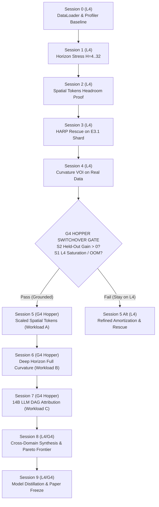

# 10-Session Operational Campaign: Colab Hardware Scaling & Hopper G4 Strategy

**Author:** Antigravity & OpenCode (`muse-spark-1.3-contributor-free`)  
**Date:** 2026-10-03  
**Status:** Approved & Frozen  
**Precedence:** Governed by [`docs/research-plan/adjoint_guided_comprehensive_research_plan.md`](../research-plan/adjoint_guided_comprehensive_research_plan.md) and [`docs/production/colab_l4_operator_brief.md`](../production/colab_l4_operator_brief.md).

---

## 1. Executive Summary & Hardware Diagnostic

Recent benchmarks (Milestones B1, B2.1, B2.2, B2.3, B3, and Direction 3 Curvature Allocation) have executed successfully on NVIDIA L4 (24 GiB VRAM). However, telemetry across all runs reveals that peak GPU memory consumption has consistently stayed below **1.2 GiB (<5% of L4 capacity)**, with wall-clock throughput exhibiting near-flat scaling across batch sizes $B \in [16, 64]$.

A critical architectural audit conducted with OpenCode identified the triple root cause:
1. **1D Pooled Representations:** Current world-model dynamics operate on 512-dimensional spatially-pooled feature vectors extracted offline from frozen ResNet backbones. Because spatial dimensions ($H \times W = 16 \times 16$) are collapsed prior to dynamics unrolling, sequence memory scales as $O(B \cdot T \cdot D)$ rather than $O(B \cdot T \cdot P \cdot D)$, where $P$ is the number of vision patches.
2. **Host DataLoader Bottlenecks:** Previous pipelines utilized single-threaded PyTorch `DataLoader(num_workers=0, pin_memory=False)`. Disk I/O and CPU deserialization of episode arrays bottlenecked GPU kernel launches, causing low SM utilization.
3. **Compact Parameter Count:** The ~25M parameter MLP/Transformer dynamics model requires under 100 MB for weights and optimizer states in FP32/BF16.

### The Hardware Scaling Principle

Per [`AGENTS.md`](../../AGENTS.md) and [`colab_l4_operator_brief.md`](../production/colab_l4_operator_brief.md), **unused VRAM is never a justification for upgrading hardware**. Upgrading to NVIDIA Hopper G4 (96 GiB GDDR7/HBM3) or A100/H100 is strictly prohibited unless:
- The workload genuinely OOMs the 24 GiB L4 runtime; OR
- A PyTorch profiler demonstrates kernel saturation and memory bandwidth exhaustion; OR
- A higher-capacity representation (e.g. spatial tokens, deeper unrolls, or 14B LLMs) produces a **measured, statistically significant held-out empirical gain**.

---

## 2. Four Genuine Workloads for Hopper G4 (96 GB)

Hopper G4 provides 96 GB high-bandwidth VRAM and advanced FP8 Tensor Cores. The following four workloads represent genuine, methodologically sound scientific directions that cannot execute on L4:

| Workload ID | Description | Mathematical / Memory Demand | Why L4 (24 GB) Fails |
|---|---|---|---|
| **Workload A** | **End-to-End Multi-Camera Spatial Patch Tokens** | 3 camera streams $\times$ 256 patches ($16\times16$) $\times$ 384 embed dim across $T=16$ steps = 12,288 tokens/seq. Sequence activation memory scales $580\times$ over pooled vectors. | Activation cache for multi-head attention + backprop exceeds 36 GiB at $B=16$. Immediate OOM on L4. |
| **Workload B** | **Deep Horizon ($H \ge 32$) Full Curvature BPTT** | Full unrolled autograd computation graph retention for second-order Hessian-vector products ($\nabla^2 J$) over long horizons. | L4 requires $3\text{--}5\times$ slower activation checkpointing and micro-batching ($B \le 4$). G4 fits full graph uncheckpointed. |
| **Workload C** | **14B Parameter LLM DAG Attribution & LoRA Routing** | Track D2/D3 scaled to 14B parameter models (e.g. Qwen2.5-14B / DeepSeek-Lite) with multi-head co-state routing. | Base model in BF16 requires ~28 GB just for weights, plus KV cache and optimizer states. Strictly exceeds L4 24 GB. |
| **Workload D** | **GPU-Vectorized Closed-Loop Simulation (ManiSkill3)** | Parallel rollout of $\ge 1,024$ continuous physics environments entirely on GPU tensor memory. | CPU-bound host cannot feed L4; full simulator state + rendering + world-model rollout requires massive unified memory. |

---

## 3. The 10-Session Operational Campaign

The campaign is structured as 10 discrete, verifiable Colab sessions ($S0$ to $S9$).



### Detailed Session Protocols

#### Session 0: Data Pipeline & PyTorch Profiler Baseline (L4 GPU)
- **Objective:** Eliminate CPU host bottlenecks, measure baseline GPU compute utilization, and produce Chrome trace profiles.
- **Hardware:** NVIDIA L4 (24 GiB).
- **Implementation:**
  - Update `src/adjointrwm/data/windows.py` to enable multi-process worker pools (`num_workers=4`, `pin_memory=True`, `persistent_workers=True`).
  - Deploy `scripts/profile_training_pipeline.py` with `torch.profiler.profile(activities=[CPU, CUDA], schedule=torch.profiler.schedule(wait=2, warmup=2, active=10))`.
- **Exit Gate:** GPU SM utilization > 75%, DataLoader wait time < 15% of step time; exported profiler JSON trace committed to repo.

#### Session 1: Horizon Stress Testing ($H=4, 8, 16, 32$) & Autograd Scaling (L4 GPU)
- **Objective:** Measure empirical VRAM and compute scaling as rollout horizon $H$ increases from 4 to 32 on the 500-episode DROID shard.
- **Hardware:** NVIDIA L4 (24 GiB).
- **Script:** `scripts/benchmark_horizon_scaling.py`.
- **Metrics:** Peak allocated VRAM, backward pass latency, autograd memory growth per step $H$.
- **Exit Gate:** Determine exact boundary where L4 requires activation checkpointing or batch reduction.

#### Session 2: Multi-Token Spatial Representation Headroom Proof (L4 GPU)
- **Objective:** Test whether preserving spatial patch tokens ($P=16\times16$) yields statistically significant held-out prediction and allocation gain over 1D pooled vectors.
- **Hardware:** NVIDIA L4 (24 GiB, batch size scaled to fit memory).
- **Protocol:** Train 2-camera spatial token world model on a 50-episode subset of E3.1; evaluate against 1D pooled baseline.
- **Exit Gate:** Held-out RMSE reduction $\ge 10\%$ with $p < 0.05$. This gate is a **mandatory prerequisite** for provisioning G4 Hopper.

#### Session 3: HARP Selective Analytical Rescue on Full E3.1 Real Shard (L4 GPU)
- **Objective:** Scale Milestone B3 analytical rescue interface from DROID-100 to the full 500-episode stratified E3.1 shard.
- **Hardware:** NVIDIA L4 (24 GiB).
- **Script:** `scripts/benchmark_harp_selective_rescue.py` on `/content/cache_e3_1`.
- **Exit Gate:** Amortization gap closed below $\tau=0.20$ invocation threshold on 4,000+ real held-out test windows.

#### Session 4: Real-Data Second-Order Curvature & Belief-Space VOI Allocation (L4 GPU)
- **Objective:** Validate the Direction 3 curvature estimator (`CurvatureCostateEstimator`) and belief-space VOI scoring on real E3.1 robotic episodes.
- **Hardware:** NVIDIA L4 (24 GiB).
- **Script:** `scripts/benchmark_curvature_voi_allocator.py` on real multimodal robot trajectories.
- **Exit Gate:** Real-data regret reduction over first-order co-state with throughput exceeding 5 kHz.

---

## 4. HOPPER G4 SWITCHOVER FLAG & GATING CRITERIA

> [!IMPORTANT]
> **Switchover Flag: SESSION 5**
> Upgrading to NVIDIA Hopper G4 (96 GiB) is permitted **ONLY at Session 5**, conditional on satisfying all three entry gates below.

### Mandatory G4 Entry Gates:
1. **Gate G4-1 (Profiler Saturation):** Session 0 profiler trace confirms that GPU kernel execution, not CPU data loading, is the primary execution bottleneck.
2. **Gate G4-2 (Representation Value):** Session 2 demonstrates a statistically significant ($p < 0.05$) held-out loss or regret advantage from spatial token representations over 1D pooled vectors.
3. **Gate G4-3 (Memory Exhaustion on L4):** Running full spatial tokens (3 cameras $\times$ 256 patches) or deep horizon ($H=32$) on L4 triggers CUDA Out-Of-Memory at nominal batch size ($B=16$).

If all three gates pass, Session 5 provisions Hopper G4 via:
```bash
colab new -s g4-worker --gpu G4
```
If any gate fails, the campaign remains on L4, pivoting to algorithmic refinements and architectural pruning.

---

### Subsequent Sessions (Post-Gate)

#### Session 5: Scaled Spatial-Token End-to-End World Model (Hopper G4)
- **Workload:** Workload A. 3-camera spatial patch world model ($P=256$ tokens/view, $T=16$, $B=32$).
- **Compute:** Hopper G4 (96 GB VRAM, FP8/BF16 Tensor Cores).
- **Objective:** Train end-to-end multi-view dynamics and evaluate adjoint camera allocation at full spatial resolution.

#### Session 6: Deep Horizon ($H=32$) Full Curvature Training (Hopper G4)
- **Workload:** Workload B. Unrolled 32-step recursive dynamics with exact second-order Hessian-vector products.
- **Compute:** Hopper G4 (96 GB VRAM).
- **Objective:** Long-horizon counterfactual planning without gradient checkpointing bottlenecks.

#### Session 7: 14B Parameter LLM DAG Attribution & LoRA Routing (Hopper G4)
- **Workload:** Workload C. 14B parameter language model DAG attribution (Track D2/D3).
- **Compute:** Hopper G4 (96 GB VRAM).
- **Objective:** Evaluate co-state sensitivity routing on large-scale discrete reasoning tasks.

#### Session 8: Joint Multi-Domain Synthesis & Pareto Frontier Mapping (L4 / G4)
- **Objective:** Unify robotic allocation, time-series anomaly detection, and LLM reasoning on a single Pareto frontier (regret vs compute FLOPs).
- **Outcome:** Comprehensive cross-domain evidence table for Track D.

#### Session 9: Model Distillation & Paper Evidence Freeze (L4 / G4)
- **Objective:** Distill G4-trained teacher models into ultra-fast L4/edge inference students; freeze all run artifacts, SHA-256 hashes, and paper figures.
- **Outcome:** Final evidence package ready for publication submission.

---

## 5. Compute Discipline & Delegation Protocol

1. **Zero Idle Burn:** Remote sessions burn compute credits continuously. When an active session exists, training and benchmark jobs must be launched immediately. Planning, reviewing, and offline analysis are conducted locally while remote jobs run.
2. **Autonomous OpenCode Delegation:** Use OpenCode (`opencode run --standalone --auto -m opencode/muse-spark-1.3-contributor-free`) for all remote execution and script deployment.
3. **Concurrent Online Research:** Use secondary OpenCode instances (`opencode/space-bunny-free`) to conduct architectural and agentic harness research concurrently during GPU execution.
4. **Mandatory Teardown:** Run `colab stop -s <session>` immediately when execution concludes; verify with `colab sessions` that 0 billable assignments remain.
