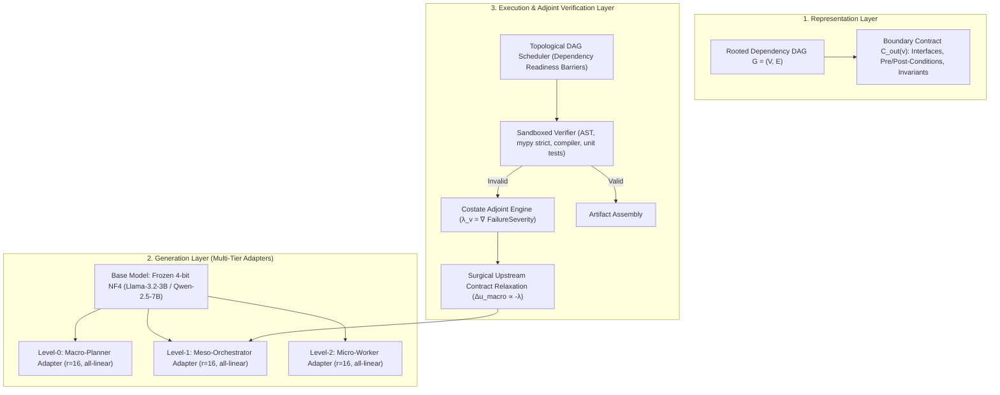

# Track D2 & D3: Dependency-Aware Hierarchical Generation with Hot-Swappable Adapters and Discrete Adjoint Sensitivity

**Date:** 2026-10-02 · **Status:** Codified Architecture Plan · **Parent:** [`docs/plans/cross-domain-plan.md`](cross-domain-plan.md)  
**Domains:** Track D2 (Long-Form Text & Context Compression) & Track D3 (Repository-Level Code Generation)  
**Hardware Profile:** Google Colab NVIDIA L4 (24 GB) / T4 (16 GB) / G4 (96 GB)  

---

## 1. Executive Summary and Problem Statement

Monolithic autoregressive generation over long horizons (books, complex software repositories) suffers from three fundamental failure modes:
1. **Attention Dilution & Compute Growth:** KV-cache grows linearly during generation, while prompt prefill work scales quadratically ($O(N^2)$), straining memory bandwidth and latency.
2. **Error Compounding & Root-Plan Contamination:** Early token-level drift or an un-implementable Level-0 architectural plan contaminates all subsequent downstream decisions.
3. **Open-Loop Decomposition Failure:** Standard hierarchical generation frameworks lack an upward feedback channel. When a lower-level leaf implementation fails compilation or unit tests, systems either loop infinitely at the leaf (futile if the parent contract is mathematically impossible) or tear down the entire tree (incurring severe recomputation overhead).

This plan codifies a **Dependency-Aware Hierarchical Generation Architecture** that unifies three core principles:
1. **Rooted Dependency Directed Acyclic Graphs (DAGs)** with explicit typed boundary contracts.
2. **Topologically Invariant Hot-Swappable QLoRA Adapters** operating over a shared, frozen 4-bit NormalFloat (NF4) foundation model.
3. **Discrete Adjoint Sensitivity Updates (Costate Packets)** that attribute downstream leaf execution failures directly back to upstream contractual clauses, enabling surgical, localized parent replanning without tree teardown.

---

## 2. Decoupled Architectural Layers

The architecture strictly decouples representation, generation, and execution:



### 2.1 Layer 1: Representation (Dependency DAGs & Typed Contracts)
Artifacts are formally modeled as rooted DAGs $G = (V, E)$ rather than simple trees, explicitly accommodating shared types, crates, and transitive dependencies.
- **Topological Readiness Barrier:** A node $v$ is eligible for generation if and only if all predecessors have produced verified contracts:
  $$\operatorname{ready}(v) \iff \forall u \in \operatorname{Pred}(v), \quad C_{\text{out}}(u) \text{ is finalized and VALID}$$
- **Typed Boundary Contract Schema:**
  ```json
  {
    "node_id": "string",
    "tier": "macro | meso | micro",
    "dependencies": ["list_of_predecessor_node_ids"],
    "boundary_contract": {
      "interfaces": { "symbol_name": "type_signature_or_spec" },
      "pre_conditions": ["assertions_assumed_true"],
      "post_conditions": ["assertions_guaranteed_true"],
      "invariants": ["state_invariants_preserved"]
    },
    "content_payload": "string_or_null"
  }
  ```

### 2.2 Layer 2: Generation (Topologically Invariant Hot-Swappable Adapters)
To execute multi-tier generation within Colab's VRAM constraints (16–24 GB):
1. **Frozen 4-Bit Base Model:** Llama-3.2-3B-Instruct or Qwen-2.5-7B quantized in 4-bit NormalFloat (NF4) with Double Quantization ($\sim 2.2\text{--}5.5\text{ GB}$ VRAM).
2. **Topological Locking Invariant:** Every tiered adapter (`macro_planner`, `meso_orchestrator`, `micro_worker`) is trained with identical rank ($r=16, \alpha=32$) targeting all linear projections (`q_proj`, `k_proj`, `v_proj`, `o_proj`, `gate_proj`, `up_proj`, `down_proj`).
3. **Frozen Embeddings & LM Head:** `embed_tokens` and `lm_head` remain strictly frozen to preserve quantization boundaries, prevent vocabulary fragmentation, and allow in-place weight pointer switching without CUDA graph invalidation.

### 2.3 Layer 3: Execution & Discrete Adjoint Sensitivity
When a leaf node fails validation in the ephemeral sandbox (AST error, type mismatch, test failure):
1. **Discrete Sensitivity Attribution:** The costate packet maps the failure back to the upstream contract:
   $$\lambda_v = \nabla_{C} \text{FailureSeverity}$$
2. **Upstream Perturbation ($\Delta u_{\text{macro}}$):**
   ```python
   @dataclass
   class CostateSensitivityPacket:
       source_leaf_id: str
       target_ancestor_id: str
       failing_symbol: Optional[str]
       diagnostics: list[str]
       constraint_relaxation_delta: str  # Δu_macro directing contract edit
       severity_weight: float = 1.0       # Shadow price factor
   ```
3. **Surgical Repair:** The parent node re-generates *only the offending sub-clause* of its contract, avoiding full-tree teardown and preserving valid sibling subtrees.

---

## 3. Theoretical Corrections and Boundaries

Adhering to repository research-integrity rules (Rule 1: Never fabricate results; Rule 3: Report limits plainly):

| Myth / Naive Assumption | Validated Engineering Reality |
|---|---|
| **"Hierarchical generation is inherently faster"** | Hierarchical generation adds planning token overhead, duplicated ancestry context, and validation latency. It is only cost-effective if **localized repair savings** outweigh scaffolding costs. |
| **"Sibling branches are always independent"** | Sibling modules frequently share transitive types, macros, traits, and narrative state. Concurrency must be **dependency-aware** over DAGs. |
| **"Hidden-state KL divergence validates contracts"** | Latent space geometry does not guarantee semantic or type safety. Validation must be **deterministic and symbolic** (AST parsing, strict `mypy`, sandboxed test execution). |
| **"Shared KV cache yields near-zero latency"** | Cache lookup, page allocation across Radix trees, and adapter switching incur measurable systems latency. Prefill is reduced, not eliminated. |

---

## 4. Empirical Evaluation Protocol

All experiments compare three distinct architectures under identical token budgets:

1. **Arm 1: Flat Autoregressive Baseline:** Monolithic single-pass generation.
2. **Arm 2: Standard Hierarchical DAG:** Top-down DAG expansion with naive leaf-level retry loops.
3. **Arm 3: Adjoint-Guided Hierarchical DAG (Proposed):** DAG generation with **Costate Sensitivity Packets** performing upstream contract relaxation.

### Evaluated Metrics:
- **Quality-Adjusted Latency:** Wall-clock time to generate an artifact passing 100% of validation checks.
- **Effective Token Efficiency:** Ratio of final artifact tokens to total tokens consumed (including scaffolding and repair).
- **Tree Preservation Rate:** Fraction of valid sibling branches preserved during an error repair event.
- **Peak VRAM Utilization:** Dynamic memory footprint under varying concurrency levels ($K \in \{1, 4, 8, 16\}$).
- **First-Try vs Repaired Build Pass Rate:** Compilation and test pass rates across benchmarks (e.g. HumanEval-Repo, SWE-bench mini).

---

## 5. Implementation Roadmap (Milestones D2-0 to D2-2)

- **D2-0 (Domain Formalization & Data Pipeline):** Implement `src/adjointrwm/domains/llm_dag/` with Pydantic contract schemas, topological scheduler, and AST/mypy sandboxed verifier.
- **D2-1 (Adapter Training & In-Place Swapping on Colab L4):** Train tiered QLoRA adapters ($r=16$) on a curated hierarchical code synthesis dataset. Measure in-place adapter switching latency.
- **D2-2 (Confirmatory Saturation Benchmark):** Execute the three-way comparative evaluation matrix on Colab L4/G4, measuring repair overhead and quality-adjusted latency.
