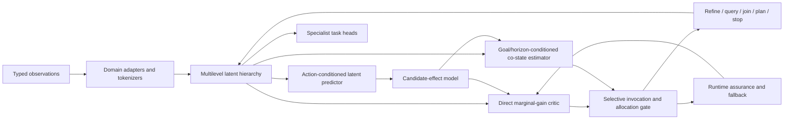

# Production Training Plan for an Adjoint-Guided Recursive World Model

**Execution target:** single NVIDIA L4, A100, or H100 through Google Colab, Colab Enterprise, or a Colab local/remote runtime  
**Primary framework:** PyTorch  
**Primary product strategy:** one modular generalist world-model core, separately deployable specialist adapters, and a distilled L4 student  
**Training philosophy:** preserve the validated adjoint mechanism, but train the production representation and dynamics model in mixed precision rather than extending the entire prototype in `float64`

---

## Executive decision

The most efficient route to a broadly useful production system is **not** to train a new web-scale visual foundation model from scratch in hosted Colab. The recommended route is:

1. Start from a strong, released image/video JEPA backbone or a compact in-domain JEPA pretraining run.
2. Add a shared hierarchical latent dynamics core supporting vision, video, continuous state/action, time-series/event, relational, and optional language-conditioning adapters.
3. Preserve primal state and co-state as separate fields.
4. Train an objective-, goal-, horizon-, budget-, and candidate-conditioned amortized co-state model from exact or high-fidelity adjoint labels.
5. Train the adjoint allocator against the same fully realized direct critic used in the research programme.
6. Retain the direct critic as both a scientific comparator and a runtime fallback.
7. Train the medium production teacher on A100 or H100, then distil a smaller L4 model.
8. Expose specialization through adapters and heads rather than duplicating the entire backbone.

This produces three useful deliverables rather than one oversized compromise:

| Deliverable | Purpose | Preferred hardware |
|---|---|---|
| **Generalist teacher** | Broad representation, dynamics, joins, co-state estimation, and planning | A100 80 GB or H100 80 GB |
| **Specialist production models** | Robotics, adaptive sensing, time-series, graph/event, or video-specific behaviour | A100, H100, or L4 depending size |
| **Edge/Colab student** | Fast inference and continued task adaptation under a 24 GB memory ceiling | L4 |

A single monolithic model should not be required to reconstruct pixels, generate language, control robots, compress streams, and answer arbitrary semantic questions. The common core should learn **predictive state, dynamics, task sensitivity, and resource allocation**; optional decoders, policies, language interfaces, and task heads should remain replaceable.

---

# 1. Starting point and production implications

## 1.1 Assets already available

The executed programme supplies:

- analytic and autograd co-state verification;
- a recursive rate-distortion formulation;
- a range-coding path and actual-rate instrumentation;
- a selective invocation concept;
- a direct critic fallback;
- a runtime-assurance guard;
- embodied planning telemetry on A100;
- an `OptimizedNeuralAdjointTeacher` checkpoint;
- causal-taint and release manifests.

The current checkpoint was inspected directly and contains:

| Tensor | Shape |
|---|---:|
| `fc_in.weight` | `64 x 33` |
| `fc_in.bias` | `64` |
| `net.1.weight` | `64 x 64` |
| `net.1.bias` | `64` |
| `net.3.weight` | `32 x 64` |
| `net.3.bias` | `32` |

It has **8,416 parameters**, uses `float64`, receives a 32-dimensional state plus one scalar budget, and emits a 32-dimensional sensitivity estimate.

## 1.2 Correct role of the existing checkpoint

The checkpoint is valuable as:

- a frozen regression teacher on the validated 32-dimensional task family;
- a behavioural prior for a new co-state head;
- a source of unit and integration tests;
- a calibration anchor for selective invocation;
- a compatibility target for the production fallback path.

It is **not** by itself a general production world model. A deployable co-state is objective-dependent. The production estimator therefore needs at least:

```text
lambda_hat = f(
    predictive_state,
    goal_or_objective,
    horizon,
    remaining_budget,
    domain_id,
    candidate_effect,
    acquired_ports,
    causal_history
)
```

The existing state-plus-budget MLP should be retained as a legacy teacher and distilled into a broader estimator, not enlarged by mechanically repeating weights.

## 1.3 Precision policy

The validated `float64` path remains essential for:

- analytic correctness;
- short-horizon exact co-state labels;
- finite-difference tests;
- rate-ledger reconciliation;
- release-gate regression tests.

It should not be the default precision for the large representation backbone. Production training should use:

- **BF16** for the main A100/H100/L4 training path;
- **FP32** for loss reductions, optimizer state where required, normalization statistics, calibration, and sensitive adjoint accumulations;
- **FP64** only for exact teacher subsets and correctness suites;
- **FP8** only on a promoted H100/L4 experiment after BF16 parity, with critical heads and reductions left in BF16/FP32.

---

# 2. Product boundary

## 2.1 Capabilities in scope

The common production core should support:

1. multiscale latent representation of observations;
2. future latent prediction with and without actions;
3. recursive refinement and halting;
4. candidate-effect prediction;
5. co-state estimation and uncertainty;
6. direct marginal-gain prediction;
7. rate-, compute-, latency-, and risk-aware allocation;
8. typed external ports and value-of-information decisions;
9. typed hierarchical joins across compatible domains;
10. latent-space planning;
11. task-specific adaptation through adapters or heads;
12. runtime fallback and out-of-distribution interception.

## 2.2 Capabilities that remain optional modules

The following should not be forced into the shared core:

- photorealistic pixel generation;
- unrestricted natural-language generation;
- speech synthesis;
- one universal robot action space;
- environment-specific reward shaping;
- safety certification for physical hardware;
- high-fidelity physical simulation.

A diagnostic decoder may be trained for interpretability, but the primary model remains latent and predictive.

## 2.3 Meaning of “general usage”

The realistic generality target is:

> a shared resource-aware predictive substrate that can be adapted to multiple observation structures and decision tasks with bounded adapters, rather than a universal model that performs every modality and task natively.

The first production release should cover four domain families:

- spatial image/video hierarchies;
- continuous state/action trajectories;
- temporal or event streams;
- relational graphs.

Language should initially be a **conditioning port**, not the primary world representation or an autoregressive output domain.

---

# 3. Alternatives considered

## 3.1 Representation and world-model alternatives

| Alternative | Strengths | Weaknesses | Recommended use |
|---|---|---|---|
| **V-JEPA 2.1 continuation** | Mature released code/checkpoints; dense prediction; intermediate-layer supervision; image/video tokenizers | Original pretraining scale is far beyond Colab; visual-first | Default visual backbone for the medium/large model |
| **V-JEPA 2 action-conditioned continuation** | Direct precedent for observation pretraining followed by small robot-data post-training | Very large released backbones; less convenient for dense features than 2.1 | Strong action-conditioned teacher or initialization |
| **LeJEPA/SIGReg from scratch** | Simple objective; anti-collapse without EMA/stop-gradient; suitable for small in-domain runs | More recent; less production history for action-conditioned world models | Main scratch-training alternative and controlled ablation |
| **UniJEPA-style unified objective** | Integrates photometric and temporal prediction in one latent space | Recent and not yet as operationally mature as V-JEPA releases | Promising generalist research branch |
| **TD-MPC2-style implicit world model** | Decoder-free, strong continuous control, demonstrated multi-task scaling | Less suited to broad passive image/video understanding | Default control-specialist alternative |
| **Dreamer-style RSSM** | Handles uncertainty and imagination; robust broad-domain RL recipe | Decoder/generative training adds cost and can distract from task relevance | Use when stochastic futures and reward imagination dominate |
| **Autoregressive discrete latent model** | Clear likelihood and sampling interface | Sequential generation cost; tokenization becomes critical | Use for event/symbolic streams, not the first visual-control model |
| **Latent diffusion/flow future model** | Represents multimodal futures | More expensive training and planning | Add only when deterministic prediction fails due genuine multimodality |
| **Conv/SSM specialist** | Efficient long streams and edge deployment | Less reusable across heterogeneous token structures | L4 time-series/video specialist |
| **Sparse MoE generalist** | Separates domain expertise at large scale | Routing instability, low utilization on one GPU, difficult accounting | Defer until dense model and data scale justify it |

## 3.2 Training-strategy alternatives

| Strategy | Cost | Generality | Recommendation |
|---|---:|---:|---|
| Continue pretraining a released visual backbone, train new dynamics/adjoint modules | Low–medium | High for physical visual tasks | **Primary path** |
| Freeze backbone and train only adapters, predictor, co-state, critic, and heads | Lowest | Medium | First production baseline and L4 path |
| Partially unfreeze top backbone blocks after adapter convergence | Medium | High | Default A100/H100 path |
| Train a 40–120M in-domain JEPA from scratch | Medium | Medium–high in selected domains | Viable when data is proprietary or non-natural-image |
| Train a 300M–1B foundation model from scratch | Very high | Potentially high | Not recommended on hosted Colab; use dedicated cloud/local runtime |
| Train one specialist per domain | Medium multiplied by domains | Low sharing | Use only where interference or safety boundaries require it |
| Shared core plus domain adapters and specialist heads | Medium | High | **Recommended product architecture** |

## 3.3 Recommended decision

Build a **generalist-specialist model family**:

- a shared hierarchical latent core;
- bounded domain tokenizers/adapters;
- an action-conditioned predictor;
- separate co-state and direct-critic streams;
- a top-k hierarchical join router;
- specialist heads and optional LoRA/adapters;
- one distilled L4 model for each operational specialization.

---

# 4. Production architecture

## 4.1 High-level graph



## 4.2 Domain adapters

Each adapter emits:

```text
DomainBatch {
    tokens: Tensor[B, T, d_model]
    validity_mask: BoolTensor[B, T]
    coordinates: Tensor[B, T, coordinate_dim]
    abstraction_level: Tensor[B, T]
    timestamps: Tensor[B, T]
    provenance: metadata
    rate_cost: metadata
    privilege_class: P0..P3
}
```

Initial adapters:

| Domain | Adapter |
|---|---|
| Images/video | Patch/tubelet tokenizer initialized from V-JEPA 2.1 or a compact JEPA |
| Proprioception/actions | Normalized MLP or small temporal Transformer |
| Multivariate time series | Strided 1D convolution plus causal Transformer/SSM |
| Events | Interval or event-token encoder with causal timestamps |
| Graphs | Node/edge projection plus relation-aware attention |
| Language conditioning | Frozen text encoder or learned instruction tokens projected to the common space |

No adapter may expose exact future state, simulator internals, or unmetered correspondence labels.

## 4.3 Shared hierarchy

The hierarchy should have three to five levels. Each node contains:

- latent state;
- local uncertainty;
- scale/abstraction coordinate;
- parent and legal child references;
- active external ports;
- current join messages;
- rate and compute ledger fields;
- goal and horizon context;
- cached candidate effects.

The recursive operator is shared across depths where tensor shapes permit. Depth-specific normalization or small scale embeddings are allowed; full per-depth copies are an ablation, not the default.

## 4.4 Predictive core

The predictor supports:

```text
predict(current_hierarchy, actions, horizon, acquired_ports)
    -> future_hierarchies, uncertainty, candidate_effects
```

Primary implementation:

- Transformer blocks with SDPA/FlashAttention kernels;
- optional SSM blocks between attention stages for long continuous streams;
- action and time conditioning through FiLM, cross-attention, or additive embeddings;
- deterministic mean plus distributional residual head;
- deep predictive supervision at selected intermediate levels;
- no pixel decoder in the primary loss.

## 4.5 Co-state subsystem

The production estimator predicts a distribution rather than one uncalibrated vector:

```text
lambda_mean, lambda_scale, confidence =
    AdjointEstimator(state, goal, horizon, budget, domain, candidate_effect)
```

Recommended representation:

- low-rank co-state basis of rank 32–128;
- optional block-diagonal heads by state component;
- candidate-direction projections stored alongside the full or low-rank label;
- calibrated epistemic uncertainty from a small ensemble, dropout-free multi-head output, or bootstrap heads;
- separate normalization from primal state;
- objective and horizon embeddings mandatory.

The exact teacher remains offline and privileged. The deployed estimator consumes only P0 information.

## 4.6 Direct critic and fallback

The direct critic receives the same causal information, candidate effects, costs, and histories as the adjoint allocator, excluding only explicit co-state features and deterministic derivatives of them.

The critic serves four roles:

1. production fallback;
2. selective-invocation comparator;
3. control variate for high-variance value-of-information estimates;
4. protection against a co-state estimator failing under shift.

## 4.7 Selective invocation

The runtime has three paths:

| Path | Trigger | Cost profile |
|---|---|---|
| **Cheap critic** | predicted adjoint benefit below incremental cost or co-state unavailable | Lowest |
| **Amortized adjoint** | calibrated student confidence is adequate | Low |
| **High-fidelity sweep** | decision is consequential and estimator uncertainty is high | Highest |

The gate is trained on **net decision value**, not merely co-state variance:

```text
invoke_adjoint iff
E[decision_loss_critic - decision_loss_adjoint | context]
    > incremental_compute + latency + risk_margin
```

## 4.8 Hierarchical joins

A join is a typed edge between compatible nodes in different domain hierarchies. The join router:

- proposes at most top-k edges;
- uses normalized abstraction coordinates rather than raw depth equality;
- charges proposal, message, attention, cache, and synchronization cost;
- supports missing, delayed, noisy, and corrupted modalities;
- uses relation-specific projections;
- remains acyclic in the primary production path;
- permits at most a fixed number of message rounds.

## 4.9 Optional output heads

Specialist heads may include:

- MPC terminal cost and action proposal;
- object/state probe;
- anomaly and failure prediction;
- active sensing/port query value;
- adaptive compression profile;
- trajectory success and constraint risk;
- graph/event forecasting;
- language-conditioned goal embedding.

---

# 5. Model-size profiles

The ranges below are planning envelopes, not promises. Every profile requires an actual two-hour memory and throughput calibration on the assigned accelerator.

| Profile | Primary GPU | Total parameters | Typical visual input | Use |
|---|---|---:|---|---|
| **RWM-S** | L4 24 GB | 40–90M | 8–16 frames, 224 px, aggressive masking | Edge/student, specialist, smoke/pilot |
| **RWM-M** | A100 40/80 GB | 150–350M | 16 frames, 224–256 px | Recommended production teacher |
| **RWM-L** | H100 80 GB or A100 80 GB | 400–900M | 16–32 frames, 256–384 px | Broad research teacher; only after M scaling evidence |
| **RWM-XL** | Dedicated multi-GPU/cloud | >1B | Long video and many domains | Outside a hosted single-Colab production plan |

## 5.1 Starting architectural values

| Parameter | RWM-S | RWM-M | RWM-L |
|---|---:|---:|---:|
| `d_model` | 384–512 | 768 | 1024–1280 |
| Encoder blocks | 8–12 | 16–24 | 28–36 |
| Predictor blocks | 4–6 | 8–12 | 12–16 |
| Attention heads | 6–8 | 12 | 16–20 |
| Hierarchy levels | 3 | 4 | 4–5 |
| Co-state rank | 32 | 64 | 96–128 |
| Join top-k | 4 | 8 | 8–16 |
| Candidate set | 16–64 | 32–128 | 64–256 |

The production target should be selected by measured validation gain per GPU-hour and inference cost, not by choosing the largest model that fits memory.

---

# 6. Data strategy

## 6.1 Data layers

Use three layers of data:

### Layer A — broad passive representation data

- licensed images and videos;
- in-domain operational video;
- synthetic multi-scale scenes;
- temporal and event streams;
- graph sequences.

Purpose: representation, temporal consistency, cross-scale structure.

### Layer B — action-conditioned and embodied data

- DROID;
- BridgeData V2;
- selected Open X-Embodiment subsets;
- ManiSkill3 demonstrations and generated rollouts;
- proprietary trajectories with clear rights and provenance;
- existing validated synthetic control tasks.

Purpose: action-conditioned dynamics, candidate effects, planning, cross-embodiment transfer.

### Layer C — task and safety data

- executed candidate outcomes;
- near-failure and recovery trajectories;
- corrupted/missing sensor episodes;
- timing and bandwidth stress cases;
- out-of-distribution states;
- task-specific success/failure labels.

Purpose: decision alignment, runtime assurance, fallback calibration.

## 6.2 Data split rules

Do not randomly split neighbouring frames. Split by:

- environment or site;
- robot embodiment;
- task family;
- object identity/category;
- scene and episode;
- time window or collection batch;
- operator where relevant.

Maintain four sets:

1. train;
2. tuning/validation;
3. frozen internal test;
4. external or cross-institution replication.

## 6.3 Data mixture

A starting physical-world generalist mixture is:

| Domain family | Initial batch share |
|---|---:|
| Image/video self-supervision | 35–45% |
| Action-conditioned robot/control trajectories | 30–40% |
| Time-series and event streams | 10–15% |
| Relational graphs and synthetic joins | 10–15% |
| Language-conditioned tasks | 0–10% |

The final sampler uses temperature-smoothed domain balancing rather than sampling directly in proportion to dataset size. Each domain retains a minimum batch share and an independent validation endpoint.

## 6.4 Data quality controls

Every sample stores:

- source and licence;
- collection timestamp;
- modality schema;
- calibration version;
- robot/environment/task identity;
- quality score and rejection reason;
- transformation and augmentation history;
- privilege class;
- checksum.

Reject or quarantine:

- corrupt timestamps;
- duplicated episodes across splits;
- impossible actions;
- leakage of future or simulator-only state;
- unsynchronised modalities beyond tolerance;
- missing licence/provenance;
- unsafe or personally identifying content not covered by the data policy.

## 6.5 Offline preprocessing

Cache expensive deterministic products:

- frame indices and timestamps;
- fixed video clips;
- proprio/action normalization statistics;
- graph coarsenings;
- exact candidate sets for teacher-label generation;
- pretrained frozen-backbone tokens where the backbone is not being updated.

Do not cache stochastic augmentations or any target generated using frozen-test outcomes.

---

# 7. Training objectives

Avoid activating every loss from the first step. Objectives enter through a curriculum.

## 7.1 Representation objective

```text
L_repr =
    L_masked_latent
  + alpha_dense * L_dense_visible_and_masked
  + alpha_deep * sum_l L_intermediate_l
  + alpha_reg * L_anti_collapse
  + alpha_cross * L_cross_scale
```

Two anti-collapse recipes should be compared on proxy runs:

- EMA target encoder plus stop-gradient and variance/covariance health checks;
- SIGReg/LeJEPA-style Gaussian regularization without an EMA target.

The mature EMA recipe is the default for the first production run. SIGReg is promoted only if it matches or exceeds downstream utility and is at least as stable under the same tuning budget.

## 7.2 Dynamics objective

```text
L_dyn =
    Huber(z_future_hat, stopgrad(z_future_target))
  + alpha_nll * distributional_future_loss
  + alpha_multi * multi_horizon_loss
  + alpha_action * action_consistency
```

Train horizons progressively: `1 -> 2 -> 4 -> 8 -> 16` or the task-relevant equivalent.

## 7.3 Co-state objective

```text
L_adj =
    alpha_vec  * Huber(lambda_hat, lambda_teacher)
  + alpha_dir  * Huber(lambda_hat^T delta_x, lambda_teacher^T delta_x)
  + alpha_rank * pairwise_candidate_ranking_loss
  + alpha_sign * directional_sign_loss
  + alpha_cal  * uncertainty_calibration_loss
  + alpha_trans * adjoint_transport_consistency
```

Candidate-direction and ranking terms are primary for production because the full co-state vector is coordinate-dependent and may contain information irrelevant to feasible actions.

## 7.4 Allocation objective

```text
net_value(u) =
    predicted_task_gain(u)
  + predicted_prediction_gain(u)
  - beta_rate * actual_or_predicted_bits(u)
  - beta_compute * measured_or_predicted_compute(u)
  - beta_latency * latency(u)
  - beta_risk * risk(u)
```

```text
L_alloc =
    listwise_or_pairwise_rank_loss(net_value_hat, net_value_target)
  + positive_gain_classification
  + calibrated_regression
  + budget_violation_penalty
  + stopping_consistency
```

## 7.5 Rate-distortion objective

Train with several fixed budget multipliers and explicit budget tokens rather than one permanent scalar:

```text
L_RD = distortion + beta_rate * rate + beta_compute * compute
```

The model must produce a frontier, not one operating point.

## 7.6 Join objective

```text
L_join =
    join_value_regression
  + join_ranking
  + message_rate_penalty
  + missing_modality_robustness
  + per_domain_noninferiority_penalty
```

## 7.7 Decision-alignment objective

After predictive training is stable, an optional bounded decision-alignment head may learn from executed candidate outcomes. It should:

- operate on candidate sets;
- be permutation-equivariant;
- use a zero-initialized bounded correction;
- preserve the base predictive geometry unless execution evidence supports a local correction;
- never replace the main direct-versus-adjoint comparison.

This is an optional adoption path inspired by recent decision-aligned JEPA research and should remain behind a separate gate until independently reproduced.

---

# 8. Training curriculum

## Stage P0 — asset conversion and compatibility

**Goal:** convert the research artifacts into stable production interfaces.

Tasks:

- load the existing checkpoint with `weights_only=True`;
- freeze and hash it;
- create a compatibility wrapper for state shape `[B, N, 32]` and scalar budget;
- record exact outputs on a fixed golden set;
- export state-dict metadata;
- add FP64/FP32/BF16 parity tests;
- reproduce the runtime-assurance interception tests;
- separate notebook orchestration from package code.

Exit:

- identical FP64 golden outputs;
- no pickle or arbitrary-code loading path;
- all manifests reproducible from a clean kernel.

## Stage P1 — data and runtime substrate

**Goal:** make the input pipeline faster than the model.

Tasks:

- build WebDataset/Parquet/RLDS-compatible sharded stores;
- stage current shards from Drive to `/content` before training;
- implement asynchronous prefetch and pinned memory;
- use fixed clip/sequence buckets;
- profile CPU decode, host-to-device transfer, and GPU idle time;
- add DALI/NVDEC for video if decoding is a bottleneck;
- checkpoint full run state atomically.

Exit:

- GPU utilization is not dominated by data stalls;
- interrupted/resumed run is sample-order and metric equivalent within tolerance.

## Stage P2 — proxy scaling and architecture selection

**Goal:** select model/data scale before an expensive run.

Run a matrix of models at approximately:

- 20–30M;
- 50–80M;
- 120–180M;
- optional 250–350M.

Use 1%, 3%, and 10% of the planned data and at least three compute budgets. Fit:

- loss versus compute;
- downstream utility versus compute;
- allocation AURC versus compute;
- latency and memory versus scale.

Use maximal-update parametrization or an equivalent width-transfer discipline so learning rate and initialization can transfer from proxy models to the selected production width.

Exit:

- one RWM-S and one RWM-M configuration selected;
- RWM-L opens only when predicted gain per GPU-hour remains positive.

## Stage P3 — representation pretraining

**Goal:** establish a non-collapsed, transferable hierarchy.

Order:

1. freeze released visual encoder and train adapters/predictor;
2. unfreeze only the top 25% of visual blocks;
3. unfreeze more only when validation improves without collapse;
4. increase resolution and clip length late in training;
5. activate dense and intermediate supervision after basic convergence.

Masking:

- large semantic target blocks;
- spatially distributed context;
- mixed spatial and temporal masks;
- some visible-token prediction for dense consistency;
- no mask that permits trivial target leakage.

Exit:

- latent variance and effective rank above thresholds;
- prediction improves on every required domain;
- unseen-scale transfer is non-inferior;
- no domain is hidden by a macro average.

## Stage P4 — action-conditioned dynamics

**Goal:** turn representation into a causal world model.

Tasks:

- add actions, proprioception, and time deltas;
- train one-step prediction first;
- extend horizon progressively;
- mix passive video and action trajectories without treating missing actions as zero actions;
- predict distributional residuals where futures are multimodal;
- include no-action, wrong-action, and shuffled-action controls.

Exit:

- action conditioning beats action-shuffled control;
- compounding error remains within the planning tolerance;
- latent rollout ranks candidate actions usefully.

## Stage P5 — exact teacher-label generation

**Goal:** generate trustworthy co-state and candidate-effect supervision.

For a stratified subset:

- compute FP64 exact adjoints on short horizons;
- use FP32/BF16 high-fidelity sweeps for longer horizons after parity;
- store full co-state only where practical;
- store candidate-direction products and exact candidate gains broadly;
- include goals, horizon, objective ID, budget, domain, and continuation semantics;
- hash teacher checkpoint and rollout trace.

Exit:

- analytic/autograd/finite-difference agreement on bounded cases;
- teacher labels have no test or future-target leakage into P0 deployment traces.

## Stage P6 — amortized co-state training

**Goal:** train a general causal co-state student.

Curriculum:

1. legacy D=32 teacher distillation;
2. exact short-horizon labels;
3. projected co-state labels in the larger latent space;
4. mixed goals/horizons/budgets;
5. domain and task shifts;
6. stale, noisy, and missing-port cases.

Use oversampling near candidate decision boundaries because ranking errors there matter most.

Exit:

- directional sign and rank accuracy pass thresholds;
- uncertainty is calibrated;
- estimator remains useful under held-out goals and horizons;
- randomized/wrong-goal controls fail as expected.

## Stage P7 — allocator and direct critic

**Goal:** obtain a matched production allocator.

Train:

- direct critic;
- directional-only adjoint;
- co-state-only adjoint;
- full adjoint;
- randomized co-state control;
- optional exact-teacher upper bound.

Use identical candidate sets, data, labels, tuning access, and compute accounting.

Exit:

- full adjoint improves the selected primary endpoint at matched total cost;
- direct critic is fully realized and remains available as fallback;
- selective invocation beats always-critic and always-adjoint on net value.

## Stage P8 — hierarchical joins and multimodal training

**Goal:** generalize across domains without uncontrolled fusion.

Order:

1. exact synthetic joins;
2. vision + proprioception;
3. state/action + events;
4. video + graph;
5. optional text-conditioned goals;
6. held-out domain pair and join topology.

Apply modality dropout, delay, corruption, and reliability metadata.

Exit:

- hierarchical joins beat no-join and flat-fusion controls;
- every domain passes its non-inferiority guard;
- no exact-correspondence or future-state leakage.

## Stage P9 — specialist adaptation

**Goal:** turn the common core into useful products.

For each specialization:

- freeze common core first;
- train adapters and task head;
- unfreeze top blocks only if necessary;
- use LoRA or bounded residual adapters for low-data tasks;
- preserve the core representation and runtime contract;
- calibrate a specialization-specific safety guard.

## Stage P10 — distillation and deployment optimization

**Goal:** produce the L4 student and serving artifacts.

Distil:

- latent states;
- future predictions;
- co-state projections;
- candidate ranking;
- uncertainty;
- selective-invocation decisions;
- task heads.

Then test:

- BF16;
- FP16 with gradient scaling where required;
- FP8 on supported promoted paths;
- weight-only INT8/FP8 inference where appropriate;
- pruning only after distillation;
- compiled and eager parity.

## Stage P11 — assurance and release

Release requires:

- clean causal-taint audit;
- deterministic correctness suite;
- stochastic production replay within statistical tolerance;
- complete rate and compute ledgers;
- OOD and anomaly fallback tests;
- model card, data card, licence inventory, SBOM, and checksum manifest;
- external replication on at least one separate runtime or site.

---

# 9. Hardware-specific training profiles

## 9.1 L4 profile

**Best uses**

- RWM-S training;
- frozen-backbone adaptation;
- student distillation;
- specialist heads;
- inference profiling;
- data pipeline development.

**Default numerical path**

- BF16 autocast when stable;
- FP16 plus `GradScaler` as fallback;
- FP32 reductions and optimizer-sensitive operations;
- FP8 only after a measured parity study.

**Memory strategy**

- 224 px and 8–16 frames;
- microbatch 1–8 depending token count;
- gradient accumulation;
- non-reentrant activation checkpointing;
- freeze visual backbone during early stages;
- fixed sequence buckets;
- cache frozen backbone embeddings where permitted.

**Do not use L4 for**

- full FP64 production-backbone training;
- large from-scratch video foundation pretraining;
- unbounded dynamic join graphs;
- a 500M+ full-finetuning run without a demonstrated memory and throughput case.

## 9.2 A100 profile

**Best uses**

- RWM-M training;
- partial or full visual-backbone continuation;
- longer clips and larger candidate sets;
- FP64 teacher-label batches;
- confirmatory comparisons.

**Default numerical path**

- BF16 autocast;
- FP32 sensitive operations;
- TF32 may be enabled for non-confirmatory FP32 matmuls after parity;
- FP64 only for correctness and teacher subsets.

An 80 GB A100 is the default production training target when available. A 40 GB A100 uses the same model profile with lower microbatch, more checkpointing, or a smaller predictor.

## 9.3 H100 profile

**Best uses**

- RWM-L training;
- long-video or many-domain continuation;
- FP8 Transformer Engine experiments;
- high-throughput teacher-label generation;
- large candidate-set and join studies.

**Default numerical path**

1. establish BF16 reference;
2. convert attention/MLP blocks to Transformer Engine;
3. keep normalization, softmax-sensitive reductions, output heads, co-state calibration, and critical losses in BF16/FP32;
4. compare convergence and downstream utility, not throughput alone;
5. promote FP8 only when the final task and allocation endpoints remain equivalent.

## 9.4 Hardware-stratified evidence

Do not pool L4, A100, and H100 wall-clock measurements into one result. Scientific metrics may be aggregated only when the method comparison is paired within hardware strata and no material method-by-hardware interaction is found.

---

# 10. Google Colab execution architecture

Hosted Colab does not guarantee a specific GPU type or uninterrupted runtime. Treat every run as preemptible.

## 10.1 Runtime gate

Every notebook begins by recording:

- exact GPU name and memory;
- CUDA driver/runtime;
- compute capability;
- PyTorch, Triton, cuDNN, DALI, and Transformer Engine versions;
- BF16/FP8 support;
- available RAM and local disk;
- package-lock checksum;
- git commit and dirty state;
- dataset and split hashes.

A profile mismatch blocks confirmatory training and may run only as a labelled pilot.

## 10.2 Filesystem policy

- Use Google Drive for persistent artifacts, not high-frequency training reads.
- Copy compressed dataset shards and the active checkpoint to `/content`.
- Train from local ephemeral storage.
- Write logs locally and synchronise in batches.
- Save checkpoints atomically: temporary file, checksum, rename, then copy to Drive.
- Retain a `latest`, `best_validation`, and `last_known_good` checkpoint.

## 10.3 Full checkpoint state

A resumable checkpoint contains:

```text
model weights
EMA/target weights or SIGReg state
optimizer state
scheduler state
AMP scaler state
random states: Python, NumPy, CPU, CUDA
sampler and data-shard cursor
curriculum stage and horizon
running normalization statistics
rate/compute calibrators
selective-invocation calibrator
configuration and environment hashes
completed-step and wall-clock counters
```

## 10.4 Sharding

- Target individual run shards of 30–120 minutes.
- Save a recovery checkpoint every 15–30 minutes.
- Stop cleanly before the notebook runtime limit.
- Never count resumed shards as independent seeds.
- Perform one forced-interruption test before a long run.

## 10.5 Notebook structure

Notebooks remain thin orchestrators. Production logic lives in importable modules.

```text
00_environment_and_asset_audit.ipynb
01_data_contract_and_split_audit.ipynb
02_data_cache_and_throughput.ipynb
03_proxy_scaling_and_mup.ipynb
04_representation_pretraining.ipynb
05_action_conditioned_dynamics.ipynb
06_exact_adjoint_label_generation.ipynb
07_amortized_costate_training.ipynb
08_direct_and_adjoint_allocator.ipynb
09_hierarchical_join_training.ipynb
10_specialist_adaptation.ipynb
11_l4_distillation.ipynb
12_precision_compile_and_quantization.ipynb
13_runtime_assurance.ipynb
14_full_evaluation.ipynb
15_export_and_release.ipynb
16_clean_kernel_replication.ipynb
```

## 10.6 Colab escape path

Move from hosted Colab to a Colab local/remote runtime, Colab Enterprise, or dedicated GCP VM when any of these is true:

- a promoted shard repeatedly exceeds session limits;
- the required H100/A100 is not available reliably;
- Drive quota/I/O limits delay training;
- data cannot legally enter a hosted notebook;
- continuous execution or guaranteed capacity is required;
- the final selected model exceeds the single-GPU plan.

---

# 11. Efficient training practices

## 11.1 Use pretrained representations where appropriate

Internet-scale V-JEPA pretraining is not reproducible economically in hosted Colab. Continue from a released checkpoint for natural image/video domains and spend available compute on:

- in-domain continued pretraining;
- action-conditioned dynamics;
- co-state distillation;
- allocation;
- cross-domain joins;
- specialisation.

For non-visual or highly proprietary domains, a compact LeJEPA/UniJEPA-style scratch run is more defensible.

## 11.2 Tune small, transfer large

Use proxy models and maximal-update parametrization where compatible. Hyperparameters should be selected on a smaller width and then transferred to the medium model. Do not run a broad search directly on RWM-L.

## 11.3 Scale data and model together

The language-model-specific numerical ratios from compute-optimal scaling should not be copied literally to multimodal world models. The transferable principle is to avoid an oversized, undertrained model. Use IsoFLOP-style proxy runs to estimate the best allocation between:

- model width/depth;
- number of unique video/trajectory tokens;
- clip length;
- prediction horizon;
- number of candidate labels;
- domain diversity.

## 11.4 Progressive difficulty

Increase one axis at a time:

1. resolution;
2. frames/sequence length;
3. prediction horizon;
4. number of hierarchy levels;
5. domain count;
6. join count;
7. candidate-set size;
8. action complexity.

This makes regressions attributable and preserves cheaper early iterations.

## 11.5 Shape and kernel discipline

- Make embedding dimensions and major matrix dimensions multiples of 8 or 16.
- Use PyTorch SDPA so FlashAttention/memory-efficient kernels can be selected.
- Bucket variable lengths into a small set of fixed shapes.
- Use variable-length attention only after eager and padded references agree.
- Apply `torch.compile` to the highest stable tensor-heavy function or module, not notebook I/O or dynamic Python tree management.
- Inspect graph breaks and recompilations.
- Compile after eager correctness, never before.

## 11.6 Activation memory

- use `torch.utils.checkpoint` with `use_reentrant=False`;
- checkpoint groups of Transformer blocks, not every trivial operation;
- measure recomputation overhead;
- preserve RNG state only where stochastic equivalence requires it;
- keep the exact teacher path uncompiled until numerical parity is established.

## 11.7 Data throughput

Begin with `DataLoader` using:

- pinned memory;
- persistent workers;
- tuned worker count;
- prefetch factor;
- contiguous shards;
- asynchronous nonblocking transfer.

Promote to DALI/NVDEC when video decode or augmentation keeps GPU utilization below target.

## 11.8 Optimizer and schedule

Starting defaults for proxy runs:

| Setting | RWM-S | RWM-M | RWM-L |
|---|---:|---:|---:|
| Optimizer | AdamW | AdamW | AdamW |
| Peak LR, new modules | `2e-4`–`4e-4` | `8e-5`–`2e-4` | `4e-5`–`1.2e-4` |
| Backbone LR multiplier | `0`–`0.3` | `0.05`–`0.3` | `0.03`–`0.2` |
| Betas | `(0.9, 0.95)` | `(0.9, 0.95)` | `(0.9, 0.95)` |
| Weight decay | `0.03`–`0.10` | `0.03`–`0.10` | `0.03`–`0.10` |
| Warm-up | 3–8% | 3–8% | 3–8% |
| Decay | cosine or validated cooldown | cosine/cooldown | cosine/cooldown |
| Grad clip | 1.0 starting point | 1.0 | 1.0 |

Exclude biases, scale parameters, and normalization parameters from weight decay unless the selected reference implementation does otherwise. These values are starting ranges; the proxy scaling stage selects the final manifest.

## 11.9 Batch definition

Define global batch in **valid tokens or frames**, not only sample count. Keep effective token batch fixed across compared methods. Record:

- microbatch;
- gradient accumulation;
- valid tokens;
- padding tokens;
- masked/target tokens;
- domain composition;
- candidate count.

## 11.10 Collapse and divergence tripwires

Abort or quarantine a run when any persists beyond the frozen window:

- per-dimension latent variance below threshold;
- effective rank collapse;
- target/predictor norm explosion;
- NaN/Inf;
- co-state amplification beyond threshold;
- gate saturation;
- all-refine or all-stop allocation;
- one-domain domination;
- join graph explosion;
- selective gate choosing one path almost always without utility evidence.

Aborted runs remain in the report and are not silently replaced.

## 11.11 Determinism policy

Use two modes:

- **Correctness mode:** deterministic algorithms, fixed shapes, strict error on unsupported nondeterministic kernels.
- **Throughput mode:** optimized kernels allowed after parity; repeatability assessed statistically and environment hash recorded.

Bitwise identity across different GPUs or software releases is not a valid expectation. Release tests require fixed-platform equality where feasible and metric/trace tolerances elsewhere.

## 11.12 Profiling policy

Profile every promoted configuration with:

- `torch.profiler` CPU/CUDA traces;
- peak and reserved memory;
- HBM traffic where available;
- kernel occupancy;
- data-loader wait;
- forward, backward, candidate, adjoint, join, coder, and synchronization time;
- p50, p95, and p99 latency;
- compile time and recompile count.

A nominal FLOP saving does not count as a production saving when memory traffic or launch overhead increases wall-clock cost.

---

# 12. Specialist production paths

## 12.1 Embodied manipulation and control

Use:

- V-JEPA 2.1 or compact video encoder;
- proprio/action adapter;
- action-conditioned latent predictor;
- TD-MPC2-style local planning baseline;
- adjoint candidate ranking;
- second-view/contact/tactile ports;
- runtime assurance guard.

Primary endpoint: success at matched total decision compute.

## 12.2 Adaptive perception and communication

Use:

- image/video hierarchy;
- port-query VOI;
- actual bit-rate model and coder;
- bandwidth, sensor, and latency constraints;
- task-specific utility head.

Primary endpoint: task quality at matched transmitted bits and compute.

## 12.3 Industrial time-series and event prediction

Use:

- Conv/SSM temporal adapter;
- event hierarchy;
- no large visual backbone;
- long-horizon dynamics;
- anomaly/failure head;
- adjoint-guided sensor sampling.

Primary endpoint: event/failure prediction and decision utility at matched sampling and compute cost.

## 12.4 Relational and graph systems

Use:

- graph adapter and deterministic coarsening;
- edge/node candidate refinements;
- typed joins to time-series or spatial domains;
- direct and adjoint graph-allocation heads.

Primary endpoint: graph-task utility and join regret at matched message cost.

## 12.5 Video understanding without control

Use:

- V-JEPA 2.1 continuation;
- dense/deep latent supervision;
- adaptive clip/region refinement;
- optional text conditioning;
- no control head.

Primary endpoint: downstream frozen-probe/dense-task quality at matched compute.

## 12.6 Language-conditioned planning

Language remains a bounded goal/instruction channel:

- frozen or lightly adapted text encoder;
- instruction tokens projected into the goal space;
- explicit rate and context-length accounting;
- no dependence on hidden chain-of-thought;
- action outcome remains grounded in world-model predictions and executed evidence.

---

# 13. Evaluation suite

## 13.1 Core endpoints

| Track | Primary endpoint |
|---|---|
| Representation | Downstream frozen-probe or dense-task utility |
| Prediction | Held-out future latent loss/NLL at matched compute and rate |
| Allocation | Oracle regret and AURC across budgets |
| Planning | Task success/return at matched total decision compute |
| Ports | Query regret and calibrated net VOI |
| Joins | Join AURC and per-domain non-inferiority |
| Systems | p99 latency, throughput, peak memory, energy where available |
| Safety | Interception accuracy, unsafe false negatives, fallback recovery |

## 13.2 Required baselines

- fixed resolution/full compute;
- uniform/random allocation;
- uncertainty-only allocation;
- direct critic;
- non-recursive dynamic-token selector;
- no-join;
- flat early fusion;
- flat late fusion;
- exact teacher upper bound on bounded cases;
- action-shuffled dynamics;
- randomized/wrong-goal co-state;
- always-critic, always-amortized, and always-high-fidelity invocation.

## 13.3 Generalization tests

- unseen scale and resolution;
- unseen recursion depth;
- unseen goal and horizon;
- held-out domain pair;
- held-out robot embodiment;
- missing/corrupted/delayed modality;
- novel object/environment/task composition;
- changed rate/compute budget;
- L4/A100/H100 hardware transfer;
- external dataset or institution.

## 13.4 Calibration

Measure:

- co-state uncertainty coverage;
- predicted net-benefit calibration;
- positive-gain probability calibration;
- VOI calibration;
- safety risk calibration;
- selective-invocation calibration.

## 13.5 Production acceptance gates

A release candidate passes only when:

1. its specialist primary endpoint exceeds or is non-inferior to the strongest baseline under the frozen rule;
2. adjoint contribution remains after direct-critic realization and full cost accounting;
3. no required domain degrades beyond its margin;
4. actual rate and compute ledgers reconcile;
5. causal privilege audit is clean;
6. resume/replay tests pass;
7. OOD and anomaly interception meet the safety target;
8. p99 latency and memory fit the target hardware;
9. all required licences and data provenance are present;
10. external replication does not reverse the main operational effect.

---

# 14. Colab resource plan

## 14.1 Use of each accelerator

| Activity | L4 | A100 | H100 |
|---|---:|---:|---:|
| Unit/integration tests | Yes | Yes | Yes |
| Data pipeline profiling | Yes | Yes | Yes |
| RWM-S training | Primary | Fast | Fast |
| RWM-M training | Limited/frozen backbone | Primary | Fast |
| RWM-L training | No | Conditional 80 GB | Primary |
| FP64 exact teacher | Small subsets | Primary | Primary |
| FP8 training | Experimental | No native FP8 path | Primary experiment |
| L4 student distillation | Primary | Teacher generation | Teacher generation |
| Confirmatory systems evidence | L4 stratum | A100 stratum | H100 stratum |

## 14.2 Budget by evidence stage

Do not freeze total GPU-hours before the two-hour hardware pilots. Use this allocation rule:

| Stage | Share of approved compute |
|---|---:|
| Data/runtime and proxy models | 10–15% |
| Representation pretraining | 30–40% |
| Dynamics and action conditioning | 15–20% |
| Teacher-label generation and co-state training | 10–15% |
| Allocator, joins, and specialization | 10–15% |
| Distillation, quantization, replication | 10–15% |

Reserve at least 10% of the total for failed-run diagnosis and clean replication. Do not consume the reserve on unconstrained tuning.

## 14.3 Stop-loss rules

Stop or reduce scale when:

- validation gain per GPU-hour is below the smaller profile;
- data throughput cannot sustain the accelerator;
- the model is data-limited;
- RWM-M matches RWM-L within the practical-equivalence margin;
- the L4 student retains required utility;
- the direct critic catches up after realization;
- co-state cost exceeds avoided computation;
- negative transfer persists after bounded adapter remedies.

---

# 15. Work packages and schedule

## Fast specialist path: approximately 10–16 weeks

| Weeks | Work package | Deliverable |
|---|---|---|
| 1–2 | Asset, data, and runtime audit | Frozen manifests and golden tests |
| 2–4 | Frozen-backbone specialist baseline | Direct critic and task head |
| 4–6 | Action-conditioned dynamics | Stable latent rollout |
| 6–8 | Co-state distillation and allocator | Matched direct/adjoint comparison |
| 8–10 | Selective invocation and fallback | Runtime policy |
| 10–12 | L4 distillation and precision optimization | Deployable student |
| 12–16 | External test, assurance, release | Signed release package |

## Generalist-specialist path: approximately 24–32 weeks

| Weeks | Work package | Deliverable |
|---|---|---|
| 1–3 | P0–P1 asset/data/runtime | Reproducible substrate |
| 3–6 | P2 proxy scaling | Selected S/M profiles |
| 6–12 | P3 representation continuation | Stable shared hierarchy |
| 10–16 | P4 dynamics | Multi-horizon action-conditioned model |
| 14–19 | P5–P6 teacher labels and co-state student | Calibrated deployable adjoint |
| 18–22 | P7 allocator and selective gate | Production allocation policy |
| 20–25 | P8 joins and multimodal curriculum | Cross-domain core |
| 23–27 | P9 specialist adapters | Functional products |
| 25–29 | P10 L4 distillation/quantization | Edge students |
| 28–32 | P11 assurance and external replication | Release candidates |

## Foundation-model-from-scratch path

A scratch RWM-L or larger foundation model is a separate programme. It requires:

- dedicated, guaranteed compute rather than opportunistic hosted Colab;
- a substantially larger licensed video corpus;
- multi-GPU scaling infrastructure;
- dedicated data engineering;
- a separate compute-optimal scaling study;
- a longer assurance and replication cycle.

It should proceed only if continued pretraining fails to cover the target domains and proxy scaling predicts material value beyond RWM-M.

---

# 16. First 30 days

## Days 1–3

- freeze the current checkpoint and manifests;
- generate a state-dict audit and golden outputs;
- split FP64 reference code from production mixed-precision code;
- define the product endpoints and target hardware.

## Days 4–7

- implement the package/notebook split;
- create `RunSpec`, data manifest, and checkpoint schema;
- build environment and hardware gates;
- add clean-kernel and forced-interruption tests.

## Week 2

- ingest one visual/video dataset and one action-conditioned dataset;
- build local `/content` caching;
- profile decode and transfer;
- establish eager BF16 baselines on L4 and A100/H100 when assigned.

## Week 3

- instantiate RWM-S proxy variants;
- compare released-backbone continuation with compact scratch JEPA;
- run EMA versus SIGReg anti-collapse proxy;
- fit preliminary throughput/memory curves.

## Week 4

- select RWM-S and provisional RWM-M;
- train the first frozen-backbone action-conditioned predictor;
- generate exact short-horizon co-state labels;
- train a broadened goal/horizon-conditioned co-state student;
- produce the first direct-versus-adjoint allocation AURC curve.

**Day-30 decision:** select one primary architecture, one anti-collapse recipe, one medium hardware profile, and one specialist fast path. Do not launch RWM-L before this decision.

---

# 17. Repository structure

```text
adjoint_world_model/
  pyproject.toml
  uv.lock
  README.md
  configs/
    hardware/
      l4.yaml
      a100_40.yaml
      a100_80.yaml
      h100_80.yaml
    models/
      rwm_s.yaml
      rwm_m.yaml
      rwm_l.yaml
    data/
    stages/
    specialists/
  src/agrwm/
    schemas/
    data/
    adapters/
    hierarchy/
    predictor/
    costate/
    critic/
    allocator/
    ports/
    joins/
    planning/
    rate/
    assurance/
    profiling/
    checkpointing/
    export/
  notebooks/
  tests/
    analytic/
    precision/
    determinism/
    data/
    leakage/
    rate/
    compute/
    allocation/
    planning/
    resume/
    export/
  manifests/
    runs/
    data/
    releases/
  artifacts/
    checkpoints/
    traces/
    evaluations/
    cards/
```

---

# 18. Configuration templates

## 18.1 Medium A100 production teacher

```yaml
model:
  profile: rwm_m
  d_model: 768
  encoder_blocks: 18
  predictor_blocks: 8
  heads: 12
  hierarchy_levels: 4
  costate_rank: 64
  join_top_k: 8
  visual_init: vjepa2_1_released_checkpoint
  freeze_visual_blocks_initially: 12

input:
  resolution: 256
  frames: 16
  frame_stride: 2
  candidate_limit: 96
  shape_buckets: [8, 16]

precision:
  train_dtype: bfloat16
  reduction_dtype: float32
  exact_teacher_dtype: float64
  fp8: false

optimizer:
  name: adamw
  lr_new_modules: 0.00015
  backbone_lr_multiplier: 0.15
  betas: [0.9, 0.95]
  weight_decay: 0.05
  warmup_fraction: 0.05
  gradient_clip: 1.0

memory:
  activation_checkpointing: true
  use_reentrant: false
  gradient_accumulation: auto_from_token_budget

runtime:
  compile_after_eager_gate: true
  deterministic_correctness_mode: true
  production_throughput_mode: false
  checkpoint_minutes: 20
```

## 18.2 L4 student

```yaml
model:
  profile: rwm_s
  d_model: 384
  encoder_blocks: 10
  predictor_blocks: 4
  heads: 6
  hierarchy_levels: 3
  costate_rank: 32
  join_top_k: 4
  visual_backbone: frozen_or_partially_frozen

input:
  resolution: 224
  frames: 8
  candidate_limit: 48

precision:
  train_dtype: bfloat16
  fp16_fallback: true
  fp8_experimental: false

training:
  objectives:
    - latent_distillation
    - future_distillation
    - costate_projection_distillation
    - candidate_ranking_distillation
    - selective_invocation_distillation
  activation_checkpointing: true
  gradient_accumulation: auto
```

## 18.3 H100 FP8 experiment

```yaml
hardware:
  required_gpu_family: H100
  required_memory_gb: 80

precision:
  reference: bfloat16
  experiment: fp8_transformer_engine
  keep_bf16_or_fp32:
    - normalization
    - softmax_reductions
    - costate_output
    - uncertainty_output
    - rate_loss
    - calibration_loss
    - optimizer_master_state

promotion:
  require_loss_curve_equivalence: true
  require_primary_endpoint_equivalence: true
  require_no_calibration_regression: true
  require_measured_throughput_gain: true
```

---

# 19. Risk register

| Risk | Detection | Mandatory response |
|---|---|---|
| Hosted Colab preemption | missing heartbeat/session end | atomic checkpoint, resume from last valid shard |
| GPU type changes | runtime hardware mismatch | block confirmatory run; select matching profile |
| Representation collapse | variance/effective-rank tripwire | abort and retain failed run; inspect recipe/data |
| Existing teacher is too narrow | held-out goal/horizon/domain failure | regenerate exact labels; broaden conditioning |
| Direct critic under-realized | convergence/capacity/calibration failure | bounded rescue before adjoint claim |
| FP8/BF16 changes ranking | parity and endpoint failure | retain higher precision for affected modules |
| Data pipeline starves GPU | low utilization/high loader wait | local cache, workers/prefetch, DALI/NVDEC |
| Excessive recompilation | `TORCH_LOGS=recompiles`, compile traces | fixed buckets/dynamic-shape policy; compile smaller region |
| Negative domain transfer | domain endpoint below margin | separate adapter/head or specialist model |
| Join explosion | candidate/edge/memory thresholds | deterministic top-k, acyclic graph, fixed rounds |
| Co-state miscalibration | coverage/rank drift | critic fallback and recalibration |
| Selective gate collapses to one path | invocation distribution and utility | retrain with cost-balanced cases; preserve explicit policies |
| Privileged leakage | taint graph/cache audit | invalidate checkpoint and retrain from clean detached labels |
| Dataset licence/provenance gap | manifest audit | quarantine data; no production use |
| Scratch model is compute-inefficient | proxy IsoFLOP curves | use released backbone or reduce scale |
| Production model too large for L4 | dry-run OOM/latency | distil, reduce tokens, freeze modules, specialist student |

---

# 20. Final recommendation

Proceed with this sequence:

1. **RWM-S on L4:** frozen visual backbone, production data pipeline, action-conditioned predictor, broadened co-state estimator, direct critic, selective gate.
2. **RWM-M on A100/H100:** partial backbone continuation, four-level hierarchy, multimodal joins, full production allocator.
3. **Distil RWM-M to RWM-S:** transfer prediction, co-state, candidate ranking, uncertainty, and invocation policy.
4. **Create specialist adapters:** embodied control first, then adaptive sensing/compression, time-series/event, and graph domains.
5. **Open RWM-L only when proxy scaling justifies it.**
6. **Do not attempt web-scale foundation pretraining solely in hosted Colab.** Use released backbones or move the scratch programme to guaranteed cloud/local multi-GPU infrastructure.

The production model should therefore be a **modular resource-aware world-model family**, not one undifferentiated network. The shared core learns what changes, what matters for a declared objective, and where additional bits or computation have positive net value. Specialist adapters translate that capability into functional products, while the direct critic and runtime assurance path maintain a safe and auditable fallback.

---

# 21. Research and engineering basis

The plan draws on the following primary papers and official documentation:

1. Assran et al., *Self-Supervised Learning from Images with a Joint-Embedding Predictive Architecture*, arXiv:2301.08243.
2. Assran et al., *V-JEPA 2: Self-Supervised Video Models Enable Understanding, Prediction and Planning*, arXiv:2506.09985.
3. Mur-Labadia et al., *V-JEPA 2.1: Unlocking Dense Features in Video Self-Supervised Learning*, arXiv:2603.14482.
4. Balestriero and LeCun, *LeJEPA: Provable and Scalable Self-Supervised Learning Without the Heuristics*, arXiv:2511.08544.
5. Lanji et al., *UniJEPA: A Unified Joint-Embedding Predictive Architecture for Task-Agnostic Visual World Modeling*, arXiv:2608.07409.
6. Liu et al., *D-JEPA: A Decision-Aligned Latent World Model*, arXiv:2609.24749. Treat as an emerging optional branch pending replication.
7. Hansen, Su, and Wang, *TD-MPC2: Scalable, Robust World Models for Continuous Control*, arXiv:2310.16828.
8. Hafner et al., *Mastering Diverse Domains through World Models*, arXiv:2301.04104.
9. Yang et al., *Tensor Programs V: Tuning Large Neural Networks via Zero-Shot Hyperparameter Transfer*, arXiv:2203.03466.
10. Hoffmann et al., *Training Compute-Optimal Large Language Models*, arXiv:2203.15556. The scaling principle is adopted; its language-token ratio is not assumed to transfer directly.
11. Open X-Embodiment Collaboration, *Open X-Embodiment: Robotic Learning Datasets and RT-X Models*, arXiv:2310.08864.
12. Khazatsky et al., *DROID: A Large-Scale In-The-Wild Robot Manipulation Dataset*, arXiv:2403.12945.
13. Walke et al., *BridgeData V2: A Dataset for Robot Learning at Scale*, arXiv:2308.12952.
14. Tao et al., *ManiSkill3: GPU Parallelized Robotics Simulation and Rendering for Generalizable Embodied AI*, arXiv:2410.00425.
15. Official PyTorch documentation for AMP, activation checkpointing, SDPA/FlashAttention, `torch.compile`, profiling, deterministic algorithms, data loading, and numerical accuracy.
16. Official NVIDIA A100, H100, L4, Transformer Engine, DALI, and mixed-precision documentation.
17. Official Google Colab FAQ and local-runtime documentation.

