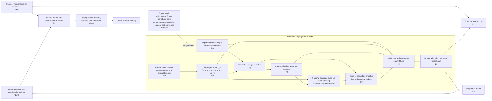
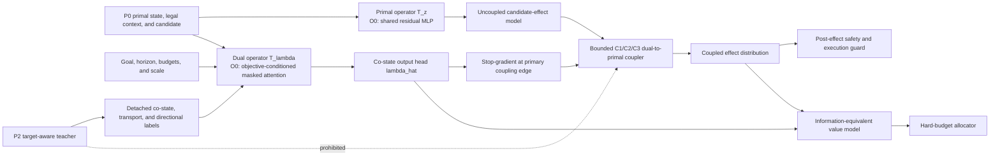
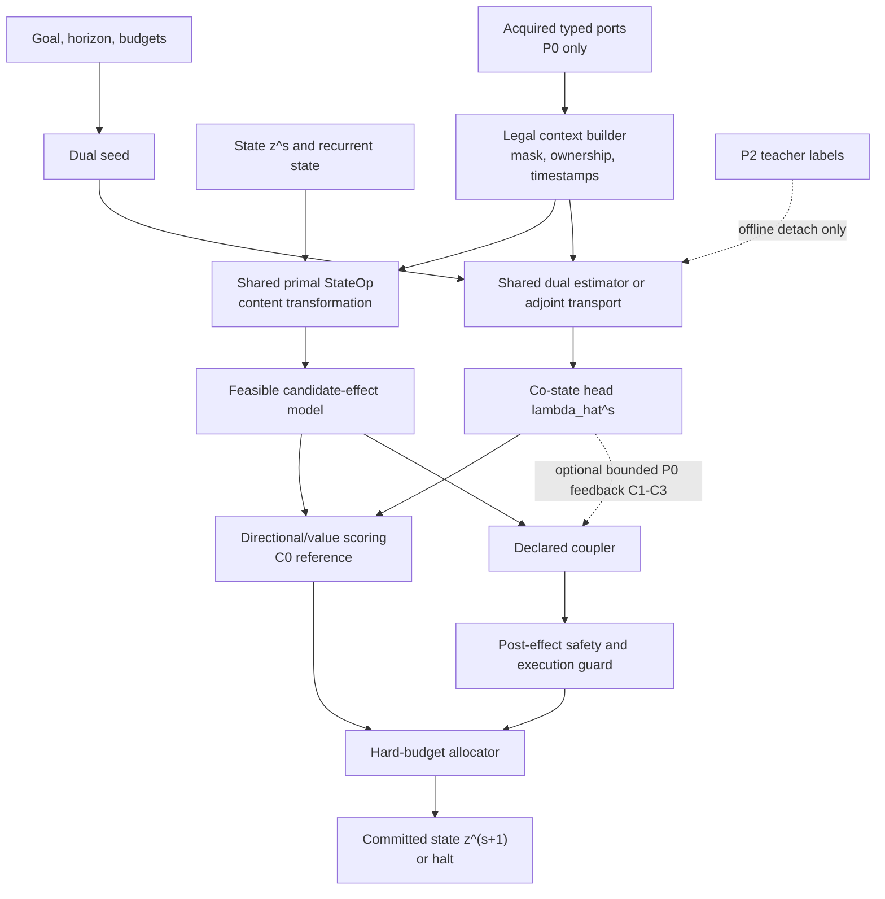
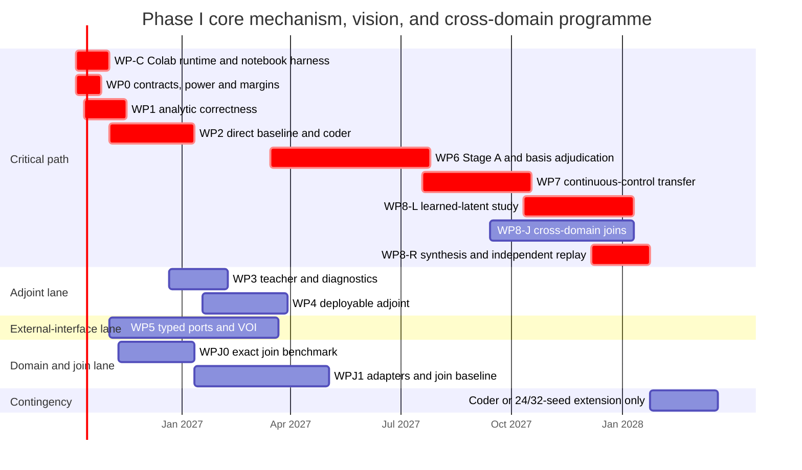
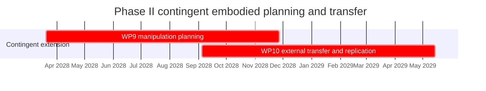

# Adjoint-Guided Recursive Rate-Distortion World Models Across Domains
## Comprehensive Research, Validation, and Google Colab Implementation Plan

## Protocol snapshot

### Plain-language abstract

This programme tests whether a recursive world model can allocate representational detail, computation, sensing, planning effort, and cross-domain communication only where those resources improve a declared future objective. The model exposes legal coarse-to-fine refinement, query, planning, and hierarchical-join actions under explicit information-rate, compute, latency, memory, reliability, and safety budgets. A co-state is defined strictly as the derivative of a declared cost-to-go with respect to the differentiable deployed state; it becomes useful only when combined with a feasible candidate effect and explicit costs. The principal scientific comparison is a causal adjoint-guided allocator against a fully realized direct marginal-gain critic with matched causal information, supervision, candidate actions, parameters, actual coded rate, hardware profile, tuning opportunity, and measured inference cost. Analytic trees establish correctness; controlled multiscale and cross-domain benchmarks test allocation and hierarchical joins; learned JEPA-style representations and embodied planning open only after the corresponding correctness, accounting, causal, and statistical gates pass. All experiments, tests, benchmarks, and training execute through restartable Python notebooks on NVIDIA T4, L4, or A100 accelerators in Google Colab.

### Current scientific status

```text
S0_DIAGNOSTIC_EXECUTION_COMPLETE
P0_SCIENTIFIC_VALIDATION_PENDING
PROMOTED_DOMAIN_AND_ROBOTICS_SCALE_UP_BLOCKED
```

The current Colab implementation is a useful execution and artifact-generation smoke test. It shows that the model, plotting, serialization, manifest, and GPU code paths run on a Tesla T4. It does not yet establish a causal adjoint contribution, a matched quality-cost frontier, a calibrated co-state, hierarchical-join superiority, or embodied-planning superiority.

The recorded P0 summaries are retained as provenance:

- five listed seeds: `101`, `202`, `303`, `404`, and `505`;
- direct-labelled reconstruction mean `1.7447827065`, standard deviation `0.1390934325`;
- adjoint-labelled reconstruction mean `1.4413422358`, standard deviation `0.1149032703`;
- mean T4 timing recorded as `0.5711492 ms` for the critic-labelled path and `0.5027492 ms` for the adjoint-labelled path;
- target device `cuda` on a Tesla T4.

These numbers are not accepted as method effects because the notebook constructs the reported loss difference from one shared base loss using fixed multipliers and does not time the complete allocator paths. The mechanism-decomposition plot is interpreted as a gradient-scale and sigmoid-saturation diagnostic, not as evidence of calibrated allocation utility.

### Primary scientific question

> Does an explicit, causal representation of downstream objective sensitivity improve candidate ranking, allocation regret, transfer, or net decision efficiency beyond a parameter-, information-, supervision-, actual-rate-, hardware-, and measured-compute-matched direct marginal-gain critic?

### Strongest defensible programme claim

> A shared recursive world model can use causal deployable adjoint estimates, feasible candidate-effect models, typed external ports, and metered hierarchical joins to allocate refinement, sensing, planning, and cross-domain communication more effectively across held-out goals, horizons, domains, and hierarchy structures than matched direct-utility, uncertainty-only, fixed-scale, flat-fusion, and non-recursive adaptive baselines.

This claim remains conditional until the evidence-integrity reset, analytic correctness suite, direct-baseline realization, matched `HJoinBench` confirmation, complete accounting, and independent replication gates pass.

### Primary matching contract

| Quantity | Required match between adjoint and direct-critic arms |
|---|---|
| Causal information | Identical `P0` state, goal, horizon, budgets, legal candidates, acquired ports, join state, histories, masks, timestamps, ownership, and provenance |
| Supervision | Identical examples, counterfactual labels, continuation semantics, label budget, and train/validation/test/replication splits |
| Candidate actions | Identical refine, query, join, request, refresh, release, planning, hold, and stop actions |
| Model capacity | Matched deployed parameter envelope, with neutral capacity where explicit co-state inputs are absent |
| Optimization opportunity | Equal initial search, validation access, tuning wall-clock, stopping rules, and a bounded conservative direct-baseline rescue |
| Information rate | Identical canonical coder, quantizers, reset policy, topology and metadata charging, and actual bit budget |
| Inference cost | Matched `C_total`, including forward, backward, candidate generation, effect prediction, coupling, port, join, serialization, synchronization, padding, memory traffic, and safety costs |
| Hardware | Paired arms run on the same GPU family, precision, batch/layout contract, package lock, compiler state, and profiler path |
| Randomness | Paired seeds and common-random-number streams where valid; independent generator-seed replication is mandatory |
| Decision semantics | Identical hold/stop references, continuation policy, safety rules, tie-breaking, and hard budgets |
| Analysis | Prespecified endpoint and practical margin; no aggregate score may override a failed primary endpoint |

### Evaluation tracks and primary endpoints

| Track | Primary endpoint | Interpretation boundary |
|---|---|---|
| Prediction | Held-out future-state, coefficient, or latent loss at matched actual rate and `C_total` | NLL, calibration, rate saving, latency, and energy are secondary |
| Allocation | Oracle regret and `AURC` across the frozen budget range | Mean allocation magnitude is not an endpoint |
| Query and active sensing | Query regret or task value after acquisition cost, failure, delay, and corruption | Sensitivity alone is not value of information |
| Join allocation | Oracle join regret and join `AURC` at the frozen join budget | Join depth and message sparsity are diagnostics |
| Cross-domain transfer | Equal-domain-weighted held-out improvement with worst-domain non-inferiority | Sample-count-weighted pooling cannot hide negative transfer |
| Planning | Task success or return at matched total decision compute | Action ranking, latency, energy, and model calls are secondary |
| Systems | Quality-cost frontier within one hardware stratum | T4, L4, and A100 timings are reported separately |
| Runtime assurance | Safety/deadline compliance and recovery under the frozen switching policy | Empirical switching evidence is not a general proof of stability |

### Programme map

| Programme block | Purpose | Promotion condition |
|---|---|---|
| Evidence integrity | Remove constructed effects, hardcoded allocations, self-declared gates, and invalid timing | Clean-kernel replay and shortcut-detection tests pass |
| Analytic correctness | Verify co-states, candidate effects, VOI, oracles, ledgers, and invariance | All correctness gates pass on `LQTree` |
| Matched hierarchical allocation | Establish or reject adjoint contribution on explicit joins | Direct baseline realized; `HJoinBench-0/1/2` accounting and causal gates pass |
| Mechanism calibration | Determine whether improvement is caused by objective-aligned directional effects | Semantic controls, mediation, and reparameterization tests pass |
| Efficient deployment | Compress, cache, amortize, or selectively invoke co-states | Frozen fraction of confirmed benefit retained within L4 latency/memory limits |
| Continuous control and planning | Test scaling with action dimension, horizon, uncertainty, and planning complexity | Task endpoint improves at matched total decision compute without safety regression |
| Cross-domain and learned-latent models | Generalize across typed hierarchies and JEPA-style representations | Per-domain non-inferiority, collapse, rate, and recursion-transfer gates pass |
| Hardware and runtime assurance | Establish device-specific frontiers and a defensible critic fallback | Separate hardware strata, calibrated monitor, switching tests, and deadline gates pass |
| Independent replication and release | Test unopened generators, domains, implementations, and simulators | Replication manifest and full positive/null/negative result matrix complete |

### Execution environment and resource envelope

The reference execution model is Python in Google Colab with notebooks acting as reproducible run sheets over importable modules. T4 is retained for diagnostic replay and portability checks; L4 is used for smoke tests, pilots, compression, and throughput engineering; A100 is used for promoted confirmation and larger learned-latent or planning runs. Paired scientific comparisons stay within one hardware stratum.

The nominal core programme spans 68 weeks for three core researchers, with parallel model, systems, statistics, external-interface, and domain/join lanes. Phase II manipulation and external-transfer work requires a separate unlock and may add 36–60 weeks with simulation or robotics support. The planning envelope is approximately `1,900–5,550` L4 hours and `2,850–8,600` A100 hours across integrity, analytic, cross-domain, learned-latent, planning, hardware, and replication work. Actual allocations are frozen after pilot variance and profiler measurements.

### Navigation

- [Current evidence status and scientific-integrity gate](#current-evidence-status-and-scientific-integrity-gate)
- [Core research protocol](#core-research-protocol)
- [Research programme commitments](#0-research-programme-commitments)
- [Evidence-calibrated entry sequence and next phases](#0a-evidence-calibrated-entry-sequence-and-next-phases)
- [Scientific questions and hypotheses](#2-research-questions-hypotheses-endpoints-and-falsifiers)
- [Operational contracts and accounting](#3-operational-definitions-state-contracts-and-accounting)
- [Formal allocation model](#4-formal-model)
- [System architecture](#5-system-architecture)
- [Experimental programme](#7-experimental-programme)
- [Baselines and ablations](#8-required-baselines-and-ablations)
- [Metrics and statistics](#9-metrics-and-statistical-protocol)
- [Work packages and timeline](#10-work-packages-and-timeline)
- [Repository and notebooks](#11-repository-architecture)
- [Verification and tests](#12-verification-and-test-plan)
- [Risk register](#13-risk-register)
- [Claim discipline](#15-claim-discipline-and-decision-framework)
- [Notation registry](#appendix-a-consolidated-notation-and-label-registry)

---

# Current evidence status and scientific-integrity gate

## Evidence inventory

| Artifact | Supported interpretation | Unsupported interpretation |
|---|---|---|
| `Untitled0.ipynb` | End-to-end Colab/T4 code paths execute and generate artifacts | A fair allocator comparison or completed research programme |
| `p0_computation_ledger.csv` | Five seed-labelled rows were exported | Independent method-specific losses or allocator latency |
| `p0_evidence_manifest.yaml` | T4 device, five listed seeds, and descriptive summaries were serialized | Confirmatory superiority, complete accounting, or independent replication |
| `mechanism_decomposition_spectrum.png` | The current output changes sharply with a raw gradient-feedback multiplier | Calibrated co-state utility or an optimal operating point |
| `cross_domain_advantage_study.png` | Allocation-head means can be plotted across synthetic generators | Join regret reduction or downstream quality advantage |
| `quality_cost_frontier.png` | A plotting and export pipeline exists | An empirically measured frontier when the loss gap is constructed |
| `embodied_planning_evaluation.png` | Reward distributions can be simulated from assigned resource levels | Matched-budget learned planning control |
| `positive_result_manifest.yaml` and `final_compliance_report.yaml` | Legacy workflow state and intended thresholds are preserved | Gate-backed activation or independent scientific compliance |

## Evidence-audit findings

The current notebook must not be used to support a superiority statement for the following reasons.

1. **Constructed loss difference.** The critic-labelled and adjoint-labelled losses are computed from the same base prediction loss using fixed method-specific multipliers:

   ```python
   loss_crit = base_loss * 1.15
   loss_adj  = base_loss * 0.95
   ```

   The exact ratio `0.95 / 1.15 = 0.8260869565` fixes the apparent `17.39%` reduction before any allocator decision is evaluated.

2. **Shared and incomplete timing region.** The recorded timing blocks cover the shared world-model forward path rather than the critic head, co-state estimator, backward sweep, effect model, hard allocator, or safety path. CUDA synchronization is absent, so the recorded `0.571 ms` and `0.503 ms` means are provenance only.

3. **Hardcoded planning allocations.** The planning demonstration assigns different constant resource levels to the two controllers. Reward separation therefore measures the simulator's response to manually assigned resources rather than learned allocation quality.

4. **Allocation magnitude is not advantage.** A lower or higher mean allocation weight is not a scientific endpoint. The required endpoint is task value, regret to an oracle, or `AURC` at matched actual rate and measured compute.

5. **Untrained scale sweep.** The mechanism spectrum varies the scalar in `sigmoid(sensitivity * dL_dy)` using fresh, untrained modules. The fall from roughly `0.50` at multiplier `0.01` to roughly `0.31` at multiplier `10`, and the crossing of the critic reference between multipliers near `1` and `2`, demonstrate scale sensitivity and saturation only. They do not establish correct co-state direction, calibration, or value per cost.

6. **Self-declared activation.** A manifest written by the same notebook before scientific gates run is not evidence that those gates passed. Activation and compliance records must be generated from immutable gate artifacts after the relevant analysis completes.

## Normative evidence status

```yaml
scientific_status: P0_SCIENTIFIC_VALIDATION_PENDING
diagnostic_execution: complete
validated_hardware_path: Tesla_T4_Colab
confirmed_adjoint_superiority: false
confirmed_hierarchical_join_utility: false
confirmed_embodied_planning_utility: false
promoted_scale_up: blocked
```

The legacy `P0_REPLAY_COMPLIANT`, `activated`, `replicated_adjoint_advantage_detected`, and `FULLY_COMPLIANT` labels remain archived for provenance but do not control progression.

## Evidence-closure requirements

Before any superiority-led expansion, the programme requires:

- method-blind metric functions with no branch on method name;
- independent train, validation, test, and replication generator seeds;
- actual legal allocation actions that change computation, observation, refinement, join state, or planning fidelity;
- exact or forced-action counterfactual labels under declared continuation semantics;
- separately trained critic and adjoint heads on a frozen or equivalently controlled world model;
- complete candidate, backward, memory, synchronization, port, join, and safety accounting;
- synchronized CUDA-event timing with warm-up and p50/p95/p99 reporting;
- a fully realized direct critic, including the bounded rescue protocol;
- randomized, permuted, wrong-goal, wrong-horizon, stale, sign-flipped, and raw-norm controls;
- seed-level endpoint tables and confidence intervals;
- clean-kernel notebook replay and interruption-equivalent checkpoint recovery;
- immutable source, environment, dataset, split, checkpoint, figure, and artifact hashes;
- an activation manifest generated only from passed gate artifacts.

## Prohibited shortcuts

Tests must fail when any of the following occurs:

- a method-specific constant scales loss, reward, regret, quality, or latency;
- identical predictions receive different endpoint values because of a method label;
- fixed allocation profiles are presented as learned controller outputs;
- artifact existence is treated as scientific compliance;
- an allocator comparison excludes a backward sweep, candidate generation, or safety cost;
- future targets, hidden simulator state, exact correspondences, or oracle continuation values enter a deployable trace;
- a plot is released without its raw table, run manifest, script hash, and confidence interval;
- T4, L4, and A100 timings are pooled into one systems claim;
- a failed or aborted seed is silently replaced;
- a positive downstream result is used to rescue a failed correctness or primary allocation gate.

## Activation contract

A future `positive_result_manifest.yaml` is an output, not an input. It may be signed only when all of the following are true:

1. the direct critic meets the realization floor or the result remains inconclusive;
2. the causal deployable adjoint beats the critic on the frozen primary endpoint by the frozen practical margin;
3. the sequential confidence or posterior rule supports the effect;
4. randomized and semantically wrong co-state controls do not reproduce the effect;
5. complete actual-rate and `C_total` accounting preserves the sign;
6. no domain violates the worst-domain guard;
7. no privilege, optimizer-taint, hidden-state, or exact-correspondence violation exists;
8. the result survives an independent generator seed and a clean-kernel replay;
9. the basis classification and hardware stratum are stated explicitly;
10. the manifest references immutable gate artifacts, raw tables, checkpoints, traces, and source hashes.

---

# Core research protocol

## 0. Research programme commitments

The research programme is governed by the following commitments.

1. **Use a discrete forward-adjoint formulation.** Physical time, recursion depth, and refinement-decision order are different axes and must not be collapsed into one variable. The allocator is formulated as a discrete controlled computation process over refinement step `k`; physical time is `t`; tree depth is `s`.
2. **Treat the co-state as sensitivity, not as refinement value.** A co-state is the derivative of a defined cost-to-go with respect to a differentiable state. It does not by itself measure expected distortion reduction, information gain, or value per bit.
3. **Use directional adjoint effects.** The useful first-order quantity is the effect of a feasible refinement-induced state change on the objective, such as `-lambda^T delta_x`, or a dual-weighted residual. Raw `||lambda||` is coordinate-dependent and can be large where refinement cannot change the state.
4. **Keep the direct marginal-gain critic as the principal baseline.** The adjoint route is an augmentation whose scientific value must be demonstrated. It is not assumed to outperform a direct counterfactual value head.
5. **Separate teacher and deployable adjoints.** Exact target-aware adjoints may be computed during training to create labels and diagnostics. They may not be supplied to the deployed gate. Deployment uses either a causal backward sweep through an imagined rollout, an amortized co-state estimator, or a hybrid of the two.
6. **Formalize foreign leaves as typed ports.** External information may be given, queryable, uncertain, delayed, or owned by another subtree. Each port has explicit timing, provenance, ownership, reliability, rate cost, compute cost, and gradient semantics.
7. **Do not equate a foreign input with a boundary condition automatically.** Some foreign leaves are exogenous inputs; some are interface constraints; some are observations that can be purchased; some are peer messages. Only terminal or spatial interface conditions are described literally as boundary conditions.
8. **Use value of information for queries.** Sensitivity to a foreign input is not the same as the value of observing it. Query decisions require a counterfactual expected value-of-information estimate, especially when the expected first-order update is zero.
9. **Use explicit candidate-continuation semantics.** Local, fixed-continuation, deployed-policy, and oracle gains are distinct labels. Every training target, trace, metric, and oracle result declares which continuation semantics it uses.
10. **Halt on expected net candidate benefit.** Halt when the best feasible candidate has non-positive expected net benefit after rate, compute, latency, and query costs, or when a hard budget is exhausted.
11. **Retain complete rate and compute accounting.** Root state, refinements, topology, external and join messages, recurrent memory, join caches, learned side channels, candidate generation, backward sweeps, adapters, port transport, synchronization, and maintenance are fixed-capacity or charged. Foreign ports and hierarchical joins may not become unmetered information bypasses.
12. **Use discrete reverse-mode differentiation first.** Implicit differentiation is reserved for a genuine fixed-point or inner-optimization formulation. Continuous-adjoint methods are not the default for an explicitly discrete recursive tree.
13. **Restrict physical analogies to explicitly proved operator correspondences.** The formal method is goal-oriented forward-adjoint refinement. Refractive-index, scattering, wavelet-propagation, and Fourier-band analogies carry no evidentiary weight unless an operator equivalence is stated and tested.
14. **Use gated parallelism rather than a single serial chain.** Analytic correctness precedes the direct adaptive baseline. Once that baseline passes its stability and accounting gate, the deployable-adjoint branch and typed external-interface branch proceed in parallel. A bounded learned-basis diagnostic runs during Stage A alongside the fixed basis. Full learned-latent and embodied stages begin only after Stage A classifies basis dependence and the relevant accounting gates pass.
15. **Keep primal state and co-state separate.** The state carries predictive content and recurrent sufficient statistics; the co-state carries sensitivity of a declared objective. They use distinct output heads and are never identified, averaged, or forced to reconstruct one another. Shared scale embeddings or backbone features are permitted only as declared ablations.
16. **Make any feedback asymmetric, causal, bounded, and auditable.** A forward refinement may be modulated only by a `P0` model-derived or amortized co-state through a bounded, logged coupling operator with a fixed alternation count. A target-aware teacher co-state may supervise the estimator but may never drive the deployed state path. State–co-state alignment is judged by counterfactual utility, allocation regret, scale-selection agreement, and stability—not by raw energy matching or correlation.
17. **Assign semantic roles by contracts and supervision, not by layer names.** A state operator advances predictive content under the primal state contract; a co-state estimator approximates objective sensitivity under directional and transport tests. Attention, MLPs, convolutions, state-space models, recurrent cells, implicit fields, and graph operators are implementation families rather than semantic identities. The role-aligned MLP-state/attention-co-state pairing is a prespecified hypothesis tested against all-MLP, swapped-role, all-attention, and single-stream controls.
18. **Separate the core mechanism study from embodied extensions.** Phase I ends after Stages 0–A, B, C-L, and C-J, the Phase I reproducibility package, and the registered-report analysis. Phase II Stages D–E begin only after a basis-robust positive or independently confirmed basis-dependent positive Stage A result, a causal deployable estimator, a stable C-L planning representation, and completion of the C-J correctness and accounting classification. A negative or inconclusive basis classification closes Phase II under this protocol.
19. **Use pilot-driven precision under a controlled sequential design.** Stage A begins with eight paired seeds but may expand mechanically to 16, 24, or 32 from blinded pilot variance and the frozen alpha-spending/futility contract. Interim results may stop or continue sampling; they may not alter models, endpoints, bases, budgets, or tuning.
20. **Treat determinism and optimizer state as scientific contracts.** Sparse reductions, scatter/gather kernels, batching, layout, safety randomness, parameter updates, and optimizer moments are audited. Direct privileged gradients taint both parameters and optimizer state; only the authorized detached-label student path may produce exportable P0 weights.

21. **Generalize through typed domain adapters, not hidden domain branches.** Every spatial, temporal, relational, event, or control domain implements the same hierarchy and candidate contracts. Domain-specific capacity, normalization, metadata, and compute are explicit and matched.
22. **Treat hierarchical joins as allocation actions.** A join is a directed, typed, level-aware edge whose message, maintenance, topology, synchronization, and reliability costs are charged. Concatenation, cross-attention, or shared memory is not a free join.
23. **Separate modality composition from distributional transfer.** Within-sample sensor fusion, transfer to a held-out environment, and transfer to a new representation domain are different claims with separate splits and endpoints.
24. **Use Colab notebooks as reproducible run sheets, not as the implementation.** Scientific logic lives in importable Python modules; notebooks load one immutable `RunSpec`, execute top-to-bottom, checkpoint atomically, and export a signed result bundle.
25. **Keep paired systems comparisons in one hardware stratum.** A direct/adjoint or flat/hierarchical pair uses the same L4 or A100 profile, precision, physical batch, layout, package lock, and profiler path. Hardware transfer is reported separately.
26. **Make every run interruption-equivalent.** Saving and resuming must preserve model, optimizer, scheduler, scaler, RNG, data-sampler, active-tree, join-graph, ledger, and notebook-cell state so that a resumed trace agrees with an uninterrupted reference within the frozen tolerance.

The programme has six linked tracks:

- **Track F — fixed-boundary mechanism:** fixed wavelet hierarchy, exact tree semantics, actual bit accounting, shared recursive prediction, direct utility baseline, and no learned high-capacity observation encoder or learned reconstruction decoder.
- **Track A — adjoint-guided allocation:** exact training-time adjoints, deployable co-state estimation, directional candidate scoring, hard budgeted refinement, and a bounded causal state–co-state coupling study nested behind the score-only adjoint baseline.
- **Track X — external interface ports:** given and queryable foreign leaves with causal timing, cost accounting, missingness, corruption, and cross-subtree coupling tests.
- **Track M — micro-JEPA basis diagnostic:** a frozen, low-capacity learned observation basis with fixed hierarchy and complete rate/compute accounting, used only to determine whether a Haar-specific representation artifact suppresses the adjoint signal.
- **Track L — learned-latent extension:** JEPA-style learned representation, fixed cross-scale restriction, complete latent-rate accounting, and the same allocator comparisons.
- **Track J — cross-domain hierarchical joins:** typed domain adapters, explicit level maps, metered join messages, exact small-problem join oracles, leave-one-domain-out transfer, and matched no-join and flat-fusion controls.

Track A does not replace Track F's direct counterfactual utility head. Track X infrastructure may begin on `LQTree` after analytic correctness and may integrate with the direct allocator after Track F passes its baseline gate; it does not depend on a positive adjoint result. Retrieval and learned external memory do not enter Track X until simpler port classes pass accounting and causality gates. Track M is a diagnostic arm, not an early substitute for Track L: its encoder is frozen before allocation training, its scope is limited to controlled Stage A data, and its result is interpreted through the basis-adjudication rules. Full Track L begins after Stage A resolves the basis classification and the direct adaptive mechanism passes. An adjoint-specific Track L comparison additionally requires basis-robust evidence or a separately confirmed basis-dependent result. Track J begins with exact synthetic joins and the direct allocator; it does not depend on H2. Adjoint-guided join selection is promoted only after the no-join, flat-fusion, and direct hierarchical-join arms are realized.

Phase I comprises Stages 0–C, including the C-L learned-latent and C-J cross-domain substages, and concludes with the core analysis and reproducibility package. Phase II Stages D–E unlock only when Stage A yields a basis-robust positive or independently confirmed basis-dependent positive deployable-adjoint result, the causal estimator and accounting gates pass, C-L supplies a stable representation for planning, and the C-J correctness and accounting classification is complete. A basis-dependent positive result restricts Phase II to the supported representation family. A negative or inconclusive classification ends Phase II under this protocol; any direct-only embodied study requires a separate protocol rather than consuming the contingent extension budget.


## 0A. Evidence-calibrated entry sequence and next phases

The following sequence gates the full mechanism, cross-domain, learned-latent, and embodied programme. It is normative for progression from the present diagnostic state. Existing later-stage work packages may prepare infrastructure in parallel, but no promoted claim or confirmatory test opens before its entry gates pass.

### 0A.1 Phase N0 — evidence-integrity reset

**Timing:** weeks 1–2  
**Purpose:** convert the current notebook demonstration into an auditable experimental substrate.

Required work:

- preserve hashes of the supplied notebook, CSV, YAML, and figures;
- extract scientific logic into importable Python modules;
- remove fixed `1.15/0.95` loss multipliers and all fixed method-specific allocation profiles;
- replace self-declared activation and compliance with gate-backed state transitions;
- add generator, split, initialization, environment, and planning seeds as separate manifest fields;
- implement explicit train, validation, test, and replication partitions;
- implement synchronized CUDA-event timing around each allocator component;
- record source, environment, dataset, split, checkpoint, trace, bitstream, and artifact hashes;
- implement tests that intentionally reintroduce each prohibited shortcut and verify detection;
- retain current plots under a diagnostic namespace rather than as scientific results.

**Exit gate:** a fresh Colab kernel regenerates identical diagnostic artifacts; resume equivalence passes; every intentionally reintroduced shortcut is detected; status becomes `N0_INTEGRITY_READY` rather than `activated`.

### 0A.2 Phase N1 — analytic correctness and true allocation

**Timing:** weeks 2–6  
**Purpose:** prove co-states, candidate effects, counterfactual labels, value of information, and hard-budget allocation on `LQTree`.

Deliverables:

- exact linear-quadratic tree dynamics and exhaustive dynamic-programming oracle;
- legal `hold`, `stop`, `refine`, `query`, and bounded join actions;
- analytic, autograd, and finite-difference co-state agreement;
- exact local, one-step, policy, and oracle gains;
- exact query VOI and port failure/corruption cases;
- separately trained direct critic and amortized co-state estimator;
- canonical rate and compute ledgers;
- objective-unit and paired coordinate-reparameterization tests;
- CPU reference and L4 smoke notebooks.

**Exit gate:** all correctness tests pass; the benchmark contains verified adaptive opportunity; both learned methods beat fixed and random allocation; the direct baseline reaches its realization floor.

### 0A.3 Phase N2 — matched hierarchical-join confirmation

**Timing:** weeks 5–14  
**Purpose:** establish or reject an explicit adjoint contribution on real hierarchical allocation and join actions.

Sequence:

1. `HJoinBench-0`: exact analytic joins and bounded exhaustive oracle;
2. `HJoinBench-1`: nonlinear learned candidate effects and calibrated join values;
3. `HJoinBench-2`: held-out domain pairs, relation types, depth maps, and join topologies.

Required arms:

- fixed allocation;
- random allocation;
- uncertainty-only;
- no-join and domain-isolated models;
- matched flat early and late fusion;
- realized direct hierarchical critic;
- directional-only, co-state-only, and full adjoint allocators;
- randomized and permuted co-state controls;
- exact teacher and oracle upper bounds on bounded cases.

**Primary endpoint:** `AURC_direct - AURC_adjoint`, oriented so positive favours the adjoint, with complete actual-rate and `C_total` matching.

**Exit classes:** deployable adjoint contribution; teacher-only value; direct utility sufficient; hierarchy useful without explicit adjoint; basis/domain-dependent effect; negative transfer; accounting failure; or inconclusive because the direct baseline or statistical precision is insufficient.

### 0A.4 Phase N3 — mechanism and scale calibration

**Timing:** weeks 9–18  
**Purpose:** determine why any validated advantage occurs and replace raw gradient scaling with calibrated expected net benefit.

Required analyses:

- direct, directional-only, co-state-only, full-adjoint, random, permuted, stale, sign-flipped, wrong-goal, and wrong-horizon factorial arms;
- objective-unit rescaling with consistent benefit/cost transformation;
- deliberate estimator miscalibration with costs held fixed;
- paired coordinate transforms satisfying `lambda' = A^{-T} lambda` and `delta_x' = A delta_x`;
- candidate-action mediation: action-change rate and regret conditional on changed actions;
- co-state uncertainty calibration and applicability prediction;
- gate saturation, halt rate, allocation entropy, and stability surfaces;
- critic catch-up under additional labels, capacity, and training compute.

**Exit gate:** a mechanism claim is permitted only when objective-aligned co-state information changes actions, those changed actions reduce held-out counterfactual regret, semantic controls remove the effect, and complete cost accounting preserves it.

### 0A.5 Phase N4 — deployment compression and selective invocation

**Timing:** weeks 15–28  
**Purpose:** retain confirmed utility while reducing backward, memory, and latency cost.

Compare:

- always critic;
- always imagined-rollout adjoint;
- amortized co-state;
- candidate-projected or low-rank co-state;
- cached co-state with explicit age and staleness model;
- one-sweep hybrid;
- cost-aware selective invocation;
- critic fallback under uncertainty, deadline, or stale-state triggers.

The selective controller uses the frozen decision rule:

```text
invoke adjoint when
E[gain over critic | x_k] > incremental cost + risk margin
```

**Exit gate:** at least one causal deployment mode retains the frozen fraction of confirmed benefit while meeting L4 latency, peak-memory, bandwidth, calibration, and hard-budget targets. A100 confirmation opens only after the L4 contract is frozen.

### 0A.6 Phase N5 — continuous action and planning scale-up

**Timing:** weeks 19–38  
**Purpose:** test whether adjoint value scales with action dimension, horizon, uncertainty, model error, and planning complexity.

Environment ladder:

1. analytic linear and nonlinear continuous control;
2. Gymnasium-compatible low-dimensional tasks;
3. MuJoCo locomotion and manipulation primitives;
4. an independently implemented Brax-style parity or throughput arm;
5. coupled locomotion, contact, and dexterous tasks after lower stages pass.

Real computation actions include planning horizon, action-candidate count, CEM/MPPI iterations, ensemble members, rollout fidelity, latent refinement depth, sensor acquisition, join creation, and co-state refresh.

**Exit gate:** the promoted method improves return or task success at matched total decision compute on held-out environments, passes action-regret mediation, and does not increase collision, constraint, deadline, or fallback violations.

### 0A.7 Phase N6 — cross-domain and multimodal hierarchical joins

**Timing:** weeks 21–42, parallel with N5  
**Purpose:** generalize across spatial, temporal, relational, event, sensor, control, and bounded language-token hierarchies.

Requirements:

- every domain implements `DomainSpec`, `HierarchySpec`, normalized level coordinate `rho_d`, legal candidates, restriction/prolongation operations, and an explicit adapter budget;
- joins are directed, typed, level-aware, causally timestamped, ownership-aware, rate-charged, compute-charged, latency-charged, and reliability-modelled;
- exact correspondence identifiers remain `P3` and never enter deployment;
- language enters only through a frozen typed boundary with tokenization, encoder, context, latency, message, and rate costs;
- hidden labels, future state, answer tokens, and privileged retrieval are prohibited;
- no-join, flat-fusion, random-join, all-join, same-depth, direct hierarchical, and oracle controls remain available.

**Exit gate:** hierarchy-aware joins beat the strongest realized flat-fusion arm on held-out pairs or topologies, survive semantic shuffles, and satisfy the worst-domain non-inferiority guard.

### 0A.8 Phase N7 — learned latent recursive model

**Timing:** weeks 35–56  
**Purpose:** move from fixed and analytic hierarchies to a JEPA-style learned latent hierarchy without losing causal, accounting, or collapse controls.

Requirements:

- representation recipe selected in representation-only pilots before allocator outcomes are inspected;
- EMA target, stop-gradient without EMA, and variance-covariance stabilization are prespecified matched candidates;
- automated latent-variance and effective-rank collapse tripwire;
- actual latent-rate and side-information ledger;
- fixed cross-scale restriction/prolongation contract;
- unseen-depth, unseen-resolution, and branching-factor transfer;
- repeated direct-versus-adjoint comparison without post-hoc architecture selection;
- frozen micro-JEPA and smoother fixed-basis adjudication when basis mismatch remains possible.

**Exit gate:** the representation remains healthy, recursive transfer succeeds, complete rate accounting closes, and the allocator result stays within the permitted basis classification.

### 0A.9 Phase N8 — hardware-aware deployment and runtime assurance

**Timing:** weeks 29–58, parallel  
**Purpose:** establish device-specific quality-cost frontiers and a defensible critic fallback.

Hardware strata:

- `t4_replay`: diagnostic replay and portability only;
- `l4_pilot`: pilots, compression, kernel/layout engineering, and throughput studies;
- `a100_confirm`: promoted confirmation and larger learned-latent or planning runs;
- `hardware_transfer`: separately reported precision, quantization, memory-bandwidth, and layout sensitivity.

Runtime-assurance work includes:

- calibrated co-state uncertainty and divergence monitors;
- hysteresis and minimum dwell time;
- deadline, memory-pressure, stale-cache, and estimator-fidelity triggers;
- deterministic safety randomness or worst-case bounds;
- recovery-set and fallback-reachability tests;
- empirical high-frequency switching stress;
- Lyapunov, barrier, invariant-set, multiple-Lyapunov, or dwell-time analysis only for explicitly bounded systems whose assumptions are stated and checked.

**Exit gate:** systems claims are confined to measured devices; switching meets safety, deadline, and recovery requirements; no arbitrary scalar threshold is presented as a general stability proof.

### 0A.10 Phase N9 — independent replication and release

**Timing:** weeks 55–68  
**Purpose:** test the effect under a clean implementation, independent generator or simulator, unopened domain family, and independent analysis path.

Release requirements:

- all positive, null, reversed, restricted, divergent, aborted, and failed results;
- seed-level raw tables and confidence intervals;
- checkpoints, exact bitstreams, traces, ledgers, and profiler outputs;
- environment lock, source hash, and figure-regeneration scripts;
- complete direct-rescue, seed-expansion, collapse, taint, determinism, and deviation logs;
- one-command CPU analytic suite and clean-kernel Colab replays;
- signed claim matrix that maps every statement to its passed gates.

### 0A.11 Programme calendar

| Weeks | Primary activity | Parallel activity | Decision output |
|---|---|---|---|
| 1–2 | N0 evidence-integrity reset | repository and notebook harness | integrity-ready gate |
| 2–6 | N1 analytic correctness | coder, port, join, and profiler substrate | `LQTree` correctness decision |
| 5–14 | N2 `HJoinBench-0/1/2` | direct rescue and power calibration | primary adjoint/direct classification |
| 9–18 | N3 mechanism calibration | basis and invariance adjudication | mechanism-supported or restricted result |
| 15–28 | N4 compression/selective invocation | L4 systems engineering | deployable mode selection |
| 19–38 | N5 continuous control | N6 joins begins | planning transfer decision |
| 21–42 | N6 cross-domain/multimodal joins | hardware profiling | join and transfer classification |
| 29–58 | N8 hardware/runtime assurance | N7 representation work | device and fallback boundaries |
| 35–56 | N7 learned latent recursion | embodied substrate preparation | learned-latent and recursion decision |
| 55–68 | N9 independent replication/release | limited Phase II preparation only after unlock | release and Phase II go/close decision |

### 0A.12 First 30 days

**Days 1–5 — integrity conversion**

- freeze hashes of the supplied notebook, CSV, YAML, and figures;
- extract code into importable modules;
- remove constructed loss gaps and fixed allocations;
- replace artifact-existence compliance with gate-backed compliance;
- add method-blind endpoint regression tests.

**Days 6–12 — timing and split contracts**

- create train/validation/test/replication hashes;
- implement separate generator and model seeds;
- add CUDA-event timing with synchronization and warm-up;
- profile world model, critic, estimator, backward sweep, effect model, allocator, joins, and safety separately;
- create immutable `RunSpec`, completion marker, and resume state.

**Days 13–21 — `LQTree`**

- implement exact state dynamics, hierarchy, hold, stop, refine, query, and bounded join actions;
- implement analytic/autograd/finite-difference co-states;
- implement exact candidate gains, VOI, and oracle allocation;
- train the first direct critic and amortized estimator separately.

**Days 22–30 — first honest comparison**

- run fixed, random, direct, directional-only, full-adjoint, randomized, raw-norm, and oracle arms;
- report regret, `AURC`, calibration, action changes, and complete cost;
- run objective-unit and coordinate-invariance tests;
- decide whether `HJoinBench-0` may open.

### 0A.13 First 90 days

| Period | Primary work | Required gate output |
|---|---|---|
| Days 1–30 | integrity reset and analytic correctness | `LQTree` pass/fail and direct-realization decision |
| Days 31–45 | explicit `HJoinBench-0` hierarchy and exact joins | join oracle, privilege, and ledger pass |
| Days 46–60 | `HJoinBench-1` direct realization and adjoint estimator | pilot effect, calibration, and power estimate |
| Days 61–75 | mechanism factorial and invariance | mechanism classification and applicable-state model |
| Days 76–90 | selective invocation, L4 profiling, `HJoinBench-2` substrate | confirmatory promotion manifest or bounded stop |

### 0A.14 Google Colab notebook suite

| Notebook | Profile | Purpose |
|---|---|---|
| `00_environment_and_hashes.ipynb` | CPU/L4/A100 | environment gate, source hash, deterministic support |
| `01_evidence_audit.ipynb` | CPU | detect constructed metrics, fixed allocations, and self-declared gates |
| `02_lqtree_exact_oracle.ipynb` | CPU | exact dynamics, oracle, VOI, finite differences |
| `03_lqtree_allocator_training.ipynb` | L4 | separate direct and adjoint heads on a frozen model |
| `04_invariance_and_scale.ipynb` | CPU/L4 | units, coordinate transforms, and estimator miscalibration |
| `05_hjoinbench_generator.ipynb` | CPU | explicit hierarchies, joins, splits, oracles, hashes |
| `06_hjoinbench_direct.ipynb` | L4 | direct critic realization and rescue |
| `07_hjoinbench_adjoint.ipynb` | L4 | teacher, imagined, amortized, projected, cached, and hybrid co-states |
| `08_hjoinbench_confirmatory.ipynb` | A100 | paired confirmatory evaluation and sequential seed schedule |
| `09_mechanism_factorial.ipynb` | L4/A100 | factorial, semantic controls, and mediation |
| `10_selective_invocation.ipynb` | L4 | compression, cache, trigger, and fallback |
| `11_continuous_control.ipynb` | L4/A100 | action-dimension and horizon ladder |
| `12_cross_domain_joins.ipynb` | L4/A100 | held-out pair, relation, topology, and missing-domain tests |
| `13_learned_latent.ipynb` | A100 | JEPA representation, collapse, and recursive transfer |
| `14_hardware_frontiers.ipynb` | T4/L4/A100 | separate device-specific frontiers |
| `15_runtime_assurance.ipynb` | CPU/L4 | switching, hysteresis, dwell time, deadlines, and recovery |
| `16_clean_replication.ipynb` | A100 or independent device | unopened replication and release audit |

Every notebook starts from a clean kernel, validates one immutable `RunSpec`, installs from a lock file, writes first to `/content`, checkpoints full scientific and random state, exports atomically, and writes a signed completion marker only after post-run audits pass.

### 0A.15 Entry-phase resource envelope

| Workstream | L4 planning range | A100 planning range | Retained storage |
|---|---:|---:|---:|
| Integrity, analytic, and exact joins | 100–250 GPU-hours | 0–100 GPU-hours | 50–150 GB |
| `HJoinBench` pilots and direct realization | 250–700 | 100–300 | 100–300 GB |
| Confirmatory allocation and mechanism | 200–500 | 300–900 | 150–500 GB |
| Compression and selective invocation | 250–700 | 200–600 | 100–350 GB |
| Continuous control | 300–900 | 500–1,500 | 200–800 GB |
| Cross-domain and multimodal joins | 400–1,100 | 600–1,800 | 300–1,000 GB |
| Learned latent and manipulation substrate | 400–1,000 | 900–2,500 | 400–1,500 GB |
| Independent replication and release | 100–400 | 250–900 | 300–900 GB |

T4 remains a diagnostic replay stratum and is never pooled with L4 or A100 to support a primary systems result.


## 1. Scientific claim boundaries and operational requirements

| Scientific proposition | Claim boundary | Operational requirement |
|---|---|---|
| A co-state represents sensitivity of future cost to the state. | Supported only after the objective, differentiable state, discrete context, and dynamics are specified. | Define the cost-to-go precisely and use a discrete adjoint recursion over the implemented computation graph. |
| High co-state magnitude means that a region should be refined. | Co-state magnitude alone is insufficient for allocation. | Score the directional effect of an available refinement, not state sensitivity in isolation. A high-gradient direction may be unreachable by that refinement. |
| Scale can play the role of time in optimal-control equations. | This is not an implementation identity; physical time, depth, and allocation order remain separate axes. | Use refinement-decision index `k` for allocation control, physical time `t` for dynamics, and depth `s` for hierarchy. |
| A forward solve and a backward adjoint solve define a goal-oriented refinement mechanism. | This statement is valid only for the declared discrete computation graph and objective. | Use the formal name *goal-oriented forward-adjoint refinement* and test the implemented primal and adjoint operators directly. |
| The adjoint directly provides prediction-error reduction per unit information. | This does not follow from the co-state definition. | Combine the adjoint with a candidate-effect model and explicit rate, compute, latency, and query costs. The co-state is one factor in marginal value. |
| Exact co-states can be passed to the refinement policy. | Permitted only for a training teacher or diagnostic oracle. | Test-time allocation must be causal. Future-target-derived gradients are prohibited at inference. |
| Foreign leaves are boundary conditions that inject sensitivity. | True only for explicit interface constraints. | Model external inputs as typed ports. Differentiable couplings produce sensitivities; queryable observations require expected value of information; discrete couplings require declared counterfactual or score-function estimators. |
| `lambda_leaf = lambda_internal + J^T lambda_foreign` is a general update. | The expression is valid only for a declared linear coupling and complete successor-edge semantics; it is not a general graph-adjoint recursion. | Apply the generic graph-adjoint recursion over every successor edge. Introduce Lagrange multipliers only for explicit interface constraints. |
| Feature density can be defined as co-state norm. | Co-state norm is not an invariant measure of allocated representation. | Feature density remains allocated bits, active refinements, compute, or realized value density. Co-state norm is a sensitivity diagnostic. |
| Halt when `\|\|lambda\|\| * expected_error_drop < rate + compute cost`. | Dimensionally and operationally weak. | Halt when the maximum expected net candidate advantage is below a fixed threshold, with uncertainty, safety rules, and hard budgets included. |
| Exact adjoints through deep recursion require implicit differentiation. | Implicit differentiation is required only for a declared converged fixed point or solved inner problem. | Use ordinary reverse-mode differentiation with checkpointing for finite unrolls. Use implicit differentiation only for converged fixed points or solved inner problems. |
| Contractive constraints are universally required. | Such constraints are introduced only in response to measured instability under the declared diagnostics. | Begin with residual updates, normalization, clipping, and Jacobian monitoring. Apply spectral or contractive penalties only if measured instability justifies them. |
| State and co-state should be aligned by matching raw energy or correlation. | Raw energy or correlation is representation-dependent and can be manufactured by rescaling; it is not evidence of causal alignment. | Evaluate alignment through directional candidate ranking, realized counterfactual gain, allocation-regret reduction, scale-selection agreement, and stability under paired reparameterization. Treat raw energy/correlation losses as negative controls. |
| Attention is the co-state and the MLP is the state. | Useful as a first-pass functional analogy, but false as an architectural identity. Attention outputs content as well as routing weights, MLPs can estimate sensitivity, and a standard transformer entangles both in one residual stream. | Define state transformation, co-state estimation, dual-to-primal coupling, and cross-scale transport as separate interfaces. Test a role-aligned dual stream against matched all-MLP, swapped-role, all-attention, and single-stream transformer controls. |
| A co-state may directly drive the forward state recursion. | This is admissible only for a causal deployable estimate under an explicit bounded coupling contract; a target-aware teacher in the state path is leakage. | Keep a score-only adjoint arm as the reference. Compare additive, multiplicative-residual, and cross-attention coupling only with `P0` co-states, fixed alternation count, logged gates, matched capacity, and complete compute accounting. |
| State and co-state should predict each other symmetrically. | Symmetric prediction is not required by the co-state definition. A co-state depends on state, objective, horizon, and model but need not contain state content; reconstructing state from co-state encourages redundancy and privileged leakage. | Train state-to-co-state amortization and discrete adjoint-transport consistency. Do not require co-state-to-state reconstruction in the primary method; retain it only as a labelled negative control. |
| Symplectic state/co-state dynamics with damping guarantee stability or energy conservation. | Symplecticity applies only to a declared canonical continuous-time subsystem; damping changes the preserved structure, and neither property guarantees bounded learned trajectories. | Restrict structure-preserving dynamics to an exploratory Stage B ablation comparing residual, symplectic, and conformally symplectic or split-damped integrators under long-horizon and form-drift diagnostics. |
| Failure under a Haar basis falsifies the adjoint mechanism. | Unsupported because basis regularity can alter candidate-effect smoothness and gradient sparsity. | Repeat the matched allocator comparison on a smoother fixed basis and the frozen Track M learned basis before making a representation-general rejection. |
| The same raw tree depth denotes the same abstraction across domains. | Unsupported. Image quadtrees, temporal segment trees, graph coarsenings, event spans, and control options have different depth semantics. | Map nodes through a declared normalized scale/abstraction coordinate and relation-specific compatibility rule; never join solely because depth indices match. |
| Concatenation or cross-attention constitutes a hierarchical join. | Unsupported without a typed edge, legal endpoints, causal availability, explicit message, and complete cost/privilege accounting. | Route every cross-domain message through the join registry and charge message, adapter, synchronization, and maintenance costs. |
| Better multi-domain average performance establishes generalization. | Unsupported when gains are driven by one domain or require training-domain identifiers or exact correspondences. | Use equal-domain weighting, leave-one-domain-out splits, unseen join topologies, a worst-domain non-inferiority guard, and P3 correspondence isolation. |
| A single shared latent space is required across domains. | Unsupported and potentially destructive. | Keep domain-native states and adapters separate; use a small typed join space only at declared edges. Compare against a fully shared latent ablation. |
| A hierarchical join must be bidirectional. | Unsupported. Causal influence and observation availability may be directional. | Represent bidirectionality as two separately legal, costed, and scheduled directed joins. |
| A join benefit proves an adjoint benefit. | Unsupported. Direct utility may select the same joins. | Establish join value first with the direct allocator; test explicit co-state contribution as a nested comparison. |

### 1.1 Strongest defensible research claim

> A shared recursive world model can use causal, deployable adjoint estimates together with explicit candidate-effect, rate, compute, and external-observation models to allocate refinement and sensing actions more effectively across held-out goals and horizons than parameter-, information-, supervision-, actual-rate-, and measured-compute-matched direct-utility, uncertainty-only, fixed-scale, and non-recursive adaptive baselines.

This claim is narrower and more falsifiable than claiming that co-state magnitude itself produces emergent zoom.

### 1.2 Primary scientific question

The primary question is not whether gradients can be back-propagated through a recursive model; that is standard reverse-mode differentiation. The operational question is:

> Does an explicit representation of downstream objective sensitivity improve candidate ranking, sample efficiency, goal or horizon transfer, or net decision efficiency beyond a parameter-, information-, supervision-, actual-rate-, and measured-compute-matched direct marginal-gain critic?

A result in which the direct critic matches or beats the adjoint-guided allocator is a valid outcome. It would show that explicit co-state structure is unnecessary for this architecture while leaving the underlying adaptive rate-distortion mechanism available for evaluation.

A secondary question is tested only after the score-only adjoint route is stable: whether a bounded `P0` co-state-conditioned modulation of candidate refinements provides incremental value beyond using the same co-state solely as an allocator feature. This coupling question cannot rescue a failed or leaking adjoint estimator.

## 2. Research questions, hypotheses, endpoints, and falsifiers

### 2.1 Research questions

**RQ1 — Adjoint validity:** Do node-wise discrete adjoints predict the sign and ranking of true counterfactual refinement gains?

**RQ2 — Added value:** Does an adjoint-guided value model outperform a parameter-, information-, and supervision-matched direct marginal-gain model on held-out goals, horizons, rates, or recursion depths?

**RQ3 — Deployment:** Is a causal model-derived or amortized co-state sufficiently accurate to preserve any benefit of the target-aware training teacher?

**RQ4 — Geometry:** Are directional products stable under representation rescaling and reparameterization where raw co-state norms are not?

**RQ5 — Foreign interfaces:** Can the model learn when an external observation or peer message is worth its rate, compute, latency, reliability, failure, and corruption costs?

**RQ6 — Open hierarchy:** Do typed foreign interfaces improve prediction and planning without becoming uncharged shortcuts that defeat the internal rate-distortion bottleneck?

**RQ7 — Planning:** Can a task-derived adjoint from an imagined rollout focus model refinement on details that change action selection rather than merely reduce generic frame error?

**RQ8 — Systems cost:** Does the backward-sweep overhead preserve a net wall-clock or energy benefit compared with direct allocation and full-resolution prediction?

**RQ9 — Basis dependence:** Are directional ranking, deployable co-state utility, and the adjoint-versus-direct comparison stable across Haar, a smoother fixed multiresolution basis, and a frozen micro-JEPA learned basis?

**RQ10 — Primal-dual coupling:** Does bounded, causal co-state-conditioned modulation of candidate refinement improve allocation beyond score-only use of the same deployable co-state, without target leakage, reparameterization artifacts, or unstable feedback?

**RQ11 — Structure-preserving dynamics, exploratory:** In continuous-control settings with an explicitly declared canonical latent subsystem, do structure-preserving primal-dual integrators improve long-horizon prediction or planning stability relative to residual dynamics after their additional constraints and compute are included?

**RQ12 — Functional operator specialization:** Does a separate dual-stream block with a content-transforming state operator and an objective-conditioned attention co-state estimator improve co-state fidelity, allocation, transfer, or systems efficiency beyond all-MLP, swapped-role, all-attention, and single-stream transformer controls?

**RQ13 — Cross-domain abstraction:** Can one shared recursive core operate across spatial, temporal, relational, event, and control hierarchies using bounded domain adapters without a hidden high-capacity domain-specific model?

**RQ14 — Hierarchical join value:** Do typed, level-aware joins reduce join regret or improve the native task endpoint beyond no-join, all-join, same-depth, and flat-fusion baselines after message and synchronization costs?

**RQ15 — Compositional transfer:** Do learned relation-conditioned joins transfer to held-out domain pairs, hierarchy depths, and join topologies without degrading any held-out domain beyond `m_domain`?

**RQ16 — Notebook execution equivalence:** Do clean, interrupted, and resumed Colab runs reproduce the same trace, bitstream, checkpoint lineage, and primary result under the frozen L4/A100 profile?

### 2.2 Preregistered hypotheses

**H1 — Directional validity.** A directional adjoint score will correlate more strongly with exact counterfactual marginal gain than raw co-state norm, residual magnitude alone, or predictive uncertainty alone.

**H2 — Allocation utility.** At the same parameter count, information set, training data, candidate-label budget, actual coded rate, and inference budget, the adjoint-guided allocator will reduce oracle allocation regret and area under the regret curve on held-out goals relative to the direct marginal-gain allocator.

**H3 — Horizon transfer.** A co-state estimator conditioned on planning horizon will degrade less than a horizon-agnostic direct value head when evaluated beyond the training horizon.

**H4 — Causal deployment.** A deployable imagined-rollout or amortized adjoint will retain measurable allocation value from the target-aware teacher without access to realized future targets.

**H5 — Query value.** For queryable foreign ports, a counterfactual value-of-information critic will achieve lower query regret and better calibrated net-value estimates than sensitivity norm, uncertainty, always-query, and random-query baselines.

**H6 — Open-but-metered hierarchy.** Typed foreign ports will improve the applicable track's primary endpoint at matched total information and compute while passing leakage, causality, missingness, corruption, and acquisition-cost tests.

**H7 — Planning utility.** Task-adjoint allocation will improve task success at matched total decision compute, or maintain success within a preregistered non-inferiority margin while reducing measured model-evaluation cost.

**H8 — Recursive transfer.** Shared recursive operators with adjoint guidance will transfer to unseen tree depths, input resolutions, or feasible branching structures better than per-depth operators with the same total parameter budget.

**H9 — Basis adjudication.** A representation-general adjoint contribution requires the oriented adjoint-versus-direct effect to retain its sign on Haar and at least one smoother basis. A negative Haar result paired with a positive, independently confirmed smoother-basis result is classified as basis-dependent rather than as rejection of the adjoint mechanism.

**H10 — Incremental causal coupling.** After a deployable co-state estimator meets its fidelity and leakage gates, one coupling variant selected under the frozen pilot rule will reduce allocation `AURC` relative to the score-only adjoint arm at matched non-adjoint information, parameter envelope, actual rate, and total measured inference compute, while remaining non-inferior on prediction and passing the feedback-stability gate.

**H11 — Functional operator specialization.** Under matched primal and dual context, co-state labels, parameters, actual rate, and measured compute, the O0 role-aligned dual-stream estimator will reduce C0 allocation `AURC` relative to both the O1 all-MLP and O4 single-stream controls by at least the frozen practical margin `delta_role_min`. Conditional on that primary effect, O0 will also reduce the prespecified directional-regret endpoint, remain non-inferior in state prediction under `m_role_pred`, and pass privilege, separation, realization, and stability gates.

**H12 — Hierarchical join utility.** On `HJoinBench-1`, a typed hierarchy-aware direct join allocator will reduce join `AURC` relative to matched flat fusion by at least `delta_join_min`, while remaining non-inferior on every domain under `m_domain` and satisfying actual rate and `C_total`.

**H13 — Cross-domain compositional transfer.** A relation-conditioned join operator trained on a subset of domain pairs and join topologies will improve the equal-domain-weighted held-out endpoint over domain-isolated models and will not exceed the negative-transfer guard on the held-out domain family.

**H14 — Adjoint contribution to join selection.** Conditional on H12 and the C0 estimator floor, an adjoint-guided join allocator will reduce join `AURC` relative to the information-equivalent direct hierarchical-join critic at matched adapters, join candidates, labels, actual message rate, and measured compute.

**H15 — Resume equivalence.** An interrupted-and-resumed notebook run will match an uninterrupted reference on checkpoint state, allocation/join trace, canonical bitstream, random-stream sequence, and primary metric within the frozen deterministic tolerance.

### 2.3 Prespecified evaluation tracks and primary endpoints

Every confirmatory experiment is assigned to exactly one primary evaluation track before training. Secondary endpoints may explain a result but cannot replace the primary endpoint.

| Evaluation track | Primary endpoint | Secondary endpoints |
|---|---|---|
| **Prediction** | Held-out future-state or coefficient loss at matched actual coded bits and matched total measured compute, summarized over the preregistered budget range | probabilistic NLL, calibration, sharpness, rate saving, latency, energy |
| **Allocation** | Oracle regret per decision and area under the regret curve across preregistered budgets | absolute gain over fixed allocation, ranking regret, budget compliance, conditional fraction of oracle advantage |
| **Planning** | Task success at matched total decision compute | action-sequence ranking, return, latency, energy, model-evaluation count |
| **Join allocation** | Oracle regret for expand/query/join decisions and join `AURC` across the frozen message budget | calibration, join depth, message sparsity, gain per bit, join churn |
| **Cross-domain transfer** | Equal-domain-weighted oriented improvement on each held-out domain's native endpoint, subject to worst-domain non-inferiority `m_domain` | unseen topology/depth transfer, adapter cost, negative-transfer rate, missing-domain robustness |

Prediction and task losses may not be combined into one confirmatory primary score unless `eta_task` is fixed before training, justified independently of the observed results, and used unchanged by all compared methods.

> No method is declared superior from an aggregate score if it does not improve the prespecified primary endpoint for its evaluation track.

For lower-is-better allocation cost `J`, define candidate or policy regret as:

`Regret = J_method - J_oracle`

and area under the regret curve as:

`AURC = integral_(B_min)^(B_max) [J_method(B) - J_oracle(B)] dB`

The allocation report includes all three views:

1. **absolute adaptive gain:** `J_fixed - J_method`;
2. **oracle regret:** `J_method - J_oracle`, together with `AURC` across budgets;
3. **normalized fraction of oracle advantage:** `(J_fixed - J_method) / (J_fixed - J_oracle)`.

The normalized fraction is secondary and is not interpreted when the oracle-minus-fixed advantage is too small. Before confirmatory access, each benchmark freezes a minimum meaningful denominator `delta_oracle_min` from simulator precision, pilot uncertainty, and a domain-specific practical-effect floor. The fraction is reported as undefined whenever the lower confidence bound on the oracle-minus-fixed advantage does not exceed `delta_oracle_min`.

The primary adjoint comparison is:

`deployable adjoint-guided allocator` versus `direct marginal-gain allocator`

with paired seeds, identical permitted information, matched parameter count, matched candidate labels, an equal initial tuning budget plus the direct-baseline realization protocol in Section 5.5.1, matched actual coded rate, and matched total measured inference compute.

Let positive `Delta_adj-direct` denote improvement by the adjoint method on the track's oriented primary endpoint. The confirmatory superiority test is:

`H_0: Delta_adj-direct <= 0`

`H_1: Delta_adj-direct > 0`

The sample-efficiency study is separate. It freezes a non-inferiority margin `m_SE` and compares label or trajectory requirements at a fixed endpoint; it does not reuse the superiority test or its threshold. A positive sample-efficiency result cannot rescue a failed H2 superiority test, and a positive H2 result cannot establish a sample-efficiency advantage.

> **Claim hierarchy.** H2 is the primary explicit-adjoint test. H11 is secondary, is evaluated only after the operator architecture and information contract are frozen, and cannot select a favourable architecture post hoc. H10 is incremental to C0 and is void if the estimator floor, leakage gate, coupled-adjoint anchor test, prediction non-inferiority, or feedback-stability gate fails. Track X remains an independent port/VOI question. Exploratory operator and structure-preserving studies cannot rescue a failed primary or incremental test.

The operator-role study is a gated secondary family and cannot replace the primary adjoint-versus-direct comparison. For control arm `c` in `{O1, O4}`, define:

`Delta_role-AURC(c) = AURC_c - AURC_O0`

and

`Delta_role-dir(c) = Regret_dir(c) - Regret_dir(O0)`,

where `Regret_dir` is the exact-candidate decision regret induced by the estimator's directional ranking on the frozen diagnostic set. Positive values favour O0. The confirmatory sequence is:

1. test `H0_role(c): Delta_role-AURC(c) <= delta_role_min` against the one-sided alternative for O1 and O4, with Holm correction across the two controls;
2. only for a control whose AURC test passes, test `Delta_role-dir(c) > 0` under a fixed-sequence gate, with Holm correction across the controls that enter this second gate;
3. require prediction non-inferiority under `m_role_pred`, complete operator-control realization, and all privilege, mask, rate, and compute gates.

O2 and O3 diagnose non-uniqueness and generic attention capacity; they are not added to the H11 confirmatory family unless a separate hypothesis is preregistered before test access.

### 2.3.1 Cross-domain and hierarchical-join endpoints

For one legal join candidate `j` and continuation policy `pi`, define:

`JoinRegret^pi(j) = Q^pi(x_k,j) - min_(v in U_k) Q^pi(x_k,v)`

where `U_k` contains all legal refinements, port queries, joins, and stop. Join `AURC` integrates this regret over the preregistered combined rate/compute/message budget. A method cannot improve join `AURC` by evaluating a smaller candidate set unless the candidate-proposal cost, recall, and oracle loss are reported.

The hierarchy-specific effect is:

`Delta_hjoin-flat = AURC_flat - AURC_hierarchical`

with positive values favouring the typed hierarchy-aware method. H12 requires the lower confidence bound to exceed `delta_join_min`, complete cost compliance, and non-inferiority on every domain under `m_domain`. A no-join benefit or a flat-fusion benefit does not support H12.

For held-out domain set `D_test`, orient every native endpoint so positive is better and report:

`TransferMacro = (1 / |D_test|) sum_d Delta_d`

`TransferWorst = min_d Delta_d`.

The cross-domain claim requires a positive prespecified test on `TransferMacro`, `TransferWorst >= -m_domain`, and no privilege or exact-correspondence dependency. Sample-count-weighted pooling is secondary because it can hide a failed smaller domain. Domain-pair, domain-family, join-topology, and seed effects are reported separately.

H14 is tested only after H12 establishes that the join task is real and the direct hierarchy-aware baseline is realized. A direct hierarchical join result remains scientifically reportable when H14 is negative.

### 2.4 Falsifiers

The explicit adjoint contribution is not supported if any of the following remains true after the planned diagnostics:

- exact directional adjoint scores do not rank true refinement gains better than residual or uncertainty baselines after both the fixed-basis and learned-basis diagnostic arms are adjudicated;
- the target-aware adjoint teacher works but the causal deployment estimator loses nearly all of the advantage;
- the direct marginal-gain critic matches or outperforms the adjoint-guided critic under equal information, supervision, parameters, and compute;
- apparent gains disappear after state rescaling, revealing dependence on raw gradient norms;
- foreign-port gains disappear when port bits, query latency, failures, corruption, and message-compute costs are included;
- foreign ports leak future, privileged, or hidden-subtree information;
- the backward sweep consumes more latency or energy than the refinement it avoids;
- task-adjoint allocation reduces prediction error but does not improve action ranking or planning;
- a non-recursive dynamic-token model matches all gains, leaving recursion unsupported;
- the O0 role-aligned dual stream does not improve directional fidelity or C0 allocation over matched all-MLP and single-stream controls, leaving the attention/co-state and MLP/state specialization unsupported even if explicit co-state guidance remains useful;
- a matched flat-fusion, same-depth, or domain-isolated baseline matches the typed hierarchy-aware join method;
- the join result depends on P3 entity correspondence, future cross-domain information, an uncharged shared cache, or raw depth equality;
- the equal-domain-weighted transfer effect is non-positive or any held-out domain degrades beyond `m_domain`;
- clean, interrupted, and resumed notebook executions disagree beyond the frozen tolerance.

A failed adjoint test does not automatically invalidate the adaptive rate-distortion world model. It determines whether the adjoint representation is useful beyond direct learned value estimation. A failed operator-role test likewise does not invalidate an adjoint implemented by another operator family; it limits architectural claims to the tested mechanism.

## 3. Operational definitions, state contracts, and accounting

### 3.1 Independent axes

- `t`: physical or environment time.
- `h`: future prediction or planning horizon index.
- `s`: tree depth or representation scale.
- `n`: node identifier.
- `k`: sequential refinement or query decision index within one prediction or planning call.
- `d`: representation-domain identifier.
- `H_d`: typed hierarchy for domain `d`.
- `rho_(d,n)`: normalized scale or abstraction coordinate of node `n` in domain `d`.
- `A_k`: prefix-closed active local hierarchy or forest after decision `k`.
- `J_k`: active directed hierarchical-join graph after decision `k`.
- `z_(t,d,n)`: node state for domain `d` at physical time `t`.
- `x_k`: complete deployed allocator state at decision step `k`.
- `u_k`: allocation action: expand a node, query a port, request a peer message, instantiate/update/release a hierarchical join, or stop.

### 3.2 Deployed primal-state contract

The deployed state is:

`x_k = (z_k, b_k, q_k, j_k, r_k, c_k, tau_k)`

where:

- `z_k` contains all active-node predictive states, recurrent states, cached parent-to-child predictions, task-head state, value-head state if recurrent, allocator recurrent memory, and any stochastic latent state required to reproduce the next transition;
- `b_k` contains predictive uncertainty, port beliefs, candidate-effect distributions, calibration state, and belief-update sufficient statistics;
- `q_k` contains the active prefix-closed domain topologies, legal local candidate set, ownership, masks, query history, previous rejected candidates, stale-port metadata, and candidate-status flags;
- `j_k` contains the active join graph, legal join candidates, level maps, relation types, endpoint ownership, message caches, join ages, reliability state, cycle-round counters, and rejected or released joins;
- `r_k` contains remaining and consumed representation-rate, topology, join-message, and join-maintenance budgets;
- `c_k` contains remaining and consumed forward, backward, candidate, query, latency, and safety budgets;
- `tau_k` contains causal timestamps, provenance and privilege labels, deterministic random-stream identifiers, and event ordering required for replay.

A cached deployable co-state, its age, its source checkpoint, and any coupling recurrent state are part of `x_k` whenever they can affect a later decision: tensor content belongs in `z_k` or `b_k`, while source, age, detach mode, and recomputation schedule belong in `tau_k`. If the co-state is not part of `x_k`, it must be recomputed and may not persist in an unlogged cache.

The state contract is serialized in every experiment manifest. A state component that can change a future decision may not exist only in an unlogged cache.

Partition the state into a differentiable projection `x_k^diff` and discrete context `x_k^disc`:

- `x_k^diff` normally includes continuous tensors in `z_k`, differentiable beliefs in `b_k`, differentiable join messages in `j_k`, and any explicitly differentiable continuous budget features;
- `x_k^disc` includes domain and join topology, legal-action masks, ownership, integer counters, timestamps, provenance, relation and level-map identifiers, candidate rejection history, coder state, and random-stream identifiers unless a declared relaxation is being tested.

The co-state is taken with respect to `x_k^diff` while conditioning on the fixed discrete trace. Straight-through, Gumbel-softmax, and score-function estimators are permitted only as named experimental variants with separate variance and bias diagnostics.

### 3.3 Co-state or adjoint

For a specified objective `J`, the co-state at decision `k` is:

`lambda_k = partial J / partial x_k^diff`

under the implemented discrete computation and fixed discrete trace. It is objective-, goal-, horizon-, model-, representation-, and state-contract-dependent. It is not an intrinsic salience label.

Three co-state classes are kept separate:

1. **Teacher co-state:** target-aware gradient computed during training or diagnostic evaluation. It may use the realized future target and cannot be used by the deployed policy.
2. **Model-derived co-state:** a causal gradient of predicted task or prediction loss through an imagined rollout. It may use the current model, current goal, actions, and observed history, but not realized future targets.
3. **Amortized co-state:** output of a learned estimator conditioned only on information available at deployment.

### 3.3.1 Primal-dual separation and operational alignment

The predictive state and co-state are separate fields with different semantics:

- `z_k` and the other differentiable components of `x_k` represent predictive content, recurrent sufficient statistics, beliefs, and state needed to continue the computation;
- `lambda_k` represents the derivative of a declared cost-to-go with respect to that differentiable state under a fixed discrete trace;
- `lambda_hat_k` is a causal approximation to `lambda_k`; it is not an attention map, state description, feature-density measure, or cost-to-go value.

The fields may interact, but they are not made identical and are not required to have comparable norms. The primary architecture uses separate output heads and separate normalization. Shared scale embeddings are allowed because they identify the same node, depth, and coordinates; shared content channels or weight tying are separate ablations. The forward refinement operator and co-state estimator are not required to be architecturally symmetric; a matched symmetric design is a named ablation rather than a default assumption.

Architectural mechanism does not confer semantic status. An attention output is a co-state only when it is conditioned on the declared objective, goal, horizon, and budget; mapped into the declared dual coordinates; and validated against teacher or model-derived directional effects. Attention weights are routing coefficients and diagnostics, not `lambda`. Conversely, an MLP may implement either a primal transition or an amortized co-state estimator. In a standard transformer, attention and MLP sublayers both read from and write to one state-like residual stream; that architecture is therefore a matched single-stream control rather than evidence of primal-dual separation.

Two attention directions are kept distinct. `A_(z->lambda)` denotes state-to-dual estimation: objective-conditioned dual queries attend only to legal `P0` state and context to estimate `lambda_hat`. `A_(lambda->z)` denotes optional dual-to-primal feedback: a state or candidate query attends to detached `P0` co-state tokens to modulate a feasible candidate effect. They use separate parameters, masks, privilege contracts, traces, and compute ledgers and may not be silently substituted for one another.

Operational state–co-state alignment is established only when all applicable conditions hold:

1. co-state-conditioned candidate scores improve sign, ranking, or regret against exact counterfactual gain;
2. predicted or selected refinement mass is concentrated at scales and regions with positive oracle gain;
3. any co-state-to-state coupling improves the assigned primary endpoint over score-only use of the same co-state;
4. the effect survives co-state permutation, goal permutation, representation rescaling, and paired invertible transforms;
5. gate saturation, loop gain, Jacobian amplification, and long-horizon error remain within frozen stability limits.

For diagnostic scale agreement, define positive oracle-gain mass

`p_oracle(s) proportional_to sum_(u: scale(u)=s) max(g_oracle(u), 0)`

and compare it separately with predicted positive-gain mass `p_pred(s)` and realized allocated-rate mass `p_alloc(s)`. Report normalized Jensen-Shannon agreement

`A_scale = 1 - JS(p_model || p_oracle) / log(2)`

for `p_model` equal to `p_pred` and `p_alloc`. This is a diagnostic, not a replacement for regret or the track primary endpoint. When the oracle has negligible positive-gain mass, `A_scale` is undefined.

Incremental information in the co-state is measured by held-out improvement over the information-equivalent direct features, by masking and permutation reliance tests, and by conditional prediction or ranking gain. Raw `Corr(z, lambda)`, `||z||^2 approximately ||lambda||^2`, phase locking, and direct reconstruction of `z` from `lambda` are not primary objectives.

### 3.4 Candidate effects and continuation semantics

A candidate is useful only through the state or belief change it can cause. For candidate action `u`, define the immediate effect:

`delta_x_u = F(x_k, u) - F(x_k, hold)`

or its predictive distribution when the outcome is unknown. `hold` is a counterfactual no-refinement/no-query reference that preserves the current partial tree and beliefs. It consumes the same allocation-decision slot, state-hash construction, active-tree traversal, memory traffic, and fixed allocator overhead as a scored decision; these costs are charged to `C_candidate`. It incurs no candidate-specific rate, port, or payload cost. It is distinct from terminal `stop`, is not exposed as a repeatable deployable action, and therefore cannot be used to obtain free repeated deliberation.

Let `Q^pi(x,u)` be expected cost when first allocation action `u` is forced and continuation policy `pi` runs from the resulting state. Four non-interchangeable gain labels are defined:

1. **Local gain:** `g_local(u) = Q^stop(x_k, stop) - Q^stop(x_k, u)`. The candidate is applied and allocation terminates immediately afterwards.
2. **One-step/default-continuation gain:** `g_one(u) = Q^pi0(x_k, hold) - Q^pi0(x_k, u)`, where `pi0` is a frozen default continuation policy with a fixed look-ahead depth.
3. **Policy gain:** `g_policy(u) = Q^pi_deploy(x_k, hold) - Q^pi_deploy(x_k, u)`, where `pi_deploy` is the frozen deployed allocator.
4. **Oracle gain:** `g_oracle(u) = Q^pi_star(x_k, hold) - Q^pi_star(x_k, u)`, where `pi_star` is exhaustive or otherwise exact within the declared small problem.

For final action quality, define continuation-specific decision regret:

`regret^pi(u) = Q^pi(x_k,u) - min_(v in U_k) Q^pi(x_k,v)`

This distinguishes value relative to holding or stopping from regret relative to the best competing action. Every label records the continuation policy, horizon, candidate set, forced first action, hold/stop costs, random stream, and whether a candidate remains available after the first step. Local and one-step gains are the default training targets for the effect and directional models. Policy and oracle regret are the primary targets for final allocation evaluation. Results may not mix gain semantics under one metric name.

### 3.5 Foreign leaves as external interface ports

A **foreign leaf** is represented formally as a port `f` with the following required fields:

| Field | Meaning |
|---|---|
| `port_id` | Stable identifier. |
| `owner` | Current subtree, peer subtree, environment, memory, or external service. |
| `kind` | `given`, `queryable`, `uncertain`, `peer`, or `constraint`. |
| `modality` | Proprioception, action, tactile, audio, second camera, language, retrieval, boundary state, or another declared type. |
| `available_at` | Earliest physical time and allocator step at which the value exists. |
| `timestamp` | Causal source time carried by the message. |
| `transform` | Fixed or learned adapter, capacity, and frozen identifier. |
| `rate_cost` | Actual bits, fixed capacity, or declared variational proxy. |
| `compute_cost` | Encoding, transport, fusion, and downstream compute. |
| `latency_cost` | Delay or blocking time. |
| `reliability` | Noise, missingness, failure, corruption, confidence, and calibration metadata. |
| `gradient_mode` | Exact differentiable, exact enumeration, Monte Carlo, Gumbel-softmax, straight-through, score-function, finite-difference, or no-gradient. |
| `provenance` | Data source and privilege classification. |

Port types:

- **Given port:** always available, such as the executed action or proprioception. Its capacity and precision are fixed across models.
- **Queryable port:** hidden until selected, such as a second view, tactile sample, retrieval, or high-rate sensor.
- **Uncertain port:** represented by a belief until observed or resolved.
- **Peer port:** a message owned by another subtree or model component.
- **Constraint port:** an interface relation or boundary condition imposed on one or more nodes.

### 3.6 Canonical rate ledger

Actual coded bits are the primary rate quantity. Entropy estimates are training proxies and diagnostics. The canonical coding contract and one comparison-wide coding backend are frozen before the direct adaptive baseline is trained. The exact coder is a forward-only measurement component: gradients never pass through emitted bitstreams. Training uses a separately validated differentiable rate proxy, while confirmatory rate is taken only from the actual emitted stream.

1. **Quantization.** Every root, detail, memory, port, and side-channel symbol class declares quantizer type, step size or bit depth, clipping range, rounding rule, and saturation behavior. Methods compared in one confirmatory family use the same quantization contract unless quantization is the declared independent variable.
2. **Probability models.** Static and adaptive probability models are declared separately. Adaptive models begin from identical state; any transmitted adaptation state or observation-specific parameters are charged. Adaptation may not inspect hidden coefficients or future observations.
3. **Coder backend and reset policy.** A deterministic reference range coder and a thin `CoderBackend` interface define the contract. WP2 may use either the in-repository reference implementation or one approved, pinned, precompiled entropy-coding backend, including a library such as `constriction` or `torchac`, when the custom path misses its throughput or schedule gate. The backend version, build flags, ABI, device path, probability precision, escape-symbol policy, reset points, and symbol ordering are checksummed. All methods in one comparison family use the same backend and reset policy.
4. **Topology.** Split, leaf, halt, ownership, and exceptional topology symbols are coded as a separate stream. Prefix closure does not make topology free.
5. **Ports and metadata.** Port identifiers, payload lengths, query decisions, masks, timestamps or timestamp deltas, failure/corruption flags, ownership changes, and observation-dependent provenance metadata are charged. Constant schema identifiers shared by all examples are not charged per example.
6. **Repeated messages.** Temporal prediction or delta coding is permitted only when the same causal predictor and reset rules are available to every compared method. Residuals, escape symbols, and reset metadata are charged.
7. **Codebooks and parameters.** Shared pretrained model parameters are excluded from per-example rate but reported as model size. Any example-specific codebook, adapted parameter, retrieval payload, or prompt-like state is charged. Alternative method-specific codebooks are either shared or their storage is reported and included in the declared deployment comparison.
8. **Round-trip requirement.** Every scored bitstream must decode to the exact quantized symbols and topology represented in the trace. Bit count is taken from the emitted stream length, not an entropy estimate.
9. **Ledger reconciliation.** Root, detail, topology, memory, port, metadata, and adaptation streams reconcile exactly to total emitted bits. Lossless checksums and decoder assertions are mandatory.
10. **Backend conformance.** Every approved backend passes golden-symbol tests, sequence-boundary/reset tests, topology and port-stream tests, randomized round trips, malformed-stream rejection, and cross-process replay. Exact byte identity is required for the same pinned backend/build; different approved backends may emit different bytes, but their lengths and symbols are never mixed within one confirmatory comparison. The backend choice is frozen before pilot outcome inspection.

### 3.7 Canonical compute and latency ledger

For every allocation or planning decision call, measure synchronized wall-clock components:

`C_total = C_forward + C_backward + C_candidate + C_effect + C_coupling + C_port + C_serialization + C_sync`

where:

- `C_forward`: primal prediction and rollout time;
- `C_backward`: imagined or teacher-independent deployed backward-sweep time, including activation restoration and checkpoint recomputation;
- `C_candidate`: state-hash construction, active-tree traversal, hold-reference evaluation, legal-candidate generation, masking, sorting, deterministic safety-sample setup, and allocator overhead;
- `C_effect`: uncoupled candidate-effect and uncertainty-model time;
- `C_coupling`: state–co-state projection, gating, cross-attention, and coupled-effect construction; co-state estimation or backward recomputation remains charged to its ordinary forward or backward component and is never double-counted;
- `C_port`: port encoding, transport, decoding, fusion, and query handling;
- `C_serialization`: bitstream, trace, and state serialization required by deployment;
- `C_sync`: device synchronization, blocking, and inter-process waiting.

Every allocation iteration incurs a frozen `C_decision_base` inside `C_candidate`, even when no refinement or query is executed. It covers the traversal and memory-bandwidth work needed to construct the current state, evaluate the hold reference, enumerate legal actions, and reach a stop decision. The remaining compute budget is decremented before another allocator iteration; no method can obtain free repeated hold/stop evaluations.

The ledger also records:

- number of forward, backward, effect-model, coupling-module, value-head, and port-adapter evaluations;
- accelerator and CPU model, software stack, precision, batch size, warm-up policy, compilation state, and concurrency;
- peak and allocated device memory;
- checkpointed activation bytes, restored activation bytes, and recomputed forward work;
- estimated FLOPs or operation counts where reliable;
- actual device energy when available;
- p50, p95, and p99 total and component latency;
- latency variance and timeout frequency;
- preprocessing and postprocessing outside the model call.

For every primary Mode A or hybrid backward-sweep configuration, collect profiler counters on the reference accelerator:

- HBM or DRAM bytes read and written;
- achieved memory bandwidth and percentage of peak bandwidth;
- arithmetic intensity;
- streaming-multiprocessor active time or occupancy;
- tensor-core utilization where applicable;
- kernel count, mean kernel duration, and launch overhead;
- host-to-device and device-to-host transfer bytes and time;
- allocator fragmentation and memory-allocation stalls.

If a hardware counter is unavailable, record the profiler-derived proxy and the reason. Memory bandwidth, occupancy, peak memory, and energy are reported as separate systems quantities rather than added to `C_total`. A matched-compute comparison uses the same hardware, software, batching, and concurrency contract and constrains `C_total` or total decision time directly. FLOPs alone do not establish compute equivalence. A claimed backward-sweep efficiency gain is withheld when lower operation count is offset by memory-bandwidth saturation, launch overhead, or synchronization.

For every primary comparison family, WP0 freezes the physical batch size, logical sequence count, dtype, tensor memory format, token/tree packing order, compiler flags, kernel-selection mode, and warm-up schedule. Variable-tree methods may use bucketing or packing, but padding, sorting, host scheduling, device synchronization, stragglers, and under-filled batches are charged to `C_candidate` or `C_sync`. A method that requires dynamic batching does not receive a systems advantage from a larger effective batch or different layout unless the comparator receives the same contract. Throughput, latency, memory, and HBM traffic are reported at that frozen layout; an alternative layout is a separate sensitivity analysis.

### 3.7.1 Deterministic execution contract

Confirmatory execution enables the framework's strict deterministic mode—`torch.use_deterministic_algorithms(True)` in the PyTorch reference implementation, or the documented equivalent in another framework—and treats a nondeterministic fallback warning as an error. Sparse tree routing, graph aggregation, segment reductions, scatter/gather, histogramming, and gradient accumulation may not rely on unordered CUDA `atomicAdd` paths when the reduction order changes floating-point results. The implementation uses a deterministic segmented-reduction kernel, a sorted reduction, or a CPU reference path whose extra transfer and latency are fully charged.

The frozen manifest records framework, compiler, driver, runtime, accelerator model, deterministic-environment variables, kernel hashes, and every permitted exception. A permitted exception is diagnostic-only unless two fresh-process replays reproduce the allocation trace, bitstream, component ledger, safety decisions, and primary metric within the frozen tolerance. Paired comparisons use the same deterministic kernel path and common random streams. Hardware or library changes require a new systems stratum rather than silent pooling.

### 3.8 Feature density

Feature density is not co-state magnitude. Report separately:

- `rho_R`: actual coded bits per spatial area and time;
- `rho_C`: measured operations, wall-clock allocation, or energy per area and time;
- `rho_Z`: active descendants as a fraction of possible descendants;
- `rho_G`: realized counterfactual gain per bit;
- `rho_T`: task-loss reduction per bit;
- `rho_A`: positive adjoint-weighted candidate value per area, used only as a sensitivity-allocation diagnostic;
- `rho_P`: foreign-port bits or queries per region and time.

A normalized co-state magnitude may be plotted as **sensitivity intensity**, but it is never reported as feature density.

### 3.9 Privilege taxonomy

Privilege is attached to tensors and traces, not inferred from module names.

| Privileged quantity | Teacher-label construction | Diagnostic oracle | Validation | Deployment | Frozen-test evaluation |
|---|---|---|---|---|---|
| Realized future target | Allowed | Allowed | Allowed only for scoring or offline labels; prohibited as allocator input | Prohibited | Allowed only after the causal trace is frozen, for scoring |
| Exact future observation | Allowed when required by the declared label | Allowed | Allowed only for scoring or controlled counterfactuals | Prohibited | Allowed only for post-hoc scoring or bounded oracle diagnostics |
| Exact child/detail coefficients before expansion | Allowed for offline gain/effect labels | Allowed | Prohibited as policy input; allowed for post-hoc gain scoring | Prohibited until the expansion legally reveals them | Allowed only after the decision trace is frozen |
| Exhaustive continuation value | Allowed on tractable training cases | Allowed | Allowed for oracle regret calculation, never as a policy feature | Prohibited | Allowed on preregistered bounded diagnostic subsets after trace freeze |
| Privileged simulator state | Allowed only for declared labels and probes | Allowed | Scoring only | Prohibited to the visual allocator | Scoring only after trace freeze |

All exported deployment graphs accept only causal privilege class `P0`. Post-outcome scorers are `P1`, offline teachers are `P2`, and diagnostic oracles are `P3`. Taint checks reject any `P1`–`P3` tensor crossing into a `P0` allocation decision.


#### Privilege-detachment and deployment data flow

> **Figure 1 — Privilege and detachment flow.** Only `P0` tensors enter the deployable graph. `P1` scoring and `P3` oracle work begin after the causal trace is frozen; `P2` teacher information crosses the boundary only as detached, checksummed offline labels. The figure is generated from the privilege-edge manifest used by continuous-integration taint tests.



Normative rules:

1. `P1`–`P3` tensors never enter the P0 runtime graph, cache, recurrent state, candidate set, or allocator trace.
2. Privileged teacher information crosses the boundary only as detached, serialized, checksummed labels used in offline optimization. The resulting exported weights may enter P0 only after graph, cache, and artifact audits remove every privileged tensor and module.
3. P1 scoring and P3 oracle computation begin only after the P0 trace and its hash are frozen.
4. Continuous integration rejects any runtime edge, hook, batch field, or serialized state whose privilege label exceeds P0.
5. The Mermaid graph is generated from the same machine-readable privilege-edge manifest used by the taint tests; the diagram and manifest must agree.
6. Any coupling edge from a co-state into the forward state path accepts only `P0` model-derived or amortized co-states. Teacher, scorer, oracle, realized-target, and exact-child tensors are rejected even when detached at runtime.
7. The number and order of primal-to-dual and dual-to-primal alternations are fixed in the experiment manifest. Hidden iterative refinement is prohibited because it changes compute and the deployed state contract.
8. Privilege taint propagates through autograd edges into parameters, gradient accumulators, optimizer moments, gradient scalers, exponential-moving-average weights, and checkpoint metadata. Detaching a tensor after a privileged loss has already updated shared parameters does not remove that taint.
9. Teacher and oracle modules use parameter-disjoint optimizer instances. The exportable student optimizer may update P0 parameters from P0 forward computations against authorized detached, serialized teacher labels, but it may not backpropagate through a P2/P3 teacher graph or share teacher optimizer state.
10. If an exportable parameter or its optimizer state receives a direct P2/P3 graph gradient, the checkpoint is invalid. Recovery requires restoring the last clean pre-taint checkpoint, clearing optimizer/scaler/EMA state, and retraining or distilling through the authorized detached-label path. A cache purge alone is insufficient.

### 3.10 Cross-domain hierarchy and join contracts

#### 3.10.1 Domain taxonomy

The word *domain* is used on three independent axes:

1. **representation domain:** spatial grid, temporal signal, relational graph, event/token sequence, or control trajectory;
2. **environment or data domain:** generator family, simulator, dataset, scene distribution, or hardware profile;
3. **task domain:** prediction target, goal family, planning task, or cost functional.

Every experiment declares which axis is trained, held out, joined, or transferred. Within-sample multimodal fusion is not described as environment transfer, and a new dataset split is not described as a new representation domain.

#### 3.10.2 `DomainSpec` and `HierarchySpec`

Each domain `d` provides a checksummed `DomainSpec`:

| Field | Requirement |
|---|---|
| `domain_id`, `family` | Stable identity and one of `spatial`, `temporal`, `relational`, `event`, `control`, or a separately registered family |
| `native_schema` | Observation, action, target, mask, timestamp, and provenance schema |
| `hierarchy_builder` | Fixed or learned construction of `H_d`; learned capacity and compute are charged |
| `node_schema` | Node content, coordinates, interval or entity support, parent/child rules, ownership, and legal reveal semantics |
| `rho_map` | Monotone normalized abstraction coordinate `rho_(d,n) in [0,1]`; raw depth is retained but is not assumed comparable across domains |
| `restriction`, `refinement` | Coarse-to-fine and fine-to-coarse operators, with declared stochasticity and coder semantics |
| `candidate_api` | Legal refinements, local hold/stop semantics, effect schema, and exact or approximate oracle support |
| `adapter_budget` | Parameters, rate, compute, latency, memory, and training-data allowance for the domain adapter |
| `privilege_schema` | P0-P3 fields and exact-correspondence fields that must remain P3 |
| `native_endpoint` | Prediction, allocation, or planning endpoint used for per-domain transfer guards |

The primary shared-core arm uses separate domain-native states and small declared adapters. A fully shared latent, fully independent specialist, and parameter-matched adapter-capacity expansion are controls.

#### 3.10.3 `JoinSpec`

A hierarchical join is a directed typed edge `j = (d_src, n_src, d_dst, n_dst, tau_j)` in the active join graph `J_k`. It transfers one declared message or belief update; it does not merge model parameters or silently concatenate complete domain states.

| Field | Requirement |
|---|---|
| `join_id`, `relation_type` | Stable identity and one of `alignment`, `containment`, `temporal_overlap`, `causal`, `goal_reference`, `peer_message`, or a preregistered extension |
| `source`, `target` | Domain and node selectors; wildcard selectors must resolve to an explicit finite candidate set before scoring |
| `level_map` | Mapping from source `rho` to legal target `rho` range; same raw depth is insufficient |
| `time_rule` | Source timestamp, target decision time, maximum age, delay, and ordering rule |
| `causal_direction` | One directed message; bidirectionality is represented by two edges |
| `cardinality` | One-to-one, one-to-many, many-to-one, or bounded many-to-many with an explicit candidate cap |
| `message_schema` | Payload shape, quantizer, mask, uncertainty, reliability, and provenance |
| `adapter` | Fixed or learned projection and update operator with a parameter and compute budget |
| `availability` | Given, queryable, inferred, delayed, failed, corrupted, or peer-owned |
| `rate_cost` | Join identifier, endpoint identifiers, level map, payload, masks, timestamps, reliability metadata, and maintenance bits |
| `compute_cost` | Proposal, projection, message creation, target update, synchronization, and release cost |
| `latency_cost` | Blocking, stale-message, retry, and synchronization delay |
| `privilege` | P0-P3 labels for endpoints, metadata, exact correspondence, and labels |
| `gradient_mode` | Exact, finite-difference, enumeration, Monte Carlo, score-function, straight-through, or no-gradient |
| `cycle_policy` | `acyclic_primary` or a fixed number of charged message-passing rounds for diagnostic cycles |

A legal join must satisfy endpoint availability, relation, scale, time, ownership, privilege, and budget predicates. Ground-truth entity identity or simulator correspondence is P3 unless that identity is explicitly observable and charged. The candidate generator may use P0 geometry, timestamps, semantics, or learned proposals, but candidate-proposal recall and cost are measured.

#### 3.10.4 Join lifecycle and accounting

The deployable actions are:

- `instantiate_join(j)`: create one active edge and, when applicable, acquire its first message;
- `update_join(j)`: refresh or propagate a message under the frozen schedule;
- `release_join(j)`: remove the edge and invalidate its cache;
- `hold`: evaluate the same candidate state without a join-specific payload;
- `stop`: terminate allocation.

A persistent join pays its opening cost once and its maintenance, refresh, memory, and synchronization costs at every declared interval. A released join cannot leave an uncharged cache. An external or queryable source reuses the typed-port acquisition and VOI contract; an internal cross-domain edge reuses the same message and privilege ledger without pretending that an internal message is free.

The primary join graph is acyclic within one allocation step. Cyclic message passing is Tier P, uses a frozen number of rounds, records every intermediate state, and charges all rounds. Fixed-point or implicit join solvers require a separate contract and are not part of the primary cross-domain claim.

#### 3.10.5 Join information equivalence

No-join, flat-fusion, direct hierarchical-join, and adjoint hierarchical-join arms receive identical native observations and legal P0 relation metadata. Flat fusion receives the same acquired messages and adapter parameter envelope but discards hierarchy and level-map structure. The direct and adjoint hierarchical arms differ only by explicit co-state-derived features. Oracle joins may use P3 correspondences only after the P0 trace is frozen or for offline labels.

## 4. Formal model

## 4.1 Sequential allocation problem

Within one prediction or planning call, the allocator evolves as:

`x_(k+1) = F_theta(x_k, u_k, m_k)`

where `m_k` contains available external-port and active-join messages and `u_k` is one of:

- `expand(n)`;
- `query(f)`;
- `request(peer, payload_spec)`;
- `instantiate_join(j)`;
- `update_join(j)`;
- `release_join(j)`;
- `stop`.

Throughout the remainder of the plan, **port action** or **port query** denotes either `query(f)` or `request(peer, payload_spec)`. A peer request is therefore implemented through the typed port machinery, but remains a distinct action in traces, ownership checks, latency accounting, and message-rate accounting. **Join action** denotes `instantiate_join(j)`, `update_join(j)`, or `release_join(j)`; every join action passes the `JoinSpec` legality checks and the same hard allocator, safety, rate, compute, latency, and privilege contracts as local refinements and ports.

The finite-horizon cost is:

`J = Phi(x_K; g) + sum_(k=0)^(K-1) l_k(x_k, u_k; g)`

with:

`l_k = d_k + beta_R R_k + beta_C C_k + beta_L L_k + beta_Q Q_k`

where:

- `d_k` is the track-specific prediction, allocation, task, join-regret, or equal-domain transfer cost fixed before training;
- `R_k` is actual or training-proxy rate under the canonical rate contract;
- `C_k` is measured compute or a calibrated training proxy reconciled to the compute ledger;
- `L_k` is latency cost;
- `Q_k` is external-query acquisition, reliability, or join-message risk and maintenance cost not already charged in `R_k`, `C_k`, or `L_k`;
- `g` is an optional task goal.

Hard rate, compute, query, join-message, active-edge, or latency budgets are enforced separately. The Lagrangian costs do not replace deployable hard caps. Confirmatory results use the primary endpoint of exactly one evaluation track. Prediction and task costs are combined only under the prespecified `eta_task` rule in Section 2.3.

## 4.2 Discrete co-state recursion

For the implemented discrete computation:

`lambda_K = gradient_x Phi(x_K; g)`

`lambda_k = gradient_x l_k(x_k, u_k; g) + J_Fx(x_k, u_k)^T lambda_(k+1)`

Define the discrete Hamiltonian:

`H_k(x_k, u_k, lambda_(k+1)) = l_k(x_k, u_k) + lambda_(k+1)^T F_theta(x_k, u_k)`

This is a necessary-sensitivity construction, not a guarantee that greedy Hamiltonian minimization solves the discrete tree-allocation problem. Non-additive refinements, discrete topology, uncertainty, and budget coupling require counterfactual evaluation or a learned value function.

## 4.3 Generic graph-adjoint recursion

The hierarchy and temporal rollout form one directed acyclic computation graph after an allocation trace is fixed. For every differentiable variable `z_v`:

`lambda_v = gradient_(z_v) ell_v + sum_(u in successors(v)) J_(u <- v)^T lambda_u`

Successor edges may be:

- parent-to-child refinement;
- child-to-parent aggregation;
- temporal prediction;
- recurrent memory;
- cross-subtree messages;
- typed hierarchical-join source projections and target updates;
- task, reward, or goal heads;
- port fusion.

This graph form replaces informal addition rules. Every contribution is generated by an actual edge in the implemented computation.

## 4.4 Adjoint-weighted refinement value

For a declared continuation policy `pi`, define exact candidate benefit using the forced-action semantics in Section 3.4:

`B_task^pi(u) = Q_task^pi(x_k, hold) - Q_task^pi(x_k, u)`

For a small candidate-induced update and a fixed continuation trace:

`B_task(u) approximately -(Delta d_u + lambda_(k+1)^T delta_x_u)`

The deployable net score is:

`S(u) = g_hat(u) - beta_R Delta R_u - beta_C Delta C_u - beta_L Delta L_u - beta_Q Delta Q_u - kappa sigma_g(u)`

where:

- `g_hat(u)` predicts a named local, one-step, policy, or oracle-compatible benefit label;
- the adjoint directional product is an input or structured intermediate, not the whole prediction;
- `sigma_g` is uncertainty in the gain estimate;
- `kappa` controls conservative allocation.

In the reference allocator, the formal score `S(u)` is realized as the conservative lower-confidence score:

`lower_score(u) = net_mean(u) - kappa_lcb sigma_g(u)`

with:

`net_mean(u) = g_hat(u) - beta_R Delta R_u - beta_C Delta C_u - beta_L Delta L_u - beta_Q Delta Q_u`.

Thus the generic `kappa` in `S(u)` is instantiated as `kappa_lcb`. Optimistic pruning uses a separate upper-confidence score:

`upper_score(u) = net_mean(u) + kappa_ucb sigma_g(u)`.

`kappa_lcb` and `kappa_ucb` have different roles and are frozen independently with `epsilon_stop` and `epsilon_ucb`; they may not be collapsed into one post-hoc coefficient.

A dual-weighted-residual-style local feature is:

`eta_n = - <lambda_n, delta_z_n>`

or, when the model predicts a local residual `e_n`:

`eta_n = - <lambda_n, e_n>`

The signed value is retained. Absolute magnitude may be useful for diagnostics but cannot distinguish improvement from harm.

For large updates, interactions, or zero-mean uncertain updates, the first-order term may be inaccurate or vanish. The implementation therefore compares:

1. first-order directional score;
2. first-order plus diagonal curvature estimate;
3. learned residual correction;
4. exact local or one-step counterfactual teacher;
5. policy and oracle gain on bounded evaluation cases.

Training labels default to local and one-step gain. Final allocation regret uses deployed-policy or oracle continuation. A result is invalid if the continuation semantics of predictions and targets differ silently.

## 4.5 External-port sensitivity and value of information

If a differentiable port message `m_f` enters the transition, its local sensitivity is:

`rho_f = J_(F,m_f)^T lambda_(k+1)`

This says how the cost changes under a perturbation to a known port value. It does not determine whether the value should be observed.

Define `V(b, A, t)` as a lower-is-better cost-to-go under belief `b`, future action set `A`, and current causal time `t`. For queryable port `f`, let the random query outcome be:

`o_f = (y_f, status_f, delay_f)`

where `status_f` includes success, missingness, failure, or corruption. The gross expected value of information is:

`VOI(f | b, A, t) = V(b, A, t) - E_[o_f ~ p(o_f | b,f)] [ V(Update(b,o_f), A_f(o_f), t + delay_f) ]`

The expectation includes changes to future action availability, budget consumption, blocking latency, query failure, and corruption. Information value is kept separate from acquisition cost. The deployable net query score is:

`S_query(f) = VOI_hat_f - beta_R R_f - beta_C C_f - beta_L L_f - beta_Q risk_f`

A first-order approximation may use `rho_f` and a predicted belief update, but when the update is zero-mean the first-order expectation can be zero even though the observation is valuable. The primary query critic is trained on enumerated or sampled counterfactual outcomes, not solely on sensitivity magnitude.

Estimator rules are fixed by port schema:

- use exact enumeration when the finite support is tractable;
- otherwise use common-random-number Monte Carlo with stratification where available, a frozen sample count or stopping rule, and a control-variate baseline;
- Gumbel-softmax and straight-through estimators are bias-characterization ablations, not ground-truth VOI labels;
- score-function estimators use a learned or analytic baseline, gradient clipping, and reported effective sample size and variance;
- finite-difference estimators report step-size sensitivity;
- no-gradient ports use direct counterfactual or policy-learning objectives only.

For non-enumerable visual, tactile, and peer ports, the confirmatory Monte Carlo estimator uses the realized direct marginal-gain critic as a control variate unless a blinded pilot shows no variance reduction. For sampled outcome `o_i`, define gross query value

`Delta_i = V(b, A, t) - V(Update(b,o_i), A_f(o_i), t + delay_i)`

and let `h_i = h_direct(b,f,o_i)` be the direct critic's prediction of that gross value using only permitted P0 information. The estimator is

`VOI_hat_cv = (1/N) sum_i [Delta_i - alpha_cv (h_i - mu_h)]`

where `mu_h = E[h_direct(b,f,o)]` is obtained by exact enumeration, an independently seeded larger proposal pool, or cross-fitting that keeps the current evaluation samples out of both `mu_h` and `alpha_cv` estimation. `alpha_cv` is fitted on a disjoint pilot fold, clipped to a frozen interval, and then fixed. Estimating `mu_h` and `alpha_cv` from the same confirmatory samples without a declared correction is prohibited. If the pilot confidence interval for variance reduction includes zero, `alpha_cv` is set to zero rather than tuned after outcome inspection.

The report publishes raw and control-variate estimates, empirical variance, interval width, effective sample size, control-variate correlation, and exact-case bias checks. Acquisition cost remains outside the gross control-variate estimator and is subtracted only in `S_query`. Common random numbers and identical sampled port outcomes are used for direct and adjoint query comparisons.

VOI evaluation includes calibration of `VOI_hat`: calibration slope and intercept, Brier or continuous ranked probability score as applicable, interval coverage, expected calibration error, and regret by predicted-value bin.

For an ordinary differentiable port fusion, the forward and backward maps are deliberately different:

`z_next = U_theta(z_internal, A_f(m_f))`

`lambda_m_f = J_(U,m_f)^T lambda_next`

The forward state receives an adapted message; the co-state receives the Jacobian pullback of downstream sensitivity. The plan does not inject `J^T m_f` into the forward state or assume that state and co-state port contributions have the same representation.

For an explicit differentiable interface constraint:

`c_f(z_internal, m_f) = 0`

introduce multiplier `mu_f`. The internal adjoint receives `J_(c,z)^T mu_f`, while sensitivity to the foreign value is `J_(c,m)^T mu_f`. This is the precise case in which the foreign interface behaves as a boundary constraint.

## 4.6 Halting and safety-rule classes

The allocator halts when any of the following holds:

1. no feasible candidate remains;
2. a hard rate, compute, latency, or query budget is exhausted;
3. `max_(u in optimistic) lower_score(u) <= epsilon_stop`, where `optimistic = {u in U_k : upper_score(u) > epsilon_ucb}` and `lower_score(u)` is the algorithmic realization of the formal `S(u)` from Section 4.4 using `kappa_lcb`;
4. `optimistic` is empty, equivalently `max_u upper_score(u) <= epsilon_ucb`, where `upper_score(u)` uses the distinct optimistic coefficient `kappa_ucb`;
5. pre-evaluation, post-effect, or execution-time safety rules block all remaining actions.

Safety rules are partitioned before experiments begin:

- **pre-evaluation rules** use only topology, ownership, privilege, timestamps, static metadata, declared action type, and conservative hard-cost bounds;
- **post-effect rules** require `EffectModel(x_k, u)` and may test predicted state constraints, instability, Jacobian amplification, collision risk, uncertainty bounds, or port reliability;
- **execution guards** repeat stale-state, hard-budget, and invariant checks immediately before committing the selected action.

A rule may not migrate between classes after test access. Safety filtering is not a utility penalty: a blocked candidate is removed rather than assigned an arbitrary low value. The cost of computing an effect for a subsequently blocked candidate remains charged.

The default UCB-pruning tolerance is `epsilon_ucb = 0`; any nonzero numerical tolerance is fixed in the experiment manifest. `epsilon_stop`, `epsilon_ucb`, `kappa_lcb`, and `kappa_ucb` are frozen before confirmatory execution together with the uncertainty estimator, calibration split, and deterministic tie-breaking rule. The halt trace records the canonical halt reason, the best rejected candidate where defined, every blocking rule identifier, and each cost component. A raw co-state norm threshold is not used.

## 4.7 Representation geometry

Raw gradient norms change under simple rescaling of the state. To avoid arbitrary decisions:

- Track F uses standardized fixed wavelet coordinates;
- all primary scores use directional products with candidate effects;
- co-state cosine and norm losses are secondary diagnostics;
- Track L uses whitened or explicitly normalized latent states;
- reparameterization tests apply invertible linear transforms and verify that candidate rankings based on paired directional products remain unchanged within tolerance;
- if a latent metric `M` is introduced, report the dual norm `sqrt(lambda^T M^(-1) lambda)` and justify `M`.

## 4.8 Limits of the forward-adjoint analogy

The retained analogy is:

| Adjoint design language | Recursive world-model implementation |
|---|---|
| Primal or forward solve | Coarse-to-fine prediction and imagined rollout |
| Adjoint solve | Backward sensitivity of a declared goal functional |
| Local design perturbation | Candidate node refinement, port query, or typed hierarchical join |
| Goal-oriented error indicator | Adjoint-weighted predicted candidate effect |
| Boundary/source term | Typed external interface port where mathematically appropriate |

The following are not treated as established equivalences: refractive index equals rate-distortion multiplier; branching equals optical scattering; refinement operators equal Huygens wavelets; latent depth equals physical propagation distance.

## 4.9 Controlled state–co-state coupling

The score-only adjoint architecture is the reference coupling mode:

`C0: F_theta(x_k, u_k, m_k)` is independent of `lambda_hat_k`, while the allocator value head may consume co-state features and directional products.

Any dual-to-primal feedback is a separate, nested experiment. For node `n` and candidate `u`, project the node state and deployable co-state into capacity-matched features:

`h_z = P_z(z_(k,n))`

`h_lambda = P_lambda(N_lambda(stopgrad(lambda_hat_(k,n))))`

The primary coupled candidate is a bounded multiplicative residual gate:

`a_(k,u) = a_min + (a_max - a_min) sigmoid(G_psi(h_z, h_lambda, e_s, e_u, g, h, b))`

`delta_z_(k,u)^C1 = a_(k,u) elementwise_mul delta_z_(k,u)`

`F_C1(x_k,u) = F_hold(x_k) + delta_z_(k,u)^C1`

with identity initialization, frozen bounds, and `0 < a_min <= 1 <= a_max`. The pilot default is `a_min = 0.5`, `a_max = 1.5`; changing the interval is a declared hyperparameter, not an implicit tuning freedom. The same coupled residual used for scoring is used when the candidate is executed. In Track F it may modulate only the learned predictive or recurrent residual after a legal reveal; decoded wavelet coefficients, port payloads, topology symbols, masks, and rate-ledger content remain immutable. The gate may amplify or suppress a feasible learned update but may not synthesize hidden child content.

Prespecified coupling modes are:

- **C0 — score-only:** co-state enters only the value model and directional score;
- **C1 — multiplicative residual gate:** bounded candidate-effect modulation as defined above;
- **C2 — bounded FiLM:** small additive and multiplicative modulation of candidate-effect features, with a frozen residual coefficient and identity initialization;
- **C3 — zero-gated cross-attention:** state queries co-state tokens or summaries at the same legal nodes and scales through a residual branch `delta_z_C3 = delta_z + alpha_C3 W_o Attn(Q_z,K_lambda,V_lambda)`, with matched parameter and compute envelopes and a learned scalar `alpha_C3` initialized to exactly zero;
- **C4 — state-only matched gate:** the same bounds, parameter envelope, output path, and measured compute as a coupled arm, but the co-state channel is replaced by an independently parameterized projection of the current `P0` state, goal, horizon, budget, candidate, and scale;
- **C5 — randomized or permuted co-state coupling:** architecture-, scale-, and marginal-statistics-matched negative control;
- **C6 — teacher-gated diagnostic:** target-aware co-state used only on a frozen bounded diagnostic subset as a `P2` upper bound; it is never a deployment result.

C3 must be mathematically identical to C0 at initialization: `alpha_C3 = 0` is serialized exactly, the residual path is unchanged, and a unit test verifies equal candidate effects and predictions within the frozen numerical tolerance before any optimizer step. The attention branch may use ordinary nonzero internal initialization so that the zero scalar gate learns first; softmax weights alone never modify the state. An equivalent zero-initialized output projection is permitted only when the same identity test and gradient-flow test pass.

The primary C1–C3 implementations use `stopgrad(lambda_hat)` at the coupling edge and train the estimator through its own supervision. The co-state is anchored to the uncoupled C0 forward or imagined rollout for that allocation step, then held fixed while the coupled candidate effects are constructed. After one candidate executes, the co-state may be recomputed only according to the frozen schedule. On a frozen diagnostic subset, an exact co-state is also recomputed through the executed coupled transition. The analysis reports directional-score disagreement, candidate-rank disagreement, and objective error between this coupled-system adjoint and the C0-anchored estimate. The primary coupling arm is eligible for confirmation only when those discrepancies remain inside the WP0 margin `m_anchor`; otherwise it is classified as an uncontrolled approximation rather than evidence for controlled feedback. An end-to-end second-order feedback variant is Tier D only and must separately report higher-order derivative cost, stability, and leakage audits. The initial deployment permits one primal forward pass, one C0-anchored co-state estimate or backward sweep, and one coupled candidate-effect pass. Repeated primal-dual feedback loops are prohibited until a fixed-loop ablation is preregistered and fully charged.

The coupling study tests an incremental question: whether modulating the feasible effect improves over using the same co-state only to score that effect. It cannot replace the direct baseline, the score-only adjoint arm, or exact candidate semantics.

**Coupling promotion sequence**

1. Freeze one deployable co-state source, checkpoint, uncertainty model, and O-arm using C0 validation only.
2. Verify the estimator floor, privilege audit, information equivalence, and `m_anchor` coupled-adjoint diagnostic before examining C1–C3 outcomes.
3. Screen C1–C3 under the same bounds, initialization, alternation count, recomputation schedule, and resource envelope; evaluate C4, C5, identity-gate, stale-co-state, and goal/horizon controls in parallel.
4. Promote at most one C1–C3 mode using the frozen validation rule.
5. Confirm the promoted mode against C0 on `Delta_coupled-C0`, prediction non-inferiority, and stability. Failure at any prior step leaves C0 as the only admissible deployable adjoint result.
 Mirrored state/co-state block topology with untied weights and shared scale coordinates is a Tier P architectural ablation, not a default assumption; the semantic heads, normalization statistics, objectives, and privileges remain separate in every arm.

### 4.9.1 Functional operator roles and dual-stream recursion

The architecture separates four functions that are often conflated in a transformer block:

1. `T_z`: a primal operator that advances predictive content and recurrent sufficient statistics;
2. `T_lambda`: a dual estimator or transport operator that approximates `lambda` or carries it fine-to-coarse;
3. `G_(lambda->z)`: an optional bounded coupling operator that modulates a feasible primal effect;
4. `R_z`: the shared cross-scale primal operator; `R_lambda` denotes only an amortized dual-transport approximation constrained against `J_(R_z)^T`, not an independent definition of the exact dual dynamics.

No layer family owns any function. The reference O0 arm assigns a shared residual MLP to `T_z` and objective-conditioned masked cross-attention to `T_lambda` because this is a plausible content-versus-routing division, not because attention is inherently a co-state. The exact and model-derived adjoints remain Jacobian-transpose recursions regardless of the estimator architecture.

For every legal active node `n` at scale `s`, let `C_(z,n)^s` be the canonical legal-context pack containing active `P0` state tokens, declared parent and sibling summaries, and already acquired port embeddings. The O0 amortized estimator is:

`d_seed_(n)^s = E_dual(z_n^s, g, h, b, e_s, lambda_anchor_(n)^s)`

`q_(n)^s = W_q N_d(d_seed_(n)^s)`

`k_(n)^s = W_k N_z(C_(z,n)^s)`

`v_(n)^s = W_v N_z(C_(z,n)^s)`

`d_mid_(n)^s = d_seed_(n)^s + W_o MHA(q_(n)^s, k_(n)^s, v_(n)^s; M_(P0,n)^s)`

`lambda_hat_(n)^s = Lambda_head(N_d(d_mid_(n)^s); state_schema_n)`

where `d_seed` is an internal dual feature, not itself a co-state; `lambda_anchor` is absent, stale, amortized, or imagined according to the declared mode; and `M_(P0,n)^s` masks hidden children, unavailable ports, future timestamps, and foreign-owned content not exposed by an interface. `Lambda_head` emits structured cotangent blocks matching the declared differentiable node-state schema rather than an arbitrary salience vector. A separate global dual token emits cotangent blocks for differentiable root, belief, memory, and continuous-budget components; the concatenated output must exactly match the ordered schema of `x_k^diff`. The estimator loss applies to `lambda_hat` and its directional projections, not to attention weights.

The O0 primal transform is:

`h_z^s = z^s + alpha_z T_z(N_z(z^s), parent_summary, sibling_summary, a_t, m^s, e_s)`

`delta_z_u = EffectHead(h_z^s, u)`

where `T_z` is a shared residual MLP in the fixed-boundary study. Parent and sibling summaries use declared aggregation and do not reveal hidden descendants. C1–C3 may then apply `G_(lambda->z)` to `delta_z_u` under Section 4.9; C0 leaves the primal transition independent of `lambda_hat`.

Exact cross-scale dual transport remains:

`lambda_parent = partial(l_local)/partial(z_parent) + J_(R_z,parent)^T lambda_child`

An amortized `T_lambda` approximates this relation under Section 4.10; attention is not a substitute for the adjoint definition. Shared scale embeddings align node coordinates, while separate content projections, residual streams, normalization statistics, and recurrent memories preserve semantic separation.

Foreign ports also have asymmetric semantics. A legally available payload may enter the primal context through a declared adapter `A_f(m_f)`. Sensitivity to that fusion is the Jacobian pullback `J_(A_f)^T lambda`; it is not produced by adding the same payload to a co-state stream. Queryable ports remain governed by value of information rather than attention weight or local sensitivity.

The operator-role factorial is evaluated under C0 before any dual-to-primal feedback:

| Arm | Primal state operator | Co-state estimator | Stream structure | Scientific purpose |
|---|---|---|---|---|
| **O0 — role-aligned dual stream** | shared residual MLP with declared tree summaries | objective-conditioned masked cross-attention | separate primal and dual streams | prespecified reference |
| **O1 — all-MLP dual stream** | same state MLP | capacity-matched MLP over the same legal context | separate streams | tests whether attention is needed for co-state estimation |
| **O2 — swapped dual stream** | masked state self-attention | capacity-matched MLP co-state estimator | separate streams | tests whether the proposed functional assignment is special |
| **O3 — all-attention dual stream** | masked state self-attention | objective-conditioned masked cross-attention | separate streams | tests whether generic attention capacity explains the result |
| **O4 — single-stream transformer** | interleaved self-attention and MLP in one residual stream | separate state and co-state readout heads from the same stream | shared stream by design | tests whether explicit primal-dual separation is necessary |

Stage-specific substitutions remain bounded rather than forming an unrestricted architecture search:

| Scope | Candidate primal operator | Candidate dual operator | Entry rule |
|---|---|---|---|
| Track F / Stage A | residual MLP with tree summaries | objective-conditioned attention or matched MLP | O0–O4 factorial described above |
| Stage B long-horizon dynamics | residual MLP or state-space operator | attention, gating network, or amortized error network | Tier P only after the residual baseline is stable |
| Track L / Stage C vision | convolutional, token-MLP, or masked-attention operator | objective-conditioned attention or matched MLP | repeat O0/O1/O4 under the frozen representation recipe |
| Track X peer graphs | graph message passing | edge attention or graph error network | only after typed peer ports pass causality and accounting |
| Coordinate-field study | implicit field | gradient-field or score-style estimator | deferred; not on the critical path |

All arms receive the same legal context, scale coordinates, goals, horizons, budgets, candidate labels, optimizer family, initial tuning allocation, parameter envelope, actual-rate contract, and measured-compute envelope. O0 is the prespecified Mode B reference. O1–O4 are Tier P controls and cannot replace the primary adjoint-versus-direct result post hoc. At most one alternative may be promoted for later stages by the frozen validation rule; the resulting claim is architecture-specific until replicated.

Convolutional, state-space, recurrent, graph, and implicit-field state operators, and gating, error-network, edge-attention, or score-network co-state estimators, remain stage-specific substitutions. They may enter only with an information-, parameter-, and compute-matched control. The current critical path does not include a normalizing-flow or raw-generation study.

The execution order preserves the primal-dual distinction. The primal hierarchy first propagates coarse-to-fine over the legal active tree. An exact teacher or Mode A model-derived co-state then propagates fine-to-coarse after the declared objective is evaluated. Mode B may estimate node-wise co-states in parallel or by a fixed coarse-to-fine schedule for latency, but its outputs are trained and audited against the fine-to-coarse discrete adjoint relation. Parallel attention is therefore an amortization strategy, not a change in the mathematical direction of sensitivity transport.

Every O0–O4 comparison is built from one frozen `RoleContext` contract:

- `C_primal` contains the observation-derived state, action, legal topology, declared state summaries, already acquired ports, coordinates, and scale identifiers permitted to the state transition;
- `C_dual` contains `C_primal` plus the declared goal, objective identifier, horizon, budgets, candidate descriptor, and any legal causal anchor co-state;
- both views carry identical ownership, timestamp, provenance, and privilege masks across arms;
- the exact serialized token pack and mask hashes are recorded before model-specific projections.

O1 consumes `C_dual` through a masked set-MLP: a shared per-token MLP, fixed masked sum/mean/max pooling, and a capacity-matched output MLP. O0 consumes the same tokens and mask through cross-attention. O2 and O3 use the same `C_primal` tokens for their primal attention path. O4 receives the same tagged token pack in one conventional residual stream; any objective-to-state mixing is intentional and measured as part of the single-stream control rather than hidden as an information mismatch.

## 4.10 Adjoint transport consistency, not symmetric reconstruction

The amortized co-state may be regularized by the discrete adjoint relation along a frozen imagined trace:

`lambda_transport_k = stopgrad(gradient_x l_k + J_Fx(x_k, u_k)^T lambda_anchor_(k+1))`

`L_transport = Huber(lambda_hat_k, lambda_transport_k)`

where `lambda_anchor_(k+1)` is an exact teacher, a causal model-derived sweep, or a frozen target-estimator output under a declared mode. The terminal condition is supervised explicitly. `L_transport` is auxiliary and is never used as the only co-state objective because unanchored bootstrapping can admit trivial or self-consistent but incorrect fields. A candidate-direction projection may replace full-vector matching when the latter is poorly conditioned. This is an asymmetric consistency condition: state, objective, horizon, and dynamics predict sensitivity. The primary method does not require the co-state to reconstruct state content, future observations, texture, or object identity.

A co-state-to-state reconstruction head, scale-wise raw energy matching, state/co-state correlation maximization, and phase-locking parameterization are retained only as labelled Tier D negative or exploratory controls. Any apparent benefit must survive the reparameterization, leakage, and information-equivalence tests before it can motivate a separate study.

## 4.11 Optional structure-preserving continuous-time ablation

A Hamiltonian or symplectic formulation is not part of the discrete tree-allocation claim. It may be tested only in Stage B on a separately declared continuous physical-time latent subsystem with canonical variables and a learned Hamiltonian `H_eta(z, lambda, a, t)`. Here the co-state is goal-, horizon-, and terminal-objective-dependent and is obtained from the declared boundary-value or backward-sweep construction; it is not treated as objective-independent physical momentum or persistent world content:

`dot(z) = partial H_eta / partial lambda`

`dot(lambda) = - partial H_eta / partial z`

Compare three capacity- and compute-matched arms:

1. residual latent dynamics with the standard discrete adjoint;
2. a symplectic integrator for the undamped canonical subsystem;
3. a conformally symplectic, contact, or operator-split damped formulation whose dissipative term is named explicitly.

A standard damped update may not be labelled symplectic. Symplectic integration is evaluated for preservation of the canonical two-form and long-horizon numerical behaviour; it does not imply exact learned-energy conservation, information conservation, bounded oscillation, correct physics, or better allocation. This ablation is promoted only if it improves validation long-horizon error or planning at matched compute without degrading the primary Stage B endpoint.

---

## 4.12 Hierarchical joins across domains

Let the domain set be `D`, with hierarchy `H_d = (V_d, E_d)` for each domain. The active deployed state contains local active nodes and the active directed join graph `J_k`. A legal join candidate is:

`j = (d_s, n_s, d_t, n_t, tau_j, m_j)`

where `tau_j` is the relation type and `m_j` contains legal level, time, ownership, and message metadata.

A source adapter creates a message:

`message_j = B_(tau_j)(P_s z_(d_s,n_s), m_j)`

and a target adapter produces a feasible state effect:

`delta_z_j = U_(tau_j)(z_(d_t,n_t), message_j, m_j)`.

The primary implementation uses a bounded residual update with exact no-op initialization:

`z'_(d_t,n_t) = z_(d_t,n_t) + alpha_j delta_z_j`

with `alpha_j = 0` at initialization for learned residual cross-attention and a bounded gate thereafter. A join may update a belief rather than the primal state; the target field is declared in `JoinSpec`.

The join candidate effect is:

`delta_x_j = F(x_k, instantiate_join(j)) - F(x_k, hold)`.

It enters the same direct and adjoint value models as a local refinement. Its net value subtracts message rate, proposal cost, source and target adapter compute, synchronization, latency, reliability risk, maintenance, and any query acquisition cost.

For a differentiable directed join, the graph adjoint contributes:

`lambda_(d_s,n_s) += J_(B,z_s)^T J_(U,message)^T lambda_(d_t,n_t)`.

This pullback is a sensitivity decomposition, not a join-value estimate. The direct critic remains the principal join baseline, and stochastic/discrete messages use the declared estimator in `gradient_mode`.

A join is level-aware through `rho`, relation metadata, and the frozen compatibility predicate. Raw depth equality, token position equality, or feature dimensionality cannot make an illegal join legal. One-to-many and many-to-one joins aggregate through a deterministic ordered reducer. The reducer, ordering, padding, and memory traffic are part of the batch/layout and compute contracts.

The primary join selection problem is:

`u_k in expand union query union join union release union {stop}`

subject to local-tree closure, join legality, rate, compute, latency, safety, privilege, candidate-count, and cycle-round constraints. The hard allocator may prune joins with the same lower/upper confidence rules used for local candidates, but a pruned proposal still pays proposal cost.

#### 4.12.1 Join discovery modes

1. **Oracle enumeration:** P3 exact correspondence on bounded analytic cases; evaluation and labels only.
2. **Rule-derived P0 proposals:** timestamps, geometry, declared semantics, or identifiers that are causally observed and charged.
3. **Learned P0 proposals:** bounded top-k relation proposals with recall, calibration, parameter, rate, and compute accounting.
4. **All-pairs diagnostic:** allowed only on small problems; its quadratic cost is fully charged.

Primary Stage C-J uses rule-derived candidates on `HJoinBench-1` and learned top-k proposals on the held-out-topology experiment. An oracle proposal set is reported as an upper bound, not a deployable result.

#### 4.12.2 Domain-balanced objective and negative-transfer constraint

Let `J_d` be the native oriented cost for domain `d`. Cross-domain training minimizes a fixed equal-domain-weighted objective:

`J_cross = (1 / |D_train|) sum_d normalize_d(J_d) + beta R_join + gamma C_join + xi L_join_cal`

where each normalization is frozen from training-only statistics. Confirmatory reporting returns to native units. A joint method is promotable only when its held-out macro endpoint improves and every domain satisfies the `m_domain` guard. Loss-weight tuning on the frozen test domains is prohibited.

#### 4.12.3 Compositional generalization

The join operator is tested under:

- held-out domain pairs;
- held-out relation types where a semantic mapping exists;
- unseen source/target hierarchy depths;
- chain, star, and tree join topologies not used in training;
- missing, delayed, failed, and corrupted domains;
- transitive composition: train `A->B` and `B->C`, evaluate bounded `A->C` or `A->B->C` without new core parameters.

A positive result on seen pairs alone supports multi-domain fitting, not compositional transfer.

## 5. System architecture

## 5.1 Track F: fixed-boundary recursive predictor

The causal mechanism study uses:

- orthonormal 2D Haar analysis and fixed inverse transform;
- a prefix-closed quadtree;
- actual entropy-coded root, detail, topology, memory, port, and metadata symbols;
- a shared node predictor reused at every depth;
- native action and proprioception ports with fixed precision;
- direct counterfactual utility head as the strongest non-adjoint allocator;
- hard rate and compute ledgers;
- no learned high-capacity observation encoder and no learned reconstruction decoder.

Track F permits only:

- fixed-precision synthetic port values;
- fixed deterministic adapters;
- declared low-dimensional encodings whose capacity and code length are charged.

Track F prohibits learned high-capacity observation encoders, learned visual port adapters, hidden simulator-state channels, and uncharged side information. A second view in Track F is represented by a fixed transform or fixed-precision declared summary; learned visual encoding belongs to Track L. The root and every side channel are fixed-capacity or charged. Hidden detail coefficients cannot be read before legal expansion.

### 5.1.1 Track M: frozen micro-JEPA basis diagnostic

Track M is a controlled representation diagnostic, not a full learned-latent world model. It asks whether a discontinuous or pathologically sparse Haar representation suppresses useful candidate effects or adjoint rankings.

The frozen pilot configuration is:

- Stage A data at `64 x 64` only unless the basis-adjudication trigger promotes it;
- a stride-4 convolutional patch stem producing a `16 x 16` token grid;
- latent width 128, four residual convolutional blocks, GroupNorm, GELU, and at most five million encoder parameters;
- fixed `2 x 2` area restriction from `16 x 16` to `8 x 8`, `4 x 4`, and `2 x 2`, followed by one shared projection, so tree topology and candidate semantics remain identical across depths;
- a JEPA-style future-token predictor with a stop-gradient EMA target branch; the EMA schedule and variance floor are fixed before allocator results are inspected;
- no pixel decoder, learned external port adapter, retrieval, planning head, or end-to-end allocator/encoder fine-tuning;
- encoder pretraining on the Stage A training split, followed by a frozen encoder for every direct and adjoint allocator comparison;
- one checksummed preprocessing and augmentation manifest covering resize, crop, colour, photometric noise, masking, frame sampling, normalization, and random-stream derivation; encoder pretraining and allocator-training latent extraction use the same augmentation distribution, while validation and test use one deterministic preprocessing path;
- quantized root and refinement-token streams under the canonical rate ledger, with encoder, target, and restriction compute reported separately;
- the same action inputs, goals, candidate sets, gain labels, direct-baseline information, allocator architecture, and evaluation budgets as the corresponding Track F arm.

The encoder checksum, augmentation-manifest checksum, normalization statistics, and random-stream derivation are frozen together. Direct and adjoint allocator arms consume latents generated from paired augmentation draws; changing augmentation strength, crop policy, colour statistics, or frame sampling after encoder freeze invalidates the basis comparison. The representation-health tripwire defined for Track L also runs during Track M pretraining.

Track M is run with five pilot seeds. It is promoted to a power-selected `8–32`-seed `128 x 128` confirmatory arm under the same permitted interim looks only when the Haar and learned-basis adjoint-versus-direct effects differ in sign, their interaction confidence interval exits the preregistered equivalence band `[-m_basis, m_basis]`, or Haar directional rankings show the preregistered gradient-sparsity failure. The fixed F-Smooth arm uses CDF 9/7 to distinguish learned-representation effects from basis smoothness alone; a Laplacian pyramid remains a Tier P sensitivity analysis.

## 5.2 Adjoint teacher

`AdjointTeacher` computes target-aware gradients for training and diagnostics only.

Inputs:

- frozen or current predictor checkpoint;
- a fixed allocation trace or full tree;
- realized future target;
- declared prediction/task objective;
- horizon and goal.

Outputs per node and decision step:

- exact discrete co-state;
- directional derivatives for sampled candidate effects;
- task and prediction components separately;
- gradient norm and amplification diagnostics;
- graph-edge contribution decomposition;
- checkpoint/recomputation statistics.

Implementation rules:

- use ordinary reverse-mode differentiation through the discrete unroll;
- use activation checkpointing for memory control;
- detach all teacher outputs before student training;
- never expose teacher tensors to test-time allocation;
- validate against finite differences and the analytic benchmark;
- compute teacher labels offline for confirmatory data to prevent accidental target access.

## 5.3 Candidate-effect model

`EffectModel` predicts the state or belief change caused by a candidate refinement or query:

`q_omega(delta_x_u | x_k, u)`

For a wavelet node it predicts child-detail residual statistics, downstream node-state updates, and uncertainty. For a port query it predicts the distribution of possible observations and posterior state updates.

This module is required because sensitivity without a feasible effect direction is insufficient.

## 5.4 Co-state estimator

`AdjointEstimator` supports three deployment modes.

### Mode A: imagined-rollout adjoint

1. Run a coarse or current-tree imagined rollout.
2. Evaluate predicted terminal/task loss.
3. Run one discrete backward sweep.
4. Use the resulting causal model-derived co-state to rank candidate refinements.
5. Optionally repeat once after selected expansions.

This is the closest deployed analogue of adjoint design, but incurs backward-pass overhead.

### Mode B: amortized co-state

Predict:

`lambda_hat_k = Lambda_psi(x_k, goal, horizon, budget)`

This is faster but must be calibrated and tested under goal, horizon, scale, and distribution shift.

**Novelty boundary relative to R12.** R12 predicts finite-horizon co-state trajectories for a continuous constrained-control problem and recovers control actions through Hamiltonian minimization with a separate runtime feasibility and safety projection. Mode B adopts only the idea that co-states can be amortized. The present research question is whether such estimates improve discrete tree-expansion, sensing, and typed peer-request decisions under explicit rate, topology, compute, latency, and reliability budgets; R12 does not test recursive rate-distortion allocation, foreign-port value of information, or the matched direct-utility comparison defined here.

### Mode C: hybrid

Use one coarse backward sweep to produce anchor co-states, then update local candidate scores with an amortized estimator as the tree changes. This is the default planning candidate if Mode A is too slow.

### 5.4.1 Causal state–co-state coupling module

`PrimalDualCoupler` implements the C0–C6 modes in Section 4.9. Its inputs are limited to the current `P0` state, legal candidate, goal, horizon, budget, scale embedding, uncoupled candidate-effect prediction, and a `P0` co-state estimate anchored to the C0 rollout for that allocation step. Its outputs are a bounded modulation tensor, a coupled candidate-effect distribution, and the learned residual update used on execution; it never outputs new child coefficients, decoded symbols, or external observations.

Normative rules:

- C0 remains the confirmatory reference until the co-state estimator passes its fidelity, calibration, and leakage gates;
- before any C1–C3 result is inspected, one deployable co-state source and checkpoint is selected from imagined-rollout, amortized, or hybrid candidates using C0 validation only; the selected source is then frozen for every coupling arm and may not be reselected from coupling outcomes;
- the estimator floor requires no leakage or hard-budget failure, a positive lower confidence bound for candidate-direction rank association, sign accuracy above chance, finite calibrated uncertainty under the frozen tolerance, and lower C0 allocation regret than the same value architecture with C5 randomized features at two adjacent budgets;
- C1 is the first deployable coupling candidate; C2 and C3 are pilot competitors rather than presumed improvements;
- gate bounds, identity initialization, detach mode, number of alternations, and recomputation schedule are frozen before pilot comparison;
- O0–O3 use separate primal and dual residual streams, recurrent memories, parameters, and normalization; O4 intentionally shares one residual stream as a labelled control, while retaining separate output heads;
- operator type never substitutes for supervision: attention outputs count as co-state estimates only after the same directional, transport, calibration, leakage, and reparameterization tests applied to MLP estimators;
- O0–O4 are first compared under C0; a co-state architecture and checkpoint are frozen from C0 validation before any C1–C3 feedback study, so coupling results cannot select their own estimator retrospectively;
- all attention masks admit only active legal `P0` nodes, declared summaries, and already acquired ports; masked attention to hidden children, unavailable ports, or future timestamps is a hard correctness failure;
- shared scale embeddings are logged but do not carry observation content;
- coupling compute, activation memory, bandwidth, and latency are isolated in `C_coupling` and included in `C_total`;
- the coupled effect is rescored by the same cost model and safety filters as the uncoupled effect;
- a candidate blocked after coupled effect prediction still incurs its effect and coupling compute;
- co-state permutation, goal permutation, wrong-horizon, stale-co-state, and identity-gate controls are mandatory.

> **Figure 2 — Causal co-state estimation and bounded coupling.** The O-arm is selected under C0 before coupling results are opened. Only a deployable `P0` co-state may enter C1–C3; the target-aware teacher supplies detached labels and has no runtime edge to the forward state path. The selected and executed candidate share the same effect distribution and safety checks.



The Mermaid graph is generated from machine-readable coupling-edge and operator-role manifests and checked against the privilege manifest.

### 5.4.2 Reference recursive dual-stream block

The reference implementation exposes the semantic boundaries directly rather than relying on a conventional transformer block to imply them:

```text
# Inputs are P0 unless explicitly labelled otherwise.
z_s, d_s, goal, horizon, budgets, scale_id, candidate_u = inputs
context_s = BuildLegalContext(active_nodes, acquired_ports, topology, timestamps)

# Primal content path: coarse-to-fine state transformation.
z_mid = z_s + alpha_z * StateOp(
    norm_z(z_s), parent_summary, sibling_summary,
    action, given_ports, scale_embedding(scale_id)
)
base_effect = EffectModel(z_mid, candidate_u)

# Dual path: objective-conditioned sensitivity estimation or transport.
d_seed = DualSeed(d_s, goal, horizon, budgets, scale_embedding(scale_id))
d_mid = d_seed + DualOp(
    query=norm_d(d_seed),
    key=norm_z(context_s),
    value=norm_z(context_s),
    mask=legal_p0_mask,
)
lambda_hat = CoStateHead(norm_d(d_mid))

# Optional causal feedback. C0 uses the identity path.
modulation = Coupler(
    state_features=z_mid,
    costate_features=stopgrad(norm_lambda(lambda_hat)),
    candidate=candidate_u,
    bounds=frozen_gate_bounds,
)
coupled_effect = ApplyDeclaredCoupling(base_effect, modulation)

# Score, safety-check, and commit the same effect distribution.
score = ValueModel(z_mid, lambda_hat, coupled_effect, costs, uncertainty)
commit = ExecutionGuard(PostEffectSafety(coupled_effect), current_state_hash, budgets)
z_out = Commit(z_mid, coupled_effect) if commit else z_mid
```

> **Figure 3 — Recursive dual-stream block across one legal scale transition.** The primal path transforms predictive content and proposes a feasible effect. The dual path estimates or transports objective sensitivity using only legal `P0` context. C0 sends the co-state only to scoring; C1–C3 add a bounded optional feedback edge. External ports enter only after acquisition and provenance checks. The graph is generated from `reports/diagrams/dual_stream_operator_roles.mmd` and the operator-role manifest.



`StateOp` is the O0 residual MLP in the primary fixed-boundary study. In Mode B, `DualOp` is O0 masked cross-attention and its parameters are reused at every permitted depth. Mode A bypasses the amortized `DualOp` and computes `lambda` through an explicit reverse-mode sweep of the implemented primal transition. The dual internal feature `d_s` is not reported as `lambda_hat`; only the supervised output head and exact/model-derived adjoints receive co-state semantics. The state path cannot read attention maps, teacher tensors, hidden coefficients, or unqueried port payloads. O4 is implemented as a separate single-stream module rather than by aliasing the O0 buffers, ensuring that stream separation is a real experimental factor. Any cached dual state is keyed by model checkpoint, goal, horizon, budget state, active-tree hash, port-acquisition state, and physical timestamp; a key change invalidates the cache rather than silently reusing a stale co-state.

### 5.4.3 Operator-control realization and fair-context protocol

The operator-role comparison treats O1 and O4 as scientific adversaries rather than nominal controls. The main comparison remains parameter- and measured-compute-matched, but no specialization claim is opened until all three confirmatory arms are realized.

1. **Identical context construction.** A single `RoleContextBuilder` produces `C_primal`, `C_dual`, token ordering, padding, masks, provenance, and hashes before any arm-specific projection. Byte-level context and mask hashes must agree across O0, O1, and O4 for every paired trace.
2. **Equal initial search.** O0, O1, and O4 receive the same number of optimizer, learning-rate, normalization, depth, and regularization trials. Architecture-specific parameters such as attention heads or set-pooling width are drawn from prespecified spaces with equal validation access and tuning wall-clock envelopes.
3. **Convergence floor.** At least four of five pilot seeds must be finite and budget compliant; the oriented validation endpoint must change by less than 1% relative over the final 20% of training; and a doubled-step continuation must improve it by less than 2% relative.
4. **Capacity and scaling diagnostics.** Each arm receives `0.5 x / 1 x / 2 x` width probes to estimate its validation and systems scaling frontier. The confirmatory comparison remains at the frozen `1 x` matched parameter and compute envelope. A same-envelope rescue may alter optimization, normalization, or training duration only within the frozen deployed-resource contract; if that rescue closes an apparent O0 gap, the original control was under-realized. A diagnostic over-capacity O1 set-MLP and O4 transformer, up to `4 x` head capacity and `2 x` training steps, tests whether the effect is resource efficiency or functional necessity. If over-capacity closes the gap after the matched controls have otherwise converged, a matched-resource O0 effect may still be reported, but no claim that attention or dual-stream separation is intrinsically required is permitted.
5. **Mechanism floor.** Each arm must beat randomized co-state features on directional regret and must retain objective, goal, and horizon dependence under intervention. An attention arm that succeeds only through value-content transport but fails the supervised co-state outputs is not counted as a co-state estimator.
6. **Readiness decision.** If O1 or O4 fails the convergence floor after the frozen same-envelope rescue, H11 is inconclusive. If only an over-capacity diagnostic closes the gap, the matched-resource result is classified as an efficiency effect and the necessity claim is withheld. The primary adjoint-versus-direct experiment may continue with the best realized deployable estimator regardless, but no broader attention/MLP or dual-stream claim is made beyond the supported classification.

All tuning trials, failed seeds, capacity probes, rescue runs, and profiler traces are reported. Main endpoint comparisons continue to use the frozen matched parameter, rate, and total-compute envelope.

## 5.5 Value-model factorial and information-equivalent direct baseline

The deployable full adjoint value head receives:

- active node state;
- goal, horizon, and budget;
- predicted candidate-effect mean and uncertainty;
- model-derived or amortized co-state features;
- directional product and optional curvature feature;
- expected rate, compute, latency, and query cost;
- local history and neighboring active-node summary.

It predicts:

- expected task benefit;
- expected generic prediction benefit;
- benefit uncertainty;
- probability that net benefit is positive;
- optional interaction correction with already selected refinements.

The direct marginal-gain critic follows a strict information-equivalence rule. It receives the same node state, goal, horizon, budgets, candidate effect, cost estimates, uncertainty, local history, neighboring summary, training examples, gain labels, optimizer family, training schedule class, and initial tuning allocation. The only removed inputs are explicit co-state tensors and deterministic features derived from them. The conservative direct-baseline rescue budget in Section 5.5.1 is an allowed asymmetry and is reported separately. Parameter count is matched by width adjustment or neutral latent capacity, not by withholding non-adjoint information from the direct baseline.

The primary factorial contains:

| Variant | Explicit co-state | Directional product | Value model | Purpose |
|---|---|---|---|---|
| **Direct** | No | No | Direct features only | Principal non-adjoint baseline |
| **Directional-only** | No separately exposed tensor | Teacher or estimated scalar/vector products | Direct features plus directional effect | Tests whether the compressed directional signal is sufficient |
| **Co-state-only** | Yes | Not supplied explicitly | Structured head over co-state and information-equivalent direct features | Tests whether the representation carries useful structure beyond the product |
| **Full adjoint** | Yes | Yes | Structured adjoint value head | Complete deployable proposal |
| **Randomized co-state** | Distribution-matched permutation or random rotation | Randomized consistently | Same architecture as full adjoint | Detects gains from auxiliary dimensionality or capacity alone |
| **Frozen teacher feature** | Exact offline teacher feature | Yes | No learned co-state estimator | Diagnostic upper bound; never a deployment result |

The randomized control preserves shape, marginal scale, and architecture while breaking alignment with the objective. The frozen-teacher variant is privileged under Section 3.9. The co-state estimator is evaluated independently of the value head, and the value head is tested for reliance on co-state features through masking, permutation, and counterfactual replacement.

The coupling study is nested rather than crossed exhaustively with every value-model variant:

1. establish Direct and C0 Full-adjoint under the primary factorial;
2. require the deployable co-state estimator to meet the frozen directional-ranking, calibration, and leakage floor, then freeze its mode and checkpoint using C0 validation only;
3. screen C1, C2, and C3 with that same frozen estimator and value head under Tier P;
4. promote at most one deployable coupling mode to confirmatory comparison using the frozen validation rule in Section 8.4;
5. retain C4 state-only and C5 randomized/permuted controls, plus the bounded C6 privileged diagnostic, whenever a coupling mode is promoted.

The promoted coupling mode receives the same non-adjoint information as C0, the same co-state estimate, a matched total parameter envelope, and matched total measured compute. Its primary comparison is incremental: promoted coupling versus C0 score-only adjoint. It does not replace the adjoint-versus-direct test.

### 5.5.1 Direct-baseline realization and tuning protocol

The direct marginal-gain critic is treated as a scientific adversary, not as a nominal equal-trial control. Inference parameters and deployed compute remain matched, but the direct baseline is not declared ready merely because it consumed the same number of tuning trials.

Tuning proceeds as follows:

1. **Equal initial search.** Direct and adjoint families each receive 16 pilot configurations under the same data, candidate-label, wall-clock, and validation-access limits. The top four configurations per family are promoted to five-seed pilot training.
2. **Convergence check.** A configuration is converged only when at least four of five seeds are finite and budget compliant, the oriented validation surrogate changes by less than 1% relative over the final 20% of training, and a `2 x`-step continuation improves it by less than 2% relative.
3. **Capacity check.** A `0.5 x / 1 x / 2 x` width probe is run for the direct critic. If `2 x` width improves the validation surrogate by at least 2%, the common parameter envelope is increased and the adjoint family receives the same total parameter budget before confirmatory comparison.
4. **Performance-floor trigger.** On `LQTree`, the direct critic must reach at least 0.95 Spearman correlation with exact one-step gain. On Stage A pilot data, it must outperform random and uncertainty-only allocation on validation `AURC` at two adjacent budgets and show positive absolute adaptive gain. Failure triggers a mandatory rescue search rather than an adjoint success claim.
5. **Conservative rescue with a hard cap.** The direct family receives up to 16 additional validation-only configurations and one doubled-training-schedule run per promoted architecture, subject to the stricter of those trial limits and the frozen compute cap. Rescue plus the over-capacity diagnostic may consume no more than `direct_rescue_cap_fraction = 0.20` of the total Stage A Tier C accelerator-hour envelope. Every job is charged at measured normalized accelerator-hours, including failed and pre-empted jobs. This asymmetry is intentionally conservative with respect to the adjoint hypothesis and is reported separately.
6. **Readiness decision.** The direct baseline is considered realized if it meets the performance floor or if the convergence and capacity probes demonstrate saturation and a diagnostic direct reference with up to `4 x` head parameters and `2 x` training steps improves the oriented validation endpoint by less than 2% relative. If neither condition holds before the rescue cap is exhausted, the arm is classified as `UNDER_REALIZED_DUE_TO_COMPUTE_CONSTRAINTS`; H2 remains inconclusive, confirmatory test access remains closed, and the outcome cannot be counted as evidence for the adjoint method.

Hyperparameters are selected only from validation data. Tuning compute, failed trials, rescue trials, and scaling probes are reported, while the confirmatory scientific comparison continues to match deployed information, parameters, actual rate, and measured inference compute.

## 5.6 Foreign-port registry and router

`PortRegistry` enforces schemas, timing, accounting, privilege classes, and estimator rules. `PortRouter` exposes only ports available at the current time and selected by policy.

Initial port sequence:

1. `action`: given, native;
2. `proprio`: given, native;
3. delayed or noisy given port;
4. `goal`: given, fixed-capacity;
5. `event_cue`: queryable synthetic channel;
6. `second_view`: queryable fixed-boundary visual channel in Track F and learned-adapter channel only in Track L;
7. `contact`: queryable or delayed tactile channel;
8. `peer_summary`: cross-subtree message;
9. `retrieval`: optional only after all preceding classes pass causality and accounting gates.

Every message carries a mask, timestamp, owner, privilege class, failure/corruption status, and coding metadata. Missing values are represented explicitly, not silently zero-filled without a mask.

## 5.7 Hard best-first allocator

```text
A <- root-active tree
state <- build_state(A, available_given_ports, goal, budgets)
halt_reason <- null
best_rejected <- null
blocked_for_state <- empty set
decision_index <- 0

lambda_hat <- none
if deployment_mode uses imagined, amortized, hybrid, or coupled adjoint features:
    lambda_hat <- compute_or_estimate_co_state(state)
    record co-state source, age, anchor trace, and compute

repeat:
    decision_index <- decision_index + 1
    state_hash <- hash_deployed_state(state)
    decision_base <- MeasureDecisionBase(
        state, active_tree=A, candidate_index_required=true
    )
    charge decision_base.tree_traversal, state-read traffic, index construction,
           kernel launches, padding, synchronization, and latency to C_candidate
    record C_decision_base, physical batch, logical sequence count, layout hash,
           state hash, and decision index

    exhausted <- first_exhausted_hard_budget(budgets)
    if exhausted exists:
        halt_reason <- exhausted.reason
        break

    raw_candidates <- legal expansions and legal port actions
                      excluding blocked_for_state at the current state hash
                      # port actions include query(f) and request(peer, payload_spec)
    feasible <- enforce_prefix_ownership_timing_and_budget(raw_candidates, state)

    if feasible is empty:
        halt_reason <- NO_FEASIBLE_CANDIDATE
        break

    pre_safe, blocked_pre <- PreEvaluationSafetyFilter(
        feasible, state, declared_pre_evaluation_rules
    )
    record blocked_pre candidates and rule identifiers

    if pre_safe is empty:
        halt_reason <- SAFETY_BLOCK_ALL_PRE
        break

    uncoupled_effects <- empty map
    effects <- empty map
    safety_key <- empty map
    safety_sample <- empty map
    for each candidate u in pre_safe:
        safety_key[u] <- hash(
            run_seed, episode_id, decision_index, state_hash, candidate_id(u),
            safety_rule_version
        )
        safety_sample[u] <- FrozenSafetySampleOrWorstCase(
            state, u, safety_key[u], declared_safety_contract
        )
        uncoupled_effects[u] <- EffectModel(state, u)
        charge effect-model compute and memory traffic

        effects[u] <- PrimalDualCoupler(
            state, u, uncoupled_effects[u], lambda_hat, coupling_mode
        )
        charge coupling compute, activation memory, and bandwidth
        record uncoupled effect, coupled effect, gate summary, and detach mode

    post_safe, blocked_post <- PostEffectSafetyFilter(
        pre_safe, effects, state, declared_post_effect_rules,
        safety_key, safety_sample
    )
    record blocked_post candidates, predicted effects, and rule identifiers

    if post_safe is empty:
        halt_reason <- SAFETY_BLOCK_ALL_POST
        best_rejected <- highest-valued blocked candidate only if scoring it is permitted
        break

    for each candidate u in post_safe:
        gain[u] <- ValueHead(state, u, effects[u], lambda_hat)
        explicit_cost[u] <- beta_R * rate_cost[u]
                            + beta_C * compute_cost[u]
                            + beta_L * latency_cost[u]
                            + beta_Q * query_risk[u]
        net_mean[u] <- gain[u].mean - explicit_cost[u]
        lower_score[u] <- net_mean[u] - kappa_lcb * gain[u].std
        upper_score[u] <- net_mean[u] + kappa_ucb * gain[u].std

    optimistic <- candidates u in post_safe with upper_score[u] > epsilon_ucb
    if optimistic is empty:
        halt_reason <- UCB_NONPOSITIVE
        best_rejected <- candidate with highest upper_score
        break

    u_star <- optimistic candidate with highest lower_score
              using deterministic tie-breaking
    if lower_score[u_star] <= epsilon_stop:
        halt_reason <- NONPOSITIVE_EXPECTED_NET_BENEFIT
        best_rejected <- u_star
        break

    if not ExecutionGuard(
        state, u_star, effects[u_star], current_budgets,
        safety_key[u_star], safety_sample[u_star]
    ):
        record execution-time block, rule identifier, safety key, and sample identifier
        add u_star to blocked_for_state for the current state hash
        if every currently post-safe candidate is now blocked:
            halt_reason <- SAFETY_BLOCK_ALL_EXECUTION
            best_rejected <- u_star
            break
        continue

    execute u_star using the same coupled transition represented by effects[u_star]
    update A, port beliefs, budgets, and state
    blocked_for_state <- empty set

    if configured and recomputation budget remains:
        update lambda_hat

assert halt_reason is one of:
    NO_FEASIBLE_CANDIDATE,
    HARD_RATE_BUDGET, HARD_COMPUTE_BUDGET,
    HARD_LATENCY_BUDGET, HARD_QUERY_BUDGET,
    NONPOSITIVE_EXPECTED_NET_BENEFIT,
    UCB_NONPOSITIVE,
    SAFETY_BLOCK_ALL_PRE, SAFETY_BLOCK_ALL_POST,
    SAFETY_BLOCK_ALL_EXECUTION

return prediction, active tree, port trace, complete allocation ledger,
       halt_reason, best_rejected, and all safety-block records
```

Pre-evaluation safety rules are limited to static or already-observed information. Post-effect rules run after the coupled candidate effect is available and before utility ranking or execution. The execution guard protects against stale state and budget races immediately before commit. A stochastic safety rule is admissible in a confirmatory comparison only as either a deterministic worst-case bound or a frozen common-random-number calculation keyed by run, episode, decision, state, candidate, and rule revision. Scoring and execution reuse the same key and sample whenever the deployed state hash is unchanged. If new observations or a changed state require a fresh guard evaluation, the trace preserves both the original rejected-candidate score and the new guard result rather than silently replacing the former. `best_rejected` is therefore stable for the scoring state. All three safety layers are replayable for a frozen rule set; their compute is assigned to `C_candidate`, `C_effect`, `C_coupling`, or the execution guard without overlap. `lower_score` is the algorithmic realization of the formal `S(u)` in Section 4.4, with `kappa` instantiated as `kappa_lcb`; `upper_score` is used only for optimistic pruning with the separate `kappa_ucb`. The upper-confidence test implements the fourth halting condition in Section 4.6; the conservative lower score remains the action-selection rule. Every termination path emits one canonical halt reason and the best rejected candidate where one exists. The act of comparing against `hold` is never free: every allocation iteration charges the same state-tree traversal, candidate-index construction, memory traffic, kernel-launch, padding, and synchronization work needed to establish the hold reference. `hold` is not exposed as a repeatable deployed action, so the allocator cannot accumulate apparently costless no-op decisions.

A beam or limited look-ahead allocator is an ablation for non-additive candidate interactions.

## 5.8 Track L: learned JEPA-style hierarchy

Full Track L begins only after Stage A completes the basis-adjudication protocol and the direct adaptive mechanism passes. Track M does not satisfy this gate by itself: it is a frozen diagnostic encoder, whereas Track L studies a complete learned hierarchy under the same causal, rate, and compute contracts. If Stage A finds no adjoint contribution across adjudicated bases, Track L proceeds with the direct allocator and treats any adjoint rerun as a preregistered replication rather than a fresh exploratory search.

Requirements:

- fine latent tokens from one learned encoder;
- fixed, versioned restriction operators for coarse scales;
- shared recursive temporal/refinement operator;
- a separate primal and dual stream for O0–O3, with the O4 single-stream transformer retained as a matched control;
- O0 residual-MLP state transformation and objective-conditioned attention co-state estimation as the prespecified Mode B reference, with O1 all-MLP and O4 single-stream required controls and O2/O3 retained as Tier P architecture tests;
- attention masks restricted to legal active tokens and already acquired ports, with attention weights treated only as routing diagnostics;
- rate control over root, refinements, global tokens, memory, topology, and learned port adapters;
- no pixel decoder in the primary training or planning loop;
- target stabilization and anti-collapse methods treated as prespecified experimental factors rather than open-ended tuning choices;
- candidate rankings based on directional effects, not raw latent-gradient norms;
- object/texture and structure/detail factor separation evaluated with frozen probes and swap interventions rather than inferred from co-state coupling;
- any explicit disentanglement loss confined to a Tier P Track L ablation after representation stability is established;
- post-hoc visualization decoder excluded from all primary metrics.

Prespecified Track L stabilization candidates are:

1. **EMA target:** an exponential-moving-average target encoder with a stop-gradient target branch and an online predictor;
2. **stop-gradient without EMA:** a shared or weight-tied encoder with an online predictor and a stop-gradient target branch, but no moving-average teacher;
3. **variance-covariance regularization:** an end-to-end shared encoder with explicit variance and covariance regularization, without a target EMA.

All three use the same encoder, predictor, optimizer, data order, parameter envelope, and tuning-trial budget. They are screened before the allocator factorial. The selected stabilization method is frozen on representation-validation criteria before direct-versus-adjoint allocation is tested; the other two remain reported controls rather than being silently discarded.

**Automated representation-health tripwire.** Every Track M and Track L training loop evaluates per-dimension latent variance, covariance spectrum, effective rank, mean pairwise cosine, target/predictor norm, and token-usage entropy on two fixed monitoring batches every `W_collapse` steps. A run is aborted and logged as `REPRESENTATION_FAILURE` when latent variance falls below `v_collapse_min`, effective rank falls below `r_eff_min`, or another frozen collapse predicate holds for `N_collapse` consecutive windows on both monitoring batches. The abort preserves the final clean checkpoint, optimizer state, health traces, random streams, and consumed compute. Confirmatory failures are not restarted or replaced; they remain failed seeds. Pilot debugging may change a stabilization recipe only before the corresponding manifest is frozen and test access opens.

Track L first repeats the C0 score-only adjoint comparison. O0, O1, and O4 are repeated at minimum under the selected stabilization recipe; O2 and O3 are run when Stage A indicates an operator-role interaction or when required to resolve the architectural falsifier. The `RoleContext` schema, context hashes, legal masks, and operator-control realization checks are repeated in learned coordinates. The operator-role choice is frozen on representation-validation and C0 co-state-fidelity criteria before any coupling result is inspected. A coupled C1–C3 arm is introduced only after the learned representation passes collapse, reparameterization, direct-baseline, operator-control realization, and co-state-fidelity gates. The Track F coupling choice is not assumed to transfer to learned coordinates; one pilot screen may select a Track L coupling arm under the same nested rule.

---

## 5.9 Track J: domain adapters and hierarchical-join engine

`DomainRegistry` owns immutable `DomainSpec` and `HierarchySpec` records. Each `DomainAdapter` implements:

```python
class DomainAdapter(Protocol):
    def build_hierarchy(self, observation, causal_context) -> DomainTree: ...
    def legal_refinements(self, state) -> list[Candidate]: ...
    def apply_refinement(self, state, candidate) -> EffectDistribution: ...
    def export_join_message(self, state, node_id, join_spec) -> MessageDistribution: ...
    def apply_join_message(self, state, node_id, message, join_spec) -> EffectDistribution: ...
    def rate_symbols(self, state, action) -> SymbolStreams: ...
    def native_metrics(self, prediction, target) -> dict[str, float]: ...
```

The initial adapter families are:

| Domain family | Native hierarchy | Primary node support | Fixed-boundary implementation |
|---|---|---|---|
| `SpatialGrid` | quadtree or multiresolution grid | spatial region and time | Haar/CDF coefficients or frozen visual tokens |
| `TemporalSignal` | dyadic segment or wavelet-packet tree | time interval and channel subset | fixed 1-D wavelet coefficients |
| `RelationalGraph` | deterministic graph-coarsening tree | entity cluster, relation set, and time | fixed pooling and ordered edge summaries |
| `EventSequence` | interval/span tree | event interval, token span, and event type | fixed token/event identifiers and interval summaries |
| `ControlTrajectory` | option/subgoal/trajectory tree | time horizon, state subset, or action segment | native state/action summaries and fixed temporal pooling |

`HierarchicalJoinEngine` contains:

- `JoinRegistry`: validates endpoints, relation type, level map, time, ownership, privilege, and cycle policy;
- `JoinCandidateGenerator`: rule-derived or learned bounded top-k proposals;
- `JoinMessageAdapter`: relation-conditioned source projection and target update;
- `JoinEffectModel`: predicts message outcome, target effect, failure, corruption, and uncertainty;
- `JoinLedger`: reconciles identifier, topology, payload, timestamp, adapter, memory, synchronization, and maintenance cost;
- `JoinTrace`: stores source/target hashes, exact message bytes, proposal rank, score, safety decision, and post-hoc gain;
- `JoinOracle`: exact enumeration or dynamic programming on bounded synthetic cases.

The primary shared operator is relation-conditioned rather than domain-pair-specific. Domain-pair-specific adapters, one global latent, and independent specialists are ablations. Every learned adapter uses LayerNorm or GroupNorm rather than cross-domain BatchNorm unless a separate statistics contract is declared.

### 5.9.1 `HJoinBench`

`HJoinBench` is generated inside the repository so that exact latent correspondences, causal timing, and join oracles are available without exposing them to P0.

- **`HJoinBench-0` - exact analytic joins:** small linear/quadratic spatial, temporal, graph, and event hierarchies with exhaustive expand/query/join oracles and exact co-states.
- **`HJoinBench-1` - coupled synthetic dynamics:** one latent entity process emits a grid field, multivariate sensor signal, dynamic interaction graph, and sparse event stream. The P0 model sees only native observations and observable relation metadata; exact entity correspondence is P3.
- **`HJoinBench-2` - held-out composition:** train on selected domain pairs and chain/star topologies; test unseen pairs, depth maps, relation combinations, missing domains, and tree topology.
- **Stage B real-domain join:** rendered vision, proprioception, actions, and optional second camera become the first non-synthetic joined system.
- **Stage C-L join:** frozen learned visual tokens replace the fixed visual boundary without changing join candidates or accounting.

Primary tasks are future prediction, selective cross-domain query, join-aware allocation, missing-domain recovery, and goal-conditioned control. Public time-series, event-log, audio, or graph datasets are Tier P adapters and cannot replace the exact synthetic join benchmark.

## 5.10 Google Colab notebook execution architecture

Notebooks are thin, deterministic orchestration layers over `src/arrdwm`. A notebook contains no private implementation copy and no manually preserved hidden state. The only editable experiment cell loads or constructs one immutable `RunSpec`.

### 5.10.1 Notebook suite

| Notebook | Purpose | Default profile |
|---|---|---|
| `00_colab_bootstrap.ipynb` | clone or mount repository, validate environment, install lightweight pinned dependencies, mount artifact store | CPU/L4/A100 |
| `01_contracts_and_cpu_tests.ipynb` | schemas, manifests, exact coder, unit/property tests | `cpu_ref` |
| `02_lqtree_exact.ipynb` | analytic adjoints, finite differences, allocation and VOI oracles | `cpu_ref` |
| `03_domain_adapter_smoke.ipynb` | build every hierarchy, round-trip domain states, validate fixed adapters | `l4_smoke` |
| `04_direct_baseline.ipynb` | fixed-boundary predictor and realized direct allocator | `l4_pilot`, promoted to A100 |
| `05_adjoint_teacher.ipynb` | offline teacher labels and privileged diagnostics | L4/A100 by model size |
| `06_deployable_adjoint.ipynb` | imagined, amortized, and hybrid estimators | `l4_pilot`, `a100_confirm` |
| `07_ports_and_voi.ipynb` | typed ports, exact/Monte Carlo VOI, control variates | `l4_pilot` |
| `08_hierarchical_joins.ipynb` | `HJoinBench-0/1`, join baselines, join oracle and ledgers | `l4_pilot` |
| `09_cross_domain_transfer.ipynb` | held-out domains, pairs, depths, and topologies | `a100_confirm` for promoted arms |
| `10_micro_jepa.ipynb` | Track M frozen learned basis | L4/A100 |
| `11_learned_jepa.ipynb` | Track C-L training, collapse tripwires, learned-boundary join study | `a100_confirm` |
| `12_continuous_control.ipynb` | Stage B data generation, prediction, joined sensor experiments | L4/A100 |
| `13_analysis_and_figures.ipynb` | blinded aggregation, sequential looks, tables, plots, signed report | CPU |
| `14_reproduce_pair.ipynb` | clean replay of one paired confirmatory run from manifests | requested paired profile |

Each notebook runs top-to-bottom in a fresh kernel. Expensive notebooks begin by executing the CPU/unit smoke suite and end by writing an executed notebook, structured metrics, trace index, environment report, and signed completion marker.

### 5.10.2 `RunSpec`

Every run is identified by a checksummed YAML or JSON object containing at least:

- stage, track, notebook, method arm, domain set, join graph, relation types, and candidate semantics;
- seed, split hashes, generator/data hashes, code commit, package lock, and environment hash;
- requested Colab profile and observed GPU, memory, driver, CUDA, PyTorch, deterministic-kernel, and precision state;
- physical batch, gradient accumulation, packing/layout, compiler mode, and warm-up schedule;
- rate, compute, latency, query, join, and safety budgets;
- maximum shard steps, checkpoint interval, resume parent, and artifact destination;
- model, optimizer, scheduler, scaler, EMA, RNG, sampler, active-tree, join-graph, and ledger checkpoint hashes;
- confirmatory, pilot, diagnostic, or exploratory status.

A confirmatory notebook refuses interactive hyperparameter edits after `RunSpec` validation.

### 5.10.3 Session, storage, and resume contract

1. Training and profiling operate from Colab local disk under `/content`; Google Drive is an artifact and checkpoint store, not the active training filesystem.
2. Inputs are copied to a content-addressed local cache and verified before use. Outputs are written to a temporary directory, checksummed, and atomically synchronized to Drive.
3. A checkpoint is written at the smaller of the frozen time interval and step interval, and before every planned notebook boundary. It includes all state required by commitment 26.
4. Resume loads the latest complete checkpoint only. Partial files and completion markers with mismatched hashes are ignored.
5. A reference interruption test stops a pilot at deterministic step `q`, resumes in a fresh runtime, and compares it with an uninterrupted run.
6. Confirmatory arms may be split across sessions, but paired methods use equivalent shard boundaries and the same observed GPU family.
7. Colab disconnect, idle timeout, unavailable A100, or runtime package drift is an infrastructure event, not a failed scientific seed. The run resumes or is assigned a new systems stratum; a different model initialization is not substituted.
8. Continuous Drive I/O time, checkpoint serialization, local-cache copy, and synchronization are logged. Training throughput excludes initial repository clone but systems reports include data staging separately.

### 5.10.4 Numerical profiles

- analytic correctness uses CPU FP64 where required;
- learned training uses the frozen `bf16`, `fp32`, or mixed-precision profile after a pilot equivalence test;
- TF32, `torch.compile`, fused attention, and custom CUDA paths are disabled in the reference confirmatory profile unless separately validated for deterministic replay and paired fairness;
- activation checkpointing, microbatching, and gradient accumulation are allowed but frozen per pair;
- dynamic tree sizes use deterministic buckets with charged padding and synchronization;
- out-of-memory adaptation is allowed in pilot only. A confirmatory OOM stops the run and invokes the preregistered smaller common profile for both compared arms.

## 6. Objectives and locked training sequence

## 6.1 Track-specific budget-constrained objectives

Each run declares one primary evaluation track. The general constrained objective is:

`min E[D_track]`

subject to:

`E[R_total] <= B_R`

`E[C_total] <= B_C`

`E[L_total] <= B_L`

`E[Q_total] <= B_Q`

and, for Track J:

`N_join_messages <= B_join`

where `B_join` declares the maximum join-message events and active-edge schedule used as the join-allocation budget axis. Join payload bits remain charged in `R_total`; proposal, adapter, synchronization, and maintenance work remain charged in `C_total` and `L_total`. `D_track` is prediction loss for the Prediction track, allocation cost or regret surrogate for the Allocation track, task loss for the Planning track, join regret for the Join-allocation track, or the frozen equal-domain native objective for Cross-domain transfer. Projected dual ascent updates non-negative multipliers during training. Confirmatory evaluation uses hard budgets, actual coded bits, measured ledger quantities, and the declared `B_join` schedule.

A mixed training loss such as `D_pred + eta_task D_task` is permitted only as an auxiliary training objective. It cannot become a confirmatory endpoint unless `eta_task` and endpoint orientation are frozen independently of observed results.

## 6.2 Prediction and rate losses

Track F:

`L_base = L_future + alpha_nll L_prob + alpha_rate L_entropy + alpha_task L_task + alpha_cons L_numeric_consistency`

Track L adds:

`L_latent = L_JEPA_future + beta_root R_root + beta_ref R_ref + beta_side R_side + alpha_reg L_anti_collapse`

A refinement-only rate penalty is retained only as an explicitly invalid negative control. Training entropy losses never replace the actual-bit primary measurement.

## 6.3 Co-state supervision

The primary co-state loss is directional:

`L_dir = mean_(u in sampled candidates) Huber(<lambda_hat, delta_x_u> - <lambda_teacher, delta_x_u>)`

Secondary diagnostics:

`L_cos = 1 - cosine(lambda_hat, lambda_teacher)`

`L_log_norm = (log(||lambda_hat|| + eps) - log(||lambda_teacher|| + eps))^2`

`L_rank = pairwise ranking loss over candidate directional scores`

Use:

`L_co_state = L_dir + a_cos L_cos + a_norm L_log_norm + a_rank L_rank`

`L_dir` is primary because it directly concerns refinement decisions and is less sensitive to arbitrary state scaling.

### 6.3.1 Primal-dual consistency and coupling objectives

The C0 score-only model requires no symmetric state/co-state alignment loss. For a deployable co-state estimator, the optional asymmetric consistency term is:

`lambda_transport_k = stopgrad(gradient_x l_k + J_Fx^T lambda_anchor_(k+1))`

`L_transport = Huber(lambda_hat_k, lambda_transport_k)`

or its directional projection over sampled legal candidates. The anchor is an exact teacher, causal model-derived sweep, or frozen target estimator; the terminal co-state is supervised explicitly. The transport target is computed on a frozen imagined trace with declared goal, horizon, and budgets. This loss is never used without directional or terminal anchoring.

For coupled C1–C3 arms, use:

`L_couple = a_transport L_transport + a_identity L_identity + a_sat L_saturation + a_loop L_loop + a_scale L_scale_train`

where:

- `L_identity` weakly regularizes the coupling toward its identity initialization unless candidate labels support modulation;
- `L_saturation` penalizes persistent gate saturation outside a frozen tolerated fraction;
- `L_loop` penalizes measured local feedback amplification only when it exceeds a frozen stability bound;
- `L_scale_train` is an optional training-only Jensen-Shannon loss between predicted positive-gain mass and oracle positive-gain mass across scales on examples with a meaningful oracle denominator. Its primary coefficient is zero. If enabled as a Tier P ablation, Direct and C0 receive the same oracle scale labels through a capacity-matched auxiliary head whose output is unavailable at deployment; label count, compute, and tuning are charged identically.

Every coefficient is selected on pilot validation and frozen before confirmatory comparison. The primary evidence remains allocation regret and the assigned track endpoint. Raw state/co-state energy matching, raw correlation maximization, co-state-to-state reconstruction, and phase-locking losses are not included in the primary objective. If run, they are labelled negative or exploratory controls and receive their own leakage and reparameterization reports. Attention maps receive no direct co-state or symmetric-alignment target in the confirmatory method; supervision applies to `lambda_hat`, transport consistency, and directional candidate effects. Routing entropy and overlap with oracle-positive regions are diagnostics only.

## 6.4 Gain and query supervision

Training labels are explicitly typed:

- `g_local_star(u)` and `g_one_star(u)` are the default effect and directional-model targets;
- `g_policy_star(u)` and `g_oracle_star(u)` are used for bounded validation and final regret evaluation;
- `voi_star(f)` uses the cost-to-go convention and stochastic outcome model in Section 4.5.

Losses include:

- heteroscedastic regression or a distributional loss for named gain semantics;
- binary calibration loss for positive net value;
- ranking loss among simultaneously feasible candidates;
- query-value loss over enumerated or sampled outcomes;
- optional interaction loss for candidate pairs.

A training batch may contain multiple gain semantics only when each label is tagged and the model head is explicitly conditioned on the continuation type. The direct and adjoint models use the same candidate labels in the primary comparison. The co-state estimator and value head are evaluated both jointly and separately so a strong value head cannot hide an inaccurate or ignored co-state.

For a coupled run, the complete optimization objective is assembled explicitly rather than hidden under a generic coupling term:

`L_train = L_prediction_rate + a_cs L_co_state + a_gain L_gain + a_query L_query + a_couple L_couple + L_dual`

where absent modules contribute zero and every coefficient is declared in the manifest. `L_dual` contains the projected-dual budget terms from Section 6.1. In Track L, `L_prediction_rate` includes the frozen anti-collapse recipe. A swap- or intervention-based `L_dis` may be added only as a Tier P factor-separation ablation; it is not part of the primary state–co-state coupling objective and cannot substitute for allocation or planning evidence.

## 6.5 Stability controls

Initial controls:

- residual state updates;
- pre-normalization;
- per-module gradient clipping;
- depth curriculum;
- bounded output variance;
- activation checkpointing;
- per-depth Jacobian-vector and vector-Jacobian norm monitoring;
- co-state log-norm dashboards;
- coupling-gate distribution, saturation, and identity-deviation dashboards;
- local loop-gain and coupled-effect amplification monitoring;
- one fixed primal-to-dual-to-primal alternation in the initial coupling study;
- NaN/Inf assertions.

Optional interventions, activated only after measured need:

- spectral normalization;
- Jacobian penalty;
- gated residual coefficient below one;
- truncated backpropagation for very long temporal horizons;
- implicit differentiation for a verified convergent fixed-point module.

### 6.5.1 Domain-balanced and hierarchical-join training

Training proceeds in four locked phases:

1. **single-domain realization:** train or validate each domain adapter and native predictor independently; no join claim opens until every domain meets its native readiness floor;
2. **join-only learning:** freeze the shared predictive core and train relation-conditioned join adapters, candidate effects, direct join value, and join calibration on `HJoinBench-0/1`;
3. **bounded joint fine-tuning:** unfreeze only the preregistered shared blocks with an equal-domain sampler, fixed loss normalizers, per-domain gradient logging, and a hard negative-transfer validation guard;
4. **held-out composition:** freeze model selection and evaluate unseen domains, pairs, depths, and topologies.

The join loss is:

`L_join = L_effect + alpha_j L_gain + beta_j R_message + gamma_j C_join + delta_j L_cal`

where actual message bits and measured join compute remain evaluation quantities even when differentiable proxies train the model. No raw cross-domain latent-alignment loss is part of the primary method. If distribution alignment is explored, it is Tier D and must not expose exact P3 correspondences or replace native endpoints.

Domain sampling is equal by domain family for the primary cross-domain study. A large image domain cannot dominate the optimization through sample count. Separate normalization statistics are retained by default. Gradient conflict, adapter update norm, and per-domain validation curves are logged; post-hoc loss reweighting based on frozen-test performance is prohibited.

### 6.5.2 Notebook run sequence

Every expensive notebook follows the same state machine:

1. validate `RunSpec`, code, environment, and artifact-store hashes;
2. execute unit, schema, privilege, ledger, and tiny-data smoke tests;
3. construct or load deterministic data shards;
4. restore a checkpoint or initialize from the frozen seed;
5. run one bounded train/evaluate shard;
6. reconcile rate, compute, latency, port, and join ledgers;
7. write metrics, traces, profiler output, RNG state, and checkpoint atomically;
8. execute the post-run audit and create the completion marker;
9. export a stripped and an executed notebook copy.

A failed smoke test consumes no training budget. A failed scientific run retains its artifact bundle and is classified under the frozen failure rules; it is not silently restarted with a new seed.

## 6.6 Programme phases and gated implementation sequence

### Programme Phase I — core mechanism and vision

Phase I is the complete registered-report scope. It includes Stages 0–C, including C-J cross-domain composition, the core statistical analysis, an independent notebook replay, and the Phase I reproducibility package. Its nominal critical path is 68 weeks, with a separately declared contingency of up to eight weeks for coding-backend integration or mechanically triggered Stage A seed expansion. The contingency changes calendar time, not endpoints, baselines, budgets, or claim rules.

#### Step I.1 — analytic correctness

Implement only:

- `LQTree`;
- exact dynamic-programming or exhaustive oracle;
- analytic adjoint;
- autograd adjoint;
- finite differences;
- directional candidate scores;
- exact VOI enumeration;
- canonical rate and compute ledgers;
- deterministic reduction and optimizer-taint test fixtures.

No learned value head, co-state estimator, adaptive port policy, JEPA encoder, or robotics environment enters the critical-path correctness gate.

**Exit condition:** reproduce analytic gradients, directional rankings, exhaustive allocation, exhaustive query decisions, rate/compute reconciliation, privilege and optimizer-taint checks, deterministic replay, and reparameterization invariance.

#### Step I.2 — fixed-boundary direct adaptive baseline

Add:

- fixed Haar tree and inverse;
- one conformant pinned coding backend, selected through the canonical `CoderBackend` interface;
- actual root, detail, topology, port, and metadata streams;
- full-tree shared predictor;
- information-equivalent direct marginal-gain critic;
- direct-baseline realization and rescue protocol under the 20% rescue cap;
- hard best-first allocator with pre-evaluation, post-effect, and execution-time safety layers;
- complete traces and measured compute, including hold-reference traversal and memory-bandwidth counters;
- native action inputs where required by the dynamics, without learned visual port adapters.

The direct baseline must be stable, saturated or above its performance floor, calibrated, deterministic, and budget compliant before the deployable adjoint comparison is opened. The exact coder remains outside autograd; a validated entropy proxy is used for training, and actual bits are used for scoring.

#### Step I.3A — adjoint contribution

After the Step I.2 gate, add and compare separately:

1. exact target-aware teacher feature as a privileged diagnostic;
2. causal imagined-rollout adjoint;
3. amortized co-state;
4. hybrid imagined/amortized mode;
5. directional-only, co-state-only, full-adjoint, randomized-co-state, and frozen-teacher variants;
6. the C0-only O0–O4 operator-role factorial, with O0 prespecified and all arms matched on context, labels, parameters, rate, and measured compute;
7. only after C0 full-adjoint passes its estimator and leakage floor and the operator architecture is frozen, the nested C1 multiplicative, C2 FiLM, zero-gated C3 cross-attention, C4 state-only, C5 randomized/permuted, and C6 teacher-gated coupling study.

Every comparison uses the same direct information set, candidate labels, common parameter envelope, initial tuning allocation, actual rate, total measured inference compute, physical batch size, and tensor-layout contract. The superiority and sample-efficiency studies remain separate. Multi-step imagined rollouts begin only after one-step gain and calibration tests pass. The operator-role comparison is secondary to the adjoint-versus-direct test and cannot select a favourable architecture from confirmatory outcomes. The coupling comparison is incremental to C0 and cannot bypass a negative direct-versus-adjoint result.

#### Step I.3B — typed external interfaces

Track X proceeds independently of H2 and supplies the acquisition, message, reliability, and accounting primitives reused by hierarchical joins.

#### Step I.3C — domain and hierarchical-join substrate

After WP1, implement `DomainSpec`, `HierarchySpec`, `JoinSpec`, `HJoinBench-0`, the exact join oracle, the Colab run harness, and interruption-equivalence tests. This lane may run with the direct allocator while the adjoint estimator is developed. It cannot inspect Stage C-J held-out outcomes.

This branch is independent of adjoint success:

- port schemas, registry, router, exact VOI enumeration, failure models, and accounting may begin on `LQTree` once Step I.1 passes;
- direct-baseline port integration begins immediately after Step I.2 and runs in parallel with Step I.3A;
- high-dimensional Monte Carlo VOI uses the cross-fitted direct-critic control variate under the frozen estimator contract;
- adjoint-specific port features are added only after the no-port adjoint comparison is stable.

Ports are introduced in this order:

1. given action and proprioception;
2. delayed or noisy given port;
3. queryable synthetic event port;
4. queryable fixed-boundary second view;
5. contact or tactile port;
6. peer message.

Retrieval and learned external memory are prohibited until the preceding port classes pass rate, compute, causality, privilege, missingness, corruption, estimator-bias, and variance checks.

#### Step I.4 — Stage A basis-adjudicated synthetic study

Run the full Haar arm, the Track M frozen micro-JEPA diagnostic, and a smoother fixed-basis adjudicator under the same direct-versus-adjoint comparisons. The Haar arm remains the primary fixed-boundary test. A negative Haar result does not become a representation-general adjoint rejection until the basis-interaction rules are resolved. Confirmatory sampling follows the frozen 8/16/24/32 seed schedule and alpha-spending contract.

#### Step I.5 — Stage B transfer, Stage C-L learned hierarchy, and Stage C-J cross-domain composition

Stage B may begin with the realized direct allocator once Stage A correctness and opportunity gates pass. Full Track L begins after Stage A resolves the basis classification and the direct adaptive mechanism passes. An adjoint-specific Track L comparison proceeds only after basis-robust evidence or a separately confirmed basis-dependent result; otherwise Track L retains the direct allocator and treats any adjoint rerun as a frozen replication. The representation recipe is selected under the automated collapse tripwire, complete latent-rate accounting, frozen augmentation and layout contracts, and the same direct-versus-adjoint matching rules.

Phase I closes only after Stage C-L and Stage C-J, the complete Stage A decision matrix, the power/sequential audit, all failed and aborted representation or join runs, one independent fresh-kernel notebook replay, and the Phase I reproducibility package are reported.

### Programme Phase II — contingent embodied planning and external transfer

Stages D–E are not part of the Phase I completion criteria. They unlock only when all of the following hold:

1. Stage A is classified as **basis-robust positive** or **basis-dependent positive** for the deployable adjoint comparison;
2. the direct baseline is realized and the deployable estimator passes leakage, calibration, hard-budget, and systems-accounting gates;
3. Stage C-L provides a stable representation and planning interface without a collapse or information-bypass failure, and Stage C-J has completed its correctness, accounting, and cross-domain classification;
4. the Phase I analysis and reproducibility package are frozen before Phase II tuning begins;
5. Phase II compute, simulation support, safety review, and calendar resources are approved independently.

A basis-dependent positive result restricts Phase II to the supported basis or learned representation family and preserves that limitation in every claim. A negative or inconclusive Stage A classification closes Phase II under this protocol. A direct-only embodied study, sim-to-real effort, or alternative robotics architecture may still be scientifically useful, but it requires a separate preregistered study and cannot consume the contingent extension budget.

Phase II contains:

- **Stage D:** model-predictive manipulation with task-derived allocation, second-view/contact ports, deterministic safety sampling, and matched total planning compute;
- **Stage E:** external transfer under an independent generator, environment, implementation path, or hardware profile, followed by a separate Phase II release package.

The allocator may not be jointly fine-tuned end-to-end until frozen-predictor, frozen-teacher, information-equivalence, baseline-realization, basis-adjudication, collapse, and leakage-controlled studies establish that the measured signal is real.

## 7. Experimental programme

## 7.1 Stage 0: analytic linear-quadratic tree benchmark

> **Purpose:** verify the mathematical implementation and isolate whether adjoint-weighted candidate effects recover known optimal allocations.  
> **Exit condition:** every analytic gradient, oracle, continuation, ledger, privilege, and reparameterization correctness gate passes; failure blocks co-state-guidance claims and scale-up.

### Environment

Construct `LQTree` with:

- linear controlled dynamics `x_(t+1) = A x_t + B a_t + E w_t`;
- a fixed orthogonal multiscale basis over `x_t`;
- a depth-4 binary tree for initial tests and quadtree variant later;
- refinement actions that reveal or predict additional basis coefficients;
- quadratic prediction and terminal task costs;
- Gaussian uncertainty with known covariance;
- one given disturbance port, one queryable disturbance observation, and one peer-subtree message;
- small instances for exhaustive allocation and query enumeration.

Generate families with varying condition numbers, cross-scale coupling, noise, goal vectors, and rate costs. Use exact dynamic programming or enumeration for the optimal small-tree policy.

### Required comparisons

- analytic co-state;
- autograd co-state;
- finite-difference directional derivative;
- exact counterfactual gain;
- raw co-state norm;
- residual magnitude;
- adjoint-weighted residual;
- direct value critic;
- learned co-state critic.

### Exit gate — correctness

- analytic and autograd co-states agree to relative error below `1e-5` in double precision;
- finite-difference directional derivatives agree below `1e-4` over the preregistered step-size range;
- graph-edge adjoint contributions sum to the total gradient within tolerance;
- exact small-tree allocation and query oracle are reproduced by exhaustive code;
- directional ranking exceeds `0.95` Spearman correlation in the strictly linear first-order regime;
- local, one-step, policy, and oracle gain labels match their declared continuation semantics;
- reparameterization tests preserve directional candidate rankings;
- canonical rate and compute ledgers reconcile;
- privilege, timestamp, and hard-budget tests pass.

These are correctness requirements for the analytic regime, not effect-size expectations for nonlinear visual dynamics. Failure blocks all co-state-guidance claims and all scale-up beyond Step I.1 until the formalism or implementation is corrected.

## 7.2 Stage A: controlled multiscale visual dynamics

> **Purpose:** establish whether adaptive allocation and deployable adjoint guidance work on controlled visual dynamics while separating causal mechanism from representation-basis artifacts.  
> **Exit condition:** all correctness gates pass, the benchmark passes opportunity gates, and the adjoint result receives exactly one four-outcome basis classification under Section 7.2.

### Dataset: `MSDynamics-AX`

Each sequence contains four context frames, one to eight future frames, actions, task goals, and optional foreign ports. Begin at `64 x 64`; confirm at `128 x 128` and `256 x 256` only for promoted arms.

Families:

1. smooth global motion;
2. sparse causally critical motion;
3. high-frequency but task-irrelevant texture;
4. low-texture critical event;
5. occlusion and reappearance;
6. cross-scale interaction;
7. same pixels with different goals;
8. sibling-subtree interaction;
9. misleading uncertain cue;
10. delayed external cue.

Foreign-port variants:

- a low-rate event cue predicting a future collision;
- a queryable second view that resolves occlusion;
- a queryable contact/tactile bit;
- a peer-subtree summary containing a boundary object's state;
- a corrupted or missing version of every port;
- a privileged future cue used only as a leakage-positive control.

### Representation arms

1. **F-Haar — primary fixed-boundary arm:** orthonormal Haar analysis, exact inverse, and the complete actual-rate contract.
2. **F-Smooth — fixed-basis adjudicator:** CDF 9/7 with the same tree geometry, quantization envelope, and candidate semantics. A Laplacian pyramid is retained as a Tier P sensitivity analysis.
3. **M-micro-JEPA — frozen learned-basis diagnostic:** the Track M encoder in Section 5.1.1, pretrained only on the Stage A training split and frozen before allocator training.

The Stage A pilot runs the direct and adjoint comparisons on all three arms at `64 x 64`. F-Haar remains the primary mechanism arm. F-Smooth and M-micro-JEPA are hierarchical adjudication arms: they prevent a Haar-specific sparse or jagged gradient field from being misreported as a representation-general failure, but they do not create a positive adjoint claim without their own held-out confirmation.

For every arm, record:

- fraction of candidate directional scores below the numerical sensitivity floor;
- spatial total variation and local Lipschitz estimates of candidate effects;
- rank stability under one-pixel translations, small rotations, and equivalent state rescalings;
- exact-gain support overlap;
- allocator-by-basis interaction on the oriented primary endpoint.

### Data volumes

Pilot:

- 50,000 training sequences;
- 5,000 validation sequences;
- 10,000 test sequences;
- five training seeds per promoted allocator family;
- all three representation arms at `64 x 64` under Tier P/C rules.

Confirmatory:

- 250,000 training sequences;
- 20,000 validation sequences;
- 50,000 frozen test sequences;
- a minimum of eight and a maximum of 32 independent paired training seeds, selected mechanically under the frozen power and sequential-analysis contract;
- disjoint generator seeds, object ranges, textures, goals, and interaction patterns;
- F-Haar at `128 x 128`, with F-Smooth or M-micro-JEPA promoted only by the frozen basis-adjudication trigger;
- `256 x 256` only for methods promoted under Section 8.4.

### Power, seed expansion, and sequential analysis

Before any Stage A confirmatory test outcome is exposed, the experimental-design lead estimates between-seed variance from the pilot using method-blinded pooled residuals and frozen budget summaries. Method labels and mean differences remain masked. The power report selects the smallest maximum sample size `n_A_max` in `{8, 16, 24, 32}` that satisfies all applicable native-scale criteria:

- at least the frozen target power for `delta_H2_min` on `Delta_adj-direct`;
- expected 95% confidence-interval half-width no greater than `w_H2`;
- allocator-by-basis interaction precision sufficient to resolve the `m_basis` equivalence band;
- oracle-opportunity precision sufficient to apply `delta_oracle_min` without unstable denominator classification.

Confirmatory seeds arrive in independent paired batches and may be examined only at `seed_looks` contained in `{8, 16, 24, 32}` up to `n_A_max`. The primary one-sided H2 test uses a frozen Lan–DeMets O'Brien–Fleming-style alpha-spending rule with total alpha fixed before access. A non-binding futility boundary based on conditional power may stop a comparison early, but it cannot establish equivalence or a negative effect. Interim access may only return `stop for efficacy`, `stop for futility`, or `continue`; it may not reveal per-method curves to the training team, alter hyperparameters, change bases, replace failed seeds, or modify budgets.

Early H2 efficacy does not bypass the basis-adjudication matrix. A representation-general claim still requires the prespecified smoother-basis confirmation. If the maximum of 32 seeds is reached without the required precision, the outcome is `INCONCLUSIVE_DUE_TO_VARIANCE`; Phase II remains locked.

### Primary Stage A comparison

Within each representation arm and at matched parameters, labels, rate, and inference compute:

1. realized direct marginal-gain head;
2. target-aware exact-adjoint oracle;
3. imagined-rollout adjoint;
4. amortized co-state plus value head;
5. hybrid co-state plus value head;
6. raw gradient-norm policy;
7. uncertainty-only policy;
8. fixed and random allocation.

C0 score-only adjoint is the primary deployable adjoint arm. For Mode B, O0 is the prespecified architecture. The Stage A operator-role pilot runs O0–O4 under C0 on F-Haar at five seeds; O0, O1, and O4 are also run on M-micro-JEPA at five seeds to distinguish functional specialization from a fixed-basis artifact. O2 and O3 are not crossed with coupling modes. Their purpose is architectural adjudication, not method shopping. At most one non-O0 arm may be promoted by the Section 8.4 validation rule, and any resulting claim remains architecture- and representation-specific until replicated.

C1–C3 coupling modes run as Tier P only after one deployable co-state source and one operator architecture pass the estimator floor and are frozen using C0 validation; at most one coupling mode is promoted under the frozen validation rule. C4 state-only, C5 randomized/permuted coupling, and C6 teacher-gated diagnostic are mandatory controls when a coupling arm is promoted.

The direct critic must pass Section 5.5.1 before an adjoint superiority result can be opened. Port comparisons are run first on the direct allocator and then on the promoted adjoint allocator, so Track X remains scientifically interpretable even if the adjoint branch fails.

### Stage A decision framework

Thresholds are assigned to four categories and are not interpreted interchangeably.

#### A. Correctness gates — mandatory

All must pass before any Stage A scientific result is valid:

1. deployed traces are invariant to replacement of realized future targets;
2. hidden child/detail coefficients cannot affect pre-expansion decisions;
3. actual bitstreams round-trip and the canonical rate ledger reconciles exactly;
4. hard rate, compute, latency, and query budgets are never exceeded;
5. total compute includes forward, backward, candidate, effect, coupling, port, serialization, synchronization, and safety-filter components;
6. direct and adjoint models pass the information-equivalence audit;
7. privilege, ownership, timestamp, detachment, and port-taint checks pass;
8. candidate labels and metrics use declared continuation semantics;
9. confirmatory traces are complete and replayable;
10. exact VOI and allocation oracles agree with enumeration on bounded cases;
11. pre-evaluation, post-effect, and execution-time safety tests exercise every declared rule class and halt reason;
12. the direct baseline passes the realization gate or demonstrates saturation through the over-capacity reference;
13. Track M's encoder remains frozen, receives no privileged input, and charges all latent bits and encoder compute;
14. every dual-to-primal coupling edge accepts only `P0` co-states, uses the frozen gate bounds and alternation count, and records its compute, gate values, and detach mode;
15. identity-gate, C4 state-only, C5 randomized/permuted co-state, goal-permutation, stale-co-state, and C6 teacher-leakage controls pass before any coupling result is interpreted;
16. the frozen diagnostic subset shows that C0-anchored and exact coupled-system adjoints remain within `m_anchor`, or the coupled result is classified as an uncontrolled approximation;
17. O0–O4 receive the same `RoleContext`, objective inputs, labels, tuning allocation, parameter envelope, and measured-compute budget, with only the declared stream and operator assignments differing;
18. every attention mask excludes hidden children, unavailable ports, future timestamps, and foreign-owned state not exposed through a typed interface, and masked-token perturbations leave the P0 trace unchanged;
19. paired traces reconcile identical serialized `C_primal`, `C_dual`, token-order, provenance, and mask hashes before model-specific projection;
20. O0, O1, and O4 pass the operator-control convergence, capacity, mechanism, and readiness checks in Section 5.4.3, or H11 remains closed.

#### B. Opportunity gates — benchmark suitability

These determine whether the benchmark contains a meaningful adaptive problem; they are not evidence for the adjoint hypothesis.

1. the diagnostic oracle adaptive allocator improves normalized rate-distortion area by at least 15% over the best fixed allocation, with a confidence interval reported;
2. at least one queryable-port condition has positive oracle net value at two preregistered budgets after all costs;
3. same-pixel/different-goal cases require measurably different oracle allocations in the predicted causal direction.

If an opportunity gate fails, redesign or replace the benchmark before using it to judge adaptive allocation. The result is not counted as a failure of the adjoint mechanism.

#### C. Scientific effect tests

The core adaptive mechanism is supported when the direct learned allocator has positive absolute gain over the best fixed allocation and lower oracle regret across the preregistered budgets, with confidence intervals and full rate/compute matching.

The primary F-Haar adjoint test uses the Allocation-track endpoint:

`Delta_adj-direct = AURC_direct - AURC_adjoint`

The F-Haar adjoint claim requires rejection of `H_0: Delta_adj-direct <= 0` under the preregistered analysis. Diagnostic targets of `0.5` Spearman correlation, 70% sign accuracy, 50% recovery of oracle advantage, and a 5-percentage-point conditional fraction-of-oracle gain are reported with confidence intervals; they are not universal correctness gates. The normalized fraction is interpreted only under the denominator rule in Section 2.3.

Basis adjudication is the single source of truth for every representation-general adjoint, Track L, operator-role, and coupling claim. `m_basis` is the practical-equivalence margin frozen under the early margin contract. Within each confirmed representation arm, an effect is **positive** only when its preregistered superiority test passes; it is **not practically positive** when its upper confidence bound is at or below `m_basis`; otherwise it is unresolved. Pilot interactions may trigger confirmation but cannot support a scientific claim.

| Four-outcome classification | Required evidence | Downstream action | Permitted claim language |
|---|---|---|---|
| **Basis-robust** | F-Haar and at least one independently confirmed smoother fixed or frozen learned basis are positive with the same oriented sign; no confirmed arm shows an opposite practically meaningful effect | Adjoint-specific Track L may proceed; H11 and H10 may be tested under their own gates | “Deployable adjoint guidance improved the endpoint across the tested representation classes.” |
| **Basis-dependent** | At least one representation family is independently positive, at least one other required adjudication arm is independently not practically positive or has an opposite effect, all required arms are resolved, and the allocator-by-basis interaction excludes `[-m_basis, m_basis]` | Continue only in the supported representation family; replicate before broader transfer; H11/H10 remain restricted to that family | “Adjoint utility was observed only in the specified representation family; no representation-general effect is claimed.” |
| **Negative** | No adjudicated arm is positive and every confirmed arm is not practically positive under the frozen margin | Continue the adaptive programme with the direct allocator; close Stage A deployable-adjoint, operator-role, and coupling claims | “No Stage A evidence supported an explicit deployable adjoint contribution under the tested representations and budgets.” |
| **Inconclusive** | Any remaining combination: inadequate power, unresolved interaction, conflicting pilot-only signs, correctness failure, or at least one required arm unresolved | Withhold positive and negative adjoint conclusions; continue only independent direct and Track X work while resolving the named cause | “Stage A did not resolve the explicit-adjoint hypothesis.” |

Interpretation rules:

1. A positive F-Haar result paired with a confirmed negative smoother/learned result is **basis-dependent**, not basis-robust.
2. A negative F-Haar pilot paired with a positive smoother/learned pilot opens a separate power-selected `8–32`-seed held-out adjudication arm under the frozen sequential schedule; until confirmation, the classification is **inconclusive**.
3. Operator-role H11 and coupling H10 may be evaluated only inside a representation family allowed by this table. Their outcomes cannot change the Stage A basis classification.
4. Coupling cannot rescue a negative C0 adjoint comparison or a failed estimator floor. A basis-dependent C0 result permits coupling only in the supported family.
5. Stage C preserves this classification. Learned-latent evidence broadens the claim only through a separately preregistered replication, never by reinterpretation of Stage A.

A separate sample-efficiency claim requires non-inferiority within frozen margin `m_SE` while using a lower counterfactual-label or trajectory budget. It cannot be substituted post hoc for a failed superiority test, and superiority on H2 does not establish sample-efficiency advantage.

For Track X, the query policy must reduce oracle query regret and improve net task or prediction cost over direct, uncertainty, always-query, and random-query baselines, with calibrated `VOI_hat` and appropriate response to delayed, failed, missing, and corrupted ports.

The operator-role study is interpreted separately from the adjoint-versus-direct test. Pilot results cannot support H11 by themselves. They open a power-selected `8–32`-seed O0/O1/O4 confirmatory comparison, using the permitted sequential looks and familywise gatekeeping, only when O0 exceeds both controls by `delta_role_min` on validation C0 allocation `AURC` at two adjacent budgets, has lower directional regret, remains non-inferior on prediction under `m_role_pred`, and all three arms pass Section 5.4.3. Confirmation follows the gatekeeping sequence in Section 2.3: Holm-corrected AURC tests against O1 and O4, followed only for passing controls by the prespecified directional-regret tests, with prediction non-inferiority and complete systems accounting required throughout. The oriented O0 AURC and directional effects must retain their signs on M-micro-JEPA. If O1 is practically equivalent to O0, attention is not required for co-state estimation. If O2 or O3 matches or exceeds O0, the proposed role assignment is not unique. If O4 is practically equivalent to O0, explicit dual-stream separation is not required for the tested tasks. If a same-envelope rescue closes the gap, the initial result is classified as control under-realization. If only an over-capacity O1 or O4 diagnostic closes it, the result may support efficiency at the matched envelope but not intrinsic necessity or uniqueness. Attention-map concentration alone cannot establish any of these claims.

The secondary coupling test compares the single promoted C1–C3 mode with C0 score-only adjoint using

`Delta_coupled-C0 = AURC_C0 - AURC_coupled`.

Pilot promotion requires validation `Delta_coupled-C0` above the frozen practical margin `delta_couple_min` at two adjacent budgets, prediction non-inferiority under `m_couple_pred`, and passage of the feedback-stability gate. The confirmatory coupling claim requires the preregistered one-sided test on this endpoint, prediction non-inferiority, no increase in hard-budget or safety violations, and passage of the same stability gate. Raw energy alignment, higher state/co-state correlation, or lower co-state reconstruction loss cannot substitute for this test.

#### D. Engineering targets

The following guide scale-up but are not evidence of scientific validity by themselves:

- entropy-rate estimates within 2% of actual coded bits;
- stable p50/p95/p99 latency and memory within the declared envelope;
- profiled backward sweeps remain within the frozen memory-bandwidth, occupancy, and kernel-launch envelope;
- gain and VOI calibration within frozen tolerances;
- no uncontrolled reliance on corrupted or stale ports;
- deterministic replay and trace completeness.

Failure of an engineering target blocks the affected scale-up until corrected, but does not convert a scientific result into a negative finding when actual primary quantities remain valid.

#### Progression rule

Stage B may begin when all correctness gates pass, the benchmark has a valid adaptive opportunity, and the F-Haar direct allocator demonstrates a measurable adaptive benefit. Failure of the adjoint-specific test does not block the programme: subsequent fixed-boundary stages use the direct allocator as the default adaptive method and do not claim an adjoint advantage. A negative F-Haar result remains basis-specific until the adjudication arms finish. Full Track L may begin only after that classification is resolved; an adjoint-specific Track L claim requires either basis-robust evidence or confirmed basis-dependent evidence. A target-aware teacher benefit without deployable benefit remains outcome class 2 in Section 15.3.

## 7.3 Stage B: rendered continuous-control visual prediction

> **Purpose:** test whether the realized Stage A mechanism transfers to action-conditioned continuous-control prediction under measured systems cost.  
> **Exit condition:** the assigned prediction or allocation endpoint passes at matched actual rate and `C_total`; systems-efficiency language additionally requires measured latency or energy benefit.

### Stage B environments

Use a frozen version of the DeepMind Control Suite with:

- Cartpole Swingup;
- Reacher Easy;
- Finger Spin;
- Walker Walk;
- Cheetah Run.

Record pixel observations, actions, proprioception, state labels for evaluation, rewards, and termination. Privileged state is not available to the visual allocator.

### Data

Per task pilot: 200,000 transitions.  
Per task confirmatory target: up to 1,000,000 transitions, subject to a frozen learning-curve stopping rule.

Mixture:

- 35% expert or near-expert;
- 35% noisy/suboptimal;
- 20% broad exploration;
- 10% targeted rare events and reversals.

### Port phases

- **B1:** action and proprioception as given ports only.
- **B2:** queryable second camera or high-rate observation, introduced only after B1 passes.

### Distribution shifts

- background and texture;
- camera shift and rotation;
- lighting and contrast;
- blur, shot, and Gaussian noise;
- held-out speeds and action magnitudes;
- render resolutions `64`, `96`, `128`, and `192`;
- missing or delayed foreign ports.

### Stage B gate

At aggregate level across tasks and budgets, require the adaptive architecture to achieve at least one of:

- 5% lower distortion at matched actual rate and measured compute;
- 10% lower rate at matched distortion with no more than 3% degradation in state prediction;
- non-inferior prediction with materially lower median compute.

For the adjoint-specific claim, require one of:

- improved held-out-goal or held-out-horizon allocation over the direct utility head;
- at least 25% fewer oracle counterfactual labels to reach the direct head's performance;
- improved planning-relevant action ranking at matched prediction error.

Report backward-sweep overhead, p50/p95/p99 latency, and energy if measurable.

A structure-preserving dynamics study is optional and Tier P. It begins only after the residual Stage B model is stable, uses the same data and latent width, and compares the three arms in Section 4.11. Promotion requires validation improvement in long-horizon error or planning at matched compute and passage of the form-drift and stability tests. It does not change the primary adjoint allocation test.

## 7.4 Stage C: learned-latent hierarchy and cross-domain composition

Stage C contains two separately gated substages. C-L tests the learned latent boundary. C-J tests whether the realized recursive core and typed join mechanism operate across heterogeneous hierarchy families. A positive result in one substage cannot rescue failure in the other.

### 7.4.1 Stage C-L: learned-latent JEPA extension

> **Purpose:** determine whether a learned latent hierarchy improves downstream value without weakening rate, privilege, recursion, or basis-claim controls.  
> **Exit condition:** a downstream primary endpoint and unseen-depth or unseen-resolution recursion test pass within the Stage A basis classification.

Use the same trajectories and splits as Stage B. Compare:

- fixed wavelet hierarchy;
- learned hierarchy with fixed cross-scale restriction;
- EMA target encoder with stop-gradient target branch;
- stop-gradient target branch without EMA;
- shared-encoder variance-covariance regularization;
- complete rate accounting;
- refinement-only rate negative control;
- O0 role-aligned, O1 all-MLP, and O4 single-stream co-state estimators under C0, with O2/O3 triggered by Stage A;
- direct versus adjoint-guided allocation;
- shared versus per-depth recursive operators.

Track L passes only if it improves a downstream quantity under its assigned primary track: actual rate-distortion, task-state prediction, OOD robustness, scale transfer, or planning. Lower latent prediction loss alone is insufficient. The Stage C report preserves the Stage A basis classification and does not generalize a representation-family-specific effect beyond the tested latent geometry.

Raw latent co-state norms are excluded from primary decisions. Directional effects and candidate rankings must pass the reparameterization control. Representation-structure diagnostics use frozen linear probes and swap interventions for global structure, object identity, texture, motion, and task-relevant factors across depths. Probe or disentanglement gains are secondary and cannot establish useful primal-dual alignment without allocation or planning improvement.

The recursion claim requires all of the following transfer studies:

1. train shared operators at depths 1–3 and evaluate depth 4 without depth-specific fine-tuning;
2. train at `64 x 64` and `128 x 128`, then evaluate `256 x 256` under the same operator and rate contract;
3. train with one tree branching factor and evaluate a different feasible branching factor where the state and restriction operators admit it;
4. compare parameter growth with maximum depth for shared and per-depth models;
5. test whether node-selection rate, halt distribution, gain calibration, and depth occupancy remain stable after normalizing for budget and input size;
6. compare against a non-recursive dynamic-token selector with matched total parameters and compute.

A shared operator within the training depth range is not sufficient evidence of recursion. Fractal or self-similar terminology is permitted only after unseen-depth or unseen-resolution transfer succeeds under the above controls.

### 7.4.2 Stage C-J: cross-domain hierarchical joins

> **Purpose:** test whether one shared recursive core with bounded domain adapters and typed level-aware joins generalizes beyond the visual hierarchy.  
> **Entry condition:** `HJoinBench-0` exact oracles, all domain adapters, the direct join baseline, join ledgers, Colab resume tests, and the Stage A direct baseline pass. H14 additionally requires the C0 estimator floor.  
> **Exit condition:** the no-join, flat-fusion, direct hierarchical-join, random/permuted, and oracle arms produce a complete result; cross-domain transfer and per-domain non-inferiority are classified; every promoted run is replayable from a clean Colab notebook.

#### Domain suite

1. `SpatialGrid`: `MSDynamics-AX` or the matched synthetic grid channel;
2. `TemporalSignal`: multivariate continuous sensor traces from the same latent dynamics;
3. `RelationalGraph`: object/entity interaction graph with deterministic coarsening;
4. `EventSequence`: sparse state-change and goal events in an interval hierarchy;
5. `ControlTrajectory`: Stage B state/action and subtrajectory hierarchy.

The confirmatory synthetic suite uses the first four domains. `ControlTrajectory` is a transfer domain. Public datasets are secondary adapters and are not required for a complete Stage C-J result.

#### Join tasks

- use one domain to decide where another domain should refine;
- choose whether and at what scale to acquire a cross-domain message;
- recover prediction under one missing, delayed, or corrupted domain;
- compose a goal/event hierarchy with spatial or graph state;
- choose between local refinement, port query, and hierarchical join under one joint budget;
- transfer a relation-conditioned join operator to an unseen pair or topology.

#### Confirmatory comparison

At two adjacent total budgets and paired seeds:

1. independent domain specialists with no joins;
2. shared core with no joins;
3. flat early concatenation and flat late fusion, capacity- and message-matched;
4. same-raw-depth join without normalized level mapping;
5. hierarchy-aware direct join allocator;
6. hierarchy-aware adjoint join allocator, conditional on H14 opening;
7. all-legal-joins and random/permuted-join controls;
8. P3 oracle join candidate and oracle allocation upper bounds on bounded cases.

The primary H12 endpoint is direct hierarchy-aware versus the strongest realized flat-fusion arm on join `AURC`, with per-domain non-inferiority. H14 is a nested adjoint-versus-direct comparison. A positive H12 with negative H14 supports hierarchical composition but not an explicit co-state contribution.

#### Generalization splits

- leave one representation domain out of join training, then fit only the bounded adapter allowed by the frozen transfer rule;
- hold out one domain pair while retaining the individual domains;
- hold out one level-map range and one maximum depth;
- train chain and star joins, test a tree topology;
- train complete domains, test missing, delayed, failed, and corrupted domains;
- train observed relation metadata, test bounded learned proposal candidates;
- evaluate A-to-B and B-to-C training followed by A-to-C or A-to-B-to-C composition.

#### Stage C-J gate

All correctness gates must pass. H12 is supported only when hierarchy-aware joins beat flat fusion by `delta_join_min`, actual bits and `C_total` reconcile, join-value calibration is within `m_join_cal`, and every held-out domain satisfies `m_domain`. H13 additionally requires positive equal-domain-weighted transfer on the frozen held-out split and no dependence on P3 correspondences. H14 is reported separately. Failure produces one of: flat fusion sufficient, joins useful only in-domain, negative transfer, proposal failure, accounting failure, or cross-domain composition unsupported.

## 7.5 Stage D: manipulation and model-predictive control

> **Phase:** Phase II contingent extension; this stage is inaccessible until the Phase II unlock gate in Section 6.6 passes.  
> **Purpose:** test whether task-derived refinement and sensing decisions improve embodied planning under matched total decision compute.  
> **Exit condition:** the planning endpoint passes on frozen tasks and ports with complete rate, latency, reliability, safety, and compute accounting.

### Stage D environments

Use ManiSkill3 with:

- `PushCube-v1`;
- `PickCube-v1`;
- `StackCube-v1`;
- `PegInsertionSide-v1`.

### Observations and foreign ports

- primary fixed external RGB camera;
- proprioception as given port;
- second camera as queryable port;
- contact/tactile state as queryable or delayed port;
- goal as fixed-capacity port;
- optional peer port for object or gripper subtree boundary state.

### Planner

Use receding-horizon CEM with a common total decision ledger. Initial settings:

- horizon 10;
- 256 candidate action sequences;
- 4 CEM iterations;
- 10% elite fraction;
- identical candidate seeds for paired comparisons;
- one coarse forward rollout and at most one backward adjoint sweep per planning iteration initially.

Compare:

- full-fine model;
- direct adaptive allocation;
- imagined-rollout adjoint allocation;
- amortized adjoint allocation;
- hybrid allocation;
- uncertainty allocation;
- oracle diagnostic using realized future only outside deployment results.

### Stage D gate

Either:

- higher success at equal median and p95 decision compute; or
- success non-inferior within 3 percentage points while using at most 60% of median full-fine model-evaluation compute.

For a co-state-specific claim, action-sequence ranking accuracy or success must improve over the direct utility allocator after backward-sweep overhead is included.

Use five independent seeds and at least 100 evaluation episodes per task and seed.

## 7.6 Stage E: external transfer

> **Phase:** Phase II contingent extension; this stage begins only after Stage D produces a complete gate decision and the Phase II resource plan remains approved.  
> **Purpose:** measure transfer across generators, tasks, simulators, hardware profiles, or an independent implementation without reopening model selection.  
> **Exit condition:** the frozen promoted methods reproduce the declared directional effects or are reported as non-replications under the same claim boundaries.

After the Phase II Stage D report is frozen, run one external transfer study on:

- held-out DROID trajectories;
- unseen RLBench tasks;
- or another action-conditioned physical prediction benchmark with controlled OOD splits.

No architecture or hyperparameter changes are allowed after inspecting the frozen external test labels. The purpose is replication and transfer, not benchmark tuning.

---

## 8. Required baselines and ablations

## 8.1 Allocation baselines

1. coarse-only;
2. full-fine/full-tree;
3. fixed uniform depth;
4. uniform budget distribution;
5. random prefix-closed tree;
6. image-gradient heuristic;
7. visible wavelet-energy heuristic;
8. uncertainty-only;
9. direct marginal-gain critic;
10. learned non-recursive dynamic-token selector;
11. raw co-state norm;
12. residual magnitude;
13. adjoint-weighted residual;
14. first-order directional adjoint;
15. first-order plus curvature;
16. amortized co-state plus value head;
17. imagined-rollout adjoint plus value head;
18. target-aware exact-adjoint oracle;
19. exact counterfactual marginal-gain oracle.

The two oracle methods are diagnostic upper bounds and never deployable comparators.

## 8.2 Foreign-port baselines

1. no port;
2. always query;
3. never query;
4. random query with matched query count;
5. uncertainty-based query;
6. sensitivity-norm query;
7. direct query-value critic;
8. adjoint-guided query-value critic;
9. oracle value-of-information query;
10. untyped concatenation side channel;
11. typed port with full accounting;
12. privileged leaking port positive control;
13. delayed, stale, missing, and corrupted-port conditions.

## 8.3 Core ablation matrix

| Ablation | Question |
|---|---|
| Direct versus directional-only versus co-state-only versus full adjoint | Which component carries any measurable contribution? |
| Randomized co-state with matched architecture | Is improvement caused merely by auxiliary dimensionality or capacity? |
| Frozen exact-teacher feature versus learned estimator | What is the privileged upper bound and how much is lost in deployment? |
| Remove co-state input from value head | Does explicit sensitivity add information beyond direct value learning? |
| Match labels but vary architecture | Is any gain caused by more supervision rather than adjoint structure? |
| Match architecture but reduce counterfactual labels | Does co-state supervision improve sample efficiency? |
| Teacher co-state versus imagined co-state | How much advantage is lost by causal deployment? |
| Imagined versus amortized co-state | Is backward compute worthwhile? |
| Recompute co-state after every expansion versus once | How stale can the adjoint be? |
| Raw norm versus directional product | Is the mechanism robust to representation scale? |
| First-order versus curvature or learned correction | How nonlinear are candidate effects? |
| Local versus one-step versus policy gain labels | Which continuation semantics train a useful allocator? |
| Prediction objective versus task objective | Does allocation follow generic error or decision value? |
| Separate versus combined prediction/task co-states | Are the objectives compatible? |
| No foreign ports versus given ports | Do exogenous inputs ground the hierarchy? |
| Given versus queryable port | Can the allocator learn active sensing? |
| Charge versus omit port rate | Does the port bypass the bottleneck? |
| Differentiable versus discrete port | Which gradient estimator is reliable? |
| Shared versus per-depth parameters | Does recursion improve transfer? |
| Depths 1–3 to depth 4 | Does the shared operator extrapolate beyond the training range? |
| `64/128` to `256` resolution | Does recursion transfer across unseen resolution? |
| One branching factor to another | Is the operator tied to one tree arity? |
| Hard versus soft budgets | Are constraints obeyed at deployment? |
| Greedy versus beam allocation | Are candidate interactions material? |
| Haar versus CDF 9/7 versus Laplacian pyramid versus frozen micro-JEPA | Is the result basis-specific, smoothness-dependent, or robust to a learned representation? |
| O0 role-aligned dual stream versus O1 all-MLP | Does objective-conditioned attention improve co-state estimation beyond an MLP with the same context and supervision? |
| O0 versus O2 swapped and O3 all-attention | Is the proposed content/routing assignment special, or does generic attention capacity explain the result? |
| O0 separate streams versus O4 single-stream transformer | Is explicit primal-dual separation useful beyond separate readout heads on one residual stream? |
| Co-state output and directional products versus raw attention maps | Does the supervised sensitivity representation, rather than routing concentration alone, explain allocation quality? |
| C0 score-only versus C1 multiplicative residual gate | Does causal dual-to-primal modulation add value beyond scoring the same candidate effect? |
| C1 versus C2 bounded FiLM versus C3 cross-attention | Which coupling form, if any, is useful under matched capacity and compute? |
| C1–C3 versus C4 state-only matched gate | Is improvement caused by co-state information rather than additional conditional gating capacity? |
| C1–C3 versus C5 randomized/permuted co-state | Is improvement caused by objective-aligned sensitivity rather than auxiliary dimensionality or gating noise? |
| Asymmetric untied heads versus mirrored topology with untied weights | Does structural symmetry help transport sensitivity without collapsing the primal and dual semantics? |
| Shared versus independent scale embeddings | Does a common scale coordinate improve transfer without becoming an observation side channel? |
| C1–C3 versus identity gate | Is the coupling actually used, and does it improve beyond an architecture-matched no-op? |
| P0 co-state coupling versus C6 P2 teacher-gated diagnostic | What is the privileged upper bound, and how much is lost under causal deployment? |
| Stop-gradient coupling versus end-to-end higher-order feedback | Does second-order feedback add value after its cost and instability are included? |
| Directional/transport objectives versus raw energy matching | Does utility-aligned coupling outperform coordinate-dependent norm matching? |
| No co-state-to-state reconstruction versus reconstruction negative control | Does symmetric mutual prediction create redundancy or leakage rather than useful allocation? |
| Residual versus symplectic versus conformally symplectic or split-damped Stage B dynamics | Does structure preservation improve long-horizon behaviour independently of allocation? |
| No explicit disentanglement loss versus swap/intervention-based `L_dis` in Track L | Does factor separation improve transfer without distorting allocation or hiding a coupling failure? |

## 8.4 Baseline execution tiers

The complete baseline and ablation inventory remains mandatory, but not every trainable configuration is repeated at every resolution and stage. Execution is assigned before test access:

- **Tier C — full confirmatory:** coarse-only, full-fine, best fixed-depth, random prefix-closed, uncertainty-only, direct marginal-gain critic, learned non-recursive dynamic-token selector, amortized co-state plus value head, imagined-rollout co-state plus value head, the hybrid mode from Section 5.4, and the typed fully accounted port policies. Exact-adjoint and exact-counterfactual oracles are evaluated as diagnostics on the same frozen test cases but are not deployment runs.
- **Tier P — pilot and screening:** all remaining deployable heuristics, residual variants, curvature variants, transform alternatives, the frozen micro-JEPA basis diagnostic, O1–O4 operator-role controls, C1–C3 coupling modes, the optional structure-preserving Stage B arms, factor-separation losses, and non-primary ablations. At most one operator-role alternative and one coupling mode per representation family may be promoted. A Tier P method is promoted to Tier C only if, on frozen validation data, it is within 3% relative of the best deployable primary endpoint at two adjacent budgets, reverses a primary ranking under a preregistered shift, is required to resolve a listed falsifier, or—specifically for coupling—improves C0 `AURC` by `delta_couple_min` at two adjacent budgets while satisfying prediction non-inferiority and the feedback-stability gate. H11 uses the stricter Stage A O0/O1/O4 trigger and requires all three arms in the promoted power-selected confirmatory comparison.
- **Tier D — bounded diagnostics:** privileged leakage controls, exhaustive oracles, finite-difference checks, and expensive interaction studies run on capped, preregistered subsets sufficient to validate correctness or estimate an upper bound.

Promotion and pruning decisions use validation data only, are signed before the confirmatory test is opened, and may not depend on whether a method is favourable to the proposed architecture. Every item in Sections 8.1–8.3 is therefore executed at least at its declared tier, while full confirmatory cost is concentrated on comparisons that can change the primary conclusion.

---

## 8.5 Cross-domain and hierarchical-join baselines

The Stage C-J minimum baseline set is:

1. per-domain specialist, no shared core and no joins;
2. shared recursive core, no joins;
3. flat early concatenation;
4. flat late fusion with the same acquired messages and adapter budget;
5. same-depth join that ignores `rho` and relation-specific level maps;
6. hierarchy-aware direct join value;
7. hierarchy-aware adjoint join value;
8. always-join, never-join, random-join, and all-legal-joins policies;
9. randomized source/target, permuted relation type, stale-message, and wrong-level negative controls;
10. domain-pair-specific join operator and shared relation-conditioned join operator;
11. P3 oracle candidate and oracle allocation upper bounds on bounded cases;
12. learned top-k proposal versus rule-derived candidate set, with proposal recall and cost.

Flat and hierarchical arms receive the same acquired payloads, message-rate budget, adapter parameter envelope, and target update capacity. If flat fusion requires fewer proposal operations, that lower cost is retained rather than artificially equalized; the hierarchy-aware method must justify its extra structure through the complete endpoint. A domain-specific specialist may use the same total parameter envelope as the shared core plus adapters and is not weakened to favour transfer.

## 9. Metrics and statistical protocol

## 9.1 Prediction, rate, compute, and latency

- held-out future-state or coefficient loss at matched actual bits and `C_total`;
- actual bits per frame and bits per pixel, reconciled by stream class;
- normalized rate-distortion area;
- rate saving at fixed distortion;
- distortion saving at fixed rate;
- compute-distortion frontier;
- forward, backward, candidate, effect, coupling, port, serialization, and synchronization latency;
- p50/p95/p99 total inference or decision latency;
- peak memory and timeout rate;
- number of model evaluations;
- energy per prediction or planning decision where available;
- multi-horizon error;
- probabilistic NLL, interval coverage, calibration, and sharpness.

## 9.2 Adjoint fidelity

Primary diagnostics:

- directional derivative mean absolute and relative error;
- sign accuracy of named candidate benefit;
- Spearman and Kendall ranking correlation;
- top-`k` candidate overlap;
- regret induced by co-state approximation;
- policy-gain and oracle-gain ranking under bounded evaluation;
- fraction of exact-adjoint allocation advantage retained, only when its denominator passes Section 2.3.

Secondary diagnostics:

- co-state cosine similarity;
- log-norm calibration;
- per-depth amplification ratio;
- edge-contribution conservation;
- sensitivity to state rescaling;
- stability across seeds, goals, horizons, budgets, and continuation semantics.

A high cosine score without improved candidate ranking is not considered success.

### 9.2.1 State–co-state coupling diagnostics

Primary incremental coupling quantity:

- `Delta_coupled-C0 = AURC_C0 - AURC_coupled` at matched actual rate and total measured compute.

The feedback-stability gate requires: zero additional divergent or non-finite seeds; no increase in hard-budget or safety violations; prediction non-inferiority under `m_couple_pred`; C1 effect amplification within `a_max` plus numerical tolerance; C2/C3 p99 effect amplification below frozen envelope `m_amp`; gate saturation below frozen fraction `s_max`; and p95 local Jacobian or loop-gain amplification no more than `m_loop` above C0. `m_amp`, `s_max`, and `m_loop` are calibrated on pilot validation and frozen before confirmatory access.

Required diagnostics:

- prediction non-inferiority relative to C0;
- `A_scale` for predicted positive-gain mass and allocated-rate mass;
- realized gain per bit and task-loss reduction per bit by scale;
- gate mean, variance, entropy, identity deviation, per-scale distribution, and saturation frequency;
- coupled-to-uncoupled candidate-effect norm ratio;
- local loop-gain, Jacobian-vector, and vector-Jacobian amplification;
- change in p50/p95/p99 latency, peak memory, HBM traffic, and energy;
- masking, permutation, wrong-goal, wrong-horizon, stale-co-state, and identity-gate reliance tests;
- conditional held-out gain from co-state features after direct features are fixed;
- stability under paired representation transforms;
- long-horizon prediction drift and allocation churn.

Raw state/co-state correlation and scale-wise norm equality are reported only for negative-control diagnosis. They cannot count as evidence of useful coupling.

### 9.2.2 Operator-role and stream-separation diagnostics

The O0–O4 study reports:

- `Delta_role-AURC` against O1 and O4 as the primary operator-role endpoint;
- `Delta_role-dir`, directional co-state error, sign accuracy, rank correlation, top-`k` overlap, and induced decision regret as the gated mechanism endpoints;
- C0 allocation `AURC` and absolute adaptive gain at matched actual rate and total measured compute;
- state-prediction distortion, candidate-effect calibration, and prediction non-inferiority;
- goal, horizon, unseen-depth, and unseen-resolution transfer of `lambda_hat` and allocation rankings;
- attention entropy, sparsity, head agreement, per-scale routing mass, and overlap with oracle-positive candidate regions as diagnostics only;
- ablation of attention values, keys, queries, and objective tokens to distinguish content transport from objective-conditioned routing;
- stream-aliasing, shared-normalization, hidden-cache, stale-key, and goal/horizon cache-invalidation checks;
- byte-level equality of paired `RoleContext`, token-order, provenance, and legal-mask hashes;
- learning-curve, convergence, capacity-probe, and over-capacity-control realization evidence;
- co-state-feature reliance after direct features are fixed;
- p50/p95/p99 latency, peak activation memory, HBM traffic, achieved bandwidth, kernel count, and energy where available.

No claim is based on an attention map alone. O0 supports functional specialization only when sensitivity fidelity and the assigned primary endpoint improve over O1 and O4 under the Stage A rule.

## 9.3 Allocation

Primary:

- per-decision oracle regret;
- policy-level oracle regret;
- `AURC` across the preregistered budget range.

Required secondary views:

- absolute adaptive gain over the best fixed allocation;
- conditional normalized fraction of oracle advantage;
- ranking regret;
- precision and recall for positive-net-value expansions;
- budget violations;
- halt-reason frequencies;
- topology rate;
- depth distribution;
- temporal expansion churn;
- task-goal counterfactual shift;
- texture-distractor allocation ratio;
- adjoint update frequency and staleness.

## 9.4 Foreign ports

- query regret versus oracle VOI;
- net task or prediction benefit after all acquisition costs;
- query precision and recall for positive net value;
- port bits, latency, compute, failure, and corruption costs;
- calibration slope and intercept for `VOI_hat`;
- Brier or continuous ranked probability score;
- interval coverage and expected calibration error;
- regret by predicted-VOI bin;
- stale-message use rate;
- missingness and corruption robustness;
- causal timestamp violations;
- dependency on each port under ablation;
- information-bypass tests;
- peer-message consistency across subtree ownership boundaries;
- gradient-estimator bias, variance, and effective sample size where applicable.

## 9.5 Planning

Primary:

- task success at matched total decision compute.

Secondary:

- episodic return;
- action-sequence ranking accuracy;
- model-predicted versus realized reward;
- collision and failure categories;
- recovery after perturbation;
- planning latency and its p50/p95/p99 distribution;
- candidate rollouts evaluated;
- node expansions and port queries per candidate;
- total decision energy where measurable.

### 9.5.1 Hierarchical-join metrics

Report:

- join decision regret and join `AURC` over the combined budget;
- hierarchy advantage `Delta_hjoin-flat`;
- join proposal recall at fixed candidate cap and oracle value lost by proposal pruning;
- Brier score, expected calibration error, and reliability plots for predicted net join value;
- actual join message bits, topology/identifier bits, maintenance bits, and gain per bit;
- proposal, source adapter, target adapter, synchronization, memory, and maintenance compute;
- join depth/`rho` distribution, join lifetime, refresh rate, churn, and active-edge count;
- stale, failed, corrupted, safety-blocked, released, and infeasible join counts;
- P3 correspondence leakage tests and join-trace replay rate;
- exact versus estimated join effect and, where applicable, join-edge adjoint pullback error.

### 9.5.2 Cross-domain generalization metrics

Report native endpoints for every domain before aggregation, then:

- `TransferMacro` and `TransferWorst`;
- negative-transfer count and magnitude relative to the strongest isolated or flat comparator;
- leave-one-domain-out, leave-one-pair-out, unseen-depth, and unseen-topology effects;
- adapter-only transfer versus core fine-tuning;
- shared-core parameter saving and domain-adapter parameter/compute cost;
- robustness to missing, delayed, failed, and corrupted domains;
- relation-proposal precision/recall and transfer calibration;
- L4 and A100 results as separate systems strata.

A macro average is never reported without the per-domain table and the worst-domain guard.

## 9.6 Statistical analysis

Replication:

- Stage 0: deterministic analytic cases plus 1,000 randomized system instances;
- Stage A pilot: five seeds per promoted family with method-blinded pooled variance estimation;
- Stage A confirmatory: 8–32 independent paired training seeds under the frozen power calculation and sequential looks at 8, 16, 24, and 32;
- Stage B and C: five seeds unless the Phase I power appendix mechanically increases a prespecified comparison before its first confirmatory run;
- Stage D: five seeds and at least 100 paired episodes per task and seed, subject to a separate Phase II power calculation before Stage D opens.

Power and sequential-control rules:

1. seed is the primary independent replication unit; tasks, budgets, and episodes are nested below seed;
2. Stage A variance is estimated from method-blinded pooled pilot residuals, not from the observed adjoint-versus-direct mean difference;
3. `delta_H2_min`, `w_H2`, `m_basis`, `delta_oracle_min`, `n_A_max`, permitted interim looks, total alpha, alpha-spending function, and futility rule are frozen before confirmatory access;
4. the primary H2 test uses the frozen one-sided alpha-spending boundary; secondary families retain their declared Holm or fixed-sequence corrections within each permitted look;
5. non-binding futility may stop data collection but cannot prove equivalence, inferiority, or absence of effect;
6. adding seeds outside the permitted looks or beyond 32 converts the affected analysis to exploratory unless an external registered-report decision explicitly preserves confirmatory status;
7. early stopping does not bypass basis adjudication, direct-baseline realization, or any correctness gate;
8. all planned looks, spent alpha, conditional-power decisions, unavailable or failed seeds, and calendar delays are reported.
9. any promoted Stage A basis, operator-role, or coupling confirmatory family uses the same allowed cumulative looks and receives a separately frozen blinded variance calculation; no family is held at eight seeds merely because it is secondary when its target interval remains wider than its declared practical margin.

Primary analysis:

- paired random streams and common random numbers are used where valid;
- hierarchical bootstrap gives 95% confidence intervals compatible with the sequential boundary, with the confirmatory decision taken from the prespecified group-sequential test rather than an unadjusted terminal interval;
- the evaluation track, primary endpoint, endpoint orientation, budget range, `delta_oracle_min`, `delta_H2_min`, `w_H2`, `m_basis`, `delta_role_min`, `m_role_pred`, and stopping rule are frozen before confirmatory runs;
- `Delta_adj-direct` uses the formal superiority test in Section 2.3;
- the operator-role family uses `Delta_role-AURC` as its primary endpoint, the gated `Delta_role-dir` mechanism endpoint, Holm correction across O1 and O4, prediction non-inferiority under `m_role_pred`, and the realization/capacity classification in Section 5.4.3;
- the incremental coupling test uses `Delta_coupled-C0`, frozen practical margin `delta_couple_min`, prediction non-inferiority margin `m_couple_pred`, stability limits `m_amp`, `s_max`, and `m_loop`, and a hierarchical rule that tests only the single validation-promoted C1–C3 mode;
- sample-efficiency uses a separate frozen non-inferiority margin and analysis;
- Holm correction applies to multiple secondary budget comparisons;
- all divergent, collapse-aborted, and gate-failed seeds are reported and remain in the failure accounting;
- test-set access is logged and capped;
- normalized oracle fractions are marked undefined when the denominator rule fails.

Parameter, information, basis, tuning, and systems discipline:

- direct and adjoint heads receive a common parameter envelope; capacity probes can increase that envelope only for both families;
- direct and adjoint heads receive the same non-adjoint information and candidate labels;
- both families receive the same initial tuning allocation, after which the direct critic receives the conservative rescue protocol in Section 5.5.1 when required, capped at 20% of the total Stage A Tier C compute envelope;
- tuning and rescue compute are reported separately from matched deployed inference compute;
- counterfactual-label budgets are matched unless sample efficiency is the declared independent variable;
- actual inference compute includes co-state estimation, backward sweeps, candidate and hold-reference traversal, effect models, primal-dual coupling, safety filters, ports, serialization, synchronization, profiler-observed checkpoint recomputation, padding, and dynamic-batching overhead;
- physical batch size, logical sequence count, dtype, tensor memory layout, packing order, compiler state, and safety-randomness contract remain fixed within a primary comparison;
- the Stage A analysis includes a preregistered allocator-by-basis interaction and a frozen hierarchical adjudication rule;

- Stage C-J uses paired seeds within domain pair and join topology, equal weights for domain families, and a hierarchical bootstrap or mixed-effects analysis with seed, domain, pair, and topology as declared levels;
- H12 is tested hierarchy-aware versus the strongest realized flat-fusion arm, followed by the per-domain `m_domain` guard; H13 uses the frozen held-out-domain split; H14 opens only after H12 and the C0 estimator floor;
- L4 and A100 runs are analyzed as separate hardware strata for systems endpoints. A scientific endpoint may pool them only if the method comparison is paired within each stratum and the preregistered interaction test supports pooling;
- a negative Haar result is not interpreted as representation-general until the F-Smooth and Track M adjudication is complete;
- no favourable goal, horizon, budget, basis, endpoint, seed look, or continuation semantics is selected after viewing test results;
- no aggregate score overrides a failed primary endpoint.

### 9.7 Mandatory reporting and decision transparency

Every report exposes the assigned primary endpoint, all paired seeds, all exclusions, complete budget curves, actual-bit and `C_total` reconciliation, divergent or failed runs, baseline rescue trials, safety blocks, and basis classification. The full Stage A decision matrix and complete basis-adjudication table are reported regardless of sign. Pilot-only findings are labelled as such and cannot be merged with confirmatory estimates. A result remains reportable when it supports the direct baseline, a teacher-only effect, a basis-dependent effect, no systems benefit, or rejection of the adaptive mechanism.

### 9.8 Research context and contribution boundary

The programme combines established ideas without claiming novelty for any ingredient in isolation: goal-oriented adjoint error estimation and design sensitivity [R1, R2]; adaptive computation and stopping [R3]; active sensing and value-of-information decisions [R4]; JEPA-style latent prediction [R6, R7]; and amortized co-state control [R12]. The cross-domain study treats hierarchical message routing as a controlled systems hypothesis rather than assuming that generic multimodal fusion establishes compositional transfer. The research contribution is the controlled combination of discrete recursive rate-distortion allocation, typed and metered external ports, typed level-aware joins between domain-native hierarchies, a fully realized information-equivalent direct critic, causal privilege separation, basis adjudication, leave-one-domain and unseen-topology tests, restartable notebook execution, and measured systems accounting. The primary question remains comparative and empirical: whether explicit deployable objective sensitivity adds value beyond direct counterfactual utility under the same resources; the independent secondary question is whether hierarchy-aware joins add value beyond flat fusion.

---

# Detailed implementation and audit specification

## 10. Work packages and timeline

The schedule assumes three core researchers and a Colab-first, single-GPU execution model. Phase I is the registered-report commitment and has a 68-week nominal critical path. A separately declared contingency can extend Phase I to 76 weeks only when coding-backend integration, mechanically triggered 24/32-seed Stage A sampling, or documented A100 access interruption blocks a promoted confirmatory pair. Phase II begins only after the unlock gate and adds 36–60 weeks with dedicated simulation/robotics support.

A gate blocks dependent integration or claims, not independent infrastructure. Port contracts and VOI tooling run against `LQTree` and the direct allocator while the adjoint branch is under development. A WP2 delay therefore does not idle the team: the systems researcher continues coder conformance, deterministic kernels, WP5-X0, and profiler integration; the statistics researcher extends generators, exact oracles, and blinded power tooling; the model researcher corrects the direct baseline.

Phase I critical path:

`WP-C -> WP0 -> WP1 -> WP2 -> WP6 -> WP7 -> WP8-L -> WP8-R`, with `WPJ0 -> WPJ1 -> WP8-J -> WP8-R` as the parallel join branch

Parallel Phase I lanes after WP1/WP2:

- **Adjoint lane:** `WP3 -> WP4 -> WP6`;
- **External-interface lane:** `WP5-X0 -> WP5-X1 -> WP5-X2 -> WP6`;
- **Domain/join lane:** `WPJ0 -> WPJ1 -> WP8-J`;
- **Notebook/runtime lane:** `WP-C`, then continuous environment, checkpoint, and replay validation for every work package.

Phase II critical path after unlock:

`WP9 -> WP10`

> **Figure 4 — Phase I work-package schedule.** The visualization uses 5 October 2026 as a calendar anchor. Relative week ranges, gates, and the separate contingency rule are authoritative; later tasks move when the power/coder contingency is used. WP8-R begins analysis while final C-L/C-J runs are completing, but its release gate cannot close until both branches finish.



> **Figure 5 — Phase II relative schedule.** The calendar anchor is illustrative. Phase II starts only after the signed unlock decision; WP10 may overlap the final third of WP9 after the promoted method and evaluation interface are frozen.



### 10.1 Google Colab compute, storage, and staffing envelope

The figures below are planning caps, not performance claims. The unit of allocation is a **GPU run shard**: one resumable notebook segment with a frozen `RunSpec`, maximum steps, checkpoint interval, and completion marker. Scientific seeds may span several shards but retain one initialization and one random-stream lineage.

The plan uses L4 for correctness-adjacent GPU tests, pilots, adapters, join sweeps, and low-resolution training. A100 is reserved for promoted Stage A, C-L, C-J, and Phase II runs whose frozen memory or throughput profile requires it. Paired primary methods always use the same observed GPU family and environment hash. No confirmatory claim is created by converting L4 wall-clock into A100-equivalent time.

Planning assumptions:

- fixed-boundary and join models contain approximately 10-50 million trainable parameters; Track M remains at most five million encoder parameters plus the allocator; Track L targets 30-100 million parameters under the detected A100 profile;
- Stage A starts at `64 x 64`; `128 x 128` is the normal promoted resolution; `256 x 256` is a Tier P transfer test rather than a required Colab confirmatory condition;
- synthetic data are generated deterministically on demand; only manifests, compact caches, labels, traces, and checkpoints persist;
- A100 unavailability changes the queue, not the model, seed, endpoint, or comparison hardware;
- one active training shard and one lightweight CPU analysis job are assumed; no multi-GPU or distributed job is required;
- direct-baseline rescue remains capped at 20% of Stage A Tier C compute;
- sequential seed expansion is funded before operator, coupling, public-data, or cycle-join diagnostics;
- all Drive staging, checkpoint serialization, and resume overhead is measured separately.

| Work | Run envelope | L4 hours | A100 hours | Peak retained storage |
|---|---:|---:|---:|---:|
| WP-C/WP0/WP1 correctness, notebook, and exact-oracle suite | 30-80 shards plus at least 10,000 analytic cases | 20-80 | 0-20 | 20-100 GB |
| WP2/WP3/WP4 pilots and direct/adjoint realization | 60-140 seed-runs/shards | 180-600 | 80-300 | 100-400 GB |
| WP5 and WPJ0/WPJ1 ports, VOI, domain adapters, exact joins | 60-150 runs/shards | 200-700 | 40-220 | 100-500 GB |
| WP6 Stage A pilot and confirmatory sequential family | 70-210 paired runs, depending on 8/16/24/32 seeds | 150-500 | 200-900 | 200-900 GB |
| WP7 Stage B | 35-90 promoted runs | 120-400 | 80-350 | 150-600 GB |
| WP8-L/WP8-J Stage C | 50-130 promoted runs | 180-700 | 180-750 | 200-900 GB |
| WP8-R replay, analysis, and release | clean replay and report runs | 30-100 | 20-100 | 100-300 GB incremental |
| **Phase I total** | **approximately 280-650 seed-runs plus analytic systems** | **900-3,000** | **500-2,200** | **0.6-2.5 TB peak; 0.25-1.0 TB archive** |
| **Phase II, only if unlocked** | **approximately 100-240 runs plus planning episodes** | **300-1,200** | **500-2,000** | **0.5-2.0 TB peak** |

Resource governance:

1. each run records requested and observed profile, Colab session identifier, start/stop reason, active and idle GPU time, checkpoint overhead, Drive synchronization, and actual accelerator hours;
2. pilot OOM or throughput results may select one smaller common batch/layout profile for both arms; confirmatory per-method adaptation is prohibited;
3. a Colab infrastructure interruption resumes the same seed from the last complete checkpoint and is not counted as a new seed;
4. a run that cannot resume exactly is invalid for confirmation and is retained as a failed systems artifact;
5. if the A100 confirmatory cap is reached, Tier P work is removed first. The primary direct/adjoint, basis, flat/hierarchical join, and replay pairs are not selectively pruned;
6. if the sequential 32-seed maximum still fails precision, the result is inconclusive rather than extended indefinitely;
7. no Phase II job starts before the signed unlock and separate resource approval;
8. staffing remains one world-model/control researcher, one systems/notebook/reproducibility researcher, and one experimental-design/statistics researcher, with two-person review for leakage, accounting, join legality, hardware-profile, and confirmatory-release changes.

### 10.2 Research ethics, dual-use, and compute transparency

The core programme uses synthetic data and embodied-AI simulation and does not require human participants, personal data, biometric inference, clinical data, or autonomous deployment in public environments. Optional physical-robot work remains inside a controlled laboratory risk assessment and is not required for the core claims. The dual-use exposure is limited to general adaptive perception, planning, and active sensing methods typical of embodied-AI research; weaponization, covert sensing, and deployment against people are outside scope.

Every stage reports accelerator-hours, hardware class, energy where measurable, retained storage, failed and stopped jobs, and released compute after gate failure. No efficiency claim is based on FLOPs alone. The staged design limits environmental cost by terminating downstream scale-up when correctness, opportunity, or scientific gates fail and by replacing, rather than adding, promoted diagnostic runs inside the declared envelope.

## WP-C - Google Colab runtime and notebook harness, weeks 1-4, then maintained

> **Purpose:** make every scientific stage executable, resumable, auditable, and reproducible in a fresh Colab runtime on L4 or A100.  
> **Exit condition:** CPU, L4 smoke, L4 pilot, and requested A100 profile checks run top-to-bottom; atomic checkpoint/resume and fresh-kernel replay pass; confirmatory notebooks reject environment or manifest drift.

Deliverables:

- bootstrap, environment fingerprint, lightweight pinned dependency, and repository installation cells;
- `RunSpec`, artifact registry, local cache, atomic Drive synchronization, and completion-marker schema;
- CPU/L4/A100 profile manifests and same-stratum pairing enforcement;
- periodic full-state checkpointing and deterministic interrupted-versus-uninterrupted test;
- notebook lint, clean-kernel execution, output stripping, and executed-copy export;
- run queue/index notebook and blinded analysis notebook;
- GPU utilization, memory, wall-clock, staging, and checkpoint-overhead logging.

WP-C is infrastructure, not a scientific arm. Failure blocks expensive notebook runs but does not change a hypothesis.

## WP0 — protocol and contract freeze, weeks 1–3

> **Purpose:** lock hypotheses, endpoints, numerical margins, coding/accounting contracts, privilege edges, safety rules, and run manifests before confirmatory access.  
> **Exit condition:** every required field is `locked` in the checksummed freeze manifest; confirmatory entrypoints reject missing or inconsistent contracts.

Deliverables:

- formal state, action, objective, continuation, port, safety-rule, and primal-dual coupling specifications;
- assignment of each confirmatory study to Prediction, Allocation, or Planning;
- preregistered hypotheses, primary endpoints, `delta_oracle_min`, `delta_H2_min`, `w_H2`, sample-efficiency margin `m_SE`, basis-equivalence margin `m_basis`, operator-role practical margin `delta_role_min`, operator-role prediction margin `m_role_pred`, coupling practical margin `delta_couple_min`, prediction margin `m_couple_pred`, coupled-adjoint anchor margin `m_anchor`, stability limits `m_amp`, `s_max`, and `m_loop`, and allocator-by-basis interaction;
- blinded pilot-power schema, maximum seed count `n_A_max`, permitted looks, total alpha, alpha-spending function, non-binding futility rule, and sequential-release permissions;
- frozen allocator confidence and halting parameters `epsilon_stop`, `epsilon_ucb`, `kappa_lcb`, and `kappa_ucb`, together with the uncertainty estimator, calibration split, and deterministic tie-breaking rule;
- checksummed `prereg/freeze_manifest.yaml` entries for every field in the Protocol Snapshot margin table, including derivation source, pilot-data hash, owner approvals, lock timestamp, and confirmatory-run enforcement status;
- target-aware versus deployable data-flow and privilege-detachment graph;
- canonical rate-coding contract, `CoderBackend` conformance rules, reference/library fallback trigger, pinned build metadata, and explicit prohibition on differentiating through the exact coder;
- canonical compute, latency, energy, and memory-bandwidth ledger schemas, including `C_decision_base`, hold-reference cost, fixed physical batch size, logical sequence count, dtype, memory format, packing order, compiler state, and dynamic-batching charge rules;
- privilege taxonomy and tensor/parameter/optimizer-state taint rules, with separate teacher and student optimizer contracts;
- deterministic scatter/reduce policy, warning-as-error hardware fallback policy, safety random-stream derivation, and best-rejected replay contract;
- strict direct-baseline information set, readiness floor, `direct_rescue_cap_fraction = 0.20`, absolute normalized accelerator-hour cap, and saturation test;
- Track M architecture, checksummed augmentation/preprocessing manifest, representation-health thresholds `v_collapse_min`, `r_eff_min`, `N_collapse`, and basis-adjudication trigger;
- O0–O4 operator-role contracts, canonical `RoleContext` views and hashes, legal-context masks, separate-stream storage and normalization rules, single-stream control, realization/rescue protocol, and architecture-promotion rule;
- C0–C6 coupling contracts, gate bounds, identity initialization, detach mode, frozen estimator-selection rule, fixed alternation count, and promotion rule;
- correctness, opportunity, scientific-effect, and engineering gate classes;
- Phase II unlock schema and separate resource-approval manifest;
- dependency-locked repository.

Exit gate: no ambiguous use of co-state, feature density, boundary condition, gain continuation, matched compute, privilege, actual rate, baseline realization, safety-filter placement, basis adjudication, attention-versus-co-state semantics, operator-role assignment, or test-time target information remains.

## WP1 — analytic correctness and ledger verification, weeks 2–6

> **Purpose:** prove analytic, autograd, finite-difference, oracle, VOI, coding, accounting, privilege, and invariance correctness on tractable systems.  
> **Exit condition:** all Stage 0 correctness gates pass and the one-command CPU suite reproduces the reference artifacts.

Deliverables:

- `LQTree` generator;
- exact dynamic-programming and exhaustive oracles;
- analytic co-state and discrete autograd implementation;
- finite-difference checker;
- local, one-step, policy, and oracle gain-label tests;
- exact VOI enumeration;
- reparameterization tests;
- canonical rate and compute ledger implementations;
- privilege and causal-taint harness;
- profiler-counter harness on synthetic backward sweeps;
- deterministic CPU and GPU scatter/reduce fixtures, atomic-operation detector, hardware-fallback warning test, and fixed-layout replay;
- parameter/optimizer/EMA taint propagation tests and clean-checkpoint recovery fixture.

No learned value head is included.

Exit gate: all Step I.1 and Stage 0 correctness criteria.

## WP2 — fixed-boundary direct adaptive baseline and coder integration, weeks 5–14

> **Purpose:** realize the strongest non-adjoint adaptive allocator before testing any deployable adjoint advantage.  
> **Exit condition:** convergence, calibration, capacity, rescue, coding, safety, and budget-compliance gates pass.

Deliverables:

- Haar tree and fixed inverse;
- canonical quantization and topology stream; reference range coder plus approved compiled-backend adapters, with one backend frozen after golden-stream, reset, malformed-input, and throughput conformance tests;
- full-tree shared predictor;
- information-equivalent direct marginal-gain critic;
- direct-baseline initial search, convergence checks, capacity probes, and rescue path;
- hard best-first allocator with two-stage safety filtering and execution guard;
- actual-bit, component-compute, hold-reference traversal, memory-bandwidth, occupancy, memory, latency, padding, and dynamic-batching profiling at the frozen batch/layout contract;
- a dedicated three-week systems buffer inside the WP2 window for backend integration, deterministic kernels, and coder/trace reconciliation; the buffer cannot be converted into additional model tuning;
- active-tree visualizations and replayable traces;
- native action conditioning where required, without learned visual-port integration.

Exit gate: predictor is non-inferior to the matched unshared baseline, bitstreams round-trip, actual ledgers reconcile, and the direct allocator is realized, calibrated, deterministic, and hard-budget compliant. No deployable adjoint superiority comparison opens before this gate.

## WP3 — adjoint teacher and privileged diagnostics, weeks 11–17

> **Purpose:** generate exact target-aware labels and validate directional effects without creating a deployment path for privileged tensors.  
> **Exit condition:** teacher gradients match analytic/finite-difference references, label artifacts are detached and checksummed, and leakage tests pass.

Deliverables:

- graph-adjoint extraction;
- node and edge contribution logging;
- offline teacher-label pipeline under the privilege taxonomy;
- checkpointing, HBM-traffic, occupancy, and memory profile;
- exact versus first-order gain report for all continuation semantics;
- frozen-teacher and randomized-co-state controls.

Exit gate: finite-difference validation, privilege isolation, and useful directional ranking on validation data. Teacher features remain diagnostic and cannot enter deployment results.

## WP4 — deployable adjoint contribution, weeks 15–24

> **Purpose:** compare imagined, amortized, and hybrid causal co-states with the realized direct critic under C0, then gate operator-role and coupling studies.  
> **Exit condition:** one deployable source is frozen or the result is classified as teacher-only/no deployable value; all primary comparisons retain complete matching and overhead accounting.

Deliverables:

- imagined-rollout mode;
- amortized estimator;
- hybrid mode;
- direct, directional-only, co-state-only, full-adjoint, randomized-co-state, and frozen-teacher variants;
- O0–O4 C0-only operator-role factorial with matched `RoleContext`, labels, parameters, rate, and measured compute;
- reference dual-stream block, node-wise structured cotangent heads, legal attention masks, masked set-MLP control, single-stream control, and context-hash verification;
- operator-control convergence, capacity, over-capacity diagnostic, rescue, and readiness report;
- C0 score-only reference and nested C1–C6 state–co-state coupling study after the operator architecture is frozen;
- adjoint-transport consistency, C0-anchor-versus-coupled-system adjoint diagnostics, and coupling diagnostics;
- calibration, ranking, regret, and reliance metrics;
- matched-compute allocator comparisons with memory-bandwidth diagnostics;
- separate superiority and sample-efficiency protocols.

Exit gate: no target leakage, exact hard-budget compliance, direct-baseline information equivalence and realization, O0/O1/O4 operator-control realization, a stable C0 adjoint reference, coupling identity/randomization controls, and a frozen Stage A model set. Coupling promotion additionally requires prediction non-inferiority and the feedback-stability gate.

## WP5 — typed external interfaces, weeks 5–24 in parallel

> **Purpose:** establish typed-port causality, accounting, reliability, and VOI independently of adjoint success.  
> **Exit condition:** exact and learned query decisions pass enumeration, calibration, failure, corruption, latency, privilege, and cost tests on the direct branch; adjoint integration remains separately gated.

### WP5-X0 — contracts and exact VOI on `LQTree`, weeks 5–10

> **Purpose:** implement port schemas, exact counterfactual updates, and exhaustive VOI references.  
> **Exit condition:** bounded cases reproduce exact query decisions and reconcile every port cost and timestamp.

- port schema, registry, router, ownership, privilege, and timestamp contracts;
- synthetic outcome and failure generators;
- exact-enumeration VOI;
- query-rate, transport, serialization, and latency ledger;
- delay, failure, missingness, and corruption tests.

This subpackage runs concurrently with WP2 and does not require a learned allocator or adjoint.

### WP5-X1 — direct-baseline port integration, weeks 10–18

> **Purpose:** measure typed-port value with the direct allocator before adjoint-specific features are introduced.  
> **Exit condition:** the direct VOI policy is calibrated and outperforms always/random/uncertainty baselines where oracle opportunity exists.

- action and proprioception given ports;
- delayed and noisy given port;
- queryable synthetic event port;
- queryable fixed-boundary second view;
- contact/tactile port;
- peer port;
- Monte Carlo VOI estimators with stratification, common random numbers, cross-fitted direct-critic control variates, raw-versus-controlled variance and bias reports, direct VOI critic, and calibration report.

This subpackage uses the realized direct allocator and runs concurrently with WP3 and early WP4.

### WP5-X2 — promoted adjoint-port comparison, weeks 18–24

> **Purpose:** test incremental adjoint information for port decisions without changing the Track X causal or cost contract.  
> **Exit condition:** any promoted comparison passes the same estimator, privilege, information-equivalence, and compute gates as the no-port adjoint study.

- adjoint-guided VOI features only after the no-port adjoint branch is stable;
- direct-versus-adjoint query comparison under identical ports and costs;
- interface-constraint prototype.

Retrieval and learned external memory remain excluded.

Exit gate: no uncharged path, no timestamp or privilege violation, exact oracle agreement on small query problems, calibrated VOI estimates, and declared estimator variance controls. Track X can pass with the direct allocator even if WP4 does not show an adjoint advantage.

## WPJ0 - exact cross-domain join benchmark, weeks 5-13 in parallel

> **Purpose:** establish exact join semantics and oracles before learned cross-domain fusion.  
> **Exit condition:** `HJoinBench-0` reproduces exact join effects, dynamic-programming or exhaustive allocation, graph-adjoint pullbacks, rate/compute ledgers, P3 correspondence isolation, and replay across all initial domain families.

Deliverables:

- fixed `SpatialGrid`, `TemporalSignal`, `RelationalGraph`, and `EventSequence` adapters;
- normalized `rho` maps and relation-specific level compatibility;
- exact one-to-one, one-to-many, many-to-one, delayed, failed, and corrupted joins;
- no-join, flat, same-depth, hierarchy-aware, random, all-join, and oracle policies;
- join trace, join bitstream, and cycle-policy tests;
- direct and adjoint join-direction finite differences.

## WPJ1 - learned join effects and direct hierarchical baseline, weeks 13-28 in parallel

> **Purpose:** realize a strong direct hierarchical-join system before testing H14.  
> **Exit condition:** `HJoinBench-1` domain adapters and direct join critic converge; flat-fusion and isolated controls are realized; join calibration, proposal recall, cost, and per-domain guard instrumentation pass.

Deliverables:

- relation-conditioned join message and target-update adapters;
- rule-derived candidate generator and bounded learned top-k diagnostic;
- direct join effect/value head and hard allocator integration;
- domain-balanced sampler, fixed loss normalization, and negative-transfer dashboard;
- exact-correspondence leakage controls;
- Colab L4 pilot and A100 promoted profile runs.

## WP6 — synthetic confirmatory and basis-adjudication study, weeks 24–42, with up to eight contingency weeks

> **Purpose:** execute Stage A on frozen data, budgets, bases, baselines, and analysis code.  
> **Exit condition:** the complete decision matrix yields one basis classification and reports all seeds, rescues, exclusions, and gate results.

Deliverables:

- all Tier C baselines and required Tier P/D ablations;
- F-Haar, F-Smooth, and M-micro-JEPA pilot matrix;
- method-blinded pilot-variance report, frozen maximum sample size, alpha-spending and futility boundaries, and triggered 8/16/24/32-seed learned/smooth-basis adjudication where required;
- held-out goal and horizon study;
- port-query study;
- direct-baseline realization report;
- operator-role report covering O0–O4 on F-Haar and O0/O1/O4 on M-micro-JEPA, with any promoted alternative frozen before confirmation;
- promoted coupling-versus-C0 confirmatory comparison and required C4/C5/C6 controls where the promotion rule fires;
- phase-gate decision package and negative-results package.

Exit gate: Stage A decision and basis classification, with every interim look, spent alpha, failed seed, rescue run, and precision criterion reconciled. A 32-seed inconclusive result closes Phase II.

## WP7 — continuous-control prediction, weeks 42–54

> **Purpose:** test transfer to action-conditioned rendered dynamics and establish whether any operation saving survives wall-clock, energy, and memory-bandwidth measurement.  
> **Exit condition:** Stage B endpoint and systems gates produce a reportable result under the Stage A claim boundary.

Deliverables:

- frozen DMC data and shifts;
- five-seed Track F/A/X comparison;
- measured backward overhead and memory-bandwidth profile;
- dynamic-token baseline;
- held-out resolution and horizon transfer;
- optional residual-versus-structure-preserving pilot with form-drift and long-horizon diagnostics when promoted.

Exit gate: Stage B decision.

## WP8-L — learned-latent study, weeks 54–66

> **Purpose:** test the JEPA-style hierarchy after freezing a stable representation recipe and retaining complete latent-rate accounting.  
> **Exit condition:** Stage C-L downstream and recursion-transfer gates pass or the learned-latent extension is reported as non-beneficial.

Deliverables:

- learned hierarchy;
- complete latent-rate controls;
- matched comparison of EMA-target, stop-gradient-without-EMA, and variance-covariance stabilization under one checksummed augmentation manifest;
- automated variance/effective-rank collapse tripwire, abort records, and representation-failure accounting;
- O0/O1/O4 operator-role replication under the selected learned-latent stabilization recipe, with O2/O3 triggered by the Stage A architecture result;
- direct versus adjoint allocator under the Stage A basis classification;
- reparameterization and OOD tests.

Exit gate: Stage C-L decision.

## WP8-J - cross-domain hierarchical-join study, weeks 48-66

> **Purpose:** execute H12-H15 across held-out domains and join topologies while reusing the realized Stage A/B/C-L core.  
> **Entry condition:** WPJ1, the Stage A direct baseline, join ledgers, and Colab resume gate pass; H14 additionally requires the C0 estimator floor.  
> **Exit condition:** Stage C-J produces the complete flat-versus-hierarchical, held-out-domain, per-domain guard, proposal, accounting, and notebook-replay result.

Deliverables:

- `HJoinBench-1/2` frozen splits and P3 correspondence store;
- direct no-join, flat-fusion, same-depth, hierarchy-aware, random, all-join, and oracle arms;
- optional adjoint hierarchical-join arm under H14;
- leave-one-domain/pair/depth/topology transfer;
- missing, delayed, failed, and corrupted-domain tests;
- L4-to-A100 engineering stratum without cross-hardware pooling;
- independent clean Colab replay of one promoted pair.

## WP8-R — Phase I synthesis, independent replay, and release, weeks 60–68

> **Purpose:** complete the registered-report analysis, independently replay the core mechanism, and publish the Phase I reproducibility package before any Phase II tuning.  
> **Exit condition:** all Phase I claims, null results, sequential decisions, bitstreams, traces, manifests, failed seeds, and resource use are reconciled; one clean environment reproduces the CPU suite and one paired primary seed.

Deliverables:

- complete Stage A decision and basis matrix;
- Stage B, C-L, and C-J transfer, representation, and composition report;
- alpha-spending, power, rescue-cap, collapse, determinism, optimizer-taint, coder-backend, and systems-accounting audits;
- clean-room replay of the analytic suite and one paired primary run;
- frozen checkpoints, exact bitstreams, traces, manifests, profiler summaries, container/lock files, and generated figures;
- Phase I registered-report manuscript, limitations, and negative-results package;
- signed Phase II unlock or closure decision.

No Phase II hyperparameter search, environment adaptation, or robotics data collection begins before this exit condition.

## WP9 — Phase II manipulation planning, additional weeks 1–36 after unlock

> **Purpose:** test task-derived allocation and typed-port queries in model-predictive manipulation after the Phase II gate.  
> **Entry condition:** basis-robust positive or independently confirmed basis-dependent positive Stage A result, stable Stage C-L representation, completed Stage C-J classification, complete Phase I release, and separate compute/safety approval.  
> **Exit condition:** Stage D planning, reliability, safety, deterministic-sampling, and matched-compute gates produce a complete result.

Deliverables:

- ManiSkill3 datasets, splits, simulator build, and deterministic replay contract;
- CEM compute, memory, synchronization, and candidate-rollout ledger;
- task-adjoint planning using the frozen Phase I method;
- second-view and contact-port queries with control-variate VOI where sampling is required;
- deterministic worst-case or frozen-common-random-number safety filters;
- Phase II power analysis, paired planning results, and failure taxonomy.

A basis-dependent positive result uses only the supported representation family. End-to-end architecture search is prohibited.

## WP10 — Phase II external transfer and replication, additional weeks 25–60 after unlock

> **Purpose:** rerun the promoted Phase II method under an independent generator, environment, implementation path, or hardware profile and prepare a separate Phase II release package.  
> **Entry condition:** the Stage D method, planner interface, safety contract, and primary endpoint are frozen.  
> **Exit condition:** transfer reproduces or fails transparently, and every artifact passes checksum, environment, bitstream, deterministic-replay, and CPU-reference tests.

Deliverables:

- external frozen transfer without post-hoc architecture selection;
- clean-room reproduction and independent hardware profile;
- checkpoints, bitstreams, traces, manifests, profiler summaries, and safety-sample keys;
- Phase II empirical report and limitations;
- one-command CPU-scale reproduction for the transferable core.

Physical-robot work is optional, separately risk-assessed, and not required for either Phase I or Phase II claims.

## 11. Repository architecture

```text
adjoint-recursive-rd-world-model/
  README.md
  pyproject.toml
  uv.lock
  requirements-colab.txt
  constraints-colab.txt
  CITATION.cff
  LICENSE

  prereg/
    hypotheses.md
    freeze_manifest.yaml
    deviation_log.yaml
    reporting_commitments.yaml
    primary_endpoints.yaml
    phase_gates.yaml
    baseline_readiness.yaml
    basis_adjudication.yaml
    primal_dual_coupling.yaml
    operator_roles.yaml
    safety_rules.yaml
    privilege_edges.yaml
    power_analysis.yaml
    sequential_analysis.yaml
    coder_backend.yaml
    determinism.yaml
    optimizer_taint.yaml
    batch_layout.yaml
    safety_rng.yaml
    augmentation_manifest.yaml
    representation_health.yaml
    phase_ii_unlock.yaml
    domain_registry.yaml
    hierarchy_contracts.yaml
    join_contracts.yaml
    cross_domain_endpoints.yaml
    colab_profiles.yaml
    notebook_matrix.yaml
    resume_contract.yaml
    frozen_test_manifests/

  configs/
    data/
    model/
    rate/
    allocation/
    adjoint/
    coupling/
    ports/
    planning/
    domains/
    joins/
    runtime/
    experiments/

  src/arrdwm/
    boundaries/
      base.py
      fixed_haar.py
      fixed_cdf97.py
      micro_jepa.py
      learned_jepa.py

    contracts/
      state.py
      candidate_semantics.py
      privilege.py
      information_equivalence.py
      role_context.py
      cotangent_schema.py
      safety.py
      determinism.py
      optimizer_taint.py
      batch_layout.py

    trees/
      schema.py
      quadtree.py
      traversal.py
      active_state.py

    domains/
      schema.py
      registry.py
      base.py
      spatial_grid.py
      temporal_signal.py
      relational_graph.py
      event_sequence.py
      control_trajectory.py
      normalization.py

    joins/
      schema.py
      registry.py
      compatibility.py
      level_map.py
      candidate_generator.py
      message_adapter.py
      effect_model.py
      direct_value.py
      adjoint_value.py
      lifecycle.py
      cycle_policy.py
      oracle.py
      accounting.py
      trace.py

    runtime/
      run_spec.py
      colab_profile.py
      environment.py
      local_cache.py
      artifact_store.py
      checkpoint.py
      resume.py
      notebook_audit.py

    models/
      shared_predictor.py
      unshared_predictor.py
      effect_model.py
      task_heads.py
      uncertainty.py
      representation_health.py
      operators/
        state_mlp.py
        state_attention.py
        state_conv.py
        state_ssm.py
        legal_context.py
        masked_set_mlp.py

    adjoint/
      discrete.py
      graph.py
      teacher.py
      imagined.py
      estimator.py
      attention_estimator.py
      mlp_estimator.py
      dual_seed.py
      operator_roles.py
      directional.py
      curvature.py
      normalization.py
      diagnostics.py
      transport.py

    coupling/
      schema.py
      score_only.py
      multiplicative_gate.py
      film.py
      cross_attention.py
      dual_stream_block.py
      single_stream_control.py
      randomized.py
      diagnostics.py
      manifest.py

    allocation/
      counterfactual_oracle.py
      direct_value.py
      adjoint_value.py
      best_first.py
      beam.py
      safety_pre.py
      safety_post.py
      execution_guard.py
      safety_rng.py
      decision_base.py
      halt.py

    ports/
      schema.py
      registry.py
      router.py
      given.py
      queryable.py
      uncertain.py
      peer.py
      constraints.py
      accounting.py

    voi/
      oracle.py
      enumeration.py
      monte_carlo.py
      gradient_estimators.py
      variance_control.py
      control_variate.py
      critic.py
      calibration.py

    entropy/
      quantization.py
      model.py
      backend.py
      reference_range_coder.py
      constriction_adapter.py
      torchac_adapter.py
      range_coder.py
      topology_codec.py
      rate_ledger.py
      roundtrip.py

    accounting/
      compute_ledger.py
      latency.py
      energy.py
      profiler_counters.py
      memory_bandwidth.py
      batch_layout.py
      reconciliation.py

    losses/
      prediction.py
      rate.py
      co_state.py
      gain.py
      query.py
      stability.py
      primal_dual.py
      dual.py

    rollouts/
      autoregressive.py
      imagined.py
      checkpointing.py

    planning/
      cem.py
      objective.py
      task_adjoint.py
      compute_ledger.py

    data/
      lqtree.py
      msdynamics_ax.py
      dmcontrol.py
      maniskill.py
      hjoinbench.py
      domain_splits.py
      augmentation_manifest.py

    eval/
      rate_distortion.py
      adjoint_fidelity.py
      allocation.py
      ports.py
      transfer.py
      planning.py
      statistics.py
      power.py
      sequential.py
      primal_dual.py
      structure_preserving.py
      hierarchical_joins.py
      cross_domain.py
      notebook_replay.py

    logging/
      manifest.py
      allocation_trace.py
      adjoint_trace.py
      port_trace.py
      join_trace.py
      session_trace.py
      artifacts.py

  tests/
    unit/
    analytic/
    finite_difference/
    property/
    leakage/
    causality/
    accounting/
    determinism/
    optimizer_taint/
    coder_backends/
    batch_layout/
    safety_rng/
    representation_health/
    augmentation/
    performance/
    profiling/
    safety/
    basis/
    baseline_readiness/
    reparameterization/
    coupling/
    operator_roles/
    structure_preserving/
    domain_adapters/
    hierarchical_joins/
    cross_domain/
    notebook_execution/
    checkpoint_resume/
    hardware_profiles/

  scripts/
    generate_lqtree.py
    generate_msdynamics.py
    train_predictor.py
    build_counterfactual_labels.py
    build_adjoint_labels.py
    train_direct_value.py
    train_co_state.py
    train_adjoint_value.py
    train_primal_dual_coupling.py
    evaluate_primal_dual_coupling.py
    evaluate_operator_roles.py
    realize_operator_controls.py
    run_power_analysis.py
    run_sequential_look.py
    validate_coder_backend.py
    validate_batch_layout.py
    audit_optimizer_taint.py
    verify_augmentation_manifest.py
    evaluate_allocation.py
    evaluate_ports.py
    evaluate_planning.py
    reproduce_small.py
    generate_hjoinbench.py
    validate_domain_adapter.py
    validate_join_contract.py
    train_direct_join.py
    train_adjoint_join.py
    evaluate_cross_domain.py
    run_colab_spec.py
    resume_colab_run.py
    audit_notebook.py

  notebooks/
    00_colab_bootstrap.ipynb
    01_contracts_and_cpu_tests.ipynb
    02_lqtree_exact.ipynb
    03_domain_adapter_smoke.ipynb
    04_direct_baseline.ipynb
    05_adjoint_teacher.ipynb
    06_deployable_adjoint.ipynb
    07_ports_and_voi.ipynb
    08_hierarchical_joins.ipynb
    09_cross_domain_transfer.ipynb
    10_micro_jepa.ipynb
    11_learned_jepa.ipynb
    12_continuous_control.ipynb
    13_analysis_and_figures.ipynb
    14_reproduce_pair.ipynb

  reports/
    diagrams/
      privilege_flow.mmd
      state_costate_flow.mmd
      dual_stream_operator_roles.mmd
    templates/
    generated/
```

### 11.1 Required traces

Every allocation decision records:

- complete state-contract hash and differentiable/discrete partition;
- node or port identifier;
- depth, coordinates, owner, timestamp, and privilege class;
- information available at the decision point;
- candidate continuation semantics and reference state;
- co-state source: teacher, imagined, amortized, hybrid, randomized, frozen teacher, or none;
- operator-role arm, stream identifiers, normalization identifiers, serialized `C_primal` and `C_dual` hashes, token-order hash, legal mask hash, context provenance, and dual-cache key;
- coupling mode, gate bounds, gate tensor summary, identity deviation, detach mode, alternation count, and co-state age;
- uncoupled and coupled candidate-effect summaries;
- directional score and value-head prediction;
- expected rate, compute, latency, risk, failure, and corruption cost;
- selected, rejected, blocked, or infeasible action and reason;
- halt reason;
- actual post-hoc local, one-step, policy, and oracle gain where tractable;
- exact stream-by-stream code length;
- component runtime, peak memory, model-evaluation count, and energy where available;
- foreign-port provenance, reliability, estimator mode, and Monte Carlo sample identifiers;
- domain identifiers, hierarchy hashes, normalized levels, join source/target, relation type, message hash, candidate-proposal rank, join age, maintenance cost, and cycle round;
- notebook, `RunSpec`, environment, observed GPU, session, checkpoint parent, shard boundary, and artifact-store hashes;
- random-stream identifier sufficient for deterministic replay.

Confirmatory results without complete, reconcilable traces are invalid.

### 11.2 Reproducibility package

The release gate requires all of the following:

1. **One-command CPU-scale correctness:** `uv run python scripts/reproduce_small.py --profile cpu --deterministic` regenerates `LQTree`, analytic/autograd/finite-difference adjoints, exhaustive allocation and VOI decisions, canonical ledger reconciliation, and a signed summary without accelerator access.
2. **Frozen randomness:** train, validation, test, generator, augmentation, oracle, and common-random-number streams are named, stored, and replayed from manifests; no library-global RNG is permitted in confirmatory code.
3. **Exact bitstream tests:** root, topology, refinement, port, timestamp, mask, and metadata streams round-trip byte-for-byte under the declared quantizer, model-adaptation, and coder-reset policy.
4. **Pinned numerical stack:** `pyproject.toml`, `uv.lock`, container recipe, accelerator/runtime identifiers, compiler flags, deterministic-kernel settings, and profiler configuration are checksummed with every confirmatory artifact.
5. **Artifact lineage:** datasets, checkpoints, labels, traces, diagrams, tables, and statistical outputs carry content hashes and upstream manifest references.
6. **Independent replay:** a clean environment reproduces the CPU reference suite and at least one paired primary seed before public release.
7. **Generated figures:** the privilege, coupling, dual-stream, domain/join, notebook, and timeline figures are rendered as SVG and PDF from the machine-readable manifests checked by the corresponding tests; captions restate the normative data-flow and claim restrictions.
8. **Colab notebook replay:** every notebook executes top-to-bottom in a fresh runtime from one `RunSpec`; at least one L4 and one promoted A100 pair are replayed from the artifact store.
9. **Interruption equivalence:** a forced interruption and resume reproduces an uninterrupted pilot trace and checkpoint lineage within the frozen tolerance.
10. **Cross-domain exact suite:** `HJoinBench-0` regenerates all domain hierarchies, join candidates, exact messages, oracles, adjoint pullbacks, bitstreams, and ledger summaries without external data.

A release that cannot reproduce the analytic suite, exact bitstreams, or manifest hashes may expose exploratory artifacts but cannot be labelled a confirmatory package.

## 12. Verification and test plan

## 12.1 Adjoint correctness

1. analytic `LQTree` co-state equals autograd;
2. central finite differences agree over a stable step-size interval;
3. graph-edge contributions sum to the total co-state;
4. adjoints for multi-loss objectives equal the sum of separately computed components;
5. checkpointed and non-checkpointed gradients agree;
6. batched and single-instance results agree;
7. mixed precision remains within declared tolerance;
8. no teacher gradient reaches student parameters unintentionally;
9. local, one-step, policy, and oracle forced-action labels and decision regret match exact bounded counterfactuals.

## 12.2 Causality, privilege, and information equivalence

1. replace future targets and verify deployed allocation traces are unchanged;
2. randomize hidden detail and verify pre-expansion decisions are unchanged;
3. remove privileged simulator state from the process;
4. attempt to register a future-timestamped port and require rejection;
5. verify teacher tensors are absent from exported deployment graphs;
6. run a deliberately leaking positive control to prove the detector works;
7. log every test-set and privileged-tensor access;
8. taint every `P1`–`P3` tensor and reject entry into a `P0` decision;
9. compare direct and adjoint input schemas field by field and verify that only explicit co-state-derived features differ;
10. verify equal candidate labels, initial tuning allocation, and non-adjoint training data in the primary comparison;
11. verify that every privileged label artifact is detached, serialized, checksummed, and absent from the exported P0 graph;
12. verify that the machine-readable privilege manifest and Mermaid privilege-flow graph describe the same permitted edges;
13. reject every `P1`–`P3` tensor at a dual-to-primal coupling edge;
14. verify that the machine-readable coupling manifest and state–co-state Mermaid graph agree;
15. verify that fixed alternation count, detach mode, and co-state age are present in every coupled trace.
16. trace parameter, optimizer-moment, scheduler, EMA, and mixed-precision-scaler lineage for every `P0` checkpoint;
17. reject any deployment checkpoint whose parameters or optimizer state received direct `P1`–`P3` graph gradients outside an authorized isolated teacher optimizer;
18. verify that teacher/student optimizer instances and parameter groups do not alias storage;
19. restore from the last clean checkpoint and reset optimizer, scheduler, scaler, and EMA state in the taint-recovery positive control.

## 12.3 Reparameterization

1. scale node states by random positive factors;
2. apply random invertible linear transforms in small latent tests;
3. transform candidate effects and co-states consistently;
4. verify directional candidate rankings are invariant within tolerance;
5. demonstrate that raw gradient-norm rankings can change, confirming the need for the control.

## 12.4 Rate, compute, and candidate-semantics correctness

1. every bitstream round-trips to exact quantized symbols and topology;
2. root, detail, topology, memory, port, metadata, and adaptation streams reconcile to total length;
3. coder reset and probability-model adaptation obey the frozen contract;
4. port identifiers, masks, timestamps, failures, and repeated-message metadata are charged exactly once;
5. example-specific codebooks and adapted parameters are charged;
6. `C_total` equals the sum of synchronized component measurements within logging tolerance;
7. forward, backward, candidate, effect, coupling, safety-filter, port, serialization, and synchronization calls are counted exactly once;
8. HBM/DRAM traffic, achieved bandwidth, occupancy, kernel-launch overhead, checkpoint recomputation, and host-device transfers are captured for primary backward-sweep runs;
9. profiler counters reconcile with wall-clock component boundaries within the declared tolerance;
10. local, one-step, policy, and oracle gain labels and regret differ only as specified by their forced actions and continuation policies;
11. metrics reject mixed or missing continuation labels;
12. normalized oracle fractions are suppressed when the denominator rule fails.
13. every approved coder backend passes byte-for-byte symbol, topology, reset, and total-length conformance against the CPU reference suite;
14. `C_decision_base` is charged on every allocator iteration, including the hold reference and iterations that terminate before effect evaluation;
15. fixed physical batch size, logical sequence count, dtype, tensor layout, packing order, compiler state, and padding policy match the comparison manifest;
16. any dynamic packing or variable-tree batching overhead appears in `C_sync` and is not hidden in data loading;
17. deterministic scatter/reduce kernels are used for confirmatory traces, nondeterministic atomic reductions trigger a hard error, and any permitted hardware fallback is logged as exploratory;
18. identical inputs reproduce allocation traces, bitstreams, component ledgers, and profiler-boundary checksums across two fresh processes on the frozen hardware/software profile.

## 12.5 Port correctness and VOI estimators

1. all messages have owner, timestamp, mask, provenance, privilege, and status;
2. unavailable ports cannot be queried;
3. delayed observations appear only after declared latency;
4. query rate, compute, serialization, and latency are charged exactly once;
5. missing and corrupted messages preserve explicit masks and status;
6. peer messages cannot expose hidden child state outside the interface schema;
7. discrete ports use the declared gradient estimator;
8. exact VOI matches enumeration on tiny cases;
9. Monte Carlo VOI confidence intervals cover exact enumeration at the declared rate;
10. score-function, straight-through, and Gumbel variants report bias or variance controls;
11. query failure and corruption change value estimates in the expected direction;
12. untyped concatenation is confined to a labelled baseline.
13. the direct-critic control-variate estimator matches exact enumeration on tiny ports within its declared confidence bound;
14. control-variate coefficients and baseline expectations are fitted on disjoint folds or frozen pilot data, never on the scored confirmatory outcomes;
15. raw Monte Carlo and control-variate estimates are both reported with bias, variance, effective sample size, calibration, and query-regret diagnostics;
16. an intentionally misspecified control variate cannot improve the confirmatory point estimate by changing the estimator target.

## 12.6 Allocation and halting

1. prefix closure;
2. exact hard-budget compliance;
3. deterministic tie-breaking;
4. no child expansion without parent;
5. pre-evaluation rules see no predicted effect or privileged target;
6. post-effect rules receive the declared effect and run before utility selection and execution;
7. execution guards recheck state hashes, invariants, and hard budgets immediately before commit;
8. effect-model compute for post-effect-blocked candidates remains charged;
9. all-halt and all-expand edge cases;
10. oracle matches brute force on tiny trees;
11. halt reasons cover every termination, including all three safety classes;
12. best rejected candidate is recorded where defined;
13. C4 state-only control preserves the coupling architecture, parameter envelope, and measured compute without receiving a co-state-derived input;
14. C5 randomized/permuted control preserves architecture and marginal feature scale while breaking objective alignment;
15. identity-gate coupling reproduces C0 candidate effects within tolerance;
16. gate-bounded coupled effects never exceed the declared amplification envelope unless a test explicitly permits it.
17. post-effect scoring and the execution guard reuse the same safety key and deterministic worst-case bound or common-random-number sample while the state hash is unchanged;
18. `best_rejected` remains invariant under exact replay of the scoring state;
19. the allocator cannot issue repeated cost-free hold actions, and every decision loop consumes the measured decision-base budget;
20. stochastic safety positive controls change under a deliberately changed key, proving that replay stability is not caused by a dead sampler.

## 12.7 Recursive transfer and stability

1. per-depth forward activation norms;
2. per-depth co-state norms;
3. vector-Jacobian amplification estimates;
4. NaN/Inf assertions after every recursive step;
5. gradient clipping counters;
6. train depths 1–3 and test depth 4;
7. train at `64/128` and test `256` resolution;
8. transfer across a feasible branching-factor change;
9. compare parameter growth with depth;
10. compare normalized allocation statistics across unseen depth and resolution;
11. long-horizon rollout stress test;
12. missing-port cascade test;
13. corrupted-port adversarial stress test;
14. backward-pass memory and recomputation limits;
15. coupling-gate saturation and identity deviation remain within frozen limits;
16. local loop-gain and coupled-effect amplification remain below the declared stability threshold;
17. wrong-goal, wrong-horizon, stale-co-state, and permuted-co-state controls degrade alignment in the expected direction without changing legal candidate semantics;
18. one-pass and repeated-loop test fixtures verify that no hidden alternation occurs;
19. if the structure-preserving Stage B ablation runs, symplectic-form drift, energy drift, and damped-form behaviour match the declared integrator class.

## 12.8 Baseline realization and basis adjudication

1. the direct critic reaches the analytic `LQTree` ranking floor;
2. final-20%-of-training slope and `2 x`-step continuation satisfy the convergence rule;
3. `0.5 x / 1 x / 2 x` capacity probes either demonstrate saturation or increase the common parameter envelope;
4. rescue trials are triggered mechanically and cannot inspect the confirmatory test;
5. an over-capacity direct reference distinguishes optimization failure from substantive direct-model weakness;
6. Haar, CDF 9/7, optional Laplacian, and micro-JEPA arms expose the same candidate semantics, goals, budgets, and labels;
7. the micro-JEPA encoder checksum remains unchanged during allocator training and evaluation;
8. latent, root, refinement, topology, and encoder costs reconcile under the canonical ledgers;
9. gradient sparsity, score total variation, perturbation stability, exact-gain support overlap, and allocator-by-basis interaction are reported;
10. a negative Haar result cannot trigger a representation-general rejection until the adjudication decision table is complete.
11. the direct-baseline rescue ledger hard-stops at 20% of the Stage A Tier C envelope and emits `UNDER_REALIZED_DUE_TO_COMPUTE_CONSTRAINTS` when readiness is not achieved;
12. Stage A sequential looks occur only at the frozen seed counts, cumulative alpha spending reconciles exactly, and no unpublished look or seed replacement is permitted;
13. Track M pretraining and allocator latent extraction use the same checksummed stochastic augmentation distribution, with deterministic evaluation transforms;
14. Track M paired latent extractions use matched augmentation keys across direct and adjoint arms;
15. Track L collapse tripwires abort after the frozen number of consecutive failing windows and classify the run as `REPRESENTATION_FAILURE` without replacing the seed.

## 12.9 Primal-dual coupling correctness

1. C0 contains no dual-to-primal edge in the exported graph;
2. C1–C3 accept only `P0` co-states and legal candidate effects;
3. C4 contains no co-state or co-state-derived feature and matches the promoted coupler's non-adjoint schema, parameter envelope, and compute;
4. C5 breaks objective alignment while preserving the declared marginal statistics;
5. C6 is confined to bounded `P2` diagnostics and cannot be exported;
6. identity initialization reproduces uncoupled predictions and candidate effects within tolerance;
7. all gate values respect frozen bounds and are logged per node and candidate;
8. the primary coupling edge uses stop-gradient and has no unintended second-order path;
9. the Tier D end-to-end variant reports higher-order gradient cost and passes finite-difference checks;
10. coupled candidate effects remain consistent with the declared state contract and do not reveal hidden child content;
11. co-state permutation, goal permutation, wrong-horizon, stale-co-state, and random-rotation controls preserve architecture while breaking semantic alignment;
12. exact coupled-system and C0-anchored adjoints are compared on the frozen diagnostic subset and satisfy `m_anchor` before confirmation;
13. `A_scale`, gate reliance, and conditional-value metrics suppress undefined cases and cannot replace the primary endpoint;
14. raw energy matching and co-state-to-state reconstruction remain isolated to labelled negative controls;
15. forward port fusion and adjoint pullback agree with finite differences on typed differentiable ports;
16. O0–O3 use non-aliased primal and dual buffers, recurrent memories, parameters, and normalization statistics, while O4 alone is permitted to share the residual stream;
17. O0–O4 expose byte-identical serialized `C_primal`, `C_dual`, token ordering, objective inputs, candidate labels, provenance, and privilege masks before arm-specific projection, and reconcile to their matched parameter and compute envelopes;
18. O1's masked set-MLP receives every legal token available to O0 and no additional summary, while padding and pooling masks are deterministic and replayable;
19. perturbing masked hidden nodes, unavailable ports, or future-timestamped tokens cannot change attention output, set-MLP output, or the P0 allocation trace;
20. `Lambda_head` output shape and coordinate blocks exactly match the declared differentiable state schema, and directional products agree with the same schema used by exact adjoints;
21. raw attention maps cannot enter the value head under a co-state field name, and disabling the supervised `lambda_hat` output prevents any co-state claim;
22. O1, O2, O3, and O4 reproduce the declared architecture-role assignments rather than silently reusing O0 projections;
23. co-state caches invalidate on checkpoint, goal, horizon, budget, tree, port-state, or timestamp changes;
24. O0, O1, and O4 pass convergence and capacity probes, and over-capacity diagnostics cannot be omitted when the realization trigger fires;
25. a queried port may enter attention or set-MLP context only after acquisition, timestamp, rate, transport, and privilege checks pass.
26. C3's residual branch is exactly zero at initialization, so outputs, effects, scores, and traces match C0 within machine tolerance before training;
27. a non-zero C3 residual cannot be produced until the learned scalar gate or zero-initialized output projection departs from zero under authorized training;
28. the C3 no-op property holds under masking, padding, empty-context, and maximum-context cases.

## 12.10 Cross-domain joins and Colab notebooks

1. every `DomainAdapter` builds a valid hierarchy with stable IDs, prefix closure, monotone `rho`, legal refinement, and native metric round trip;
2. raw-depth equality cannot bypass a failed relation-specific level-map predicate;
3. exact P3 correspondence never changes a P0 candidate set, message, or decision when identifiers are permuted;
4. flat and hierarchy-aware arms receive byte-identical acquired payloads and matched adapter capacity;
5. one-to-one, one-to-many, and many-to-one ordered reducers agree with CPU references;
6. bidirectional joins are represented as two directed edges with independent cost and timing;
7. primary join graphs are acyclic; fixed-round cycle diagnostics terminate at the declared round and charge every message;
8. join instantiate, update, release, expiry, failure, corruption, and cache invalidation reconcile state and ledgers;
9. differentiable join-edge adjoint pullbacks agree with finite differences; discrete join estimators report bias and variance;
10. join proposal recall and oracle value loss are measured before allocator comparison;
11. no-join, flat, same-depth, hierarchy-aware, random, all-join, and oracle controls share the declared information contract;
12. equal-domain sampling, native endpoint reporting, macro aggregation, and worst-domain guard reproduce from manifests;
13. every notebook passes a fresh-kernel top-to-bottom run with no manual cell dependency;
14. environment mismatch, wrong GPU family, modified `RunSpec`, partial checkpoint, and hash mismatch fail closed;
15. interrupted and uninterrupted runs match model, optimizer, scheduler, scaler, EMA, RNG, sampler, tree, join graph, ledgers, traces, and primary metrics;
16. L4 and A100 systems results remain separate strata unless the preregistered pooling test passes;
17. Google Drive synchronization is atomic and a truncated artifact cannot acquire a completion marker;
18. executed and stripped notebooks point to the same signed result bundle.

## 13. Risk register

| Risk | Detection | Mitigation | Claim consequence |
|---|---|---|---|
| Domain adapter hides a specialist model | adapter capacity or compute dominates the shared core | adapter caps, independent-specialist control, adapter ablation and parameter ledger | no shared-core generalization claim |
| Raw depth is mistaken for comparable abstraction | joins cluster by depth but fail relation or perturbation tests | normalized `rho`, relation-specific level maps, same-depth negative control | no hierarchical-join claim |
| Exact correspondence leaks into deployment | P0 result changes when hidden entity IDs are permuted | P3 isolation, schema taint, identifier perturbation, post-trace oracle only | all affected cross-domain results invalid |
| Flat fusion is sufficient | flat arm matches hierarchy-aware join after full realization | retain flat system and report hierarchy non-support | no hierarchy-specific claim |
| Cross-domain negative transfer | `TransferWorst < -m_domain` or one domain collapses | separate adapters, bounded joint fine-tuning, report per-domain result | no general cross-domain claim |
| Join candidates grow combinatorially | proposal count, memory, or latency exceeds cap | deterministic bounded top-k proposals, proposal recall report, acyclic primary graph | claim limited to tested candidate cap |
| Colab runtime is preempted | missing heartbeat or incomplete shard | periodic complete checkpoint, atomic artifact sync, same-seed resume | no scientific failure if resume passes; otherwise run invalid |
| Colab GPU or package profile drifts | environment hash differs from `RunSpec` | fail closed for confirmation or create separate pilot stratum | no pooled paired systems claim |
| Drive I/O distorts throughput | low GPU utilization and high synchronization time | local `/content` cache, bounded atomic sync, separate staging metric | no efficiency claim until isolated |
| Notebook hidden state affects result | clean-kernel run differs from interactive run | thin notebooks, importable modules, one RunSpec, notebook audit | no reproducibility claim |
| Phase I is underpowered or sequential looks are used opportunistically | pilot variance implies wide intervals; unregistered looks or seed additions appear | blinded power calculation, fixed 8/16/24/32 looks, alpha spending, non-binding futility, maximum 32 seeds | affected superiority claim is inconclusive or exploratory |
| Phase II scope consumes the core-mechanism schedule | robotics work begins before the basis and release gates | hard Phase I/II unlock manifest, separate resource approval, independent calendar | embodied and transfer claims excluded from the registered core |
| Entropy-coder integration becomes a critical-path sink | backend fails reset, topology, bit-count, throughput, or platform tests | CPU reference coder, pinned compiled backend adapters, conformance suite, and dedicated WP2 buffer | matched-rate confirmation waits; other independent lanes continue |
| GPU reductions are nondeterministic | fresh-process replay differs or forbidden atomic reductions are detected | deterministic algorithms mode, deterministic scatter/reduce kernels, hard-error fallback policy, frozen toolchain | confirmatory trace invalid until rerun deterministically |
| Optimizer state carries privileged-gradient history | taint lineage reaches shared moments, EMA, scheduler, scaler, or deployed weights | separate teacher optimizer and parameter groups; detached labels; clean-checkpoint restoration and state reset | affected P0 model is invalid and must be retrained from a clean boundary |
| High-dimensional Monte Carlo VOI has prohibitive variance | low effective sample size, unstable calibration, or sign changes across draws | cross-fitted direct-critic control variate, stratification, common random numbers, raw-versus-CV reporting | no active-sensing claim if precision remains inadequate |
| Hold decisions appear computationally free | repeated no-op loops or missing traversal/memory charges | non-deployable hold reference, per-iteration `C_decision_base`, hard decision budget | allocation-efficiency result invalid |
| Track L representation collapses mid-run | latent variance or effective rank stays below the frozen floor for `N_collapse` windows | automatic abort, representation-failure classification, no seed replacement, stabilization fallback only through frozen rules | Track L arm fails; compute is not spent on a doomed continuation |
| Track M augmentation distribution drifts | transform-manifest checksums or paired augmentation keys differ | one frozen augmentation manifest for pretraining and allocator extraction; deterministic evaluation | basis-adjudication arm invalid until reproduced |
| Stochastic safety decisions are not replay-stable | best rejected or execution result changes under identical state | deterministic worst-case bound or frozen candidate-level random key reused at scoring and guard | safety and planning comparison invalid |
| Basis mismatch suppresses adjoint utility | Haar shows sparse or unstable directional scores while smoother representations do not | run F-Smooth and frozen Track M arms; measure basis interaction, gradient sparsity, and perturbation stability | Haar-negative result is basis-specific until independently adjudicated |
| Direct baseline is under-tuned or under-capacity | learning curve has not plateaued; `2 x` steps or width materially improves validation | mandatory rescue search, capacity probes, common parameter-envelope increase, and over-capacity direct reference | adjoint superiority remains inconclusive |
| Effect-dependent safety rule runs too early or too late | unsafe predicted effects survive selection or static rules consume effect-model output | frozen pre-evaluation/post-effect taxonomy plus execution guard and rule-coverage tests | safety and planning results invalid |
| Backward sweep is memory-bandwidth bound | high HBM utilization, low arithmetic intensity or occupancy, launch-dominated latency | batching, checkpoint schedule changes, fused kernels, amortized or hybrid mode, fewer sweeps | compute-efficiency claim withheld |
| Target leakage through teacher co-state | deployed traces change when future target changes | offline labels, detached teacher, deployment graph audit | invalidates all deployable adjoint results |
| Raw co-state norm drives allocation | ranking changes under state rescaling | directional products, standardized Track F, reparameterization tests | no sensitivity-based allocation claim |
| Co-state is accurate but candidate effect is wrong | good gradient metrics, poor gain ranking | improve effect model; use exact counterfactual correction | no refinement-value claim |
| First-order approximation fails | large residual between predicted and exact gain | curvature feature, learned correction, local look-ahead | restrict claims to small updates or corrected model |
| Direct critic dominates adjoint method | matched direct head performs as well or better | retain direct allocator; report adjoint negative result | no explicit adjoint advantage claim |
| Backward overhead removes savings | p95 latency or energy worse | amortized or hybrid mode; fewer sweeps; batching | representational benefit only |
| Co-state explodes across depth/horizon | log-norm and Jacobian amplification | residual design, normalization, clipping, depth curriculum | supported depth/horizon limited |
| Co-state vanishes | poor directional ranking at deep nodes | auxiliary local objectives, skip paths, better normalization | deep refinement unsupported |
| Foreign port bypasses rate bottleneck | large gain only when port cost omitted | actual coding, fixed precision, complete ledger | open-hierarchy claim invalid |
| Foreign query uses sensitivity instead of VOI | zero-mean useful queries missed | sampled counterfactual query labels | no active-sensing claim |
| Peer message leaks hidden subtree | interface schema or ownership violation | typed contracts, stop-gradient boundary, taint tests | cross-subtree result invalid |
| Port staleness ignored | stale-message use during fast dynamics | timestamps, age embeddings, expiry rules | robustness claim invalid |
| Query policy always queries | query rate saturates | dual budget, hard caps, negative controls | no adaptive-query claim |
| Query policy never queries | zero query count despite oracle benefit | curriculum, oracle labels, lower initial costs | no active-query claim |
| Sparse execution slower than dense | nominal FLOPs fall, wall time rises | depth bucketing, fused kernels, static-capacity batches | compute-efficiency claim withheld |
| Learned latent geometry unstable | rankings change under equivalent transforms | fixed aggregation, whitening, directional metrics | Track L adjoint claim withheld |
| Primary objective is selected post hoc | result changes with endpoint or aggregation | one track and endpoint frozen per confirmatory experiment | superiority claim invalid |
| Oracle denominator is negligible | unstable or extreme normalized fractions | use regret/AURC as primary and suppress fraction below `delta_oracle_min` | no normalized-oracle claim |
| Direct baseline is information-disadvantaged | schema or label mismatch | strict information-equivalence audit | adjoint comparison invalid |
| Candidate labels mix continuation semantics | training and evaluation gains disagree | typed gain labels and manifest checks | allocation result invalid |
| Coder contracts differ between methods | apparent rate advantage without stream equivalence | canonical coder, shared reset/adaptation rules, round-trip tests | matched-rate result invalid |
| Value head ignores co-state | masking or permutation leaves result unchanged | factorial variants and reliance tests | no explicit adjoint mechanism claim |
| Compute matching ignores systems overhead | FLOPs improve while latency or energy worsens | component compute ledger and paired hardware runs | compute-efficiency claim withheld |
| Teacher co-state leaks through the coupling path | coupled trace changes with realized future target or exported graph contains P2 tensors | P0-only coupling schema, taint rejection, detached offline labels, export audit | all coupled deployment results invalid |
| Coupling creates a self-fulfilling feedback loop | gate and estimator co-adapt while exact gain, perturbation controls, or held-out ranking deteriorate | score-only C0 reference, stop-gradient primary edge, identity initialization, one alternation, frozen estimator rerun | no causal coupling claim |
| Extra conditional capacity masquerades as co-state utility | C1–C3 improve over C0 but not over C4 state-only | state-only matched gate, common parameter/compute envelope, reliance tests | no co-state-coupling claim |
| C0-anchored co-state is invalid after coupling changes the transition | exact coupled-system adjoint changes candidate ranking or exceeds `m_anchor` | frozen diagnostic recomputation, smaller gate bounds, or classify the one-shot approximation as uncontrolled | no coupled-adjoint claim |
| Gate saturates or collapses to identity | persistent boundary mass or zero identity deviation | bounded gates, saturation loss, calibration, capacity-matched alternatives | coupling classified as unstable or unused |
| Energy-matching artifact | apparent alignment disappears under paired rescaling or invertible transform | exclude raw energy loss from the primary method; use reparameterization and randomized controls | no causal primal-dual alignment claim |
| Symplectic language exceeds the implemented structure | damping is called symplectic, canonical variables are undefined, or form drift is unmeasured | optional Stage B-only ablation, declared integrator class, form-drift tests | no structure-preserving claim |
| Forward port fusion and adjoint pullback are inconsistent | finite differences disagree with the port-edge contribution | typed adapter Jacobian tests and graph-edge accounting | cross-modal sensitivity claim invalid |
| Architectural role is inferred from layer type | attention maps are called co-states without objective-conditioned supervision, or MLP outputs are assumed to be primal by construction | O0–O4 factorial, structured cotangent head, explicit semantic interfaces, and claim checklist | no attention/co-state or MLP/state specialization claim |
| Operator control is under-realized | O1/O4 learning curves have not plateaued or a same-envelope rescue closes the O0 gap | equal initial search, mechanical rescue, convergence checks, and Section 5.4.3 readiness gate | H11 inconclusive; primary adjoint study may continue without specialization claim |
| Operator effect is capacity-dependent | converged matched controls trail O0, but an over-capacity O1/O4 diagnostic closes the gap | report full scaling frontier and separate matched-resource efficiency from necessity | efficiency claim may remain; no intrinsic-necessity or uniqueness claim |
| Attention bypasses hierarchy or port contracts | hidden descendants, unavailable ports, or future tokens affect dual estimates | canonical `RoleContext`, hard masks, context hashes, perturbation tests, privilege taint, and full provenance | operator-role and deployable-adjoint results invalid |
| Single-stream entanglement obscures the mechanism | O4 matches O0 or stream-aliasing tests find shared caches in a nominal dual-stream arm | non-aliased buffers, separate normalization, explicit O4 control, and reliance tests | no explicit-separation claim |
| Attention cost removes decision benefit | O0 improves ranking but p95 latency, HBM traffic, or energy exceeds O1/O4 | sparse legal-context attention, depth bucketing, MLP or hybrid fallback, and complete compute matching | no systems-efficiency claim for the attention estimator |
| Analogy overreach | physical wave-propagation or refractive-index language appears without operator equivalence | terminology and claim checklist | physical-equivalence claim prohibited |

---

## 14. First 30-day implementation work order

**Scope boundary.** The main critical path covers the Colab notebook harness, analytic correctness, a toy-scale fixed-boundary direct adaptive baseline, and exact cross-domain join semantics: `LQTree`, `HJoinBench-0`, fixed spatial/temporal/graph/event hierarchies, a fixed Haar visual boundary at no more than `64 x 64`, the canonical coder and ledgers, a full-tree predictor, and the direct marginal-gain allocator. Exact VOI and join decisions are tested by enumeration. The milestone does not train a deployable co-state estimator, adjoint value head, state-co-state coupling module, learned join proposal, micro-JEPA basis, full learned hierarchy, or robotics model. It cannot satisfy the Stage A or Stage C-J decision framework.

### Days 1–3: freeze contracts and Colab run profiles

- create `00_colab_bootstrap.ipynb`, `RunSpec`, CPU/L4/A100 environment gates, local-cache and atomic artifact-store contracts;
- assign each planned result to Prediction, Allocation, Planning, Join Allocation, or Cross-Domain Transfer;
- define `t`, `s`, `k`, the complete deployed state, its differentiable partition, and all action semantics;
- freeze local, one-step, policy, and oracle gain definitions;
- freeze the teacher/deployment privilege taxonomy and privilege-detachment manifest;
- freeze the canonical rate-coding, compute-ledger, memory-bandwidth, and profiler-counter contracts;
- freeze the direct-baseline information set, convergence rule, performance-floor trigger, and rescue cap;
- freeze pre-evaluation, post-effect, and execution-time safety-rule schemas;
- freeze the Stage A basis-adjudication trigger;
- freeze the blinded power analysis, 8/16/24/32 sequential looks, alpha-spending, futility, and maximum-seed rules;
- freeze `CoderBackend`, reference-coder, compiled-backend acceptance, and fallback rules;
- freeze physical batch size, logical sequence count, dtype, tensor layout, packing, compiler, and padding contracts;
- freeze deterministic-kernel, forbidden-atomic, fresh-process replay, and fallback-warning rules;
- freeze optimizer-state taint lineage, separate teacher/student optimizer ownership, and clean-checkpoint recovery;
- freeze candidate-level safety-randomness keys and `best_rejected` replay semantics;
- freeze Track M augmentation and Track L representation-health manifests;
- freeze `DomainSpec`, `HierarchySpec`, `JoinSpec`, normalized level maps, exact-correspondence P3 rules, and Stage C-J endpoints;
- write machine-readable correctness, opportunity, power, sequential-analysis, notebook-resume, cross-domain, and Phase II unlock gates.

### Days 4–9: implement `LQTree` and exact oracles

- linear dynamics and multiscale basis;
- exact quadratic objectives;
- exact dynamic-programming and exhaustive allocation oracles;
- analytic co-state recursion;
- exact local, one-step, policy, and oracle gains;
- exact VOI enumeration including delay, failure, and corruption outcomes;
- randomized system-family generator.

### Days 10–13: verify adjoints and invariance

In parallel, implement fixed `SpatialGrid`, `TemporalSignal`, `RelationalGraph`, and `EventSequence` adapters plus exact one-to-one and many-to-one joins for `HJoinBench-0`.

- double-precision autograd;
- central finite differences;
- graph-edge contribution checks;
- reparameterization tests;
- privilege-taint, detachment, and causal timestamp tests;
- deterministic checksums and replay;
- deterministic scatter/reduce fixtures and forbidden-atomic positive controls;
- parameter and optimizer-state taint propagation and recovery tests.

### Parallel interface lane, Days 10–30

This lane begins after the applicable `LQTree` tests pass and does not block the main critical path:

- define typed given, delayed, queryable, failed, corrupted, and peer port schemas;
- implement `PortRegistry` and a non-learned `PortRouter` test harness;
- reconcile query, payload, mask, timestamp, transport, serialization, and failure costs;
- reproduce exact VOI decisions on `LQTree`;
- validate ownership, timing, privilege, and missingness tests.

### Days 14–18: fixed wavelet boundary and canonical coder

This work begins only if the Step I.1 correctness gate passes by Day 13. Otherwise Days 14–30 remain allocated to correcting the analytic model, ledgers, privilege controls, or counterfactual semantics.

- Haar analysis and synthesis;
- quadtree and prefix closure;
- partial-tree reconstruction;
- frozen quantization;
- root, detail, topology, metadata, and port symbol streams;
- CPU reference range coder plus one pinned `CoderBackend` adapter where available;
- deterministic range-coder round-trip and backend conformance tests;
- exact bit reconciliation, reset-policy agreement, topology-stream agreement, and fallback trigger;
- explicit confirmation that coding remains outside autograd.

### Days 19–23: full-tree predictor

- shared recursive predictor;
- one-step future coefficient loss;
- probabilistic head;
- native fixed-precision action inputs where required; no learned visual-port adapter or adaptive query policy;
- gradient and stability dashboards;
- component compute, latency, memory-bandwidth, occupancy, and checkpoint-recomputation instrumentation.

### Days 24–28: direct adaptive baseline

- exact local and one-step counterfactual labels on small trees;
- information-equivalent direct marginal-gain critic;
- initial convergence and capacity probes;
- calibration and ranking evaluation;
- hard best-first allocator with per-iteration decision-base and hold-reference charging;
- pre-evaluation and post-effect safety filters plus execution guard using frozen safety keys or deterministic worst-case bounds;
- hard rate and compute budgets;
- deterministic tie-breaking and complete traces.

### Day 29: integrated verification

- coder and ledger reconciliation;
- direct allocator versus fixed, random, uncertainty, and oracle baselines;
- candidate-semantics and direct-baseline readiness checks;
- privilege, detachment, leakage, and safety-rule checks;
- p50/p95/p99 forward and allocation latency;
- HBM traffic, achieved bandwidth, occupancy, kernel count, and recomputation profile;
- replay from complete traces;
- `LQTree` port and VOI contract tests from the parallel lane;
- `HJoinBench-0` exact join oracle, flat-versus-hierarchical control, P3 correspondence isolation, and join-ledger reconciliation;
- one forced Colab interruption/resume and one fresh-kernel notebook replay.

### Day 30: correctness and continuation decision

Produce a frozen result package containing:

- analytic, autograd, and finite-difference agreement;
- exact directional and counterfactual ranking results;
- exhaustive allocation and query reproduction;
- reparameterization invariance;
- canonical rate, compute, and profiler reconciliation;
- direct-baseline convergence, capacity, calibration, and budget-compliance status;
- adaptive-opportunity estimate;
- safety-rule coverage;
- typed-port contract and exact-VOI status;
- domain-adapter, hierarchy, exact-join, and cross-domain privilege status;
- Colab CPU/L4 profile, atomic checkpoint, resume, and fresh-kernel replay status;
- measured systems overhead;
- decision to proceed into the parallel adjoint, external-interface, domain/join, and Stage A basis-diagnostic branches or to correct the analytic/direct mechanism first;
- explicit statement that no Stage D or E work is authorized by this milestone and that Phase II remains locked.

The first milestone establishes a trustworthy adaptive baseline and auditable accounting. It does not seek an adjoint advantage before the direct allocation problem is stable.

## 15. Claim discipline and decision framework

### 15.1 Claims permitted after specific gates

**After Step I.1 and Stage 0:**

- the discrete co-state and graph-adjoint implementation is correct on analytic systems;
- adjoint-weighted candidate effects recover known local sensitivity in the linear regime;
- exact allocation, query, rate, compute, and privilege contracts are implemented correctly.

**After the fixed-boundary direct baseline:**

- adaptive allocation does or does not improve the assigned primary endpoint over fixed and non-recursive baselines;
- the direct marginal-gain critic is a stable, information-equivalent reference for the adjoint study.

**After Stage A:**

- deployable adjoint guidance does or does not improve oracle regret or `AURC` on controlled multiscale dynamics;
- bounded causal state–co-state coupling does or does not add incremental value beyond score-only use of the same co-state, under its separate prediction and stability conditions;
- the O0 role-aligned dual stream does or does not improve C0 allocation and the gated directional-fidelity endpoint over realized all-MLP and single-stream controls; any claim is limited to the tested representation and operator family;
- the result is basis-robust, basis-dependent, or negative across adjudicated representation arms;
- typed foreign-port queries do or do not recover net value under explicit acquisition cost;
- no learned high-capacity observation encoder is required for the tested fixed-boundary mechanism, while Track M determines whether Haar-specific geometry masks the signal.

**After Stage B:**

- the result extends or does not extend to rendered continuous-control dynamics;
- computational efficiency may be claimed only if measured latency or energy improves after backward and allocation overhead.

**After Stage C-L:**

- learned latent representations add or do not add downstream value after the Stage A basis classification is fixed;
- explicit co-state guidance transfers or does not transfer to learned coordinates under the declared normalization;
- recursive or fractal-like transfer may be claimed only after unseen-depth or unseen-resolution tests succeed.

**After Stage C-J:**

- hierarchy-aware joins do or do not improve join `AURC` over fully realized flat fusion;
- cross-domain composition transfers or fails to transfer to held-out domains, pairs, levels, and topologies;
- an explicit adjoint does or does not improve join selection beyond the direct hierarchical critic;
- a general cross-domain claim is permitted only when every held-out domain satisfies `m_domain`, exact correspondence remains P3, and complete message and systems costs are included;
- L4/A100 portability may be described only as a stratified engineering result.

Completion of Stage C-L and Stage C-J, the full Stage A decision matrix, independent fresh-notebook replay, and the Phase I reproducibility package closes the primary core-mechanism study. No embodied-planning or external-transfer claim is needed for a complete Phase I result.

**After Phase II Stage D:**

- task-derived adjoints improve, match, or impair model-predictive control under matched total decision compute;
- queryable foreign modalities improve planning only under the tested tasks and ports;
- every claim remains conditioned on the Phase I basis classification and the separately frozen Phase II planner and safety contracts.

**After Phase II Stage E:**

- the frozen Stage D result replicates, transfers, or fails to transfer under the declared external generator, environment, implementation, or hardware profile;
- no transfer result may reopen Phase I or Stage D architecture selection.

No method is described as superior on the basis of an aggregate score when its assigned primary endpoint does not improve.

### 15.2 Claims to avoid

Do not claim:

- literal physical-optics equivalence without an explicit operator proof;
- that co-state magnitude is feature density;
- that sensitivity equals value of information;
- that exact target-aware adjoints are deployable;
- that scale is equivalent to time;
- that every foreign leaf is a boundary condition;
- that the co-state is attention, an attention map, content, feature density, or the cost-to-go itself;
- that an MLP is intrinsically the state path or that attention is intrinsically the co-state path;
- that a standard transformer separates primal and dual fields merely because it contains attention and MLP sublayers;
- that raw state/co-state correlation or matched energy establishes useful causal primal-dual alignment;
- that symmetric state/co-state reconstruction is required;
- that state–co-state separation by itself establishes object/texture disentanglement;
- that multiplicative gating, cross-attention, or any coupling architecture is intrinsically best;
- that symplectic integration with damping guarantees energy conservation, boundedness, or stability;
- that co-state guidance removes the need for an output boundary when raw generation is required;
- that an adjoint method is computationally free;
- optimal rate-distortion without an oracle or bound;
- a complete information bottleneck when any side channel is uncharged;
- matched rate without the canonical coding contract;
- matched compute from FLOPs alone;
- an adjoint advantage when the direct baseline lacks equivalent information, supervision, convergence, or capacity realization;
- a representation-general adjoint rejection from a negative Haar result before basis adjudication;
- a normalized oracle fraction when its denominator is below `delta_oracle_min`;
- fractality without shared-operator unseen-depth or unseen-resolution transfer;
- general robotics capability from a small simulation suite;
- universal cross-domain generality from a finite domain suite;
- hierarchical composition when flat fusion is practically equivalent;
- domain transfer when only seen domain pairs or exact correspondence labels succeed;
- matched systems performance from runs on different GPU families, package hashes, precision, or batch layouts;
- notebook reproducibility from an interactively successful session without fresh-kernel and interruption-resume tests.

### 15.3 Final outcome classes

1. **Adjoint contribution validated:** deployable adjoint guidance improves the prespecified primary endpoint after all overheads.
2. **Adjoint useful as a teacher only:** target-aware or offline adjoints improve training efficiency, but direct deployment is not worthwhile.
3. **Direct utility sufficient:** adaptive refinement works, but explicit co-state structure adds no measurable value.
4. **Foreign interfaces validated independently:** typed ports and VOI improve the open hierarchy even if co-state guidance does not.
5. **Representational benefit without systems benefit:** rate-distortion improves, but dynamic and backward execution overhead prevents latency or energy savings.
6. **Core adaptive hypothesis rejected:** strong fixed or non-recursive baselines match the complete method after actual-rate and matched-compute controls.
7. **Basis-dependent adjoint utility:** Haar is negative, but an independently confirmed smoother fixed or frozen learned basis shows a deployable adjoint contribution; claims are restricted to that representation family.
8. **Score-only adjoint sufficient:** a deployable co-state helps candidate scoring, but dual-to-primal coupling adds no incremental value or fails the prediction/stability conditions.
9. **Causal coupling contribution validated:** a bounded `P0` coupling arm improves the prespecified incremental endpoint over C0 after all compute, rate, leakage, reparameterization, and stability controls.
10. **Operator-role result:** after control realization, the role-aligned dual stream is supported at matched resources, unsupported, under-realized, capacity-dependent, or non-unique relative to all-MLP, swapped-role, all-attention, and single-stream controls; this classification is independent of whether explicit co-state guidance itself succeeds.
11. **Hierarchy-aware joins validated:** typed level-aware joins beat flat fusion, satisfy per-domain guards, and transfer under the declared held-out conditions.
12. **Flat fusion sufficient:** cross-domain information helps, but hierarchy and level-aware join structure add no measurable value.
13. **Domain-specific composition only:** joins work on seen domains or pairs but fail the held-out-domain or topology test.
14. **Cross-domain negative transfer:** joint training or joins improve the macro average while harming at least one held-out domain beyond `m_domain`.
15. **Join allocation direct utility sufficient:** hierarchical joins are useful, but explicit co-state features do not improve join selection over the realized direct critic.
16. **Notebook/system reproducibility failure:** the scientific result may remain exploratory, but confirmatory status is withheld because clean, interrupted, or resumed Colab execution is not equivalent.

All sixteen outcomes are scientifically reportable when the phase gates, primary endpoints, negative controls, and complete traces are retained.

### 15.4 Mandatory null, negative, and divergence reporting

The complete Stage A decision matrix, all basis arms, all paired seeds, divergent and failed seeds, all same-envelope and over-capacity rescue trials, every baseline pruned by a gate, all safety-block counts, the full four-outcome basis-adjudication table, every Stage C-J domain/pair/topology cell, all negative-transfer cases, and all interrupted/resumed notebook failures are reported regardless of sign. The report distinguishes pilot, confirmatory, diagnostic, and exploratory runs and publishes planned-versus-actual resource use. Exclusions are listed before and after applying the frozen rule. No inconvenient baseline, seed, budget, or representation arm is silently omitted.

### 15.5 Dissemination and protocol-deviation governance

The research outputs follow three stages:

1. preregistration or registered-report submission before the first confirmatory seed;
2. a methods/protocol preprint with the core protocol, detailed implementation specification, manifests, and analytic reproducibility package;
3. a Phase I empirical report covering Stages 0–C including C-J, the complete basis-adjudication and cross-domain join matrices, sequential-analysis audit, and independent Colab replay;
4. a separate Phase II empirical report, only if unlocked, covering Stages D–E under the frozen Phase I method and the separately approved planning, safety, and transfer contracts.

After confirmatory execution begins, any departure from a locked hypothesis, endpoint, margin, baseline, seed count, split, gate, or analysis is entered prospectively in the deviation log with rationale and affected claims. The locked analysis is still run when technically possible. Deviated analyses are labelled exploratory unless the registered-report process explicitly retains confirmatory status.

## 16. Selected primary research basis

Goal-oriented adjoint error estimation motivates local sensitivity-weighted refinement [R1], while adjoint design supplies the forward/backward computational pattern [R2]. Adaptive Computation Time provides a precedent for learned stopping under an explicit computation penalty [R3], and active-sensing work motivates counterfactual value-of-information decisions rather than sensitivity-only query rules [R4]. JEPA and V-JEPA establish latent predictive learning without pixel reconstruction as a required objective [R6, R7]. Continuous-control world models supply planning and action-conditioned evaluation settings [R8], while amortized co-state control demonstrates that learned sensitivity trajectories can replace part of a classical solver in a different, continuous-control setting [R12].

No single cited ingredient constitutes the programme's claim. The tested combination is discrete recursive rate-distortion allocation with exact continuation semantics, typed and metered external ports, typed hierarchical joins across domain-native hierarchies, causal teacher/deployment separation, a fully realized matched direct critic, representation-basis adjudication, leave-one-domain/topology transfer, restartable notebook execution, and measured rate/compute/latency accounting.

Recent preprints are design evidence rather than settled results. Publication status and source state must be recorded in the experiment manifest.

- **[R1]** Becker, R. and Rannacher, R. *An Optimal Control Approach to A Posteriori Error Estimation in Finite Element Methods*. Acta Numerica 10, 1–102, 2001. DOI: 10.1017/S0962492901000010.
- **[R2]** Lalau-Keraly, C. M., Bhargava, S., Miller, O. D., and Yablonovitch, E. *Adjoint Shape Optimization Applied to Electromagnetic Design*. Optics Express 21(18), 21693–21701, 2013. DOI: 10.1364/OE.21.021693.
- **[R3]** Graves, A. *Adaptive Computation Time for Recurrent Neural Networks*. arXiv:1603.08983, 2016/2017 revision.
- **[R4]** Yoon, J., Jordon, J., and van der Schaar, M. *ASAC: Active Sensing using Actor-Critic Models*. Proceedings of Machine Learning Research 106, 451–473, 2019.
- **[R5]** Chen, R. T. Q., Rubanova, Y., Bettencourt, J., and Duvenaud, D. *Neural Ordinary Differential Equations*. arXiv:1806.07366; NeurIPS 2018.
- **[R6]** Assran, M. et al. *Self-Supervised Learning from Images with a Joint-Embedding Predictive Architecture*. arXiv:2301.08243, 2023.
- **[R7]** Assran, M. et al. *V-JEPA 2: Self-Supervised Video Models Enable Understanding, Prediction and Planning*. arXiv:2506.09985, 2025.
- **[R8]** Hansen, N., Su, H., and Wang, X. *TD-MPC2: Scalable, Robust World Models for Continuous Control*. arXiv:2310.16828, 2023.
- **[R9]** Tassa, Y. et al. *DeepMind Control Suite*. arXiv:1801.00690, 2018.
- **[R10]** Tao, S. et al. *ManiSkill3: GPU Parallelized Robotics Simulation and Rendering for Generalizable Embodied AI*. arXiv:2410.00425; RSS 2025.
- **[R11]** James, S. et al. *RLBench: The Robot Learning Benchmark and Learning Environment*. arXiv:1909.12271, 2019.
- **[R12]** Agboola, I. A., Tong, Y., and Inyang-Udoh, U. *An Adjoint-based Neural Regulator for Real-Time Optimal Control with State Constraints*. arXiv:2606.16303, 2026. This supports the feasibility of amortized co-state prediction for continuous constrained control. It does not test discrete recursive refinement, sensing or peer-request allocation, explicit representation-rate budgets, typed foreign ports, or the direct-versus-adjoint comparison in this plan.
- **[R13]** Grill, J.-B. et al. *Bootstrap Your Own Latent: A New Approach to Self-Supervised Learning*. NeurIPS, 2020.
- **[R14]** Chen, X. and He, K. *Exploring Simple Siamese Representation Learning*. CVPR, 2021.
- **[R15]** Bardes, A., Ponce, J., and LeCun, Y. *VICReg: Variance-Invariance-Covariance Regularization for Self-Supervised Learning*. ICLR, 2022.
- **[R16]** Hairer, E., Lubich, C., and Wanner, G. *Geometric Numerical Integration: Structure-Preserving Algorithms for Ordinary Differential Equations*. Second edition, Springer, 2006.
- **[R17]** Greydanus, S., Dzamba, M., and Yosinski, J. *Hamiltonian Neural Networks*. NeurIPS, 2019; arXiv:1906.01563.
- **[R18]** Zhong, Y. D., Dey, B., and Chakraborty, A. *Symplectic ODE-Net: Learning Hamiltonian Dynamics with Control*. ICLR, 2020; arXiv:1909.12077.

## Appendix A. Consolidated notation and label registry

This registry is normative for manifests, traces, equations, and implementation interfaces. A symbol or label may be extended only through the protocol-freeze process; it may not silently acquire a different meaning in another stage.

### A.1 Axes, indices, tree state, and actions

| Symbol or label | Meaning | Defining section |
|---|---|---|
| `t` | Physical or environment time | Section 3.1 |
| `h` | Future prediction or planning horizon index | Section 3.1 |
| `s` | Tree depth or representation scale | Section 3.1 |
| `n` | Node identifier | Section 3.1 |
| `k` | Sequential refinement or query decision index within one model call | Section 3.1 |
| `K` | Terminal allocation-step index for one call | Section 4.1 |
| `A_k` | Prefix-closed active tree after decision `k` | Sections 3.1 and 4.1 |
| `U_k` | Feasible allocation-action set at decision `k` | Sections 3.4 and 4.1 |
| `u_k` | Chosen action at allocation step `k` | Sections 3.1 and 4.1 |
| `expand(n)` | Reveal or construct a legal refinement beneath node `n` | Section 4.1 |
| `query(f)` | Purchase or request an observation from port `f` | Sections 4.1 and 5.6 |
| `request(peer, payload_spec)` | Query a peer-owned port with a declared payload contract | Sections 4.1 and 5.6 |
| `stop` | End allocation and return the current prediction or plan | Sections 3.4 and 4.1 |
| `hold` | Counterfactual no-new-action reference used to define candidate benefit | Sections 3.4 and 4.4 |
| `x_k` | Complete deployed allocator state | Section 3.2 |
| `z_k` | Predictive, recurrent, task-head, value-head, and allocator-memory tensors in `x_k` | Section 3.2 |
| `b_k` | Beliefs, uncertainty, candidate-effect distributions, and calibration state | Section 3.2 |
| `q_k` | Active topology, candidates, ownership, masks, query history, and rejection state | Section 3.2 |
| `r_k` | Remaining and consumed representation-rate and topology budgets | Section 3.2 |
| `c_k` | Remaining and consumed compute, latency, query, backward, and safety budgets | Section 3.2 |
| `tau_k` | Causal timing, provenance, privilege, event order, and deterministic replay state | Section 3.2 |
| `x_k^diff` | Differentiable projection of the deployed state | Section 3.2 |
| `x_k^disc` | Discrete context held fixed for a declared adjoint trace | Section 3.2 |
| `z_(t,n)` | Predictive state of node `n` at physical time `t` | Section 3.1 |
| `m_k` | External-port messages legally available at allocation step `k` | Section 4.1 |
| `g` | Goal, task specification, or objective conditioning | Sections 4.1 and 4.2 |

### A.2 Dynamics, objectives, adjoints, candidate effects, and scores

| Symbol or label | Meaning | Defining section |
|---|---|---|
| `F_theta` | Deployed state-transition and refinement computation | Sections 4.1 and 4.9 |
| `J` | Declared total lower-is-better objective or cost-to-go | Sections 3.3 and 4.1 |
| `Phi` | Terminal cost at allocation step `K` | Section 4.1 |
| `l_k` | Running cost at allocation step `k` | Sections 4.1 and 4.2 |
| `d_k` | Prediction, allocation, or task-distortion component of `l_k` | Section 4.1 |
| `R_k`, `C_k`, `L_k`, `Q_k` | Rate, compute, latency, and query-risk costs at step `k` | Section 4.1 |
| `beta_R`, `beta_C`, `beta_L`, `beta_Q` | Fixed or dual-updated multipliers for rate, compute, latency, and query risk | Sections 4.1 and 6.1 |
| `lambda_k` | Co-state `partial J / partial x_k^diff` for the implemented trace | Sections 3.3 and 4.2 |
| `lambda_teacher` | Target-aware offline teacher co-state | Sections 3.3 and 5.2 |
| `lambda_hat_k` | Causal imagined-rollout, amortized, or hybrid co-state estimate | Sections 5.4 and 6.3 |
| `lambda_anchor_k` | Declared teacher, causal sweep, or frozen estimator used as an adjoint-transport target | Sections 4.10 and 6.3.1 |
| `H_k` | Discrete Hamiltonian shorthand `l_k + lambda_(k+1)^T F_theta` | Section 4.2 |
| `delta_x_u` | Candidate-induced deployed-state change relative to the declared `hold` reference | Section 3.4 |
| `delta_z_(k,u)` | Candidate-induced node-state or learned-residual change | Section 4.9 |
| `Q^pi(x,u)` | Cost-to-go after forcing action `u` and then following continuation policy `pi` | Section 3.4 |
| `pi0` | Frozen default continuation policy used for one-step labels | Section 3.4 |
| `pi_deploy` | Deployed continuation policy | Section 3.4 |
| `pi_star` | Optimal or exhaustive continuation on a tractable diagnostic case | Section 3.4 |
| `g_local(u)` | Candidate gain against immediate stopping with no continuation | Section 3.4 |
| `g_one(u)` | Candidate gain under the frozen default continuation | Section 3.4 |
| `g_policy(u)` | Candidate gain under the deployed continuation policy | Section 3.4 |
| `g_oracle(u)` | Candidate gain under optimal or exhaustive continuation | Section 3.4 |
| `g_hat(u)` | Predicted benefit with explicitly tagged continuation semantics | Sections 4.4 and 6.4 |
| `sigma_g(u)` | Predictive uncertainty of `g_hat(u)` | Section 4.4 |
| `net_mean(u)` | Predicted benefit minus explicit rate, compute, latency, and query-risk costs | Sections 4.4 and 5.7 |
| `S(u)` | Formal conservative net score; realized as `lower_score(u)` in the reference allocator | Sections 4.4 and 4.6 |
| `lower_score(u)` | `net_mean(u) - kappa_lcb sigma_g(u)`; conservative selection and stopping score | Sections 4.4, 4.6, and 5.7 |
| `upper_score(u)` | `net_mean(u) + kappa_ucb sigma_g(u)`; optimistic-pruning score only | Sections 4.4, 4.6, and 5.7 |
| `kappa_lcb` | Frozen lower-confidence multiplier used for selection and stopping | Sections 4.4 and 4.6 |
| `kappa_ucb` | Frozen upper-confidence multiplier used for optimistic pruning | Sections 4.4 and 4.6 |
| `epsilon_stop` | Frozen stopping tolerance applied to the best conservative score | Sections 4.6 and 5.7 |
| `epsilon_ucb` | Frozen optimistic-pruning tolerance; default `0` | Sections 4.6 and 5.7 |
| `eta_n` | Signed dual-weighted residual or directional candidate feature at node `n` | Section 4.4 |
| `T_z` | Primal state/content transformation operator | Section 4.9.1 |
| `T_lambda` | Amortized co-state estimation or transport operator | Section 4.9.1 |
| `G_(lambda->z)` | Optional bounded dual-to-primal candidate-effect coupling | Sections 4.9 and 4.9.1 |
| `A_(z->lambda)` | State-to-dual attention used to estimate objective sensitivity | Sections 3.3.1 and 4.9.1 |
| `A_(lambda->z)` | Optional dual-to-primal attention used only in the declared coupling arm | Sections 3.3.1 and 4.9 |
| `d_s` | Internal dual-stream feature; not itself a co-state until mapped and supervised through `lambda_hat` | Sections 4.9.1 and 5.4.2 |
| `M_P0` | Hard attention mask admitting only legal causal deployment context | Section 4.9.1 |
| `C_primal` | Canonical legal context view supplied to every primal operator in the operator-role factorial | Sections 4.9.1 and 5.4.3 |
| `C_dual` | Canonical legal context view supplied to every co-state estimator; includes declared objective conditioning | Sections 4.9.1 and 5.4.3 |
| `RoleContext` | Frozen builder and serialized schema producing `C_primal`, `C_dual`, token ordering, masks, provenance, and hashes | Sections 4.9.1 and 5.4.3 |
| `E_dual` | Objective-conditioned initializer for an internal dual token | Section 4.9.1 |
| `N_z`, `N_d` | Separate primal and dual normalization operators | Sections 4.9.1 and 5.4.2 |
| `W_q`, `W_k`, `W_v`, `W_o` | O0 attention projections; architecture parameters without independent co-state semantics | Section 4.9.1 |
| `Lambda_head` | Structured output map from internal node/global dual features to ordered cotangent blocks matching `x^diff` | Sections 4.9.1 and 5.4.2 |
| `state_schema_n` | Ordered differentiable state-block schema for node `n`, used by exact and amortized co-states | Section 4.9.1 |
| `R_z` | Shared cross-scale primal refinement or restriction operator | Section 4.9.1 |
| `R_lambda` | Amortized dual-transport approximation constrained against the pullback of `R_z` | Section 4.9.1 |
| `Regret_dir` | Exact-candidate decision regret induced by an estimator's directional ranking | Sections 2.3 and 9.2.2 |
| `Delta_role-AURC(c)` | `AURC_c - AURC_O0` for operator-role control `c`; positive values favour O0 | Sections 2.3 and 9.2.2 |
| `Delta_role-dir(c)` | `Regret_dir(c) - Regret_dir(O0)`; positive values favour O0 | Sections 2.3 and 9.2.2 |

### A.3 Budgets, endpoints, allocation metrics, and preregistered margins

| Symbol or label | Meaning | Defining section |
|---|---|---|
| `D_track` | Primary distortion or task cost for the assigned Prediction, Allocation, or Planning track | Section 6.1 |
| `B_R`, `B_C`, `B_L`, `B_Q` | Hard or expected budgets for rate, compute, latency, and query risk | Section 6.1 |
| `eta_task` | Fixed auxiliary weight when prediction and task losses are jointly trained | Sections 2.3 and 6.1 |
| `Regret` | Lower-is-better cost gap between a method and the oracle | Section 2.3 |
| `AURC` | Area under the oracle-regret curve across the preregistered budget interval | Sections 2.3 and 9.3 |
| `B_min`, `B_max` | Lower and upper bounds of the preregistered budget interval used for `AURC` | Section 2.3 |
| `delta_oracle_min` | Minimum meaningful oracle-minus-fixed advantage required before reporting the normalized oracle fraction | Section 2.3 |
| `Delta_adj-direct` | Oriented primary-endpoint improvement of the deployable adjoint allocator over the direct critic | Sections 2.3 and 9.6 |
| `m_SE` | Frozen non-inferiority margin for the separate sample-efficiency study | Sections 2.3 and 9.6 |
| `delta_H2_min` | Minimum practically relevant adjoint-versus-direct effect used in Stage A power planning | Sections 2.3 and 9.6 |
| `w_H2` | Maximum target confidence-interval width for the primary Stage A effect | Sections 2.3 and 9.6 |
| `n_A_max` | Maximum Stage A confirmatory seed count, fixed at 32 unless the analysis is relabelled exploratory | Section 9.6 |
| `seed_looks` | Permitted cumulative Stage A looks: 8, 16, 24, and 32 seeds | Section 9.6 |
| `alpha_spending_rule` | Frozen one-sided group-sequential alpha-spending function | Section 9.6 |
| `direct_rescue_cap_fraction` | Maximum direct-baseline rescue share of the Stage A Tier C compute envelope, fixed at 0.20 | Section 5.5.1 |
| `v_collapse_min` | Frozen minimum acceptable per-dimension latent variance for the Track L health tripwire | Sections 5.8 and 12.8 |
| `r_eff_min` | Frozen minimum acceptable representation effective rank for the Track L health tripwire | Sections 5.8 and 12.8 |
| `N_collapse` | Consecutive failing health windows required to abort a collapsing representation run | Sections 5.8 and 12.8 |
| `m_basis` | Practical-equivalence margin for allocator-by-basis adjudication | Sections 5.1.1 and 7.2 |
| `delta_role_min` | Minimum practical O0 improvement in C0 allocation `AURC` required for H11 promotion and confirmation | Sections 2.3, 7.2, and 10 |
| `m_role_pred` | Prediction non-inferiority margin for O0 relative to O1 and O4 | Sections 2.2, 7.2, and 10 |
| `Delta_coupled-C0` | `AURC_C0 - AURC_coupled`; positive values favour the coupled arm | Sections 7.2 and 9.2.1 |
| `delta_couple_min` | Minimum practical coupling improvement required for promotion or confirmation | Sections 7.2 and 8.4 |
| `m_couple_pred` | Prediction non-inferiority margin for a coupled arm relative to C0 | Sections 7.2 and 9.2.1 |
| `m_anchor` | Maximum allowed discrepancy between C0-anchored and exact coupled-system adjoints | Sections 4.9 and 12.9 |
| `m_amp` | Frozen p99 coupled-effect amplification envelope for C2/C3 | Section 9.2.1 |
| `s_max` | Maximum tolerated fraction of saturated coupling gates | Section 9.2.1 |
| `m_loop` | Maximum tolerated p95 Jacobian or loop-gain amplification above C0 | Section 9.2.1 |
| `A_scale` | Normalized agreement between model and oracle allocation mass across scales | Sections 3.3.1 and 9.2.1 |
| `p_oracle(s)` | Oracle positive-gain mass assigned to scale `s` | Section 3.3.1 |
| `p_pred(s)` | Predicted positive-gain mass assigned to scale `s` | Section 3.3.1 |
| `p_alloc(s)` | Realized allocation mass assigned to scale `s` | Section 3.3.1 |

### A.4 Rate, compute, latency, and feature-density ledgers

| Symbol or label | Meaning | Defining section |
|---|---|---|
| `R_total` | Canonically coded total information rate, including root, refinements, topology, ports, masks, timestamps, and declared memory | Sections 3.6 and 6.1 |
| `C_total` | Total measured decision cost across forward, backward, candidate, port, serialization, synchronization, effect, and coupling work | Sections 3.7 and 6.1 |
| `C_forward` | Forward-prediction and rollout cost | Section 3.7 |
| `C_backward` | Reverse-mode or co-state-sweep cost | Section 3.7 |
| `C_candidate` | Legal-candidate generation, filtering, hold-reference traversal, and bookkeeping cost | Section 3.7 |
| `C_decision_base` | Per-allocation-iteration state/tree traversal, candidate-index, memory-traffic, launch, padding, and synchronization cost charged even when no effect is evaluated | Sections 3.7 and 5.7 |
| `batch_layout_contract` | Frozen physical batch, logical sequence, dtype, tensor layout, packing, compiler, and padding specification for a primary systems comparison | Sections 3.7 and 9.6 |
| `C_effect` | Candidate-effect model cost | Sections 3.7 and 5.7 |
| `C_coupling` | Optional primal-dual coupling cost | Sections 3.7 and 5.7 |
| `C_port` | Port encoding, belief update, transport, and routing cost | Section 3.7 |
| `C_serialization` | Coding, packing, and trace-serialization cost | Section 3.7 |
| `C_sync` | Device synchronization, blocking, and distributed coordination cost | Section 3.7 |
| `rho_R` | Actual coded bits per spatial area and time | Section 3.8 |
| `rho_C` | Measured compute, wall time, or energy per area and time | Section 3.8 |
| `rho_Z` | Active descendants as a fraction of possible descendants | Section 3.8 |
| `rho_G` | Realized counterfactual gain per bit | Section 3.8 |
| `rho_T` | Task-loss reduction per bit | Section 3.8 |
| `rho_A` | Positive adjoint-weighted candidate value per area; diagnostic only | Section 3.8 |
| `rho_P` | Foreign-port bits or queries per region and time | Section 3.8 |

### A.5 External ports and value of information

| Symbol or label | Meaning | Defining section |
|---|---|---|
| `f` | External interface-port identifier | Sections 3.5 and 4.5 |
| `m_f` | Message or observation value supplied by port `f` | Section 4.5 |
| `o_f` | Stochastic query outcome `(y_f, status_f, delay_f)` | Section 4.5 |
| `V(b,A,t)` | Lower-is-better cost-to-go under belief, available actions, and causal time | Section 4.5 |
| `VOI(f \| b,A,t)` | Gross expected value of observing port `f` before acquisition cost | Section 4.5 |
| `VOI_hat_f` | Deployable estimate of the port's gross value of information | Sections 4.5 and 6.4 |
| `Delta_i` | Sampled realized reduction in downstream cost from acquiring a port outcome in the Monte Carlo VOI estimator | Section 4.5 |
| `h_i` | Direct-critic control-variate value for the same sampled port outcome | Section 4.5 |
| `mu_h` | Independently estimated or cross-fitted expectation of the direct-critic control variate | Section 4.5 |
| `alpha_cv` | Frozen control-variate coefficient fitted on pilot data or disjoint folds | Section 4.5 |
| `VOI_hat_cv` | Control-variate Monte Carlo VOI estimate, reported together with the raw estimator | Section 4.5 |
| `rho_f` | Local adjoint sensitivity to perturbing a known differentiable port value | Section 4.5 |
| `risk_f` | Declared query-failure, corruption, reliability, or safety cost | Section 4.5 |
| `c_f` | Explicit differentiable interface constraint | Section 4.5 |
| `mu_f` | Lagrange multiplier for an explicit interface constraint | Section 4.5 |
| `gradient_mode` | Port-specific estimator contract: exact, Monte Carlo, relaxed, score-function, finite-difference, or no-gradient | Sections 3.5 and 4.5 |

### A.6 Losses and co-state/coupling supervision

| Symbol or label | Meaning | Defining section |
|---|---|---|
| `L_dir` | Directional co-state-estimation loss over feasible candidate effects | Section 6.3 |
| `L_cos` | Co-state cosine diagnostic loss | Section 6.3 |
| `L_log_norm` | Log-norm diagnostic loss | Section 6.3 |
| `L_rank` | Pairwise candidate-ranking loss | Section 6.3 |
| `L_co_state` | Declared weighted co-state-estimation objective | Section 6.3 |
| `L_transport` | Asymmetric discrete adjoint-transport consistency loss | Sections 4.10 and 6.3.1 |
| `L_identity` | Regularizer toward identity-initialized coupling | Section 6.3.1 |
| `L_saturation` | Penalty for persistent coupling-gate saturation beyond its tolerated fraction | Section 6.3.1 |
| `L_loop` | Penalty applied only above the frozen local feedback-amplification bound | Section 6.3.1 |
| `L_scale_train` | Optional information-matched scale-allocation auxiliary loss; primary coefficient zero | Section 6.3.1 |
| `L_couple` | Declared weighted coupling objective | Section 6.3.1 |
| `L_dual` | Projected-dual terms enforcing expected resource constraints | Sections 6.1 and 6.4 |
| `L_dis` | Optional Tier P factor-separation loss; not evidence of state–co-state utility | Section 6.4 |

### A.7 Privileges, execution tiers, tracks, modes, and coupling labels

| Label | Meaning | Defining section |
|---|---|---|
| `P0` | Causal deployment information, exported weights, frozen constants, and runtime traces | Section 3.9 |
| `P1` | Post-outcome scoring information used only after the deployment trace is frozen | Section 3.9 |
| `P2` | Offline teacher information and detached training labels | Section 3.9 |
| `P3` | Diagnostic-oracle information on bounded frozen subsets | Section 3.9 |
| `Tier C` | Full confirmatory execution tier | Section 8.4 |
| `Tier P` | Pilot, screening, and promotion tier | Section 8.4 |
| `Tier D` | Bounded correctness, leakage, oracle, and expensive diagnostic tier | Section 8.4 |
| `Track F` | Fixed-boundary recursive predictor and direct adaptive mechanism | Section 0 and Section 5.1 |
| `Track A` | Adjoint-guided allocation and causal co-state estimation | Section 0 |
| `Track X` | Typed external-interface ports and value-of-information allocation | Section 0 and Section 5.6 |
| `Track M` | Frozen low-capacity micro-JEPA basis diagnostic | Section 0 and Section 5.1.1 |
| `Track L` | Full learned-latent JEPA-style hierarchy | Section 0 and Section 5.8 |
| `Track J` | Typed cross-domain hierarchical joins and compositional transfer | Section 0 and Section 5.9 |
| `Mode A` | Causal imagined-rollout adjoint | Section 5.4 |
| `Mode B` | Amortized co-state estimator | Section 5.4 |
| `Mode C` | Hybrid causal sweep and amortized estimate | Section 5.4 |
| `C0` | Score-only reference: co-state affects allocation scoring but not the forward candidate effect | Section 4.9 |
| `C1` | Bounded multiplicative residual gate | Section 4.9 |
| `C2` | Bounded FiLM modulation | Section 4.9 |
| `C3` | Matched cross-attention coupling | Section 4.9 |
| `C4` | State-only architecture- and compute-matched gate | Section 4.9 |
| `C5` | Randomized or permuted co-state negative control | Section 4.9 |
| `C6` | Privileged teacher-gated bounded diagnostic | Section 4.9 |
| `O0` | Role-aligned dual stream: residual-MLP primal operator and objective-conditioned attention co-state estimator | Sections 4.9.1 and 5.4.2 |
| `O1` | All-MLP dual-stream operator-role control | Section 4.9.1 |
| `O2` | Swapped dual-stream control: attention primal operator and MLP co-state estimator | Section 4.9.1 |
| `O3` | All-attention dual-stream control | Section 4.9.1 |
| `O4` | Single-stream transformer with separate state and co-state readout heads | Section 4.9.1 |
| `F-Haar` | Primary fixed Haar representation arm | Section 7.2 |
| `F-Smooth` | Smoother fixed CDF 9/7 basis-adjudication arm | Section 7.2 |
| `M-JEPA` | Frozen learned-basis diagnostic arm | Sections 5.1.1 and 7.2 |

### A.8 Cross-domain, join, and Colab execution notation

| Symbol or label | Meaning |
|---|---|
| `d`, `D` | One representation domain and the set of domains |
| `H_d = (V_d,E_d)` | Typed hierarchy for domain `d` |
| `rho_(d,n)` | Normalized abstraction or scale coordinate; it does not replace raw depth |
| `J_k` | Active directed hierarchical-join graph at allocation step `k` |
| `j` | Legal instantiate/update/release join candidate |
| `tau_j` | Join relation type |
| `message_j` | Typed, coded, timestamped, provenance-carrying join payload |
| `delta_x_j` | State or belief effect of a join relative to hold |
| `JoinRegret`, `JoinAURC` | Oracle regret for join-inclusive allocation and its budget integral |
| `Delta_hjoin-flat` | Flat-fusion `AURC` minus hierarchy-aware join `AURC` |
| `TransferMacro`, `TransferWorst` | Equal-domain mean and worst held-out-domain oriented effects |
| `delta_join_min` | Minimum practical hierarchy-aware join benefit |
| `m_domain` | Per-domain non-inferiority guard |
| `m_join_cal` | Join-value calibration tolerance |
| `B_join` | Frozen cap or schedule for join-message events and active edges |
| `HJoinBench-0/1/2` | Exact analytic, coupled synthetic, and held-out composition benchmark tiers |
| `WP-C`, `WPJ0`, `WPJ1`, `WP8-J` | Colab runtime, exact joins, learned direct join baseline, and confirmatory cross-domain work packages |
| `cpu_ref`, `l4_smoke`, `l4_pilot`, `a100_confirm` | Colab execution profiles |
| `RunSpec` | Immutable, checksummed notebook run manifest |
| run shard | One resumable notebook segment belonging to one scientific seed |
| completion marker | Signed artifact stating that the run shard passed post-run audits |


### A.9 Stage and work-package registry

| Label | Scope | Defining section |
|---|---|---|
| `Stage 0` | Analytic linear-quadratic tree correctness benchmark | Section 7.1 |
| `Stage A` | Controlled multiscale visual dynamics and basis adjudication | Section 7.2 |
| `Stage B` | Rendered continuous-control visual prediction | Section 7.3 |
| `Stage C-L` | Learned-latent JEPA extension | Section 7.4.1 |
| `Stage C-J` | Cross-domain hierarchical joins and held-out composition | Section 7.4.2 |
| `Phase I` | Core mechanism, vision, learned-latent, and cross-domain programme comprising Stages 0–A, B, C-L, and C-J | Sections 6.6 and 10 |
| `Phase II` | Contingent embodied-planning and external-transfer programme comprising Stages D–E | Sections 6.6 and 10 |
| `Stage D` | Phase II manipulation and model-predictive control | Section 7.5 |
| `Stage E` | Phase II external replication and transfer | Section 7.6 |
| `WP0` | Protocol and contract freeze | Section 10 |
| `WP1` | Analytic correctness and ledger verification | Section 10 |
| `WP2` | Fixed-boundary direct adaptive baseline | Section 10 |
| `WP3` | Adjoint teacher and privileged diagnostics | Section 10 |
| `WP4` | Deployable adjoint contribution | Section 10 |
| `WP5` | Typed external interfaces | Section 10 |
| `WP6` | Synthetic confirmatory and basis-adjudication study | Section 10 |
| `WP7` | Continuous-control prediction | Section 10 |
| `WP8-L` | Learned-latent study | Section 10 |
| `WP8-R` | Phase I synthesis, independent replay, and reproducibility release | Section 10 |
| `WP-C` | Colab runtime, RunSpec, checkpoint, resume, and notebook audit | Section 10 |
| `WPJ0` | Exact cross-domain join benchmark | Section 10 |
| `WPJ1` | Learned join effects and realized direct hierarchical baseline | Section 10 |
| `WP8-J` | Cross-domain hierarchical-join confirmation and transfer | Section 10 |
| `WP9` | Phase II manipulation planning after the unlock gate | Section 10 |
| `WP10` | Phase II external replication and release | Section 10 |

---

# Programme entry decision

The immediate decision is not whether to scale the plotted adjoint advantage. It is whether a corrected, method-blind, counterfactual allocation experiment produces an advantage that cannot be explained by fixed metric multipliers, hardcoded allocations, untrained sensitivity heads, timing noise, under-realized baselines, privileged information, incomplete rate or compute accounting, basis artifacts, or self-declared compliance.

The next executable milestone is complete when `N0` and `N1` pass and `HJoinBench-0` opens. The next scientific milestone is complete when `N2` produces a gate-backed adjoint-versus-direct classification. All later cross-domain, learned-latent, hardware, runtime-assurance, and embodied claims remain conditional on that classification and the corresponding stage-specific gates.
